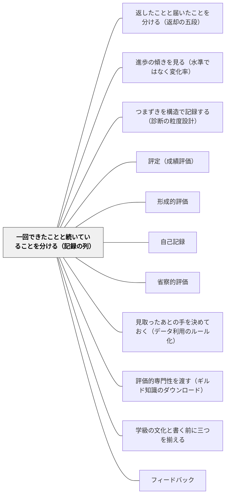

# 一回できたことと続いていることを分ける（記録の列）

> 一回できた ≠ 続いている ≠ 自分のものになった。記録を並べて言えるのは「この記録の列がこういう形をしている」であって、「この子がこういう力を持っている」ではない。

## [Pattern Connection]

本パタンは岩井（2026）第2巻の教室語版であり、**理論の正は書籍にある**（定義・記号はこの Wiki に置かない）。ここで渡すのは、学期末に記録を並べる教師が、何を言えて何を言えないかを自分で点検するための手つきだけである。

前のパタン [[パタン/返したことと届いたことを分ける（返却の五段）]] は、一件の返却のあとを数日の幅で見た。本パタンは、その一件が二件、三件になり、単元をまたいで並んだときに何が言えるかを扱う。時間の幅が数日から数週間へ広がる。そして、時間の幅が広がるたびに、言いたくなることも大きくなる。「効いた」から「できるようになった」へ。同時に、言いたくなることと、証拠から言えることの隔たりも大きくなる。

既存のパタンとの関係では、[[パタン/進歩の傾きを見る（水準ではなく変化率）]] が「並べた記録から何を読むか」を、[[パタン/つまずきを構造で記録する（診断の粒度設計）]] が「並べられる記録をどう取るか」を扱ってきた。本パタンはその手前と後ろにあたる——**並べた記録の主語は誰か**、そして**並べた結果が第一に返すのは何か**。答えは、主語は列であり、第一の産出は判定ではなく観察の宿題である。

[[概念/証拠不足と不成立の区別]] とは、同じ手つきを別の水準で使う関係にある。あちらは一件の判定について「証拠がない」と「成り立たない」を分けた。本パタンは同じ区別を、記録の列の空白について使う。「記録がない」は「起きていない」ではない。

## 背景（Context）

学期末に、教師は記録を並べる。単元テストの点数が四つ。ノートの写しが数枚。机間指導のメモ。作品のチェック欄。並べると、線のようなものが見えてくる。

見えたところで、書式が来る。所見欄。観点別の評価。三段階の記号。書式が求めているのは、記録の形ではない。「安定して理解している」「意欲的に取り組んでいる」という、その子の**力についての判断**である。

このとき、手元にある記録と、書式が求める判断のあいだには、越えなければならない隔たりがある。そして、この隔たりはたいてい意識されない。記録が四件あることが、そのまま「四回できたのだから、できるようになった」と読まれる。記録が並んで見えたことが、そのまま子どもの中に線が引かれたことのように感じられる。

隔たりが意識されないのは、教師が不真面目だからではない。むしろ逆で、丁寧に記録を取っている教師ほど、記録の厚みを判断の根拠として使いたくなる。取った記録を使わないでいることは、記録を取った意味がないように感じられるからである。

## 問題（Problem）

**記録を並べたとき、その形についての事実が、いつのまにか子どもについての判断へすり替わる。**

「この列は安定した形をしている」が「この子は安定した」へ、一語も変えずに滑る。滑ったことに気づけないのは、日本語のうえでは同じ言葉が使えてしまうからである。「安定してきました」と書いたとき、主語が記録なのか子どもなのかは、文面からは分からない。

このすり替えは、三つの取り違えを連れてくる。

第一に、**集約が証拠を作ると思ってしまう**。記録を足したり、数えたり、平均したりすると、何か新しいことが分かったような感触がある。しかし集約が返すのは、すでにある記録の形についての事実だけである。四件の記録から出てくるのは、「四件ある」という事実であって、四件目までのあいだに新しい証拠が生まれたわけではない。

第二に、**鎖のどこかに自動の矢があると思ってしまう**。一回できた → 繰り返している → 記録の列が安定した形をしている → 安定した力がある → 自分のものになった。この鎖は、どの矢も自動的には引けない。それぞれ別の主張であり、別の証拠が要る。しかし記録が並んでいると、鎖が一本の線に見える。

第三に、**列の空白を、学びの空白と読んでしまう**。記録の列は、ある見取りの体制のもとで切り出されたものである。教師が見ていた時間、記録を取る余裕があった週、その子に目を向けた場面——記録はその範囲でしか立たない。空白の区間は、その子に何も起きなかった区間ではなく、こちらが見ていなかった区間かもしれない。

## 力のかたち（Forces）

- **事務の締切 vs 記録を正直に読むこと**——所見の締切は動かない。「まだ言えない」と正直に読むほど、書けることが減る。しかし締切に合わせて読みを甘くすると、書いた本人にも根拠が分からない文が残る
- **「まだ言えない」と書けない書式**——所見欄も観点別評価も、「判定不能」を書く場所を持っていない。書式は肯定か否定かを求め、保留を許さない。この構造は教師の側では変えられない
- **観察の窓を増やす時間がない**——空白を埋めるには見取りの機会が要るが、三十人の教室で全員に厚い窓を用意することはできない。窓は必ず不均等になる
- **集約すると分かった気になる誘惑**——記録を並べて眺めると、確かに何かが見えてくる。その感触は強く、しかもたいていは間違っていない。だからこそ、感触と証拠の区別がつきにくい
- **保護者への説明可能性**——「まだ言えません」は、保護者にとっては何も言っていないのと同じに聞こえる。説明責任のある場面ほど、断定を求める圧力が強い
- **記録を厚く取った労力 vs その記録が支えられる主張の小ささ**——半年かけて取った記録が支えるのは、「この形をしている」という控えめな事実だけである。労力に見合わないように感じられる

## 解決（Solution）

**記録を並べたとき、主語を列に留める。並べて言えるのは「この記録の列がこういう形をしている」であって、「この子がこういう力を持っている」ではない。形状についての事実と、能力についての判断は、別の場所にある。**

そのうえで、四つのことを守る。

**集約は証拠を作らない。** 記録を足しても、数えても、平均しても、新しい証拠が生まれるわけではない。集約が返すのは、すでにある記録の形についての事実だけである。保留が五件あっても、それを足して確定一件にはならない。集約は集めるが、約めない。

**鎖のどこにも自動の矢はない。** 一回できた → 繰り返している → 記録の列が安定した形をしている → 安定した力がある → 自分のものになった。この鎖のどの矢も、自動的には引けない。中間に駅を増やしても、鎖は短くならない。とくに「安定した形をしている」から「安定した力がある」への一歩は、記録の側の話から能力の側の話への飛び移りであり、記録をどれだけ厚くしても自動では渡れない。

**観察体制が列の要である。** 記録の列は、ある見取りの体制のもとで切り出されたものである。だから、いつ・どの範囲を見ていたかを言わない形状の主張は、不完全である。**観察が薄かった区間の空白は、学びの空白ではなく、観察の空白かもしれない。**「記録がない」と「起きていない」を分ける（→ [[概念/証拠不足と不成立の区別]] と同じ手つきを、列の水準で使う）。記録の薄い子について出てくる「まだ言えない」は、その子についての主張ではなく、こちらの観察体制についての主張である。

**集約が第一に返すのは、判決ではなく観察の宿題である。** これが、本パタンのいちばん実践的な一点である。記録を集約して出てくるいちばん使える産出は、その子への判定ではなく、「**次に何を・誰について観察すべきか**」である。

- 一件しか記録が立っていない子には——「別の場面で二件目を観察できる窓を作れ」
- 記録が薄い子には——「観察体制そのものを変えよ。過程が残る場面を作れ」
- まだ一件も記録のない子には——「窓を作れ」

返す側はいつも教師である。集約は、その教師が記録から返される側に立つ、数少ない場面である。

---

### 具体例1：単元テストの点数を四つ並べる

三年生の算数、単元テストが四回。ある子の点数は 65、80、85、90 だった。

並べると上がっている。ここから言えることは、「この四つの点数の列は、上がっていく形をしている」である。ここまでは事実であり、そのまま所見の材料になる。

言えないのは、その先である。四つのテストは別の単元のものである。難易度が同じかどうかは分からない。三回目と四回目のあいだに家庭学習の助けがあったかどうかも記録にない。何より、点数は結果であって、どのように解いたかの過程は残っていない。

だから、この列が支えるのは「テストの点数が上がってきている」までであり、「計算の力が安定してきた」ではない。**二つは同じことのように聞こえるが、後者は能力についての主張であり、この列は能力について何も見ていない。**

書けるとすれば、こうなる——「四回のテストで得点が上がってきている。とくに繰り上がりのある計算での誤りが減った」。過程まで書くには、過程が残る記録が別に要る（[[パタン/つまずきを構造で記録する（診断の粒度設計）]]）。

---

### 具体例2：「できるようになりました」と所見に書く前の点検

所見に「自分で見直して直せるようになりました」と書こうとしている。手が止まったら、三つを順に確かめる。

一つ目——**その姿を、何件記録しているか。** 記憶にはあるが記録にないなら、まず記録の件数を数える。一件だったなら、「〜できるようになりました」は一件を根拠にした判断である。書いてはいけないという話ではない。**一件を根拠にしていると自分で知っていることが大事である。**

二つ目——**その一件は、どんな場面だったか。** 同じ単元の同じ型の問題で二回なのか、別の単元・別の型で二回なのか。同じ型で二回並んでも、「別の場面でも使える」の根拠にはならない。

三つ目——**書かなかった区間はどうか。** 三週間その子を見ていなかった区間があるなら、その区間の空白は、その子の空白ではなく、こちらの空白である。

三つを確かめたうえで書くのと、確かめずに書くのとでは、同じ文でも質が違う。前者は飛躍を飛躍と知って跳んでいる。後者は跳んだことに気づいていない。

---

### 具体例3：観察が薄かった子の空白

C児について、学期末に記録を集めると、ほとんど何もなかった。単元テストの点数はある。しかし過程の記録も、机間指導のメモも、発言の記録もない。

ここで「積極性に欠ける」「学習への関心が薄い」と読むのが、いちばん危ない読み方である。

記録の薄さが語っているのは、まず**こちらの観察体制**である。C児をどこで見ていたか思い返すと、返却の直後の机上だけだった。過程が残る場面——ノートに考え方を書く時間、ペアで説明する時間——を、C児について一度も設けていない。だから記録は薄くなるべくして薄くなった。

このとき集約が返す出力は、C児への判定ではない。「観察体制そのものを変えよ。過程が残る場面を作れ」である。翌学期の最初の単元で、C児のノートに考え方を書かせる場面を二回だけ設計する。それが、この集約の実用的な産出のすべてである。

**記録の薄い子ほど、記録の薄さを子どもの属性として書いてはならない。** 一度そう書くと、その読みは次年度へ引き継がれ、次の担任の観察の窓をさらに狭める。

---

### 具体例4：ノートの記録を学期末に見返す

ノートを学期分めくると、記録のリズムが見えてくる。四月は毎時間、五月は週二回、六月はほとんどない、七月にまた増える。

このリズムは、その子の学習のリズムだろうか。おそらく違う。六月は運動会と校外学習があり、教師がノートを見る時間が取れなかった月である。**記録のリズムは、子どものリズムではなく、教師の記録実践のリズムかもしれない。**

だから、記録の間隔や密度から「六月に停滞した」を読み出さない。読み出せるのは、「六月は記録が薄い」までである。そのうえで「六月の記録が薄いのは、こちらの事情である」と一行添えておくと、来年の自分がこの記録を誤読しない。

窓枠を広く取ったこと（一学期分を見返した）と、多くを見たこと（実際にどれだけ観察できていたか）は別である。この二つを混同すると、「長く見ているから分かっている」という感触が生まれる。

---

### 具体例5：進歩の傾きを見る実践との併用

[[パタン/進歩の傾きを見る（水準ではなく変化率）]] は、同じ物差しの短い課題を繰り返し、伸びの角度を見る実践である。本パタンと組み合わせると、それぞれの守備範囲がはっきりする。

傾きの実践が返すのは、**列の形状についての、いちばん質のよい事実**である。同じ物差しで測っているので、点数の列が比較可能になる。だから「この列は上がる形をしている」がしっかり立つ。これは本パタンが言う「形状についての事実」の、最良の形である。

しかし傾きは、傾きまでしか言わない。角度が立っていることは、「力がついた」ことの証明ではない。同じ物差しの同じ課題で速くなっただけかもしれない。だから、傾きの実践と、別の場面での記録（別の型の問題、説明の記録、ペアでの説明）を併せて、はじめて「別の場面でも使えている」の材料が揃う。

二つを併用するときの分担はこうなる——**傾きの実践は列の形を精密にする。本パタンは、その形が何を支え、何を支えないかを言う。**

---

### 具体例6：成績表を書く場面での使い方

学期末、手元にあるのは記録である。書式が求めるのは能力についての判断である。**この隔たりは埋まらない。** 本パタンが渡せるのは、隔たりを消す方法ではなく、隔たりを知ったうえで跳ぶという姿勢である。

跳ぶ前に、次の三つを自分に言う。

- いま自分が手にしているのは記録であって、能力ではない
- この空白は、学びの空白ではなく、観察の空白かもしれない
- 繰り返しの記録が一件も立っていないなら、「安定してきた」は浅い判断である

これらを知って下す判断と、記録の数を能力の証明と取り違えて下す判断は、**同じ言葉でも質が違う**。前者は、飛躍を飛躍として引き受けた判断である。後者は、飛躍が起きたことにすら気づいていない判断である。

成績表を書かなくてよい、という話ではない。書かねばならないものは書く。ただ、どれだけ見晴らしのよい場所から跳ぶかは、変えられる（[[パタン/評定（成績評価）]]）。

---

### 自己教育での適用例：自分の学習記録を並べて「身についた」と言ってよいのはいつか

数学の自己学習を続けていると、記録は溜まる。解いた日付、解けた問題、つまずいた箇所。学期の教師と同じように、自分も自分の記録を並べて読むことになる。

このとき、本パタンはそのまま自分に当たる。三か月分のノートを並べて「二次関数は身についた」と言いたくなったら、同じ三つを確かめる。

**何件あるか。** 同じ問題集の同じ節を三回解いたなら、それは「同じ場面で三件」であって「別の場面で三件」ではない。

**空白はどこか。** 五月に二週間空いているのは、忘れたからではなく、忙しかったからかもしれない。列の空白から「忘れた」を読み出さない。逆向きの越境も塞ぐ。

**支援条件はどうだったか。** 解答を見ずに解けた回と、ヒントを見た回と、解答を読んでから解き直した回は、記録としては同じ「解けた」でも、条件が違う。支援が減ったことは、それだけでは成長したことを意味しない。条件を並べて事実として書くところまでで止める。

自分の学習では、教師役も自分なので、甘い読みを止める人がいない。だからこそ、**記録を並べたあと最初に取り出すのは「身についた」ではなく、「次にどこを見るか」にする**。三か月の記録が返してくるのは、「別の文脈での二件目を作れ」——たとえば、同じ二次関数を、問題集の外の場面（図形の最大最小、あるいは実験データの当てはめ）で一度使ってみよ、という宿題である。これが、集約の第一の産出が判決ではなく観察の宿題である、という原則の自己教育版になる。

## 結果（Consequences）

**利点**

- **書いた文の根拠が、自分で説明できるようになる**——所見の一文について「これは何件の記録を根拠にしているか」が言える。保護者に問われたときにも、記録の話と判断の話を分けて説明できる
- **「まだ言えない」を、判断の放棄ではなく積極的な判断として書ける**——一件しか立っていないなら、「一件立っている」と書ける。これは何も言っていないのとは違う
- **記録の薄い子への読みが変わる**——薄さを子どもの属性として書かなくなる。代わりに、来学期の観察の設計が一つ具体的に決まる
- **記録を取る労力の使い道が変わる**——「判定の根拠を厚くする」ためではなく、「次にどこを見るかを決める」ために記録を読むようになる。後者のほうが、実際に翌週の授業が変わる
- **集約の感触と証拠が分けられる**——並べて見えた感触は、感触として残してよい。ただし、感触を証拠として書かない。この分離ができると、直感を捨てずに済む
- **自分の学習にもそのまま使える**——独学は甘い読みを止める人がいない。列の形と能力の判断を分ける手つきが、そのまま自己点検になる

**注意点・リスク**

- **「まだ言えない」を書式の外へ逃げ道にしない**——所見は書かねばならない。本パタンは、断定を避けるための道具ではなく、断定の質を上げるための道具である。跳ぶことを禁じているのではない
- **記録の件数を新しい物差しにしない**——「三件あるから書ける、二件だから書けない」という運用にすると、件数が新しい暗号になる。件数は、根拠の所在を自分で確認するための材料であって、判定の閾値ではない
- **記録を増やすことが目的化する**——見取りの窓を増やすのは、判定の根拠を厚くするためではなく、次の手立てを決めるためである。この向きを見失うと、記録が増えて授業が痩せる
- **空白の説明が、言い訳として使われる**——「観察の空白かもしれない」は、見取りをしなくてよい理由ではない。空白を見つけたら、次に窓を作る、までがひと組である
- **列の形と子どもの形を分ける言い方が、冷たく聞こえることがある**——保護者や同僚に対して、この区別をそのまま言葉にすると、子どもを見ていないように受け取られる。区別は教師の頭の中の作業であり、伝える言葉は別に選ぶ
- **変動を「まだ身についていない」と読まない、しかし「柔軟性がある」とも読まない**——記録が揺れているとき、どちらの方向にも急がない。変動は、まず列の形である

## 関連パタン

- [[パタン/返したことと届いたことを分ける（返却の五段）]] — 対になるパタン。あちらが一件の返却のあとを数日の幅で見るのに対し、本パタンは一件が並んで列になったときを数週間の幅で見る
- [[パタン/進歩の傾きを見る（水準ではなく変化率）]] — 列の形をいちばん精密にする実践。本パタンは、その形が何を支え、何を支えないかを言う。併用が前提
- [[パタン/つまずきを構造で記録する（診断の粒度設計）]] — 並べられる記録をどう取るか。過程が残る記録がないと、列は点数の列にしかならない
- [[パタン/評定（成績評価）]] — 記録から能力の判断へ跳ぶことを、書式が要求してくる場面。本パタンは、その跳ぶ前に立つ場所の見晴らしを扱う
- [[概念/証拠不足と不成立の区別]] — 同じ手つきの一件水準版。「記録がない」と「起きていない」を分けることを、本パタンは列の空白について使う
- [[パタン/形成的評価]] — 上位の枠組み。集約の第一の産出が「次に何を観察するか」であるという主張は、形成的評価の中核と重なる
- [[パタン/自己記録]] — 学習者本人が自分の記録を並べる場面。本パタンの区別は、そのまま自己点検の道具になる
- [[パタン/省察的評価]] — 記録を読み直す実践の場。三値で読み直す手つきと、列の形状で読む手つきが接続する
- [[パタン/見取ったあとの手を決めておく（データ利用のルール化）]] — 集約の出力を次の手立てへ変換する具体的な機構。「観察の宿題」を実際に運用する形
- [[パタン/評価的専門性を渡す（ギルド知識のダウンロード）]] — 記録を並べて質を判断する営みそのものを、学習者へ渡す方向。本パタンの手つきは、渡された学習者が自分の記録に対して使えるもの
- [[概念/妥当性（スコアの意味についての評価判断）]] — 記録から意味を読むときの正当化の理論。列の形状主張と、スコアの意味の主張がどこで接続するか
- [[パタン/学級の文化と書く前に三つを揃える]] — さらに時間の幅を広げた姿。一人の記録の列が、学級全体の記録の束になったとき何が言えるか
- [[文献/圏論的教育記述の公理化ノート 第2巻（岩井）]] — 本パタンの出典。理論の正はこちらにある（第II部・第8章）
- [[文献/Formative Assessment and the Design of Instructional Systems（Sadler）]] — 成績が「一方向の暗号」になること、集約が形成的目的に対して逆効果になりうることの古典的な指摘
- [[パタン/フィードバック]] — フィードバックの効き目を一件ではなく列として読む

## クラスター図

## Actionable Insight

- **所見に「〜できるようになりました」と書く前に、その姿を何件記録しているか数える**——一件なら、一件を根拠に書いていると自分で知ったうえで書く。書くこと自体は止めない
- **数えたあと、その件がどんな場面だったかを並べる**——同じ単元・同じ型で二件なら、それは「繰り返している」の根拠にはなるが、「別の場面でも使える」の根拠にはならない
- **学期の記録を月別に数え、いちばん薄い月に何があったかを思い出す**——薄いのが行事や多忙のせいなら、その一行を記録の欄に添えておく。来年の自分がその空白を誤読しない
- **記録が一件もない子を先に三人挙げ、その三人に窓を一つずつ作る**——学期末の集約から取り出す第一の行動をこれにする。判定を厚くするのではなく、次に見る場所を決める
- **「今学期いちばん見取りの薄かった子」を一人名指しして、来学期の最初の単元で、その子に過程が残る場面を二回設計する**——ノートに考え方を書く時間、ペアで説明する時間。どちらでもよいが、二回まで具体的に決める
- **成績表を書く前に、声に出して三つ言う**——「これは記録であって能力ではない」「この空白は観察の空白かもしれない」「繰り返しが一件も立っていないなら、これは浅い判断だ」。言ったうえで書く
- **自分の学習記録を並べたら、最初に取り出す言葉を「身についた」ではなく「次にどこを見るか」にする**——三か月分の記録が返してくるのは判定ではなく、「別の文脈で一度使ってみよ」という宿題である

## 出典

- 岩井輝久（2026）『圏論的教育記述の公理化ノート 第2巻——返却・持続・文化に、異なる住所を与える』第II部（記録の列と集約）・第8章（実務章）。「集約主張の主語は記録の列であって学習者ではない」「集約は証拠を作らない」「列の形状は観察体制の形状と分離できない」「集約の第一の実践的産出は、次に何を・誰について観察すべきかであって、子どもへの判決ではない」、および成績表をめぐる飛躍と距離の扱い。 [[文献/圏論的教育記述の公理化ノート 第2巻（岩井）]]

> 飛躍と距離それ自体は、埋まらない。だが、どれだけ見晴らしのよい場所から跳ぶかは、変わる。（第8章）

> 形式は判断を自動化しない。ただ、判断の場所を監査可能にする。（第8章）

- 岩井輝久（2026）『圏論的教育記述の公理化ノート 第1巻——経験・働きかけ・評価・共同形成に、異なる住所を与える』（証拠の不在と不成立を分ける手つきの出典） [[文献/圏論的教育記述の公理化ノート 第1巻（岩井）]]

- Sadler, D. R. (1989). Formative assessment and the design of instructional systems. *Instructional Science, 18*(2), 119–144.

> In any area of the curriculum where a grade or score assigned by a teacher constitutes a one-way cipher for students, attention is diverted away from fundamental judgments and the criteria for making them. （p.121）
> — 教師のつけた成績や点数が学習者にとって一方向の暗号でしかないような領域では、注意は根本的な判断とその判断を下すための規準から逸らされる。
