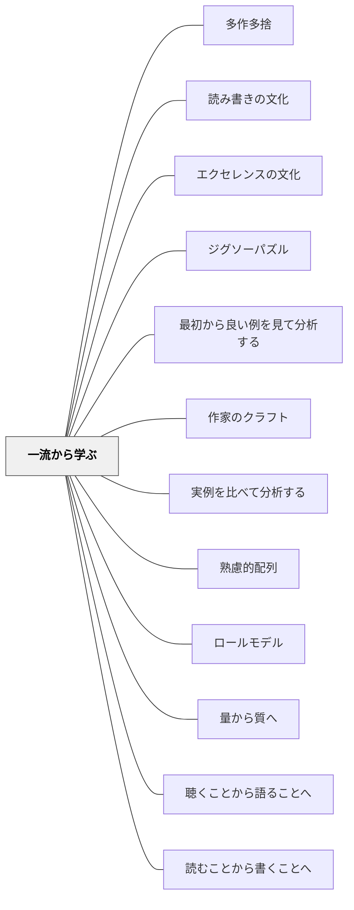

# 一流から学ぶ

> 最高峰を見た目が、最高峰へ向かう。

## [Pattern Connection]

### 北大路翼（2019）生き抜くための俳句塾 統合（2026-06-02）：「学ぶとは盗むこと」——感じることによる一流の内面化

北大路翼は第一講「心構え10箇条」で一流から学ぶ原則を独特の言葉で定式化する。

> 「学ぶとは盗むこと。感じることが表現の勉強だ。覚えることではない。」——北大路翼（2019）第一講

本パタンが「卓越した作品・実践・人物に触れさせ、基準を内面化させる」と述べるとき、その「内面化」のプロセスを北大路翼は「盗む」という言葉で表現する。「盗む」とは模倣でも暗記でもない——「感じること」によって、一流のものが自分の中に溶け込む。

**魂の二五句——名句の立ち姿：**
第五講では25人の俳人の名句を北大路翼が選び、一句ごとに独自の解説を加える。そこで示される評価基準が具体的である。

> 「なんとなく覚えてしまって、もう一度読みたくなる句がいい句だ。」——第五講

> 「句の立ち姿がいい句が名句だ。」——第五講（種田山頭火「さくらまんかいにして刑務所」解説）

「立ち姿」という評価軸は、Bergerの「質の基準を内側に持つ」の感覚的・身体的な形。良い句に触れ続けることで「立ち姿の基準」が身体に入る——これが一流から学ぶの内面化プロセス。

**「一流から学ぶ」の実践法——本能で覚える：**
種田山頭火の句（「さくらまんかいにして刑務所」）が北大路翼の原点になったのは、「なんとなく覚えてしまった」からだという。一流の作品は教わって覚えるのではなく、気づいたら入ってきている——これは「基準の内面化」の最も深い形。

- **既存パタンとの関連**：本パタンが「一流の作品・実践に触れさせ、質の基準を内面化させる」と述べるとき、北大路翼は「感じることで盗む」「なんとなく覚えてしまう」という内面化の感覚的なプロセスを加える。「作文：一流の文学作品を読み聞かせる」という実践例が、俳句の文脈で「魂の二五句に触れ続ける」として具体化される
- **補強された点**：「一流から学ぶ」の内面化プロセスに、「覚えるのでなく感じること」「立ち姿で評価すること」「なんとなく覚えてしまうレベルの反復的接触」という操作的な記述が加わる
- **他のパタンへの波及**：[[パタン/身体的理解]] — 「感じること」による内面化は身体的理解の一形態；[[パタン/作家のクラフト]] — 一流の句の立ち姿を感じることが俳句クラフトの起点；[[文献/生き抜くための俳句塾（北大路翼）]] — 本統合の出典

[[文献/生き抜くための俳句塾（北大路翼）]]

---

## 背景（Context）

[[パタン/熟慮的配列]] のモデル次元。Ron Berger の「卓越の文化（culture of excellence）」の概念に象徴されるように、学習者が内面化する「質の基準」は、触れてきたモデルの質によって決まる。平凡なモデルを基準に学ぶと、平凡さが当たり前になる。

## 問題（Problem）

学習者が触れるモデルが平均的・標準的なものばかりだと、「どこまで上達できるのか」「質の高さとはどういうものか」が見えない。自分の作品・実践に対する自己評価の基準も低いまま固定されやすい。

## 力のかたち（Forces）

- 「一流」は学習者の発達段階と大きく乖離していると、意欲を挫く場合がある
- 「一流から学ぶ」ことと「一流を真似る」ことは違う（創造性を奪う危険）
- 誰が「一流」かは分野・文化・価値観によって異なる
- 学習者自身の感性・評価眼を育てることが最終目的

## 解決（Solution）

**その領域の卓越した作品・実践・人物に学習者を意図的に触れさせ、「これがこの領域の高みだ」という基準を内面化させる。その後、自分の実践へのフィードバックをその基準に照らして行う。**

実践例：
- 作文：子どもに「完成された文学作品」を読み聞かせ、書く前にイメージの水準を上げる
- 図工・美術：一流の芸術家の作品を鑑賞し、その技術・思想に触れてから制作する
- 音楽：一流のパフォーマンス録音を聴いてからアンサンブル練習に入る
- 体育・スポーツ：世界トップレベルの試合映像を見て動きのイメージを作る

[[パタン/ロールモデル]] も参照。

## 結果（Consequences）

- 学習者が「質の基準」を内側に持てるようになる
- 自己評価・自己修正の能力が育つ
- 「もっとよくなれる」という向上への動機が生まれる

## クラスター図

## Actionable Insight

- 書く単元の最初に「この分野の一流の作品」を1つ読み聞かせる——質の高いモデルへの接触が学習者の内部基準を引き上げる
- 体育で技術を教える前に、世界トップレベルのパフォーマンス映像を1分見せる——動きのイメージが先にあると技術習得が速くなる
- 作品鑑賞後に「この作品の何が優れているか」をクラスで分析する時間を設ける——一流を「感じる」だけでなく「分析する」経験が評価眼を育てる

## 出典

- 一つの教育のパタン・ランゲージ（岩井輝久）

## 関連パタン
- [[パタン/多作多捨]]
- [[パタン/読み書きの文化]]
- [[パタン/エクセレンスの文化]]
- [[パタン/ジグソーパズル]]
- [[パタン/最初から良い例を見て分析する]]
- [[パタン/作家のクラフト]]
- [[パタン/実例を比べて分析する]]

- [[パタン/熟慮的配列]] — 上位パタン
- [[パタン/ロールモデル]] — 人物としてのモデル
- [[パタン/量から質へ]] — 量の蓄積の後、質の基準が生きる
- [[パタン/聴くことから語ることへ]] — 一流の語りを聴いて内面化する
- [[パタン/読むことから書くことへ]] — 一流の書き手の文章を読んで内面化する
- [[文献/生き抜くための俳句塾（北大路翼）]] — 「学ぶとは盗むこと。感じることが表現の勉強」・「句の立ち姿がいい句が名句」（北大路翼, 2019）
