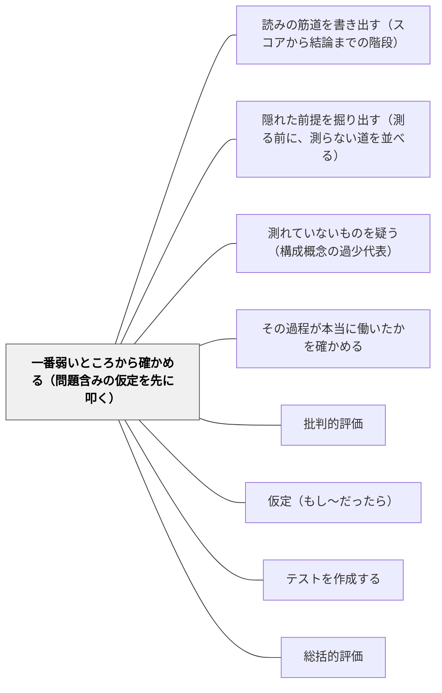

# 一番弱いところから確かめる（問題含みの仮定を先に叩く）

> 証拠は「集めやすいもの」から集まる。しかし論証は、一番弱い環より強くならない。確かめるべきは、すでにもっともらしい仮定ではなく、いちばんあやしい仮定である。

## [Pattern Connection]

本パタンは Kane（1990）の**総括的段階（summative stage）**——解釈的論証の仮定を実証的に叩く段階——を、この Wiki の評価パタン群へ接続する。Kane がここで渡しているのは、証拠の集め方ではなく、**証拠の集める順序**である。

同じ統合で新設された三つのページとは、次のように役割が分かれる。[[概念/解釈的論証と妥当性論証（何を確かめればよいかを決める）]] が枠組み全体を、[[パタン/読みの筋道を書き出す（スコアから結論までの階段）]] が**叩く対象そのものを作る**作業を、[[パタン/隠れた前提を掘り出す（測る前に、測らない道を並べる）]] が**まだ書き出されていない仮定を並べる**作業を扱う。本パタンはその次に来る——**並んだ仮定のうち、どれを先に叩くか**である。筋道を書き出しただけでは、確かめる作業は始まらない。書き出した階段は十段も二十段もあり、全部を確かめる時間はどこにもないからである。

この Wiki の妥当性パタン群は、これまで主に Messick（1994）から来ていた。[[パタン/測れていないものを疑う（構成概念の過少代表）]]、[[パタン/その過程が本当に働いたかを確かめる]]、[[パタン/採点の形を中身の形に合わせる（構造的忠実性）]] は、いずれも「**どの側面を見落としがちか**」を教える地図である。Kane が足すのは羅針盤のほうである。地図があっても、どの方角へ先に歩くかは決まらない。**Messick は見るべき側面を列挙し、Kane は見る順序に理由を与える。**

[[概念/証拠不足と不成立の区別]] とは、一語のところで噛み合う。Kane が挙げる「仮定が問題含みになる四つの条件」の最後は「単にその仮定を支える証拠が無い」である。これは**仮定が偽であることではなく、こちらの証拠の状態についての記述**である。「証拠が無い」は「成り立たない」ではない——同じ区別が、判定の水準ではなく仮定の水準で働いている。

特別支援への波及がひとつある。Kane は、科学は一部の仮定を「問題含みでない背景知識」として与件のまま置く、と書いたうえで、**「ただし特に疑う理由があるときは別である」**という但し書きを付けた。この但し書きが、そのまま特別支援の原理になる。多数の子にとって背景知識であるもの——指示が聞こえている、四十五分座っていられる、鉛筆が持てる、日本語の指示が読める——は、特定の子については問題含みの仮定へ変わる。**背景知識と問題含みの仮定を分ける線は、子どもによって引かれる位置が違う。**

## 背景（Context）

評価について点検を求められる場面は、年に何度も来る。単元テストが妥当か。この評価計画で本当に狙ったものが見えるのか。研究授業の指導案に「評価の妥当性」の欄がある。校内研究のまとめで「この取り組みは効果があったのか」を問われる。

そういうとき、何をすればよいかは、たいてい書いてある。アンケートを取る。事前事後で比べる。複数の観点で見る。手続きの書き方は詳しい。**詳しいのは、いつも「どうやって集めるか」のほうである。**

Kane が突いたのは、妥当性の文献そのものが同じ形をしている、ということだった。方法論は精密に整備されている。にもかかわらず、**どの証拠を集めるべきかについては、ほとんど何も言われていない**。彼は Ebel（1961）の一節を、四半世紀たっても真だとして引く。

> 妥当性は長らく心理測定学者の万神殿における主神の一つであった。それは普遍的に賞賛されているが、その名において為された善行は驚くほど少ない。

そして『スタンダード』（1985）が示す指針は、「他の条件が等しければ、証拠の源は多いほうが少ないよりよい」であった。Kane はこれを、指針の欠如として読む。**多いほうがよいと言われ、どれを優先すべきかは言われない。**そのうえ資源には限りがある。すると、何が起きるか。

教室でも、まったく同じことが起きている。「この取り組みが効いたと言えるか」を確かめようとするとき、手が伸びるのは、出席率、提出率、小テストの平均点、そして最後にアンケートの満足度である。どれも集められる。どれも数字になる。**そして、たいていどれも、一番あやしい仮定を叩いていない。**

## 問題（Problem）

**どの証拠を集めるべきかの指針が無いと、証拠は「都合のよさ」で選ばれる。**

Kane は、指針の欠如が二つの深刻なリスクを生むと言う。

第一に、**証拠が便利さ（convenience）で選ばれる**。最悪の場合、いちばん楽な一種類の証拠を集めて、それを妥当性への完全な答えとして扱ってしまう。この選択は不真面目から来るのではない。「源は多いほうがよい」と言われ、資源には限りがあり、優先順位の根拠が渡されていないなら、**最も集めやすいデータを使うのが合理的な振る舞いになる**。そのほうが源の数を増やせるからである。合理的に振る舞った結果、論証のいちばん弱い環が触られないまま残る。

第二に、**どこまで進んだかを測る基準が無くなる**。ある解釈に関連しうる研究は、事実上無限にある。関連の度合いに区別をつけないなら、限られた研究の集合が「十分」だとも、「実質的な前進」だとも言えない。**進捗の基準が無いと、やり終えた感触も持てないし、外から「まだ足りない」と言うこともできない。**満足感（にんじん）も外的基準（むち）も、どちらも効かなくなる。

Kane はこの状態を、古いジョークになぞらえる。

> 悪い知らせは、嵐で無線とコンパスがやられ、我々は完全に道に迷ったということです。よい知らせは、強い追い風のおかげで素晴らしい速さで進んでいるということです。

**手続きだけが精密で、何を調べるかの指針が無い状態は、これに似ている。**速く進んでいることと、正しい方向へ進んでいることは、別のことである。研究計画にはコンパスが要る——問いを選び、その問いのあいだに優先順位をつける根拠が。

教室に降ろすと、こう現れる。

- 校内研究で「読書活動に力を入れたら読解力が上がった」と言いたい。集めたのは、貸出冊数の増加と、児童アンケートの「本が好き」の割合である。どちらも上がっている。**しかしこの読みでいちばんあやしいのは、「読んだ冊数が増えること」と「読解の力がつくこと」のあいだの環**であって、そこは一度も触られていない
- 単元テストの点が上がった。だから指導が効いた、と言いたい。**いちばんあやしいのは、二回のテストの難易度が同じかどうか**である。しかし確かめるのは面倒なので、代わりに「子どもの感想が肯定的だった」を足す
- 支援が効いたと言いたい。集めたのは、その子が授業中に離席した回数の減少である。**いちばんあやしいのは、離席の減少が「学習に向かえるようになったこと」を意味するのかどうか**である。座っているが何も入っていない、という状態と、記録は区別できない

いずれの場合も、証拠の**数**は増えている。論証の**強さ**は増えていない。

## 力のかたち（Forces）

- **集めやすさ vs 効き目**——集めやすい証拠は、たいてい弱い環を叩かない。集めにくい証拠ほど、弱い環に当たる。この二つが逆を向いているのが、この問題の芯である
- **数の多さが与える安心 vs 論証の実際の強さ**——資料が三枚より五枚のほうが、報告としては通りやすい。しかし論証は、いちばん弱い環より強くならない。**五枚のうち四枚が同じ強い環を補強しているなら、増えたのは分量だけである**
- **一番あやしいところを名指しする痛み**——「この読みでいちばんあやしいのはここです」と言うことは、自分の設計の弱点を自分で言うことである。研究発表の場でも、学年会でも、これは心理的にきつい
- **説明責任の場面では「たくさん集めた」が通りやすい**——外に見せる場面ほど、量が評価される。弱い環を一つだけ叩いた報告は、薄く見える
- **無限後退**——仮定を確かめると、確かめる方法についての新しい仮定が呼び込まれる。それを確かめると、また新しい仮定が呼び込まれる。**全部確かめようとすれば、確かめるべき仮定の数は際限なく増える**
- **終わりが定義されていない**——「ここまでやれば妥当性が確かめられた」という到達点は、原理的に存在しない。だから、いつやめてよいかも分からない
- **背景知識に置いたものは見えなくなる**——与件として置くことは必要だが、置いた瞬間に、それは点検の対象から外れる。**外れたことすら記録に残らない**
- **疑う対象を選ぶこと自体が価値判断である**——「誰の異議を、具体的な異議として数えるか」で、叩く先は変わる。声の大きい異議にだけ反応していると、いちばん弱い環ではなく、いちばんうるさい環を叩くことになる

## 解決（Solution）

**確かめる項目を並べる前に、「この読みでいちばんあやしいのはどこか」を一つだけ名指しする。そして、そこだけ確かめる。**

Kane の原則は一行である。

> すでにきわめてもっともらしい仮定にさらに証拠を足しても、論証全体のもっともらしさはたいして上がらない。最も注意に値するのは、問題含みの（most subject to doubt）仮定である。

理由も一行である。**解釈的論証は、その最も弱い環より強くならない。**だから論証を評価する最良の方法は、最も問題含みの仮定を調べることになる。

### 何が「問題含み」なのかを、四つの条件で判定する

Kane は、仮定が問題含みになる条件を四つ挙げる。この四つが、名指しの実務的な道具になる。

1. **それが真でないかもしれないと示す既存の証拠がある**
2. **その仮定を否定する、もっともらしい代わりの解釈がある**
3. **批判者から具体的に異議が出ている**
4. **単にその仮定を支える証拠が無い**

四つ目が効く。**「支える証拠が無い」だけで、その仮定は問題含みになる。**誰も反対していなくても、それらしい対抗仮説が思い浮かばなくても、支える証拠が無いという一点で、そこは弱い環である。教室で使うときには、この四つ目がいちばん多く当たる。

同時に、四つ目は「その仮定が偽である」ことではない。ここは [[概念/証拠不足と不成立の区別]] の手つきが、そのまま働く場所である。証拠が無いことは、**こちらの証拠の状態についての記述**であって、その仮定についての判決ではない。

### 叩かない仮定を、意識して叩かない

Kane は、叩かない側の例も並べている。数学の配置テスト——生徒を微積分の本コースと補習の代数コースに振り分けるテスト——を例にとる。

「代数の技能がある水準で微積分の前提になっている」という仮定は、**問題含みではない**。とくに配置テストの内容が、微積分の授業で実際に使われる代数技能に明示的に結びつけられているなら、なおさらである。**微積分の問題は、代数記法なしにはほとんど書けない。**だから、この仮定を支える実証的証拠を集めても、妥当性論証にはたいして寄与しない。

他方、**カットオフ点の選び方は綿密な吟味に値する**。それは次の三つに依存しているからである——テストのスコアと各コースでの成績の関係、誤りの種類ごとに違う損失の大きさ、そして定員によって決まる暗黙の選抜比率。カットオフより上の生徒がおおむね本コースで成功し、下の生徒が成功しにくいことを示す証拠は、論証に実質的に貢献する。

この対比が、本パタンのいちばん使いやすい形である。**「当たり前だから確かめよう」ではなく、「当たり前だから確かめない」と決める。**そのうえで、確かめる資源を、線引きのような可傷な箇所へ全部寄せる。

### 無限後退を、背景知識で止める

仮定を確かめると、新しい仮定が呼び込まれる。実証的研究の結果を解釈するときには、実質的な仮定と統計的な仮定が新たに置かれる。それを確かめると、また新しい仮定が入ってくる。**全部を確かめようとすれば無限後退になる。**

科学が使う解決は単純である。**一部の仮定を、与件として、問題含みでない背景知識として置く**（Lakatos）。

> 電子タイマーで反応時間を測る心理学者は、装置が正常に働き正しく使われていれば正確な時間の測定を与えると仮定している。この仮定は、物理学（回路設計）・化学（合金や樹脂の性能特性）・天文学（時間概念の起源）について我々が知っていることに支えられている。またこの解釈は、データを記録し解釈する者の知覚過程が「正常である」ことも仮定している。**しかし、それらを疑う特別な理由が無いかぎり、これらの仮定はすべて問題含みでない背景知識として扱われる。**

最後の一文が要である。**「特別な理由が無いかぎり」——理由があれば、背景知識は問題含みの仮定に戻る。**心理学者も、特定の一台の装置や特定の一人の観察者については疑いを持ちうる。疑わないのは、時間間隔として解釈することを支える基本原理のほうである。

### 終わりが無いことを引き受け、それでも止める

> 仮定の点検は、そうしようと思えば永遠に続けられる。チェシャ猫はアリスに「初めから始めて、終わりまで進み、そこで止まりなさい」と助言した。**我々はアリスほど幸運ではない。到達すべき明確な終わりは存在しない。**

しかし、と Kane は続ける。ある時点で、**「最も問題含みの仮定はすべて扱った。残りの仮定は特に問題含みではない」と決めることはできる**。どの仮定もいつでも挑戦を受けうるし、そのとき問題含みに変わりうる。それでも、「この論証は**今のところ**十分によい」と決めて、注意を他の問題へ移す地点までは行ける。

そして、その先で得られるものにも上限がある。最も問題含みの仮定がすべて厳しい批判と実証的吟味を生き延びれば、解釈的論証のもっともらしさは強く支持される。しかし解釈的論証は常に新しい挑戦にさらされており、**解釈の妥当性が証明されることは決してない**。

### 叩いて壊れたら、四つの選択肢がある

実証的な点検が「この論証には欠陥がある」と示したとき、選べる道は四つある。

1. **企て全体を放棄する**——深刻な問題が出たなら、これも選択肢である
2. **解釈やテスト手続きを大きく変え、新しい解釈的論証を作る**——形成的段階へ戻ることになる
3. **小さな修正で済ませる**——矛盾した仮定を消しつつ、本来の目的を十分に果たす論証を保つ
4. **中心的でない仮定なら、単に落とす**——そのぶん解釈の範囲は狭くなる

四つ目に、Kane は具体例を添えている。代数の配置テストが、理科のコース配置にも使われていたとする。スコアと理科の成績の関係についての仮定が偽だと分かったなら、**理科への使用だけをやめればよい**。数学の配置への使用も、「代数問題を解く技能」というより基本的な解釈も、それによって弱まらない。

そして最後に、こう置かれる。

> 科学理論と同じように、テストスコアの解釈は、一つの問題によって必ずしも崩れはしない。確立した解釈への信頼は、一つの「決定的」実験でひっくり返されるよりも、**問題の積み重なりによって徐々に浸食される**ことのほうが多い。

これは実務的な含意を持つ。**一度の反例で評価計画を全部捨てなくてよい。同時に、小さな不具合が何度も出ているなら、それは決定的な一撃を待つべき状態ではない。**

---

### 具体例1：確かめる項目を並べる前に、一つだけ名指しする（算数・第4学年）

「わり算の筆算」の単元で、単元テストの結果から「筆算の手順が身についた」と読んでよいかを点検することにした。

最初にやりかけたのは、確かめる項目を並べることだった。設問の内容が教科書に対応しているか。配点は適切か。前回のテストと平均点を比べる。子どもの感想を聞く。四つ並んだところで、手が止まった。**どれも集められるが、どれもいまの読みのいちばん弱いところに当たっていない。**

そこで並べるのをやめ、読みの階段だけを書き出した——「解答が合っている」→「筆算の手順が実行できる」→「筆算の手順が身についた」。三段しかない。

**一番あやしいのはどこか。**一段目から二段目ではない。筆算の答えが合っていて手順が実行できていないことは、まず起きない。あやしいのは二段目から三段目である。テストの問題はすべて同じ桁数の同じ形をしており、四十分のあいだに十二問並んでいた。**この状況で手順が実行できることと、一週間後に別の文脈で手順が出てくることは、別のことである。**

四つ目の条件が当たっていた——この飛躍を支える証拠が、一つも無い。

叩き方は一つで足りた。二週間後の朝の五分に、桁数の違うわり算を三問だけ出す。並べようとしていた四項目は全部やめた。**結果、単元テストの分析にかける時間は減り、分かったことは増えた。**

---

### 具体例2：集めやすい証拠が、一番あやしい仮定を避けている（校内研究）

校内研究のテーマが「読書活動を通して読解力を育てる」だった。年度末のまとめに載ったのは、次の三つである。図書室の貸出冊数が前年比で一・四倍になったこと。児童アンケートで「本が好き」と答えた割合が上がったこと。朝読書に集中して取り組む児童の様子（写真つき）。

三つとも真実であり、三つとも集めやすい。そして三つとも、同じ環を補強している——「読書活動が増えた」という環である。**この環は、もともと問題含みではなかった。**取り組みをしたのだから読書量が増えるのは、ほとんど自明である。ここに証拠を三本足しても、論証全体のもっともらしさはたいして上がらない。

読みの階段を書き出すと、こうなっていた。「読書活動を増やした」→「子どもが本をたくさん読んだ」→「読む力がついた」→「読解力が育った」。

**一番あやしいのは三段目である。**四つの条件のうち三つが当たる。(a) 読書量と読解力の関係が単純でないことを示す研究は既にある。(b) 「もともと読む力のある子ほど本を借りる」という、逆向きのもっともらしい解釈がある。(d) この学校では、この環を支える証拠を一つも取っていない。

やり方を変えた。翌年の資料は一本になった。四月と一月に、同じ形式の初見の文章で読む課題を出し、答えの中身を並べる。冊数のグラフは載せない。**資料は三枚から一枚に減り、報告は薄く見えた。**しかし議論は初めて中身の話になった。「一月のほうが要約が短くなっているのは、読めていないのか、要点を選べるようになったのか」——この問いは、貸出冊数のグラフからは一度も出てこなかった問いである。

なお、この置き換えには抵抗があった。**量の資料は、外に見せる場面で強い。**そこで、冊数のグラフは残し、ただし「これは取り組みが実施されたことの記録であって、力がついたことの証拠ではない」と一行添えた。捨てるより、位置を書くほうが通りやすい。

---

### 具体例3：カットオフの線は、たいてい一番あやしい

Kane が「綿密な吟味に値する」と名指ししたのはカットオフ点だった。**学校には、線引きが至るところにある。**そして線引きは、たいてい根拠を書かれないまま置かれている。

- 単元テストの合格ラインが 70 点である
- 習熟度別のコース分けが、前単元のテストの点で決まる
- 補充学習の対象が「平均点の半分未満の子」である
- 支援の必要性の判断に、検査の数値が使われる

どれも、決めた人がいて、決めた理由が残っていないことが多い。Kane の言う三つの依存先で点検すると、線の弱さが見える。

**第一に、スコアとその先の成績の関係。**70 点で合格とした線の上と下で、次の単元の理解に本当に差が出ているか。学期のうちに一度でも照らし合わせたことがあるか。

**第二に、誤りの種類ごとの損失の違い。**線を高くしすぎると、本当は進める子を補充へ回す。低くしすぎると、前提を欠いた子を先へ送る。**この二つの誤りは、コストが等しくない。**どちらが重いかは、教科の構造と学級の状況で変わる。等しいと仮定しているなら、それは意識せず置いた仮定である。

**第三に、定員から決まる暗黙の選抜比率。**補充学習に呼べるのが放課後の三十分で、見られるのが五人までなら、線は実質「下から五人」で決まっている。**このとき線は基準ではなく、こちらの資源の関数である。**それを「この子は基準に達していない」と読むと、教師の側の制約が子どもの属性へ翻訳される。

線について確かめるのは、一つでよい。**「上と下で、次に何が違ったか」を一度だけ照らし合わせる。**この一回が、他のどんな追加資料より論証を強くする。

（合成規則そのものの設計は [[パタン/採点の形を中身の形に合わせる（構造的忠実性）]] が扱う。本パタンが言うのは、**どこに置くかを先に決めるより、置いた線を先に叩け**、である。）

---

### 具体例4：背景知識として置いた仮定を、紙に一行残す（特別支援）

Kane の但し書き——**「それらを疑う特別な理由が無いかぎり」**——を、教室の言葉にするとこうなる。

単元テストで「分数の意味を理解しているか」を見るとき、こちらは無数のことを当たり前として置いている。指示が聞こえている。四十五分座っていられる。鉛筆が持てる。日本語で書かれた問題文が読める。「次の問いに答えなさい」という言い回しが何を要求しているか分かる。用紙の左上から右下へ進む。困ったら手を挙げてよいと知っている。

**これらは全部、仮定である。**多数の子については、疑う特別な理由が無いので、背景知識として置いてよい。置かなければ授業は成り立たない。無限後退を止めているのは、この処置である。

しかし特定の子については、**疑う特別な理由がある**。そのとき、背景知識だった仮定が、いちばん問題含みの仮定へ移る。順位が入れ替わるのである。ここで確かめるべきは「分数が分かっているか」ではなく、**「問題文が読めているか」**になる。読めていない子のスコアは、分数についての証拠を含んでいない。

実務としては、一行を残すだけでよい。単元の評価計画の隅に、こう書く。

> 背景知識として置いた仮定：指示が聞こえている／文章題の問題文が読める／四十五分の中で最後まで到達する

書いてあるだけで、二つのことが変わる。一つは、ある子の点が低かったときに、この三行を先に見に行けること。もう一つは、**次の担任がこの紙を読んだときに、置かれていた前提が見えること**である。背景知識の恐ろしさは、置いた瞬間に見えなくなることにある。一行書くことは、見えなくなるのを一段だけ遅らせる作業である。

そして、この一行を書く作業は、[[パタン/余計な難しさを外す（構成概念に無関係な分散）]] の入口にもなる。読めていないことが原因なら、直すのは子どもではなく問題文のほうである。

---

### 具体例5：壊れたときに、範囲を狭めて生き残らせる

漢字の五十問テストを、二つの目的に使っていた。一つは漢字の定着を見ること。もう一つは、学期末の「書く力」の評価材料の一つにすることである。

ある年、両者が食い違った。漢字テストが高得点の子の作文が、内容として薄い。逆の子もいる。並べてみると、漢字テストの点と、書いたものの質のあいだに、見えるほどの関係が無かった。

このとき取りうる道は、Kane の四つである。

（1）漢字テストをやめる——過剰である。定着を見る用途では、この道具はきちんと働いている。
（2）大きく作り替える——書く力まで見られるテストを設計する、というのは大工事で、現実的でない。
（3）小さな修正——出題を文脈のある短文に変える、といった手はありうる。しかしそれで「書く力」まで届くとは思えない。
（4）**中心的でない仮定を落とし、解釈の範囲を狭める**——「漢字テストの点は書く力の指標でもある」という仮定を落とす。この一件だけをやめる。

四つ目を選んだ。**漢字テストは漢字の定着を見る道具として残り、書く力の評価材料からは外れた。**Kane の例と同じ構造である。代数の配置テストを理科のコース配置に使うのをやめても、数学の配置への使用も、「代数問題を解く技能」というより基本的な読みも傷つかない。

このやり方の価値は、**壊れたときに全部を捨てずに済む**ことにある。評価の道具を点検すると、たいてい何かは壊れる。全部か無かで考えていると、点検すること自体が怖くなる。**範囲を狭めるという選択肢を最初から持っていると、点検が安全な作業になる。**

もう一つ添えておく。この判断のあと、二年ほどのあいだに、漢字テストについて別の小さな問題が三つ出た（読みだけができて書けない、テスト形式でだけ書ける、翌月には落ちている）。どれも決定的ではない。しかし三つ並んだところで、この道具への信頼は最初とは違うものになっていた。**確立した読みは、一発の反例で倒れるより、問題の積み重なりで静かに浸食される。**倒れるのを待つのではなく、積み重なりを数えておく。

---

### 具体例6：「今のところ十分」と宣言して、手を止める

年度末、評価計画の点検をどこでやめてよいか分からなくなる。確かめるべきことは、確かめるたびに増える。**確かめると新しい仮定が呼び込まれる**からである。

チェシャ猫がアリスに言ったのは「初めから始めて、終わりまで進み、そこで止まりなさい」だった。**我々はアリスほど幸運ではない。**到達すべき明確な終わりは存在しない。

しかし、止まることはできる。手続きは三行で書ける。

1. **今年いちばん問題含みだった仮定を名指しする**——「単元テストで解けたことが、別の場面でも使えることを意味する」
2. **それについて何をしたかを書く**——「二週間後に別の桁数で三問出した。十二人中八人が解けた」
3. **宣言を書く**——「この論証は今のところ十分である。残りの仮定は、特に問題含みではない。来年度、新しい異議が出たら再開する」

三行目が本体である。**宣言を書くことは、確かめ終わったという主張ではない。**Kane が明示している通り、妥当性が証明されることは決してない。書いているのは、「ここで注意を他の問題へ移す」という決定であり、その決定を記録に残すという行為である。

記録に残す意味は二つある。一つは、来年の自分が同じ場所をもう一度掘り返さずに済むこと。もう一つは、**新しい異議が出たときに、どこから再開すればよいかが分かること**である。三行のうち二行目に、何を叩いて何を叩かなかったかが書いてある。

宣言を書かないでいると、点検は終わらないまま、ただ立ち消えになる。立ち消えは記録を残さない。

---

### 自己教育での適用例：「章末問題が解けた＝分かった」の一番あやしい段

数学の独学を続けていると、到達の読みは自然にこうなる——「章末問題が解けた。だから、この章は分かった」。

これも一つの解釈的論証であり、階段になっている。「答えが合った」→「手順を実行できた」→「なぜその手順が正しいか分かっている」→「別の文脈でもこれを使える」。

四段のうち、**どこがいちばんあやしいか**。教師なしで学ぶ場合、これを自分で決めることになる。Kane の四条件を自分に当てるとよい。

一段目から二段目は、たいてい問題含みでない。答えが合っていて手順が動いていないことは、多くはない。

二段目から三段目は、**四つ目の条件が当たる**——支える証拠が無い。手順を実行できることは、手順の正しさを説明できることの証拠にならない。そして独学では、説明を求められる場面が一度も来ない。**証拠が無い状態が、そのまま何年も続きうる。**

三段目から四段目も弱いが、こちらは (b) が当たる。「同じ問題集の同じ節を三度解いたから解けた」という、もっともらしい代わりの解釈が立つ。

すると、叩くべきは一つに絞れる。**確かめる項目を増やすのではなく、いちばんあやしい一段だけを試す。**やり方は軽くてよい——章末問題を一問選び、答えを見ずに、「なぜこの手順でよいのか」を三行で書く。書けるか書けないかだけを見る。他の問題は解き直さない。

独学がとくに危ういのは、証拠が便利さで選ばれる度合いが、教室より強いことである。**解いた問題数、続いた日数、埋まったノートのページ——集めやすい証拠は全部、量である。**そして量は、二段目より先の環をひとつも叩かない。

同時に、独学には終わりが無い。だからチェシャ猫の一行も、そのまま自分に当たる。**「この章は今のところ十分だ」と宣言して、次の章へ移ってよい。**宣言したことをノートの端に書いておく。半年後に戻ってくるとき、どこを叩いて、どこを叩かなかったかが読める。（記録の列そのものの読み方は [[パタン/一回できたことと続いていることを分ける（記録の列）]] が扱う。）

## 結果（Consequences）

**利点**

- **点検にかける時間が減り、分かることが増える**——確かめる項目を四つ並べるより、いちばん弱い環を一つ叩くほうが、時間が短くて情報が多い。これは実感として最初に来る変化である
- **「証拠の数」と「論証の強さ」が分けて見えるようになる**——資料が増えても論証が強くなっていない状態を、状態として指摘できる。学年会や研究のまとめで、この区別は具体的に効く
- **確かめない、と決められるようになる**——「代数は微積分の前提である」を確かめない判断は、手抜きではなく設計である。**確かめないことを意識して選べると、資源を一点に寄せられる**
- **点検が怖くなくなる**——壊れたときに範囲を狭めるという選択肢を持っていると、道具を全部捨てる恐れが消える。恐れが消えると、点検の回数が増える
- **背景知識に置いたものが、特定の子について問題含みへ移る仕組みが見える**——特別支援での判断が、「その子は特別だから」ではなく、「疑う特別な理由があるから仮定の順位が変わる」という言い方になる。同じ原理の別の適用になり、説明できる
- **止めてよい地点が持てる**——「今のところ十分」を宣言して、他の問題へ注意を移せる。終わりが無いことと、手を止められないことは、別である
- **異議を扱いやすくなる**——「批判者から具体的に異議が出ている」は四条件の一つである。異議が来たら、それは弱い環の場所を教えてもらったことになる。反発ではなく材料として受け取れる

**注意点・リスク**

- **「一番あやしいところ」の名指し自体が間違いうる**——名指しは判断であって、機械的な手続きではない。間違えれば、資源を寄せた先が空振りになる。**だから名指しは口に出す・紙に書く。他人が違う環を指したら、それが最良の情報である**
- **「一つだけ叩く」を、点検の縮小の口実にしない**——本パタンは点検を減らすためではなく、当たる場所へ寄せるための道具である。一つ叩いて、当たっていたなら、次の一つが見えているはずである
- **量の資料を全部捨てると、外に対して説明できなくなる**——貸出冊数も出席率も、実施の記録としては正しい。捨てるのではなく、**「これは実施の記録であって、効果の証拠ではない」と位置を書く**ほうが運用しやすい
- **背景知識を書き出す作業が肥大する**——全部書こうとすると、また無限後退になる。書くのは、その単元・その子について**疑う特別な理由が思い当たるもの**だけでよい
- **「証明されない」を、何も言えないことと取り違えない**——妥当性が証明されないことは、判断が無根拠でよいことを意味しない。最も問題含みの仮定が吟味を生き延びたなら、もっともらしさは**強く支持される**。支持と証明を分けるのが要点である
- **弱い環を名指しする文化が無いと、個人の負担になる**——自分の設計の弱点を自分で言う行為は、それが安全な場でだけ続く。学年会でこれを始めるなら、**まず自分の単元テストを材料にする**
- **一発の反例で全部を捨てる方向にも、積み重なりを無視する方向にも、どちらにも振れうる**——Kane の指摘は両刃である。一度の食い違いで道具を捨てないこと、しかし小さな問題が三つ四つ積み上がったら、その道具への信頼は既に変わっていると認めること
- **叩く先が「うるさい異議」に引きずられる**——具体的な異議は四条件の一つだが、声の大きさは弱さの指標ではない。**誰の異議が具体的な異議として数えられているかを、ときどき見直す**（[[パタン/批判的評価]]）

## 関連パタン

- [[概念/解釈的論証と妥当性論証（何を確かめればよいかを決める）]] — 親概念。Kane の枠組み全体。本パタンはその総括的段階、すなわち「どの仮定を先に叩くか」の部分を担う
- [[文献/An Argument-Based Approach to Validation（Kane, 1990）]] — 原典。ガイドラインの欠如・コンパスの比喩・問題含みの四条件・背景知識・チェシャ猫は、すべてこの報告書から
- [[パタン/読みの筋道を書き出す（スコアから結論までの階段）]] — 叩く対象を作る側。階段が書き出されていなければ、どの環が弱いかを比べようがない。本パタンはその次の工程
- [[パタン/隠れた前提を掘り出す（測る前に、測らない道を並べる）]] — 書き出されていない仮定を並べる作業。並べたあと、どれを先に叩くかを決めるのが本パタン
- [[概念/証拠不足と不成立の区別]] — 四条件の四つ目「支える証拠が無い」は、仮定が偽であることではない。証拠の不在と不成立を分ける手つきが、仮定の水準で働く
- [[概念/妥当性（スコアの意味についての評価判断）]] — 上位の枠組み。Kane が突いたのは、その枠組みが「どの証拠を集めるか」を教えないことだった
- [[パタン/測れていないものを疑う（構成概念の過少代表）]] — Messick 由来の地図。見落とす側面を教える。本パタンは、その地図のどこから歩き出すかを決める羅針盤にあたる
- [[パタン/その過程が本当に働いたかを確かめる]] — 「内容が適切だ」という強い仮定に証拠を足しても論証は強くならない、という本パタンの原則の、具体的な実行例
- [[パタン/批判的評価]] — 「批判者から具体的な異議が出ている」は問題含みの四条件の一つ。異議は弱い環の在処を教える情報であり、誰の異議が数えられているかを見直す視点も含む
- [[パタン/仮定（もし〜だったら）]] — 仮定を仮定として立てる手つき。本パタンは、立てた仮定に「問題含みかどうか」の順位をつける段階にあたる
- [[パタン/テストを作成する]] — 作る側。設計の直後に、その設計でいちばんあやしい環を一つ名指しする作業を足すと、逆向き設計の最後の一段になる
- [[パタン/総括的評価]] — 総括的段階という Kane の呼び名は、教育評価の総括的評価とは別の水準にあるが、「一区切りをつけて宣言する」という手つきは重なる

## クラスター図

## Actionable Insight

- **単元の評価計画を点検するとき、確かめる項目を並べる前に、「この読みで一番あやしいのはどこか」を一文で書く**——書けたら、並べようとしていた項目のうち、その一文に当たらないものを全部消す。残った一つだけを確かめる
- **手元の評価資料を「実施の記録」と「効果の証拠」に仕分ける**——貸出冊数・出席率・提出率・アンケートの満足度は、たいてい前者である。捨てなくてよい。**「これは実施の記録である」と一行添えるだけで、資料の位置が変わる**
- **四つの条件を、そのまま点検表として使う**——(a) 真でないかもしれないと示す証拠がある (b) それを否定するもっともらしい別解釈がある (c) 具体的な異議が出ている (d) 支える証拠が無い。**教室でいちばん多く当たるのは (d) である**
- **学校にある線を一つ選び、上と下で次に何が違ったかを一度だけ照らし合わせる**——合格ライン 70 点、コース分けの基準、補充対象の基準。どれか一つでよい。線について確かめるこの一回が、追加資料より効く
- **単元の評価計画の隅に、背景知識として置いた仮定を三行書く**——「指示が聞こえている」「問題文が読める」「四十五分の中で最後まで到達する」。ある子の点が低かったとき、この三行を先に見に行く
- **評価の道具が壊れたら、捨てる前に「範囲を狭める」を検討する**——「この道具はこの用途では使えない」と、用途を一つだけ外す。他の用途と、より基本的な読みは傷つかない
- **年度末に三行だけ書いて、点検を止める**——「今年いちばん問題含みだった仮定はこれ」「それについてこれをやった」「この論証は今のところ十分である。新しい異議が出たら再開する」。**止まることを記録に残す**
- **自己教育でも、確かめる項目を増やさず一段だけ試す**——章末問題を一問選び、答えを見ずに「なぜこの手順でよいか」を三行書く。書けるか書けないかだけを見る。他の問題は解き直さない

## 出典

Kane, M. T. (1990). *An argument-based approach to validation* (ACT Research Report Series 90-13). American College Testing. (ERIC No. ED 336 429)

以下の引用は、原典が劣化スキャンのため OCR に由来する崩れがある。明白な誤字（from / interpretive / some 等）は訂正して引用した。

> Validity has long been one of the major deities in the pantheon of the psychometrician. It is universally praised, but the good works done in its name are remarkably few. Test validation, in fact, is widely regarded as the least satisfactory aspect of test development. (Ebel, 1961, p. 640——Kane による引用)
>
> — 妥当性は長らく心理測定学者の万神殿における主神の一つであった。それは普遍的に賞賛されているが、その名において為された善行は驚くほど少ない。実のところ、テストの妥当化は、テスト開発の中で最も満足のいかない側面だと広く見なされている。（A Lack of Guidelines for Validity Evidence）

> First, the absence of guidelines encourages the practice of selecting evidence to be used for validation mainly on the basis of convenience (in the worst case, picking one "easy" kind of evidence and treating that as a complete answer to the question of validity). The validator is told "more sources of evidence are better than fewer" with little guidance on the sources to be preferred.
>
> — 第一に、ガイドラインの欠如は、妥当化に用いる証拠を主として**都合のよさ**にもとづいて選ぶ実践を助長する（最悪の場合、いちばん「楽な」一種類の証拠を選び、それを妥当性という問いへの完全な答えとして扱う）。妥当化を行う者は「証拠の源は多いほうが少ないよりよい」と告げられるが、どの源を優先すべきかの指針はほとんど与えられない。（同節）

> Second, the lack of guidelines for deciding on the relevance of different kinds of evidence makes it difficult, if not impossible, to develop clear criteria for how much progress has been made at any given point.
>
> — 第二に、異なる種類の証拠の関連性を判断するためのガイドラインが無いことは、ある時点で**どこまで進んだか**についての明確な基準をつくることを、不可能ではないにせよ困難にする。（同節）

> The pilot has good news and bad news. "The bad news is that a storm has knocked out our radio and compass and we are completely lost. The good news is that we have a strong tail wind and are making excellent time." To be coherent and relevant, any research program needs a compass, a basis for selecting the questions to be addressed and for setting priorities among these questions.
>
> — 機長には、よい知らせと悪い知らせがある。「悪い知らせは、嵐で無線とコンパスがやられ、我々は完全に道に迷ったということです。よい知らせは、強い追い風のおかげで素晴らしい速さで進んでいるということです」。首尾一貫し、かつ的を射たものであるためには、**どんな研究計画にもコンパスが要る**——取り組むべき問いを選び、それらの問いのあいだに優先順位をつけるための根拠が。（同節）

> Evidence that provides further support for a highly plausible assumption does not add much to the overall plausibility of the argument. It is the problematic assumptions in the interpretive argument, those that are most subject to doubt, that deserve the most attention. Assumptions can be problematic because of existing evidence indicating that they may not be true, because of plausible alternative interpretations that deny the assumption, because of specific objections raised by critics, or simply, because of a lack of evidence supporting the assumption. The interpretive argument is no stronger than its weakest links, and therefore, the best way to evaluate the argument is to examine its most problematic assumptions.
>
> — すでにきわめてもっともらしい仮定にさらなる支持を与える証拠は、論証全体のもっともらしさをたいして高めない。最も注意に値するのは、解釈的論証のなかの**問題含みの仮定**、すなわち最も疑いにさらされている仮定である。仮定が問題含みになるのは、それが真でないかもしれないと示す既存の証拠があるため、その仮定を否定するもっともらしい代わりの解釈があるため、批判者から具体的な異議が出されているため、あるいは単に、その仮定を支える証拠が無いためである。**解釈的論証は、その最も弱い環より強くはならない。**したがって論証を評価する最良の方法は、最も問題含みの仮定を調べることである。（The Summative Stage）

> For the mathematics placement test in our earlier example, the assumption that some level of skill in algebra is a prerequisite for successful performance in a calculus course could be considered unproblematic... It would be hard to formulate most problems in calculus without using algebraic notation. Therefore the collection of empirical evidence supporting this assumption would probably not add much to a validity argument. However, the choice of the cutoff score used in assigning students to different courses is likely to profit from careful scrutiny, depending as it does on such issues as the relationship between test scores and performance in various courses, the relative losses associated with different kinds of errors, and the implicit selection ratios defined by course enrollment limitations.
>
> — 先の例の数学配置テストについて、「代数の技能がある水準にあることが微積分のコースでの成功の前提である」という仮定は、**問題含みでない**と見なしてよい。……微積分の問題の大半は、代数記法を使わずに定式化することが難しい。したがって、この仮定を支える実証的証拠を集めても、妥当性論証にはおそらくたいして寄与しない。**しかし、生徒を異なるコースへ割り当てる際に用いるカットオフ点の選択は、綿密な吟味から利益を得る可能性が高い。**それは、テストスコアと各コースでの成績との関係、誤りの種類ごとに異なる損失の大きさ、そして受講定員によって定まる暗黙の選抜比率といった問題に依存しているからである。（同節）

> An effort to check on all assumptions leads to infinite regress, with the number of assumptions to be checked increasing indefinitely. ... The solution to this problem that is usually employed in science (Lakatos, 1978; Lakatos & Musgrave, 1970) is to simply take some assumptions as given, as unproblematic background knowledge. ... However, unless there is some specific reason to doubt them, these assumptions are all treated as unproblematic background knowledge.
>
> — すべての仮定を確かめようとする試みは無限後退へ至り、確かめるべき仮定の数は際限なく増える。……科学において通常用いられるこの問題の解決は、**一部の仮定を単に与件として、問題含みでない背景知識として受け取る**ことである（Lakatos, 1978）。……**しかし、それらを疑う特別な理由が無いかぎり、これらの仮定はすべて問題含みでない背景知識として扱われる。**（同節。電子タイマーで反応時間を測る心理学者の例）

> The plausibility of the interpretive argument is strongly supported if all of the most problematic assumptions survive searching criticism and empirical evaluation. However, the interpretive argument is always subject to new challenges, and, therefore, the validity of the interpretation is never proven.
>
> — 最も問題含みの仮定がすべて厳しい批判と実証的な吟味を生き延びるならば、解釈的論証のもっともらしさは強く支持される。しかし解釈的論証は常に新しい挑戦にさらされており、したがって、**解釈の妥当性が証明されることは決してない**。（同節）

> If a questionable assumption is not central to the interpretive argument, it may be convenient simply to drop the assumption and, perhaps, thereby limit the interpretation somewhat. ... Like scientific theories, test-score interpretations do not necessarily fail because of a single problem; confidence in an established interpretation is more likely to be eroded gradually by a succession of problems than to be overturned by a single "crucial" experiment.
>
> — 疑わしい仮定が解釈的論証の中心でないなら、**その仮定を単に落とし、そのぶん解釈の範囲をいくらか狭める**のが好都合な場合がある。……科学理論と同じように、テストスコアの解釈は一つの問題によって必ずしも崩れはしない。確立した解釈への信頼は、一つの「決定的」実験によってひっくり返されるよりも、**問題の積み重なりによって徐々に浸食される**ことのほうが多い。（同節。代数の配置テストを理科のコース配置にも使っていた場合、その使用だけをやめれば、数学の配置への使用も「代数問題を解く技能」という基本的な解釈も弱まらない）

> The checking of assumptions can go on forever if we choose to let it. The "Cheshire Cat" advised Alice to "begin at the beginning, work your way through to the end, and stop". We are not so fortunate as Alice; there is no definite end to be reached. However, we can decide at some point that we have addressed all of the highly problematic assumptions and that the remaining assumptions in the interpretive argument are not particularly problematic. While any of the assumptions could be challenged at any time and could, therefore, become "problematic," we can get to the point where we decide that the argument is good enough for the present and focus our attention on other issues.
>
> — 仮定の点検は、そうしようと思えば永遠に続けられる。「チェシャ猫」はアリスに「初めから始めて、終わりまで進み、そこで止まりなさい」と助言した。**我々はアリスほど幸運ではない。到達すべき明確な終わりは存在しない。**しかし我々は、ある時点で、きわめて問題含みの仮定はすべて扱い終えた、解釈的論証に残る仮定は特に問題含みではない、と決めることができる。どの仮定もいつでも挑戦を受けうるし、それゆえ「問題含み」になりうるが、それでも我々は、**この論証は今のところ十分によいと決めて、注意を他の問題へ向ける**地点まで行くことができる。（六段階の手続きの終わり）

Ebel, R. L. (1961). Must all tests be valid? *American Psychologist, 16*, 640–647.——Kane が引く「万神殿の主神」の一節の出典

Lakatos, I. (1978). *The methodology of scientific research programmes*. Cambridge University Press.——問題含みでない背景知識・正のヒューリスティックの出典

Cronbach, L. J. (1971). Test validation. In R. L. Thorndike (Ed.), *Educational measurement* (2nd ed., pp. 443–507). American Council on Education.——「構成概念妥当化は雑多なデータの寄せ集めではなく、意図された解釈の明示から始めよ」という Kane の出発点

Messick, S. (1988). The once and future issues of validity: Assessing the meaning and consequences of measurement. In H. Wainer & H. Braun (Eds.), *Test validity* (pp. 33–45). Erlbaum.——「妥当性の構想と妥当化の実践のあいだの持続的な乖離」
