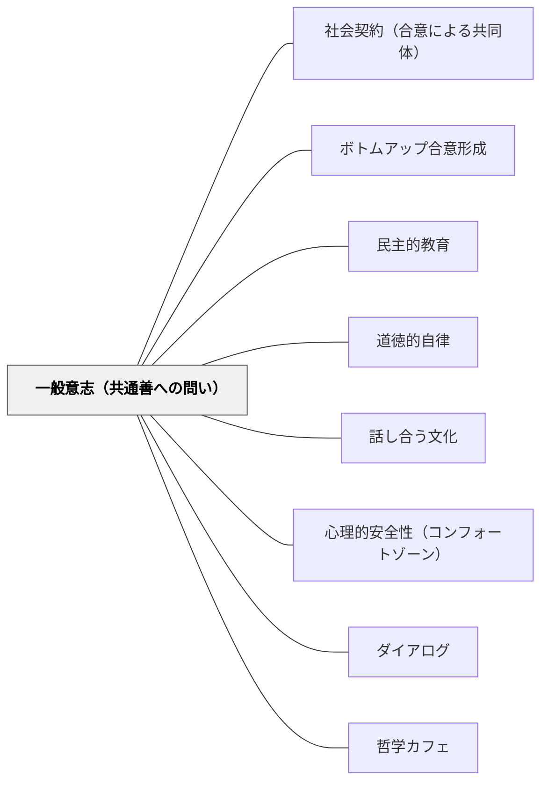

# 一般意志（共通善への問い）

> 「全員の賛成」でも「多数決」でもない——異なる意見の差異を整理したとき、その残りとして浮かびあがる共通の関心。これが一般意志（volonté générale）であり、共通善への問いを設計することで、学習者は「私の意見」より深いところにある「私たちの必要」を発見する。

## [Pattern Connection]

### ルソー（1762）社会契約論——一般意志の構造

**補強点**：
- ルソーが「一般意志は全体意志（全員の意見の総和）と異なる」と明示したことで、「民主的に決める」の意味が精緻化される。全員一致も多数決も、個別意見の集計にすぎない——共通の利益への志向から生まれる意志（一般意志）を引き出すには別の問い方が必要。
- 「個別意志の差異の総和が一般意志を生む」（中山元の解説）という構造は、KJ法・芋づる方式・ボトムアップ合意形成の理論的基礎として機能する。違いを明確にする議論が一般意志の発見を可能にする。

**拡張点**：
- 一般意志は「常に正しく、常に公共の利益に向かう」——これは学級の文脈では「子どもたちの真の必要（genuine need）」として読める。表面的な欲求（遊びたい、楽をしたい）の奥に、より深い関心（認められたい、理解したい、仲間でいたい）がある。その深層の共通関心を引き出すことが教師の問いの設計課題。

**波及するパタン**：
- [[パタン/ボトムアップ合意形成]] — 感動ポイント・芋づる・KJ法は一般意志を発見するための実践手続き
- [[パタン/民主的教育]] — 一般意志の形成プロセスこそが民主的教育の内実
- [[パタン/道徳的自律]] — 一般意志に自ら従うことが道徳的自由（ルソー）・道徳的自律（カント）へと連続する
- [[パタン/社会契約（合意による共同体）]] — 一般意志が表現されたものが社会契約（法・ルール）

---

## 背景（Context）

学級・学校・組織では、日々さまざまな意思決定が行われる。授業の進め方、学級目標、クラスのルール、行事の計画——それぞれに全員の関心と意見がある。しかし「みんなで決める」ことが、常に「よい決定」につながるわけではない。声の大きい子が場を支配する、多数決で少数派が切り捨てられる、形式的な挙手で誰も本当の意見を言わない——こうした現象は「全体意志（全員の意見の集計）」と「一般意志（共通善への志向）」が混同されているときに起きる。

ルソーは1762年の『社会契約論』で、この区別を哲学的に定式化した。一般意志（volonté générale）は共同体全体の利益を目的とし、全体意志（volonté de tous）は個々の私的利益の総和にすぎない——その差を見誤ると、民主主義は多数派の専制になる。

## 問題（Problem）

「みんなで決めたこと」が全員の納得を得られなかったり、一部の子だけが話し合いを動かしたり、「反対の意見を言いづらい」という空気が生まれたりする。これは手続きが民主的でも、問いの設計が共通善（一般意志）を引き出すものになっていないためである。

「どうしたい？」という問いは特殊意志（個人の欲求）を引き出す。「みんながよくなるには何が必要か？」という問いは一般意志（共通の利益）を引き出す——この問いの違いが議論の質を決める。

## 力のかたち（Forces）

- 「自分の意見」を主張することと「共通善を探る」ことは認知的に異なる作業——子どもはどちらをするべきか指示されなければ、前者に傾く
- 「多数決で決まったこと」は全員の意見を反映していると思われがちだが、少数意見の中に共通善が宿っていることがある
- 意見の違いを「対立」として捉えると議論が止まる——違いを「情報」として捉えると、差異の整理から共通関心が見えてくる
- 一般意志を見つけるには、まず個別意志（各人の「本当に困っていること」「本当に大切にしたいこと」）が十分に表明される必要がある
- 「全員一致でないと動けない」という幻想が、決定を先送りにする

## 解決（Solution）

**「みんなが賛成すること」でなく「違いが明確になること」を議論の目的として設計し、差異の整理の中から共通善（一般意志）を発見する。**

### 問いの転換——「どうしたい？」から「何が必要？」へ

| 全体意志を引き出す問い | 一般意志を引き出す問い |
|---|---|
| 「どうしたい？」 | 「みんなが学べるためには何が必要？」 |
| 「賛成・反対は？」 | 「この意見のどこが大切にしたいことに近いか？」 |
| 「多数決でいい？」 | 「少数意見の中に、誰もが見逃していた大切なことがないか？」 |
| 「まとめると？」 | 「みんなが言っていることの底にある共通の関心は何か？」 |

### 差異を整理する手続き

1. **各自が「本当に大切にしたいこと」を書く**（匿名でもよい）——ポストイットに一つずつ
2. **グルーピング**：似たものをまとめ、タイトルをつける
3. **「一匹オオカミ」を拾う**：どのグループにも入らない意見を無理にまとめず、「この声が伝えたいことは何か」を問う
4. **差異の底を問う**：最も意見が食い違っているところで「なぜそれが大切か？」を掘る
5. **残ったもの（差異を引いた残り）が一般意志の候補**

### 具体例1——学級目標を「一般意志」から作る

従来型：「どんなクラスにしたい？」→ 声の大きい子の意見が通る→ 「仲良しクラス」などの抽象的な目標

一般意志版：
1. 「今のクラスで困っていること」「今のクラスで大切にしたいこと」を各自ポストイットに書く
2. グルーピング——「認め合いたい」「安心して失敗できる」「意見を言える」などが浮かぶ
3. 「これらが大切なのはなぜ？」と掘る → 「怖くない場所でいたい」という共通関心が底から出てくる
4. 「怖くない場所」を具体的に行動として表現する → 学級目標

---

### 具体例2——授業の議論設計での一般意志

算数・国語・社会の学習での「話し合い」の場面でも適用できる。

- 「答えはどれ？」ではなく「なぜそう考えたか？」を先に出す
- 異なる解法・意見を「どちらが正しいか」でなく「どこが違うか」を問う
- 差異の整理の中から「なぜ算数はこうなっているか」という本質的な問いが自然に浮かぶ

一般意志の発見としての算数授業：「クラスの解法の差異」の整理から「数学の一般原理」を発見する——個別意志（各自の解法）の差異の総和から一般意志（数学的本質）が現れる。

---

### 具体例3——岩井の実践：「困り事の差異整理」

学級会で「どうしたいか」ではなく「なぜ困っているか」を先に問う試み。

各自が「今のクラスで困っていること」を書き、分類すると——「発表した後に笑われる」「意見が違うとムードが変わる」「静かにしようとしている子が邪魔される」——などが並ぶ。これらの差異を整理すると底に「安全でいたい」という一般意志が現れる。この一般意志を起点に、具体的なクラスのルールを生成する。

---

## 結果（Consequences）

- 「声の大きい子が場を動かす」という構造が崩れ、少数意見が議論の中心になりやすくなる
- 「全員が賛成していないが、全員が納得している」という合意の質が向上する
- 一般意志を探る経験の積み重ねが、「私の欲求」と「私たちの必要」を区別する道徳的能力を育てる
- 学級のルール・目標が「もらったもの」でなく「自分たちが見つけたもの」として機能し、自発的な遵守につながる

## 関連パタン

- [[パタン/社会契約（合意による共同体）]] — 一般意志が表現されたものが社会契約（合意によるルール）
- [[パタン/ボトムアップ合意形成]] — 感動ポイント・芋づる・KJ法は一般意志の発見手続き
- [[パタン/民主的教育]] — 一般意志の形成プロセスが民主的教育の内実
- [[パタン/道徳的自律]] — 一般意志に自ら従うことが道徳的自由→道徳的自律へと深化する
- [[パタン/話し合う文化]] — 一般意志を発見するための日常的な対話文化の基盤
- [[パタン/心理的安全性（コンフォートゾーン）]] — 特殊意志（本当に思っていること）を安全に表明できる場の条件
- [[パタン/ダイアログ]] — 「仮定を宙吊りにして集合的に考える」ダイアログは一般意志発見の対話形式
- [[パタン/哲学カフェ]] — 立場を脱いで共通善を語り合う場の設計
- [[文献/社会契約論／ジュネーヴ草稿（ルソー）]] — 本パタンの主要出典

---

## クラスター図

## Actionable Insight

- **「どうしたい？」を「何が必要？」に言い換える**：今週の学級会・話し合いの冒頭の問いを一語変えて、場の質がどう変わるか観察する
- **差異を拾う問い**：「誰かが言ったことで、なるほどと思ったことは？」「違う意見を言った人の言いたかったことは？」を必ず入れる
- **少数意見に注目する時間を設ける**：「まだ言えていないことがある人は？」「少数意見の人、もう少し話してもらえる？」——差異の底に一般意志が潜んでいる
- **「一匹オオカミ」を可視化する**：KJ法でグルーピングしたとき、どこにも入らない意見を「一匹オオカミ」と呼び、「この声が伝えたいことは何か？」をクラスで考える

---

## 出典

ルソー, J.-J.（1762）『社会契約論』（Du Contrat Social）。中山元訳（2008）『社会契約論／ジュネーヴ草稿』光文社古典新訳文庫, pp. 68–105（第二篇第一〜六章）、pp. 206–247（ジュネーヴ草稿）。

> 「わずかな利害関係の共通部分から差異を差し引くと、その残り（の総計）が一般意志になる」——ルソー（第二篇第三章）
