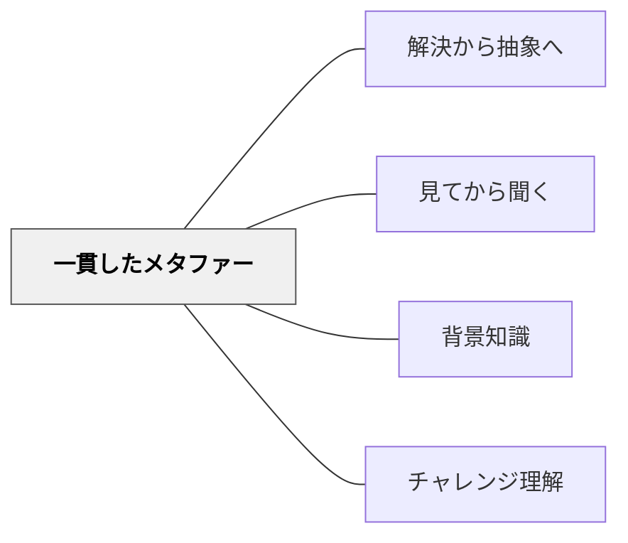

# 一貫したメタファー

> 複雑な概念には、学習者がすでに知っているものを「鏡」として渡せ——その鏡が正しく映す範囲と歪む範囲を両方教えながら。

## [Pattern Connection]

Bergin et al.（2012）の **Consistent Metaphor** パタンは、[[パタン/解決から抽象へ]]・[[パタン/見てから聞く]]が「体験から抽象へ」という順序を強調するのに対し、**学習者が持っていない体験領域**に橋を架ける手段としてのメタファーを正面から論じる点で独自の位置を占める。

- **補強点**：[[パタン/背景知識]]が「既有知識への接続」を原理として示すのに対し、本パタンはその接続のための具体的道具立て（一貫したメタファーの設計と限界の明示）を提供する
- **修正・拡張点**：メタファーは「比喩的に近い」だけでは不十分で、**要素と関係の構造が対応していること**（構造マッピング）が必要だと明確化する
- **他のパタンへの波及**：[[パタン/解決から抽象へ]]・[[パタン/見てから聞く]]・[[パタン/背景知識]]

---

## 背景（Context）

複雑なトピックを教えるとき、そのトピックは多くの部品をもち、学習者は細部の処理に追われて全体像を見失いやすい。特に技術的・専門的な内容では、学習者が日常経験から遠くなるほど「なぜこうなるのか」を類推する手がかりを持てなくなる。

## 問題（Problem）

詳細に分け入るほど、学習者は「部分のつながり」と「全体の振る舞い」を同時に把握することが難しくなる。正しい推論を引き出す足場がないと、学習者は細部を暗記するしかなくなる。

## 力のかたち（Forces）

- 細部の処理に集中すると全体像が見えなくなる
- 学習者は部品同士の関係を「なじみのある関係」に置き換えると理解しやすい
- トピックが技術的・専門的であるほど、学習者の日常経験との距離が大きい
- メタファーを与えすぎると、学習者がメタファーをトピックそのものと混同する危険がある
- 振る舞いについて正しい推論を引き出せる「使えるメタファー」は設計が難しい

## 解決（Solution）

**教えるトピックの基本要素と同じ要素をもち、同じように相互作用するメタファーを設計し、学習者にトピックを考えるための「思考ツール」として渡す。メタファーとトピックの関係を明示し、メタファーで正しく推論できる範囲と、限界（ズレる場所）を必ず伝える。**

手順：
1. トピックの核心的な要素と関係を洗い出す（例：カプセル化・メッセージパッシング）
2. 学習者がすでに知っている文脈で「同じ構造をもつもの」を探す
3. メタファーを学習者に提示し、「このトピックはこれと似たように動く」と宣言する
4. メタファーを使って推論させ、その推論がトピックで正しく成立するか確認する
5. メタファーが崩れる場所を明示し、「ここから先はこの比喩では説明できない」と伝える

---

具体例①：オブジェクト指向プログラミング→「人間」メタファー
「オブジェクトは人間のようなものです」という一貫したメタファー：人間は自律して動き（自律性）、自分の内部状態を他者に直接さわらせない（カプセル化）、他者にメッセージを送ることで情報をやり取りする（メッセージパッシング）。学習者はこのメタファーで「なぜデータを隠すのか」を直感的に理解できる。ただし、人間は相手のメッセージに返答することを「知っている」が、オブジェクトは必ずしも送信元への参照を持たない——この限界を明示することでメタファーの過剰適用を防ぐ。

具体例②：算数「かけ算」→「同じ袋を複数個用意する」メタファー
「3個入りの袋が4袋あるとき、全部で何個か」という場面は、かけ算の「同数のまとまりが複数ある」という構造に一貫して対応する。このメタファーは分配法則まで自然に拡張できる（袋を増やす・袋の中身を変える）が、小数のかけ算では「0.5袋」という直感から外れるため、その限界を明示する必要がある。

具体例③：国語「段落」→「段落は話題のブロック」メタファー
段落を「話題がひとつのブロックに入っている」と捉えることで、「なぜ段落を変えるか」（話題が変わるから）が一貫して説明できる。ただし複数の話題にまたがる段落や、文学的な段落の切り方はこのメタファーの外に出るため、「物語文では少し違う」ことを伝える。

---

## 結果（Consequences）

- 学習者がトピック全体の振る舞いを推論するための精神モデルを持つ
- メタファーは思考の省略記法として機能し、認知負荷が下がる
- 一貫したメタファーは、教師の説明にも学習者の質問にも共通言語を生む
- メタファーを過度に拡張すると誤った推論（誤概念）を招く危険があるため、限界の明示が不可欠

## 関連パタン

- [[パタン/解決から抽象へ]] — メタファーは抽象概念への足場として機能する
- [[パタン/見てから聞く]] — メタファーを体験させてから説明する順序と相性がよい
- [[パタン/背景知識]] — 既有知識にメタファーの基盤を置く
- [[パタン/チャレンジ理解]] — メタファーで推論させることが理解の試金石になる

## クラスター図

## Actionable Insight

- 新単元の導入でひとつのメタファーを宣言し、単元全体でそのメタファーを使い続ける——「今日もこれは〇〇と同じように考えよう」と毎時間のつなぎ言葉にする
- 授業中に「このメタファーで考えると〇〇のはずだが、実際はどうか？」と問い、メタファーの成立と崩れを学習者と一緒に確かめる——その崩れ目がトピックの核心的な特徴を照らし出す
- メタファーが「ズレる場所」を意図的に見つけさせる活動を設計する——「どこで通用しなくなる？」という問いは、浅い類推学習から構造的理解へと引き上げる

## 出典

Bergin, J., Eckstein, J., Manns, M. L., Marquardt, K., Chandler, J. P., Sharp, H., & Voelter, M.（2012）*Pedagogical Patterns: Advice For Educators.* Joseph Bergin Software Tools. CC BY-SA 3.0.

> "Create a metaphor that is consistent with the topic being taught, and with the same basic elements that interact in the same way. Give this to the students as a way to think about the topic. The metaphor must allow students to make valid inferences about the topic by thinking about the metaphor."
