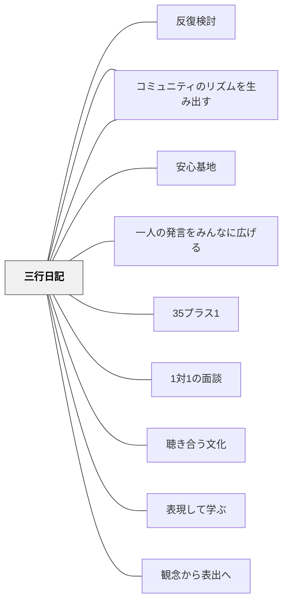

# 三行日記

> 毎日たった3行の往復が、教師と子どものルートをつくる。

## [Pattern Connection]

**小倉勝登（2020）全文再統合（2026-05-21）——二種類の日記・SOS機能・学級通信増幅の詳細：**

初期統合では「三行日記」と「いっぽいっぽ」の二種類の存在は記録されていたが、その具体的な運用・SOS機能・学級通信との連動の詳細が不足していた。

**二種類の日記の使い分けと運用**：

| | 三行日記「よかったよ・たのしかったよカード」 | 5分間日記「いっぽいっぽ」 |
|---|---|---|
| タイミング | 毎日下校前に提出 | 家で書いて毎朝提出 |
| 形式 | 3行＋「おうちのひとから」欄 | A4漢字練習（1文字）＋日記欄 |
| 内容 | ポジティブな出来事中心 | 完全自由（何でもかまわない） |
| 週末 | 持ち帰り保護者サイン→月曜返却 | 毎日継続 |
| 教師の返却 | 翌朝 | 下校まで（間に合えば）か翌朝 |

**命名の意図**：「よかったよ・たのしかったよ」という名称にすることで、子どもが1日をポジティブに振り返って帰れるようにする。

**SOS機能（二人だけのサイン）**：子どもと教師の間で秘密の約束を決める——三行日記にアンパンマンの顔を描くことが「明日、相談があります」のサインになる。言葉にしにくい子どもが、絵一つで「助けてのサイン」を出せるルートを開く。

**学級通信による増幅**：子どもの日記を（本人の掲載許可を得て）学級通信で紹介する。1年かけてすべての子の日記が載せられるように工夫する。効果：互いのよさを認め合うきっかけ、書き方のモデル、直接説明するより子どもの心に強く残る。

**継続の根拠（実例）**：6年生の子が「Cさんにふられました。オグ、ぼくはどうしたらいいかわからない」と書いてきたとき、小倉は自分の経験談も交えながら全力でコメントを書き続けた。この積み重ねが「書いた内容を全力で受け取ってもらえる」という信頼になる。

- **補強された点**：「よかったよ・たのしかったよ」という名称設計が「書き出しのハードル」を下げる仕掛けになっている。内容より「毎日書く・受け取る」サイクルの継続が第一目的。
- **他のパタンへの波及**：[[パタン/合図システム]] — 二人だけのサイン（アンパンマン）は视覚的合図による援助要求の一形態。[[パタン/コミュニティのリズムを生み出す]] — 「書く→読む→返す」の毎日のリズムが学級の文化的基盤になる。

---

## 背景（Context）

教師が35人全員の内側にアクセスするのは難しい。授業中は場が動き続け、放課後は短く、個別に話す時間は限られている。しかし子どもは毎日何かを感じ、考え、困り、喜んでいる。その日常の感情・出来事が教師に届かないまま積み重なると、困り感が大きくなってから初めて表面に出てくることになる。

## 問題（Problem）

子ども全員と毎日言葉を交わすことは物理的に難しい。学習面の観察だけでは、子どもの感情・生活・人間関係の変化を早期に捉えられない。特に内向的な子・言葉にしにくい子は、集団の場では声を出さず、困り感が教師に届きにくい。

## 力のかたち（Forces）

- 書くことは、話すことより安心して本音を出せる子どもがいる（特に内向きな子・言語化が苦手な子）
- 毎日全員分のコメントを書く教師の負担は大きく、継続に意志力を要する
- 書いたことに反応が返ってくる経験が、次の書く動機を生む
- 日記の内容が保護者と家庭でも話題になることで、三者のコミュニケーションルートが生まれる

## 解決（Solution）

**毎日下校前に子どもが3行書いて提出し、教師がコメントして翌日返すという「往復書簡」の仕組みをつくる。**

小倉は「よかったよ・たのしかったよカード」という三行日記を実践している。

ポイント：
- **内容は「よかったこと・たのしかったこと」だけでいい**：ネガティブな表現のハードルを下げ、まずルートを開通させることを優先する。書き続けることが始まってから、内容の幅は自然に広がる。
- **教師のコメントは短くていい**：「うれしいね！」「どんな気持ちだった？」など1〜2行。質問で返すと翌日の書くエネルギーになる。
- **学級通信で日記を紹介する**（許可を得て）：コメントとともに紹介することで、教師の関わり方・価値観がクラス全体に届く。「あなたのことを見ている」というメッセージが全員に伝わる。
- **もう一つの日記「5分間日記（いっぽいっぽ）」**：家庭学習シートに日記欄を設け、漢字練習と抱き合わせで家庭でも書く。家庭でのルートと学校でのルートを使い分けることで、子どもは「見てもらえている」感覚を日常の中で確認し続ける。

三行日記は[[パタン/1対1の面談]]を補完する。面談では「今日どう？」という言葉が出にくい子どもも、書いたことを媒介に話せることがある。

## 結果（Consequences）

- 教師が毎日全員の状態を最低限確認できるルートが生まれる
- 内向きな子・言語化が苦手な子のシグナルが早めに届くようになる
- 「毎日コメントしてもらえる」という経験が、教師への信頼と発言の安心感を育てる
- 学級通信での公開が、ポジティブな言葉かけの文化をクラス全体に波及させる

## クラスター図

## Actionable Insight

- 「よかったよ・たのしかったよカード」を1週間試す——下校前5分で書ける小さいフォーマットにし、まず継続することを優先する
- 教師のコメントは「質問で返す」を基本にする——「どんな気持ちだった？」「もっと聞かせて」が翌日の書く動機をつくる
- 月に1〜2回、本人の許可を得て学級通信で紹介する——ポジティブなコメントが紙面を通じてクラス全体に届き、言葉かけの文化が育つ

## 関連パタン
- [[パタン/反復検討]]
- [[パタン/コミュニティをつくる]]
- [[パタン/安心基地]]
- [[パタン/一人の発言をみんなに広げる]]

- [[パタン/35プラス1]] — 全員との接触を日常化するための仕掛け
- [[パタン/1対1の面談]] — 三行日記が開いたルートを面談でより深める
- [[パタン/聴き合う文化]] — 日記への反応が「聴いてもらえた」感覚を育てる
- [[パタン/コミュニティのリズムを生み出す]] — 毎日の日記が学級のリズムになる
- [[パタン/表現して学ぶ]] — 書くことが子どもの感情整理・思考整理を助ける
- [[パタン/観念から表出へ]] — 書く前に「今日の出来事・感情」を内側に確認する

## 出典
- [[文献/社会科教師の授業・学級づくり「仕掛け学」（小倉勝登）]]

小倉勝登（2020）『社会科教師の授業・学級づくり「仕掛け学」』東洋館出版社
