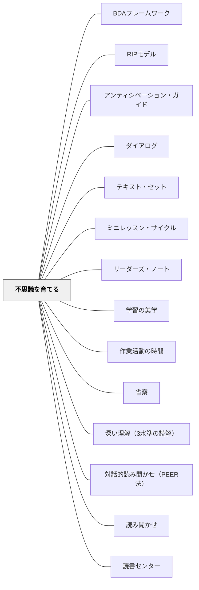

# 不思議を育てる

> 「問いを持つことは、学びが来ることを知っているサイン」——Daniel（1年生）

## [Pattern Connection]

Debbie Miller（2002）の **Reading with Meaning** では、「Wonder Box（不思議ボックス）」という実践が中心的な学級文化の道具として登場する。子どもたちの自然な疑問——「なぜ鳥は歌えるの？」「なぜ犬は鼻が濡れているの？」——を紙に書いて箱に集め、それを教室の知的探究の燃料にする。問いを「授業の中断」として扱うのではなく、「学びの出発点」として位置づける文化づくりのパタン。

**Miller（2002）Wonder Box の詳細（2026-05-18追補）：**

- **Wonder Box の実物**：3×5インチのファイルボックスをシール（テントウムシ・恐竜・鳥・花）で飾り、Wonder Cards（カラフルな索引カード）を詰める。子どもが自分で装飾し、「自分の Wonder Box」という所有感を持つ
- **The Wise Woman and Her Secret（Eve Merriam）とのつながり**：「知恵の秘密は、驚き続けることにある」というテーマの絵本を読んだ後、クラス全員で校庭に出て探索——ベンが木の股に座り、エミリーが虫眼鏡でテントウムシを観察し、ニーナが草の上に仰向けになって空を眺める。「なぜ鳥は歌を覚えられるの？」「テントウムシにはなぜ斑点があるの？」「私たちは今宇宙にいるの？」「アリはどうやって家に帰るの？」「犬の鼻はなぜ濡れているの？」
- **Wonder Box が生活に広がる**：給食室・運動場・校外学習先にも Wonder Box が持ち込まれる。虫眼鏡・ 光る小石・羽・死んだ虫・「ダイヤモンド」・花びら・「恐竜の化石」が入るようになる
- **教師自身の問いのモデリング**：「最近、アリの巣穴をじっと見つめて中で何が起きているか考えたのはいつだろう？」——Miller 自身も問いを持つ者に変わっていったことを記録
- **The Stranger（Chris Van Allsburg）との接続**：深夜に The Stranger を読んだ Miller が「これは何の話？あの人は誰？」と思い続けた経験が、問いを持つことの価値を示すプロローグになる。翌日クラスで読み聞かせると、グレースが「赤い葉が記憶を戻したから！」と即座に解決——「子どもから学べる」という認識の転換

- **補強点**：[[パタン/深める問い]] に「子どもの自然な問いから始まる」という方向性を与える。問いは教師が設定するだけでなく、子どもが自分で持ち込むものでもある
- **拡張点**：[[パタン/内発的動機付け]] の「自律性（Autonomy）」を「問いを持つ自由」という形で具体化する——「自分が不思議に思ったことを問い続けていい」という許可が自律性を育てる
- **他のパタンへの波及**：[[パタン/アンカーチャート]]・[[パタン/推論する（インファリング）]]・[[パタン/リーディング・ワークショップ]]
- **Willingham との接続**（2026-05-15追記）：Willingham（2015）*Raising Kids Who Read* は、好奇心と背景知識の補完関係を示す。「不思議を育てる」ことは読書の動機をつくり（「答えを知りたい」→本を読む）、その読書が背景知識を積み上げ（[[パタン/背景知識]]）、さらに背景知識があることで新しい「不思議」が生まれる——この循環が読書アイデンティティ（[[パタン/読書アイデンティティ]]）を育てる。ノンフィクションの読み聞かせ（[[パタン/読み聞かせ]]）は「驚く事実」を提供し、Wonder Box への問いの燃料になる

1年生のDanielは言った：「本についての問いがたくさんあるとき、それはいいことだよ。学びがたくさん来ることを知っているから」。この言葉は、「問うこと」と「学ぶこと」を直結して理解した子どもの認識を示している。

---

## 背景（Context）

子どもたちは本来、無数の問いを持っている。「なんで？」「どうして？」「あれって何？」——しかし学校では、この問いが「授業の邪魔」として扱われることがある。「今は関係ない」「後で調べて」「それは今日のテーマじゃない」。そうした経験を繰り返すと、子どもは問いを持つことを自ら抑制するようになる。

読書においても同じ構造がある。「読んで問いに答えなさい」という指示は、「あらかじめ決められた問いに正しく答えること」を求める。子どもが自分で問いを立てる機会がなければ、読書は「情報の処理」になり、探究にはならない。

## 問題（Problem）

子どもの自然な問いが、学習の邪魔として扱われる。「先生に聞けばわかること」と思うと、問いを自分で育てようとしなくなる。「答えを出すこと」が学習の目的になり、「問いを持ち続けること」の価値が伝わらない。

## 力のかたち（Forces）

- 子どもは本来、問いを持っている——それを歓迎する文化がなければ表に出ない
- 問いに「正しい問い」「誤った問い」はない——すべての問いが学びの入口になりうる
- 問いを「箱に入れる」という行為が、問いに価値を与える
- 「先生にも分からないことがある」をモデリングすることが最も強い問いの文化を作る
- 問いが蓄積されると、授業・単元・カリキュラムの出発点になりうる

## 解決（Solution）

**教室に「不思議ボックス（Wonder Box）」を置き、子どもたちが自分の問いをいつでも入れられるようにする。問いを掲示し、教師もモデリングし、問い続ける文化を年間かけて育てる。**

---

具体例①：Wonder Box の作り方と運用

- 空き箱（シューボックスなど）を「Wonder Box」として飾る
- 付箋紙と鉛筆をそばに置く
- 「いつでも自分の不思議を書いて入れていい」とルールを伝える
- 毎週1〜2個の問いを取り出して「朝の会」などで読み上げる
- 「この問いに答えられる人はいる？」「この問いを調べてみたい人は？」と問い返す

---

具体例②：教師のモデリング——「先生にも分からない」

毎週1回、教師自身の「Wonder」を書いて箱に入れる：

> 「私は今朝、カラスがゴミ袋を開けるのを見た。なぜカラスはゴミ袋を開けられるんだろう？これが私の今週の不思議です。箱に入れておきます」

子どもたちは「先生も問いを持っているんだ」「先生にも分からないことがあるんだ」という認識を得る。これが最も強い「問いを持っていい」というサインになる。

---

具体例③：Wonder Box と読書をつなぐ

読み語りや読書の後：

- 「この本を読んで、新しい不思議が生まれた人は箱に入れて」と促す
- 子どもが書いた問いをアンカーチャートに貼り出す（「私たちの問い」として可視化）
- 単元の導入で「この Wonder の問いと今日の学習はつながっているかな？」と問う
- 探究の授業で「一番気になる問い」を1つ選んで掘り下げる

---

具体例④：「問いのタイプ」を教える（推論指導との連携）

読書中に生まれる問いには種類がある：

| 問いのタイプ | 例 | 対応ストラテジー |
|---|---|---|
| 事実の問い | 「この動物は何を食べるの？」 | 本・辞典で調べる |
| 行間の問い | 「この子はなぜ泣いているの？」 | 推論する（BK + TC） |
| 世界への問い | 「なぜ不公平なことが起きるの？」 | 対話・探究・哲学的問い |

Wonder Box は3種類すべての問いを歓迎する。「どの問いも大切」という文化が、子どもの知的好奇心を守る。

---

## 結果（Consequences）

- 教室に「問いを出していい」という文化が生まれる
- 子どもが読書中に「これ気になる」と止まることを恐れなくなる
- 蓄積された問いが授業・単元の出発点になる可能性が生まれる
- 「先生も知らないことがある」が子どもの安心感を生む
- 「答えが出ない問い」と共に居続けることの価値を、体験として学ぶ

## 関連パタン
- [[実践/思考の記録サイクル]]
- [[パタン/BDAフレームワーク]]
- [[パタン/RIPモデル]]
- [[パタン/アンティシペーション・ガイド]]
- [[パタン/ダイアログ]]
- [[パタン/テキスト・セット]]
- [[パタン/ミニレッスン・サイクル]]
- [[パタン/リーダーズ・ノート]]
- [[パタン/学習の美学]]
- [[パタン/作業活動の時間]]
- [[パタン/省察]]
- [[パタン/深い理解（3水準の読解）]]
- [[パタン/対話的読み聞かせ（PEER法）]]
- [[パタン/読み聞かせ]]
- [[パタン/読書センター]]
- [[パタン/背景知識]]
- [[パタン/非カリキュラムタスク（考える文化をつくる問い）]]
- [[パタン/問いをもつ（クエスチョニング）]]
- [[パタン/問いを大切にする]]
- [[パタン/問題解決的教材研究]]

- [[パタン/深める問い]] — 問いを立てることの理論的基盤
- [[パタン/内発的動機付け]] — 問いを持つことが学びの内発的動機になる
- [[パタン/アンカーチャート]] — 問いをクラス全体で可視化するツール
- [[パタン/推論する（インファリング）]] — 行間の問いは推論の入口
- [[パタン/メタ認知的モニタリング]] — 「自分は何を分かっていて何を分かっていないか」への問い
- [[パタン/リーディング・ワークショップ]] — 問いを持ちながら読む時間の確保
- [[実践/カンファリング（読書会議）]] — 読書会議で子どもの問いを丁寧に聴く

## クラスター図

## Actionable Insight

- 今週、空き箱と付箋紙を用意して「Wonder Box」を教室に置く——「入れてみて」と伝えるだけで、子どもたちが問いを書き始める
- 教師が自分の「今週の不思議」を1つ声に出す——「先生にも分からないことがある」というモデリングが問いの文化の一番の土台になる
- 読み語りの後に「この本を読んで、新しい不思議が生まれた人は？」と1回問う——答えを求めるのではなく、問いが生まれたことを称賛する

## 出典

Miller, D. (2002). *Reading with Meaning: Teaching Comprehension in the Primary Grades*. Stenhouse Publishers.

> "When you have lots of questions about a book, that's good. Then you know there's going to be a lot of learning coming to you." —Daniel（1年生）

[[文献/Reading with Meaning（Miller）]]
