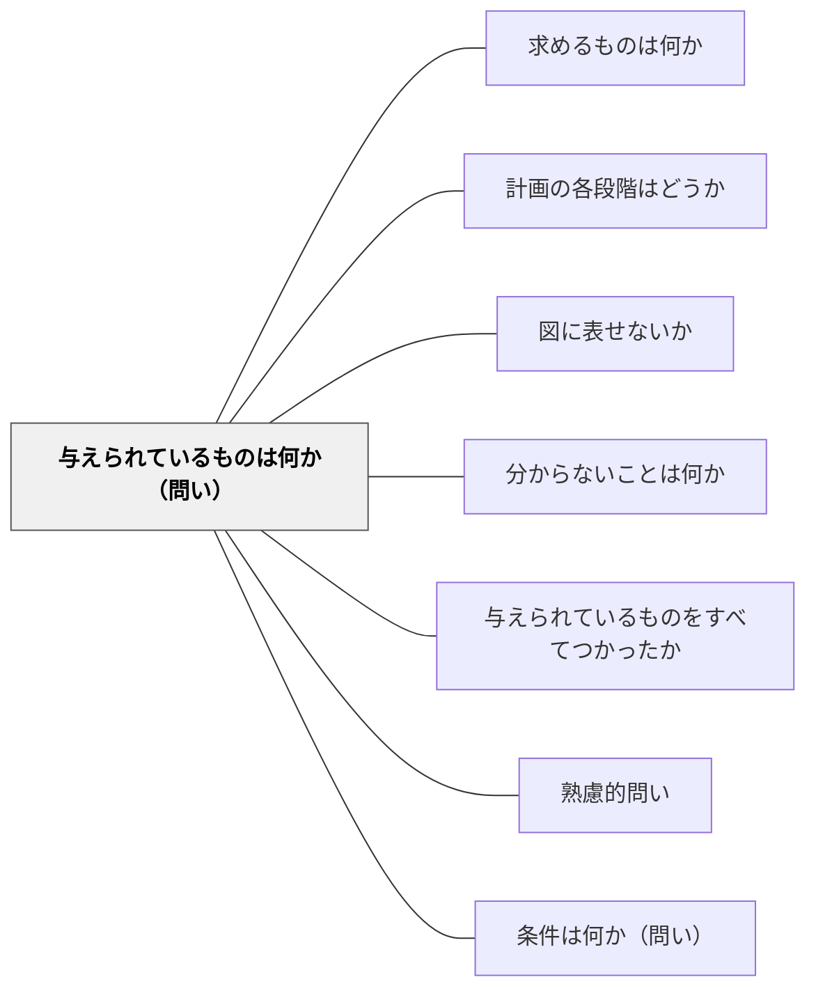

# 与えられているものは何か（問い）

> 既知の情報・前提・条件を整理することで、問題解決の出発点を確かにする。

## 背景（Context）
学習者が問題に取り組む際、何が分かっていて何が分からないかを区別できないまま考え始めることが多い。情報が混在したまま思考が進むと、方向を見失いやすい。特に複雑な問題では、手持ちの材料を整理することが最初の重要なステップになる。

## 問題（Problem）
問題に直面した学習者は、何から考えれば良いか分からず思考が止まりやすい。与えられた情報を活用せずに、ゼロから考えようとすることで不必要に難しくなってしまう。「分かっていること」を明確にしないまま「分からないこと」を探ろうとすると、混乱が生じる。

## 力のかたち（Forces）
- 学習者は問題全体を一度に把握しようとして圧倒されやすい
- 既知の情報を意識化することで、思考の足場が生まれる
- 整理する行為自体が、問題の構造を明らかにする
- 前提・条件を列挙することで、見落としを防げる

## 解決（Solution）
「この問題で与えられているものは何か？分かっていることを全部挙げてみよう」と問いかける。例えば数学の文章題なら「三角形の底辺が5cm、高さが4cmと書いてある。他には何がある？」のように、明示的に既知情報を言語化させる。箇条書きやノートへの書き出しを促すと効果的である。

## 結果（Consequences）
- 問題の出発点が明確になり、学習者が主体的に思考を始められる
- 情報の見落としが減り、解法の精度が上がる
- 「何が分かっていないか」を特定する準備ができる

## 関連パタン
- [[パタン/求めるものは何か]]
- [[パタン/計画の各段階はどうか]]
- [[パタン/図に表せないか]]
- [[パタン/分からないことは何か]]
- [[パタン/与えられているものをすべてつかったか]]
- [[パタン/熟慮的問い]] — 親パタン
- [[パタン/条件は何か（問い）]] — 制約・条件を明確にする補完的な問い

## クラスター図

## Actionable Insight

- 問題を見た後まず「分かっていることを全部ノートに書き出そう」と促す——既知情報を整理するだけで思考の足場が生まれる
- 「書いたこと以外に、問題文に書いてあることはない？」と確認させる——情報の見落としを防ぐ習慣が精度を上げる
- グループで「各自が挙げた情報を比べてみよう」と情報共有する——比較によって条件の読み落としが発見される

## 出典
- [[文献/熟慮的問いのパターンリスト（動画記録）]]
- ジョージ・ポリア（1954）『いかにして問題をとくか』丸善出版
