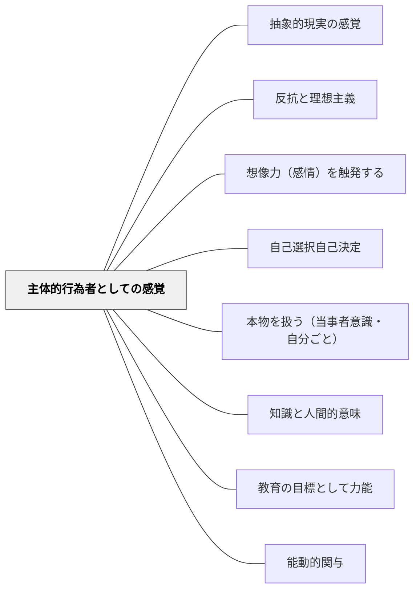

# 主体的行為者としての感覚

> 学習者が「自分が学んでいる」という行為者感覚をもてるよう設計する

## 背景（Context）

多くの学習場面で、学習者は知識を「受け取る」存在として位置づけられる。教師が決めたことを教師が決めた方法で学ぶとき、学習者は自分を受動的な対象と感じる。

## 問題（Problem）

自分が主体的行為者であるという感覚（エージェンシー）がなければ、学習への内発的な動機が育ちにくい。学習が「やらされること」になり、探究・創造・応用への意欲が生まれない。

## 力のかたち（Forces）

- 自律性・有能感・関係性の充足が内発的動機を育む（自己決定理論）
- 「自分事」として学ぶとき、人は注意・記憶・思考の質が向上する
- しかし構造や足場のないまま自由にしても、無力感を生むこともある
- 行為者感覚は、選択・決定・創造・影響の機会から生まれる

## 解決（Solution）

学習の中に、学習者が意思決定・選択・創造をする機会を意図的に組み込む。問いの立て方、探究の方法、表現の形式、評価の基準——これらのいずれかに学習者が関与できる場を設ける。

「あなたはどう思うか」「あなたならどうするか」という問いを中心に据え、学習者の判断・解釈・行動が学習の核心となるよう設計する。

## 結果（Consequences）

学習者は学習を「自分事」として受け取り、内発的動機が高まる。知識の主体的な活用や批判的思考が促される。ただし、行為者感覚を支える適切な足場（スキャフォールディング）がないと、自由が不安や混乱につながることもある。

## 関連パタン
- [[パタン/抽象的現実の感覚]]
- [[パタン/反抗と理想主義]]

- [[パタン/想像力（感情）を触発する]]
- [[パタン/自己選択自己決定]]
- [[パタン/本物を扱う（当事者意識・自分ごと）]]
- [[パタン/知識と人間的意味]]
- [[パタン/教育の目標として力能]]
- [[パタン/能動的関与]]

## クラスター図

## Actionable Insight

- 問いの立て方・探究の方法・表現の形式のいずれか一つを学習者が選べるようにする——小さな選択の機会が「自分が学んでいる」という行為者感覚を生む
- 「あなたはどう思うか」「あなたならどうするか」という問いを授業の核心に据える——学習者の判断・解釈が学習のエンジンになる
- 単元の中で「自分で問いを立てる」機会を一度設ける——問いの主体になることが最も強い行為者感覚を生む

## 出典

Egan, K. (2005). *An Imaginative Approach to Teaching*. Jossey-Bass.（邦訳：星野英一訳（2010）『想像力を触発する教育――認知的道具を活かした授業づくり』北大路書房）
