# 主要概念で評価する

> 学習者は「点数の重みで何が大切かを知る」——最重要の概念を最も高く評価することで、学習の優先順位を明示する。

## [Pattern Connection]

Bergin et al.（2012）の **Key Ideas Dominate Grading** パタンは、[[パタン/フィードバック]]が「評価を情報として返す」ことを原則とするのに対し、**評価の点数配分そのものが学習目標のメッセージを学習者に送る**という設計原理を明確にする。

- **補強点**：[[パタン/ゴールドスター]]の「卓越した成果を特別に認める」という考え方と組み合わせることで、「主要概念の習得」と「それを超えた優秀さ」を評価上も区別できる
- **修正・拡張点**：「難しい問題＝重要な問題」という暗黙の誤解を解除し、難易度と重要度を独立した軸として評価設計に明示的に組み込む
- **他のパタンへの波及**：[[パタン/ゴールドスター]]・[[パタン/フィードバック]]・[[パタン/早期警告]]

---

## 背景（Context）

学習者は評価の配点を見て「何を学ぶべきか」を判断する。教師が最も大切だと考える概念が評価に正しく反映されていなければ、学習者は重要でない部分の暗記に時間を費やし、核心的な理解をおろそかにする。

## 問題（Problem）

難しい問題や複雑な課題が高得点になるよう設計すると、学習者はコースの最重要概念よりも「難易度の高いが周辺的なトピック」に学習の重心を置いてしまう。評価の構造が学習の優先順位を誤って伝えることになる。

## 力のかたち（Forces）

- 学習者は評価されるものに集中する
- 難しい問題と重要な問題は必ずしも一致しない
- 教師が言葉で「これが大切」と言っても、評価配点がそれを示さなければ言葉は空振りになる
- 難度の高い問題も挑戦として残しておきたいが、失点の大半を占めさせるべきではない
- 学習者は「自分が何を目指せばよいか」が明確なほど自律的に学習を調整できる

## 解決（Solution）

**試験・課題・クイズのすべてにおいて、そのコースの主要概念に最も高い点数を配分する。難易度の高い問題を出してもよいが、それが主要概念でなければ低い点数に抑える。主要概念と配点の理由を学習者に明示する。卓越した応用や発展的な成果に対してはゴールドスターで別に認める。**

実施の手順：
1. コースの主要概念を3〜5個に絞り込む（単元ごとに見直す）
2. すべての評価課題で、主要概念に関わる問いが最大の配点を持つよう設計する
3. 難しい問いはあってもよいが、配点は主要概念の問いより低く設定する
4. コース開始時・単元開始時に「このコースで最も大切なことは何か」を学習者に伝える（FAQや学習目標シートが効果的）
5. 難易度の高い発展的な成果には点数以外の形（称賛・ゴールドスター・特別なコメント）で認める

---

具体例①：算数「分数の計算」単元
主要概念は「分数の意味と等価分数」。この概念への問いに配点の60%を置く。計算の手続きは残りの40%。難しい計算問題（異分母の帯分数の加減）は出題してもよいが、配点は低い。「なぜ通分が必要か」を言葉で説明する問題が最高点になる設計にする。

具体例②：国語「物語文の読解」単元
主要概念は「中心人物の変容を読む」。単元の評価では、この観点への記述が最大配点。慣用句・語句の知識問題は低配点で補足的に入れる。例外的に深い読みをした学習者のノートにはコメントで「ゴールドスター」を伝える。

具体例③：コースFAQによる主要概念の可視化
コース冒頭に「このコースで一番大切なことは何ですか？」「なぜそこが最高点なんですか？」というFAQを配布し、教師が自分の言葉で答えを書いておく。学習者が試験前に自分で学習の優先順位を立てる羅針盤になる。

---

## 結果（Consequences）

- 学習者は何に集中すべきかを評価の構造から自ら読み取れる
- 学習の優先順位とコースの目標が整合し、意図した理解が促進される
- 難しい周辺課題は挑戦として残しつつ、コアの習得を妨げない設計になる
- ゴールドスターが主要概念以外の卓越さを認める安全弁になる
- 教師は「何が主要概念か」を自分で明確化するプロセスを通じ、単元設計を見直す機会を得る

## 関連パタン
- [[パタン/批判的評価]]
- [[パタン/間違ったやり方をする]]
- [[パタン/被教育者からのフィードバックを利用して教育改善をする]]
- [[パタン/達成レベルの役割]]
- [[パタン/非確証フィードバック]]
- [[パタン/技術やスキルの実演を分析する]]
- [[パタン/脱文脈化された達成規準]]
- [[パタン/不備のある実例を示す]]
- [[パタン/テストを作成する]]
- [[パタン/一つ又はそれ以上の成功規準に焦点化し最も良い学習物を探し改善案を示す]]
- [[パタン/確証フィードバック]]
- [[パタン/教材を改善する]]
- [[パタン/授業中に学習パートナーが協働して成功を確認し改善案を示す]]
- [[パタン/総括的評価]]

- [[パタン/ゴールドスター]] — 主要概念を超えた卓越した成果を評価する補完機構
- [[パタン/フィードバック]] — 配点設計が学習者への先行フィードバックとして機能する
- [[パタン/早期警告]] — 評価構造の明示が学習の早期の方向づけに使える

- [[パタン/省察的評価]] — 主要概念の評価を振り返ることで評価設計が改善される
- [[パタン/豊かな課題]] — 主要概念を核にした豊かな課題設計
- [[パタン/出入り口を明確にする（目標設定）]] — 主要概念の特定は目標設定と連動する
- [[概念/教育評価論]] — 評価の意義と機能に関する理論的背景
## クラスター図

```mermaid
flowchart LR
    ne4b8bbe8a681e6a682e5bfb5e381a7e8a995e4bea1e38199e3828b["主要概念で評価する"]
    ne689b9e588a4e79a84e8a995e4bea1["批判的評価"]
    ne99693e98195e381a3e3819fe38284e3828ae696b9e38292e38199e3828b["間違ったやり方をする"]
    ne8a2abe69599e882b2e88085e3818be38289e381aee38395e382a3e383bce38389e38390e38383e382afe38292e588a9e794a8e38197e381a6e69599e882b2e694b9e59684e38292e38199e3828b["被教育者からのフィードバックを利用して教育改善をする"]
    ne98194e68890e383ace38399e383abe381aee5bdb9e589b2["達成レベルの役割"]
    ne99d9ee7a2bae8a8bce38395e382a3e383bce38389e38390e38383e382af["非確証フィードバック"]
    ne68a80e8a193e38284e382b9e382ade383abe381aee5ae9fe6bc94e38292e58886e69e90e38199e3828b["技術やスキルの実演を分析する"]
    ne884b1e69687e88488e58c96e38195e3828ce3819fe98194e68890e8a68fe6ba96["脱文脈化された達成規準"]
    ne4b88de58299e381aee38182e3828be5ae9fe4be8be38292e7a4bae38199["不備のある実例を示す"]
    ne38386e382b9e38388e38292e4bd9ce68890e38199e3828b["テストを作成する"]
    ne4b880e381a4e58f88e381afe3819de3828ce4bba5e4b88ae381aee68890e58a9fe8a68fe6ba96e381abe784a6e782b9e58c96e38197e69c80e38282e889afe38184e5ada6e7bf92e789a9e38292e68ea2e38197e694b9e59684e6a188e38292e7a4bae38199["一つ又はそれ以上の成功規準に焦点化し最も良い学習物を探し改善案を示す"]
    ne7a2bae8a8bce38395e382a3e383bce38389e38390e38383e382af["確証フィードバック"]
    ne69599e69d90e38292e694b9e59684e38199e3828b["教材を改善する"]
    ne68e88e6a5ade4b8ade381abe5ada6e7bf92e38391e383bce38388e3838ae383bce3818ce58d94e5838de38197e381a6e68890e58a9fe38292e7a2bae8aa8de38197e694b9e59684e6a188e38292e7a4bae38199["授業中に学習パートナーが協働して成功を確認し改善案を示す"]
    ne7b78fe68bace79a84e8a995e4bea1["総括的評価"]

    ne4b8bbe8a681e6a682e5bfb5e381a7e8a995e4bea1e38199e3828b --- ne689b9e588a4e79a84e8a995e4bea1
    ne4b8bbe8a681e6a682e5bfb5e381a7e8a995e4bea1e38199e3828b --- ne99693e98195e381a3e3819fe38284e3828ae696b9e38292e38199e3828b
    ne4b8bbe8a681e6a682e5bfb5e381a7e8a995e4bea1e38199e3828b --- ne8a2abe69599e882b2e88085e3818be38289e381aee38395e382a3e383bce38389e38390e38383e382afe38292e588a9e794a8e38197e381a6e69599e882b2e694b9e59684e38292e38199e3828b
    ne4b8bbe8a681e6a682e5bfb5e381a7e8a995e4bea1e38199e3828b --- ne98194e68890e383ace38399e383abe381aee5bdb9e589b2
    ne4b8bbe8a681e6a682e5bfb5e381a7e8a995e4bea1e38199e3828b --- ne99d9ee7a2bae8a8bce38395e382a3e383bce38389e38390e38383e382af
    ne4b8bbe8a681e6a682e5bfb5e381a7e8a995e4bea1e38199e3828b --- ne68a80e8a193e38284e382b9e382ade383abe381aee5ae9fe6bc94e38292e58886e69e90e38199e3828b
    ne4b8bbe8a681e6a682e5bfb5e381a7e8a995e4bea1e38199e3828b --- ne884b1e69687e88488e58c96e38195e3828ce3819fe98194e68890e8a68fe6ba96
    ne4b8bbe8a681e6a682e5bfb5e381a7e8a995e4bea1e38199e3828b --- ne4b88de58299e381aee38182e3828be5ae9fe4be8be38292e7a4bae38199
    ne4b8bbe8a681e6a682e5bfb5e381a7e8a995e4bea1e38199e3828b --- ne38386e382b9e38388e38292e4bd9ce68890e38199e3828b
    ne4b8bbe8a681e6a682e5bfb5e381a7e8a995e4bea1e38199e3828b --- ne4b880e381a4e58f88e381afe3819de3828ce4bba5e4b88ae381aee68890e58a9fe8a68fe6ba96e381abe784a6e782b9e58c96e38197e69c80e38282e889afe38184e5ada6e7bf92e789a9e38292e68ea2e38197e694b9e59684e6a188e38292e7a4bae38199
    ne4b8bbe8a681e6a682e5bfb5e381a7e8a995e4bea1e38199e3828b --- ne7a2bae8a8bce38395e382a3e383bce38389e38390e38383e382af
    ne4b8bbe8a681e6a682e5bfb5e381a7e8a995e4bea1e38199e3828b --- ne69599e69d90e38292e694b9e59684e38199e3828b
    ne4b8bbe8a681e6a682e5bfb5e381a7e8a995e4bea1e38199e3828b --- ne68e88e6a5ade4b8ade381abe5ada6e7bf92e38391e383bce38388e3838ae383bce3818ce58d94e5838de38197e381a6e68890e58a9fe38292e7a2bae8aa8de38197e694b9e59684e6a188e38292e7a4bae38199
    ne4b8bbe8a681e6a682e5bfb5e381a7e8a995e4bea1e38199e3828b --- ne7b78fe68bace79a84e8a995e4bea1

    classDef hub fill:#f0f0f0,stroke:#555,color:#000,font-weight:bold
    class ne4b8bbe8a681e6a682e5bfb5e381a7e8a995e4bea1e38199e3828b hub
```

## Actionable Insight

- 次の単元テストを設計するとき、各問の横に「主要概念の問いか・難易度の高い周辺問題か」を書いてみる——主要概念の問いの合計点が全体の過半数を占めているかを確認する
- 単元開始時に「このテストで一番点数が高いのはどの問いだと思う？」と学習者に予想させる——予想と実際のずれが、単元の重要度についての教師のメッセージが届いているかを測るバロメーターになる
- 発展的な課題に「これはゴールドスターの挑戦問題です。できなくても減点しません」と明記する——難易度の高い問いへの挑戦を阻む不安を取り除き、主要概念の習得と発展的探求を切り離す

## 出典

Bergin, J., Eckstein, J., Manns, M. L., Marquardt, K., Chandler, J. P., Sharp, H., & Voelter, M.（2012）*Pedagogical Patterns: Advice For Educators.* Joseph Bergin Software Tools. CC BY-SA 3.0.

> "The key ideas, not necessarily the hardest material, should be worth the most points in your grading. Make it explicit to students what the key ideas are and why they're worth most."
