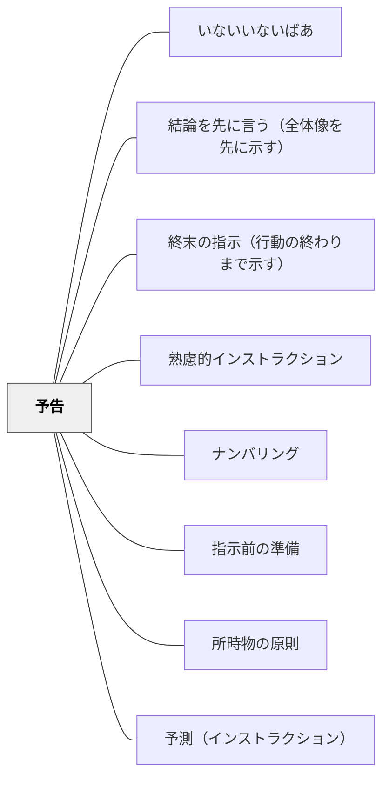

# 予告

> これから何をするかを前もって伝えることで、受け手の心の準備を促す。

## 背景（Context）
山本博樹（2019）『教師のための説明実践の心理学』ナカニシヤ出版に示される技法の一つが予告である。「次はグループ活動をします」「5分後に発表があります」という予告が、受け手の心理的準備（メンタルセット）を整える。インストラクションが届くコンテクストをつくる事前の働きかけである。

## 問題（Problem）
突然の活動切り替えや予想外の指示は、受け手を戸惑わせる。「えっ、今から？」「まだ準備できていない」という状態が生まれ、活動の開始が遅れたり、質が下がったりする。特に内省的な受け手や切り替えが苦手な受け手には予告が不可欠である。

## 力のかたち（Forces）
- 予告があると受け手は次の活動への準備を自律的に始める
- 予告なしの切り替えは、受け手の自律性を奪う管理的な側面がある
- 予告が頻繁すぎると「また言うだろう」という慣れが生まれ、効果が薄れる

## 解決（Solution）
**「次は〇〇をします」「あと3分で△△に切り替えます」のように、活動の変わり目の少し前に次の活動を知らせる予告を入れる。**

「今日の授業は最後に発表があります」という冒頭での全体予告と、「次は5分後に…」という直前の予告の両方を使い分ける。ナンバリングと組み合わせて「今日は3つのことをします。1つ目は…」のように全体の流れを示すことも有効である。

## 結果（Consequences）
- 受け手が次の活動に向けて心の準備を整えられる
- 活動切り替えがスムーズになり、待ち時間が減る
- 受け手が授業全体の見通しを持てるようになる

## クラスター図

## Actionable Insight

- 活動の切り替わりの1〜2分前に「次は〇〇をします」と声をかける——受け手が心の準備を自律的に始められる
- 授業の冒頭に「今日は3つのことをします：①…②…③…」とナンバリングで全体の見通しを示す——全体構造が見えることで受け手が安心して参加できる
- 「5分後に発表があります。今のうちにまとめておきましょう」のように予告と行動の指示をセットにする——予告が自律的な準備行動を引き出す

## 出典

- 一つの教育のパタン・ランゲージ（岩井輝久）

## 関連パタン
- [[パタン/いないいないばあ]]
- [[パタン/結論を先に言う（全体像を先に示す）]]
- [[パタン/終末の指示（行動の終わりまで示す）]]
- [[パタン/熟慮的インストラクション]] — 親パタン
- [[パタン/ナンバリング]] — 予告と組み合わせる全体構造の提示
- [[パタン/指示前の準備]] — 予告を受けての準備行動
- [[パタン/所時物の原則]] — 予告が促す物的・心理的準備
- [[パタン/予測（インストラクション）]] — 実行中の予測と対になる事前の予告
