# 予想される反応を先に書く（応答の幅を絞る）

> 授業中の応答は数秒で決めなければならない。その場で速くなろうとするのではなく、起こりうる反応の幅を前の晩に絞っておく。計画を制限することが、その場での自由を増やす。

## [Pattern Connection]

日本の学習指導案には、ほぼ例外なく「**予想される児童の反応**」という欄がある。三段の表の真ん中、教師の働きかけの右隣。研究授業のたびに書かれ、校内研修で検討され、指導主事に見られる。日本の授業研究文化の中核語彙のひとつである。

ところが、このWikiの約830パタンを「予想される反応」で検索してもヒットは一件もない。**最も日常的に書かれているものに、名前が付いていなかった。** 本パタンはその空白を埋める。

Black & Wiliam（2009）は、Threlfall（2005）を引いてこの欄に理論的な名前を与えている——**contingent assessment planning（偶発に備えた評価計画）**。定義はこうである。「相互作用が、教師が予見でき備えられる選択肢の範囲に収まるように、**教授計画を制限する**こと」（§7）。

接続の要点は三つある。

第一に、これは**形成的評価の上流条件**である。同論文は結論部でこう書く——「そうしたアプローチは、**上流の計画（up-stream planning）が好適な文脈を提供しなければ、栄えることができない**」（§7）。[[パタン/形成的評価]] を「授業中の技」として導入しようとして根づかない典型的な失敗は、ここで説明できる。技を磨く場所は授業中ではなく、その前の晩の紙の上にある。

第二に、これは [[パタン/タクト（教育的機転）]] の**対極ではなく前提**である。タクトは「今この瞬間に何をするか」を決める力だが、同論文が指摘するとおり、教師はその瞬間に**診断**（この発言は何を明かしているか）と**予後**（最適な応答は何か）という二つの複雑な決定を、しばしば**数秒で**下している（§7）。即応力を鍛えるだけではこの負荷は下りない。下ろせる負荷を事前に下ろす——それが本パタンであり、[[パタン/偶発の瞬間を活かす（コンティンジェンシー）]] が働くための余白をつくる作業である。

第三に、そして最も重要なことに、これは**正解へ収束させるための道具ではない**。同論文は「教師が全生徒に対する単一の事前決定されたゴールのような狭いものを持つとは想定しない。**異なる生徒が異なるゴールに向かって取り組んでいることを教師が良しとしてよい**」と明記する（§5）。したがって「予想される反応」が記述しているのは正解の型ではなく、**許容の幅の境界**である。この読み替えを外すと、本パタンは「想定外の発言を潰す装置」に反転する。[[パタン/複線型授業]] と衝突するか支えるかは、この一点にかかっている。

## 背景（Context）

指導案を書く。三段の表を引く。左に「学習活動」、中央に「予想される児童の反応」、右に「指導上の留意点」。中央の欄に、こう書く。

- 「12個を3人で分ける、と考える」
- 「わり算の式に表す」
- 「わからないと言う」

書き終えて、次の欄へ進む。この欄に何分かけただろうか——多くの場合、数分である。様式に空欄があるから埋めた。それが正直なところである。

授業当日、子どもは書いたとおりの反応をしない。あるいは書いたとおりの反応をするが、教師はその紙を見ていない。授業後の協議会で「予想と違いましたね」と言われ、「そうですね」と答える。欄は次の指導案でもまた埋められる。

これが形骸化の実態である。悪意も怠慢もない。**欄が何のためにあるのかが共有されていない**だけである。

一方で、日本の教師は経験的に知っている——**授業が上手い人ほど、子どもの発言に驚かない**。何が出るかを知っているわけではない。出たものを置く場所を、あらかじめ持っている。この差はどこから来るのか。

Black & Wiliam（2009）は、その差に名前を与える。

## 問題（Problem）

**授業中の応答は数秒で決めなければならない。しかしその数秒の中で、教師は二つの複雑な決定を同時に下している。この負荷は、その場で速くなることでは解消しない。**

同論文の記述は具体的である（§7）。教師が行っているのは二段階の作業である。

1. **診断（diagnostic）**——子どもの発言を、それが子どもの思考と動機について何を明かしているかという観点から解釈する
2. **予後（prognostic）**——最適な応答を選ぶ

そして「両方とも複雑な決定を含み、しばしば**わずか数秒しか使えない**状況で下される」。

ここに二重の困難がある。診断のほうは、そもそも一つの発言から複数の解釈が立つ（[[パタン/答えの出どころを推し量る（誤答の解釈）]]）。予後のほうは、同じ診断に対しても複数の手がありうる——拾って全体に返す、保留する、別の子に振る、板書に置く、あとで個別に。この掛け算を数秒で解く。

多くの教師研修は、この問題に対して「**その場の即応力を鍛える**」という解決を提示する。授業を数多く見る、模擬授業をする、切り返しの技術を学ぶ。これは有効だが、限界がある。負荷が高いのは技術が足りないからではなく、**決定の数が多すぎる**からである。

同論文が示す別の解決はこうである。Threlfall（2005）の言う「偶発的評価計画」——**相互作用が、自分が予見でき備えられる選択肢の範囲に収まるように、教授計画を制限する（limiting the teaching plan）**（§7）。

「制限する」という語がここで効いている。増やすのではない。減らす。**幅を絞るから、その場での出たとこ勝負ができる。**

そして同論文は例を続ける——「たとえば認知加速プログラムのように**焦点が絞られた**性格をもち、それに見合った専門的訓練が伴う場合、**適切な応答の範囲がそれだけ狭められ**、訓練が生徒の反応の主要な特徴をあらかじめ予期できるので、そうした偶発的計画はより簡単になる」（§7、[[概念/認知加速とダイナミック・アセスメント（学習する力そのものを狙う）]]）。

問題の形はこうなる。**指導案の中央の欄は、この負荷を下ろすための装置として設計されている。しかしそう使われていない。**

## 力のかたち（Forces）

- **その場の自由 vs 事前の制限**：教師は「授業は生き物だから決めすぎない」と考える。この直観は正しい。しかし決めていない状態は自由ではなく、**選択肢が多すぎて処理できない状態**である。Threlfall の逆説は、制限が自由の条件だという点にある
- **想定内を書く手間 vs 想定外を見分ける力**：予想を書くのは面倒である。しかし**何が想定内かを書いていない教師には、何が想定外かも見えない**。想定外を活かす力は、想定内を持っている人にしか働かない
- **単一のゴール vs 広い地平**：全員を同じ地点へ運ぶべき時間（等値分数の理解）と、受け入れうる成果の地平が広いほうがよい時間（詩の読み、道徳の議論）がある。同じ様式で書くと、後者が前者に引きずられる
- **収束の圧力**：研究授業では「ねらいに迫れたか」が問われる。この圧力のもとでは、予想される反応の欄が「ねらいに乗る反応の一覧」に縮んでいく。教師は無意識に、それ以外の発言を扱いにくくなる
- **課題そのものの不確かさ**：予想は課題の関数である。しかし同論文が言うとおり、**課題や問題は所与とみなせない**し、良い課題を選ぶ一般的な規則やレシピを定式化するのも難しい（§5）。予想が外れたとき、原因は予想側ではなく課題側にあることがある
- **調律（tuning）の難しさ**：課題が実施されるにつれて、その課題を子どもの応答に合わせて**調律する**ことは「教師にとって非常に難しい」（§5）。事前の予想は、この調律のための手がかりであって、調律を不要にするものではない
- **書く量 vs 使える量**：反応を十通り書いても本番で参照できない。三通りなら覚えていられる。**覚えていられる量が上限**である
- **一人で書く vs 学年で書く**：同学年の三人で書けば予想の幅は広がるが、書く時間は取れない。現実の落とし所は「一人で三つ書き、学年会で一つ足してもらう」あたりにある

## 解決（Solution）

**授業の前に、起こりうる子どもの反応を三つ書く。そして三つそれぞれに、教師の次の一手を一行ずつ書く。反応の幅を「予見でき備えられる範囲」に絞り、その範囲の外に出たときが本当の想定外だと分かるようにしておく。**

要点は三つある。

1. **三種に分けて書く**——「素朴な反応」「教師のねらいに乗った反応」「想定外だが筋の通る反応」。この三種にすると、幅の両端と中心が押さえられる。同じ種類を三つ並べても幅は広がらない
2. **反応ごとに次の一手を書く**——「〜と言う」で終わらせない。「〜と言う → 板書の左端に置いて、あとで比べる材料にする」まで書く。**反応だけ書いて手を書かないのが形式化の正体である**
3. **許容の幅の境界を決める**——「ここから外は、いったん引き戻す」という線を先に引いておく。同論文も、ある生徒が教師の意図から遠すぎる成果に向かっているように見える場合、教師は「教師の意図によりよく沿った軌道へその生徒を引き寄せようとするだろう」と書いている（§5）。引き寄せること自体は否定されていない。**どこから引き寄せるかを事前に決めておく**のが本パタンである

---

### 具体例1：指導案の「予想される児童の反応」を、形式から道具に戻す

三年生「あまりのあるわり算」。従来の書き方はこうだった。

| 予想される児童の反応 |
|---|
| 13÷4 の式に表す |
| 3あまり1と答える |
| わからないと言う |

三つ書いてある。しかし三つとも同じ層——「正解へ向かう途中の姿」——を書いている。幅がない。そして**次の一手が一つも書かれていない**。

書き換える。三種に分け、それぞれに手を添える。

| 種類 | 予想される反応 | 教師の次の一手 |
|---|---|---|
| 素朴 | おはじきを4個ずつ分けて「3つのふくろと、1個あまった」と操作で答える | 黒板の**左端**に置く。式に直させず、そのまま残す |
| ねらいに乗る | 13÷4＝3あまり1 と式に書く | 黒板の**中央**に置き、「この『あまり1』は、さっきの1個と同じ？」と左へつなぐ |
| 想定外だが筋が通る | 「3.25」と答える（電卓や上の学年の知識から） | 潰さない。黒板の**右端**に置き、「その答えが合う場面と、合わない場面がある」と保留して単元末へ持ち越す |

三行目が本パタンの本体である。「3.25」は現行の学習範囲の外にある。書いていなければ、教師は反射的に「今日は小数はやらないよ」と処理する。**書いてあれば、置き場所がある。**

そして書く時間は、三行で五分ほどである。形骸化した欄を埋めるのと、かかる時間はほとんど変わらない。

---

### 具体例2：算数の一時間——予想される解法を並べ、板書の位置を先に決める

同論文が例に挙げるのは、まさに「**等値分数（equivalent fractions）の理解のように、全生徒を同じゴールへ導こうとする**」場面である（§5）。日本の算数でいえば、練り上げのある一時間にあたる。

五年生「分数のたし算」導入。1/2 + 1/3 をどう計算するか。

前の晩に、予想される解法を四通り書く。

- (A) 分子どうし・分母どうしを足して 2/5 とする（**最も多い誤り**）
- (B) 図（テープ図・円）で重ねて「だいたい 5/6 くらい」と見当をつける
- (C) 小数に直して 0.5 + 0.33… とする
- (D) 通分して 3/6 + 2/6 とする

ここまでは多くの教師が書く。本パタンが足すのは**次の一行**である——**この四つを板書のどこに置くか**。

左から (A) (C) (B) (D) の順に置く。理由がある。(A) と (D) を両端に離すと比較が効かない。(B) を (D) の隣に置くと、「見当」と「通分の答え」が並んで、5/6 が二通りの道から出てきたことが見える。(C) は (A) の隣に置くと、「形を変えて計算する」という発想が (A) の直後に現れて、(D) への橋になる。

つまり**予想される反応の設計と、板書の設計は同じ作業である**（[[パタン/練り上げ（比較検討の全体交流）]]）。並べ方を前の晩に決めておくと、授業中の教師の仕事は「どこに置くか考える」から「置く」に変わる。数秒の判断が一つ減る。

四通りのうち二つしか出なかったら——出なかったものは教師が「こんなふうにやった人はいる？」と出す。これも書いておける。

---

### 具体例3：国語・道徳——予想は「正解の候補」ではなく「許容の幅の境界」

同論文は、単一のゴールへ向かう場面とは別に、「教師のねらいは**受け入れうる成果の広い地平（a broad horizon of acceptable outcomes）**をもつと特徴づけるほうが適切な場面もある」と書き、Hodgen & Marshall（2005）による**数学と英語（国語）の教室の比較**がこの違いを浮かび上がらせると付け加えている（§5）。

日本の教室でも同じ差がある。算数の練り上げと、物語文の読みや道徳の議論とでは、指導案の中央の欄が果たすべき役割が違う。

六年生・物語文「一つの花」。「お父さんはなぜ一つだけのコスモスを渡したのか」。

ここで予想を「正解の候補」として三つ書くと、授業は劣化する。三つのうちどれかに子どもを着地させる時間になるからである。

書き方を変える。**許容の幅の境界**を書く。

- **中心（迷わず拾う）**：本文の記述を根拠にした読み。「渡すものが他になかった」「一つだけと言い続けたゆみ子への返事」
- **周辺（拾うが、根拠を求める）**：本文の外の経験・知識に基づく読み。「戦争のとき物がなかったから」→「そう思ったのは本文のどこから？」と一度戻す
- **境界の外（いったん引き戻す）**：本文と切れた自由連想。「コスモスは秋の花だから」→「その話は面白いから、あとで聞かせて。今は本文に戻ろう」

三つ目を**あらかじめ言葉にしておく**ことが要点である。書いていないと、その場で引き戻すか受け入れるかの判断を数秒で下すことになり、多くの場合「とりあえず受け入れる」か「言下に否定する」の両極になる。書いてあれば、**引き戻しつつ潰さない言い方**を前の晩に用意できる。

道徳の議論でも同じである。「ここから外は引き戻す」の線を先に引くことは、議論を狭めるのではなく、**線の内側での自由を保証する**。

---

### 具体例4：課題そのものを疑う——外れた予想は、課題への調律の合図

同論文は釘を刺している。「戦略的レベルで選ばれるにせよ戦術的レベルで選ばれるにせよ、**生徒に出される課題や問題は所与とみなせない**。よく選ばれていれば、生徒を巻き込み、学習の議論へ引き入れることができる。しかし**一般的な規則やレシピを定式化するのは難しい**」（§5）。さらに「課題が実施されるにつれて、その課題を応答に合わせて『**調律（tuning）**』することも教師にとって非常に難しい」（Dillon 1994 が詳しい手引きを与えている、§5）。

実務に落とすとこうなる。**予想が大きく外れたとき、まず疑うのは予想ではなく課題である。**

四年生「面積」。「この形の面積を求めよう」とL字型の図形を出したところ、予想した三通りの分割（縦に切る・横に切る・大きな長方形から引く）のどれでもなく、教室の三分の二が手を止めた。

このとき「予想が甘かった」と反省しても次につながらない。見るべきは課題の側である——L字の寸法が四つとも与えられていて、どこから手をつけるかが決められなかった。寸法を三つにして一つを子どもに補わせる形にすると、着手点が一つに絞られる。

**授業中の調律**もある。手が止まった時点で「まず、この形を長方形二つに分けられる人？」と一段下げる。この一段下げの文言も、前の晩に書いておける。予想の三つ目に「**誰も動かない**」を入れておくと、それが可能になる（[[パタン/問題解決的教材研究]]、[[パタン/素材研究から発問内容を見出す]]）。

---

### 具体例5：支援級・個別の指導計画——幅を絞ることは、支援を具体化することと同義

特別支援学級や通級では、本パタンは指導案の様式の問題ではなく、**準備物の問題**として現れる。

反応の幅を絞ることは、支援級では次のように翻訳される。

- 「読み上げれば分かる」反応が予想される → **読み上げ用のカード**を作っておく
- 「数が大きいと混乱する」反応が予想される → **同じ問題の数を小さくした版**を一枚刷っておく
- 「言葉では答えられないが指させる」反応が予想される → **選択肢を三つ並べた紙**を用意しておく
- 「途中で離席する」反応が予想される → 戻ってきたときに**どこから再開するかを示す付箋**を貼っておく

つまり支援級においては、予想される反応を書くことと、教材の別バージョンを用意することが**同じ一つの作業**になる。書いた予想の右隣に「次の一手」を書けば、それはそのまま準備物リストになる。

個別の指導計画の様式にも「予想される姿」に相当する欄があることが多い。ここを年度当初に一度書いて放置するのではなく、**単元ごとに三行だけ更新する**ほうが実効性がある。一年分の予想は当たらないが、二週間分の予想は当たる。

そしてもう一つ。支援級では想定外の反応が通常学級より頻繁に起きる。だからこそ**何が想定内かを書いておく価値が大きい**。書いていなければ、すべてが想定外に見え、教師は常に反応する側に回り続ける（[[パタン/つまずきを構造で記録する（診断の粒度設計）]]）。

---

### 具体例6：自己教育（大人の独学）——詰まりそうな箇所を三つ書いてから入る

同じことは、自分ひとりの学習にもできる。

数学の独学で、新しい単元に入る前に、教科書の節を眺めて「**詰まりそうな箇所**」を三つ書き出しておく。

- 「定義の記号が新しい。読み方が分からなくなりそう」
- 「例題2から急に抽象度が上がりそう」
- 「前の単元の◯◯を忘れていて、そこで止まりそう」

そして三つそれぞれに次の一手を一行。「記号は別ノートに一覧を作る」「例題2で止まったら、その前の具体例を自分で三つ作る」「◯◯は先に十分だけ復習する」。

効果は理解が速くなることではない。**詰まったときに、それを気分の問題にしないで済む**ことである。「自分には向いていない」ではなく「予想した二つ目に来た」と読める。予想の外で詰まったときだけが本当の新情報であり、そこは記録する価値がある。

これは教室での本パタンと構造が同じである。**想定内を書いておくことが、想定外を発見可能にする。**

## 結果（Consequences）

**利点**

- **授業中の決定の数が減る**——診断と予後の二段階のうち、予後の側があらかじめ用意されている。数秒で解く掛け算が減り、その分を子どもの発言を聴くことに回せる（[[パタン/待ち時間（問いのあとの3秒）]] が実際に待てるようになるのはこの余白があるときである）
- **想定外が見えるようになる**——何が想定内かを書いてあるので、外側が分かる。書いていない教師にとってはすべてが等しく「子どもの発言」であり、区別がつかない。**本パタンの最大の効果は、備えることではなく見分けられるようになることである**
- **板書と発問の設計が同時に進む**——反応を並べる作業は、比較のための配置を決める作業と同じである。指導案の中央の欄を書き直すと、右の欄（指導上の留意点）が自然に具体化する
- **形骸化した様式が道具に戻る**——新しい様式を導入する必要がない。すでにある欄の書き方を変えるだけである。校内研修に持ち込むコストが極端に低い
- **予想の的中率が、教材理解の指標になる**——外れ方を記録していくと、自分がどの学年のどの内容で子どもの姿を掴めていないかが分かる。授業後リフレクションの材料になる（[[授業後リフレクションテンプレート]]）
- **支援の準備が具体物になる**——支援級では、予想を書くことがそのまま教材の別バージョンを用意することになる。抽象的な「配慮する」が、机の上に置く紙に変わる

**注意点・リスク**

- **⭐最大の失敗モード：予想が「正解の型」になり、想定外の発言を潰す装置になる**——これが本パタンが最も壊れやすい壊れ方である。原文は明示している。「教師が全生徒に対する単一の事前決定されたゴールのような狭いものを持つとは想定しない。**異なる生徒が異なるゴールに向かって取り組んでいることを教師が良しとしてよい**し、教師自身、達成される学習成果が何になるかについて明確でないこともありうる」（§5）。予想は**収束の道具ではなく、許容の幅の道具**である。「予想の三つのどれかに当てはめる」授業になった時点で、本パタンは逆向きに働いている
- **計画を制限しすぎると、学びの地平まで狭まる**——Threlfall の示唆はあくまで「**予見でき備えられる範囲に収める**」であって、「起こることを決める」ではない。予想を十通りに増やしても、想定外を禁じても、この線は越えられる。目安は「三つ書いて、四つ目が出たら嬉しい」という感覚が残っているかどうか
- **書いただけでは効かない**——反応に対応する「次の一手」がなければ、既存の指導案の形式化と同じ場所に戻る。ここは [[パタン/見取ったあとの手を決めておく（データ利用のルール化）]] との**違い**でもある。あちらは**データの使い方のルール**（「小テストで5人以上つまずいたら、次の時間を復習に充てる」のような閾値と行動）であり、扱うのは見取った**後**の教師の意思決定である。こちらは**起こりうる反応の幅の事前設定**であり、扱うのは見取る**前**の準備である。両者はつながっている——予想の幅を絞ることが、ルールを書ける粒度をつくる
- **「想定外が起きたときこそ授業が動く」という経験知と衝突する**——この緊張は解消しない。日本の授業研究には「教師の予想を超えた子どもの姿」を最上の価値とする伝統があり、それは正しい。ただし本パタンの主張は逆ではない。**予想は想定外を見分けるための背景**である。何が想定内かを書いていない教師には、何が想定外かも見えない。背景がなければ図は現れない
- **教科と学習目標によって、有効な絞り方が違う**——同論文は、応答の規則を一般化することの危険も指摘している。「ある教科で通用する規則が、別の教科や、別のねらいのもとで組み立てられた相互作用には、まったく不適切でありうる」（§7）。算数の練り上げのための三種と、道徳の議論のための三種は、同じ様式では書けない
- **上流の計画が整っていなければ、そもそも土台がない**——「上流の計画が好適な文脈を提供しなければ、そうしたアプローチは栄えることができない」（§7）。単元のゴールが曖昧なまま一時間分の予想だけ精緻にしても効かない。本パタンは [[パタン/逆向き設計]] の下流にある
- **研究授業のためだけに書くと定着しない**——年に一度の指導案で三十行書くより、日常の一時間で三行書くほうが力になる。**書く量の上限は、本番で思い出せる量**である

## 関連パタン

- [[パタン/見取ったあとの手を決めておく（データ利用のルール化）]] — 対になる姉妹パタン。あちらは**見取った後のデータの使い方のルール**、こちらは**見取る前の反応の幅の事前設定**。予想が幅を絞るから、ルールが書ける粒度になる
- [[パタン/偶発の瞬間を活かす（コンティンジェンシー）]] — 本パタンが余白をつくる先。幅を絞っておくから、その場での即興が可能になる。制限と自由の逆説がここで完結する
- [[パタン/タクト（教育的機転）]] — 対極ではなく前提。タクトが働く条件を事前に整える作業が本パタンである。即応力を鍛えるだけでは数秒の負荷は下りない
- [[パタン/答えの出どころを推し量る（誤答の解釈）]] — 診断の側の技術。本パタンは予後の側を事前に用意する。両方が揃って初めて数秒の判断が回る
- [[パタン/練り上げ（比較検討の全体交流）]] — 予想される解法を並べる作業は、板書のどこに置くかを決める作業と同じである。本パタンの算数における実装形
- [[パタン/形成的評価]] — 上位。同論文はこの実践が「上流の計画が好適な文脈を提供しなければ栄えない」と述べる。本パタンがその上流にあたる
- [[パタン/逆向き設計]] — さらに上流。単元のゴールが定まっていなければ、一時間の反応の予想は書けない
- [[パタン/教え方の作戦を立てる]] — 同じ設計フェーズのパタン。作戦の粒度を「起こりうる子どもの反応」まで下ろしたものが本パタンである
- [[パタン/素材研究から発問内容を見出す]] — 予想の質は教材理解の質に比例する。素材を自分で解いていない教師の予想は当たらない
- [[パタン/発問前の整理（文脈づくり）]] — 発問の前に文脈を整えることと、反応の幅を絞ることは同じ作業の表裏である
- [[パタン/問題解決的教材研究]] — 予想が大きく外れたときに戻る場所。原因は予想側でなく課題側にあることが多い
- [[パタン/授業の縦糸と横糸]] — 予想の幅は縦糸（学習内容の系統）と横糸（関係）の両方に沿って引かれる。どちらか一方だけの予想は薄い
- [[パタン/複線型授業]] — 「異なる生徒が異なるゴールに向かってよい」を制度化した形。本パタンが収束の道具に転ばないための歯止めになる
- [[パタン/多様な演習レベル]] — 予想した反応の幅に対応する教材を実際に用意する形。支援級では両者が同じ作業になる
- [[パタン/つまずきを構造で記録する（診断の粒度設計）]] — 予想の精度を上げる材料。前年度の記録が翌年の予想になる
- [[パタン/待ち時間（問いのあとの3秒）]] — 待てるようになるのは、次の一手が用意されているときである。判断の負荷が下りて初めて沈黙に耐えられる
- [[概念/認知加速とダイナミック・アセスメント（学習する力そのものを狙う）]] — 同論文が偶発的計画の容易な例として挙げるプログラム。焦点が絞られているほど応答の範囲が狭まる
- [[文献/Developing the Theory of Formative Assessment（Black & Wiliam, 2009）]] — 出典
- [[文献/Assessment and Classroom Learning（Black & Wiliam）]] — 先行するレビュー。形成的評価の効果の実証的基盤
- [[授業設計テンプレート]] — 本パタンを書き込む場所。「予想される反応」と「次の一手」を対にして記入する
- [[授業後リフレクションテンプレート]] — 予想の外れ方を記録する場所。外れ方の蓄積が翌年の予想の精度になる
- [[パタン/答えの出どころを推し量る（誤答の解釈）]] — 予想を書くとは、起こりうる誤りの出どころをあらかじめ言葉にすることでもある
- [[パタン/教科に対しても責任を負う（教えすぎと放任のあいだ）]] — 反応の幅を決めることは、教科の本質をどこで守るかを決めることでもある

## クラスター図

```mermaid
flowchart LR
    ne4ba88e683b3e38195e3828ce3828be58f8de5bf9ce38292e58588e381abe69bb8e3818fefbc88e5bf9ce7ad94e381aee5b985e38292e7b59ee3828befbc89["予想される反応を先に書く（応答の幅を絞る）"]
    ne8a68be58f96e381a3e3819fe38182e381a8e381aee6898be38292e6b1bae38281e381a6e3818ae3818fefbc88e38387e383bce382bfe588a9e794a8e381aee383abe383bce383abe58c96efbc89["見取ったあとの手を決めておく（データ利用のルール化）"]
    ne581b6e799bae381aee79eace99693e38292e6b4bbe3818be38199efbc88e382b3e383b3e38386e382a3e383b3e382b8e382a7e383b3e382b7e383bcefbc89["偶発の瞬間を活かす（コンティンジェンシー）"]
    ne382bfe382afe38388efbc88e69599e882b2e79a84e6a99fe8bba2efbc89["タクト（教育的機転）"]
    ne7ad94e38188e381aee587bae381a9e38193e3828de38292e68ea8e38197e9878fe3828befbc88e8aaa4e7ad94e381aee8a7a3e98788efbc89["答えの出どころを推し量る（誤答の解釈）"]
    ne7b7b4e3828ae4b88ae38192efbc88e6af94e8bc83e6a49ce8a88ee381aee585a8e4bd93e4baa4e6b581efbc89["練り上げ（比較検討の全体交流）"]
    ne5bda2e68890e79a84e8a995e4bea1["形成的評価"]
    ne98086e59091e3818de8a8ade8a888["逆向き設計"]
    ne69599e38188e696b9e381aee4bd9ce688a6e38292e7ab8be381a6e3828b["教え方の作戦を立てる"]
    ne7b4a0e69d90e7a094e7a9b6e3818be38289e799bae5958fe58685e5aeb9e38292e8a68be587bae38199["素材研究から発問内容を見出す"]
    ne799bae5958fe5898de381aee695b4e79086efbc88e69687e88488e381a5e3818fe3828aefbc89["発問前の整理（文脈づくり）"]
    ne5958fe9a18ce8a7a3e6b1bae79a84e69599e69d90e7a094e7a9b6["問題解決的教材研究"]
    ne68e88e6a5ade381aee7b8a6e7b3b8e381a8e6a8aae7b3b8["授業の縦糸と横糸"]
    ne8a487e7b79ae59e8be68e88e6a5ad["複線型授業"]
    ne5a49ae6a798e381aae6bc94e7bf92e383ace38399e383ab["多様な演習レベル"]

    ne4ba88e683b3e38195e3828ce3828be58f8de5bf9ce38292e58588e381abe69bb8e3818fefbc88e5bf9ce7ad94e381aee5b985e38292e7b59ee3828befbc89 --- ne8a68be58f96e381a3e3819fe38182e381a8e381aee6898be38292e6b1bae38281e381a6e3818ae3818fefbc88e38387e383bce382bfe588a9e794a8e381aee383abe383bce383abe58c96efbc89
    ne4ba88e683b3e38195e3828ce3828be58f8de5bf9ce38292e58588e381abe69bb8e3818fefbc88e5bf9ce7ad94e381aee5b985e38292e7b59ee3828befbc89 --- ne581b6e799bae381aee79eace99693e38292e6b4bbe3818be38199efbc88e382b3e383b3e38386e382a3e383b3e382b8e382a7e383b3e382b7e383bcefbc89
    ne4ba88e683b3e38195e3828ce3828be58f8de5bf9ce38292e58588e381abe69bb8e3818fefbc88e5bf9ce7ad94e381aee5b985e38292e7b59ee3828befbc89 --- ne382bfe382afe38388efbc88e69599e882b2e79a84e6a99fe8bba2efbc89
    ne4ba88e683b3e38195e3828ce3828be58f8de5bf9ce38292e58588e381abe69bb8e3818fefbc88e5bf9ce7ad94e381aee5b985e38292e7b59ee3828befbc89 --- ne7ad94e38188e381aee587bae381a9e38193e3828de38292e68ea8e38197e9878fe3828befbc88e8aaa4e7ad94e381aee8a7a3e98788efbc89
    ne4ba88e683b3e38195e3828ce3828be58f8de5bf9ce38292e58588e381abe69bb8e3818fefbc88e5bf9ce7ad94e381aee5b985e38292e7b59ee3828befbc89 --- ne7b7b4e3828ae4b88ae38192efbc88e6af94e8bc83e6a49ce8a88ee381aee585a8e4bd93e4baa4e6b581efbc89
    ne4ba88e683b3e38195e3828ce3828be58f8de5bf9ce38292e58588e381abe69bb8e3818fefbc88e5bf9ce7ad94e381aee5b985e38292e7b59ee3828befbc89 --- ne5bda2e68890e79a84e8a995e4bea1
    ne4ba88e683b3e38195e3828ce3828be58f8de5bf9ce38292e58588e381abe69bb8e3818fefbc88e5bf9ce7ad94e381aee5b985e38292e7b59ee3828befbc89 --- ne98086e59091e3818de8a8ade8a888
    ne4ba88e683b3e38195e3828ce3828be58f8de5bf9ce38292e58588e381abe69bb8e3818fefbc88e5bf9ce7ad94e381aee5b985e38292e7b59ee3828befbc89 --- ne69599e38188e696b9e381aee4bd9ce688a6e38292e7ab8be381a6e3828b
    ne4ba88e683b3e38195e3828ce3828be58f8de5bf9ce38292e58588e381abe69bb8e3818fefbc88e5bf9ce7ad94e381aee5b985e38292e7b59ee3828befbc89 --- ne7b4a0e69d90e7a094e7a9b6e3818be38289e799bae5958fe58685e5aeb9e38292e8a68be587bae38199
    ne4ba88e683b3e38195e3828ce3828be58f8de5bf9ce38292e58588e381abe69bb8e3818fefbc88e5bf9ce7ad94e381aee5b985e38292e7b59ee3828befbc89 --- ne799bae5958fe5898de381aee695b4e79086efbc88e69687e88488e381a5e3818fe3828aefbc89
    ne4ba88e683b3e38195e3828ce3828be58f8de5bf9ce38292e58588e381abe69bb8e3818fefbc88e5bf9ce7ad94e381aee5b985e38292e7b59ee3828befbc89 --- ne5958fe9a18ce8a7a3e6b1bae79a84e69599e69d90e7a094e7a9b6
    ne4ba88e683b3e38195e3828ce3828be58f8de5bf9ce38292e58588e381abe69bb8e3818fefbc88e5bf9ce7ad94e381aee5b985e38292e7b59ee3828befbc89 --- ne68e88e6a5ade381aee7b8a6e7b3b8e381a8e6a8aae7b3b8
    ne4ba88e683b3e38195e3828ce3828be58f8de5bf9ce38292e58588e381abe69bb8e3818fefbc88e5bf9ce7ad94e381aee5b985e38292e7b59ee3828befbc89 --- ne8a487e7b79ae59e8be68e88e6a5ad
    ne4ba88e683b3e38195e3828ce3828be58f8de5bf9ce38292e58588e381abe69bb8e3818fefbc88e5bf9ce7ad94e381aee5b985e38292e7b59ee3828befbc89 --- ne5a49ae6a798e381aae6bc94e7bf92e383ace38399e383ab

    classDef hub fill:#f0f0f0,stroke:#555,color:#000,font-weight:bold
    class ne4ba88e683b3e38195e3828ce3828be58f8de5bf9ce38292e58588e381abe69bb8e3818fefbc88e5bf9ce7ad94e381aee5b985e38292e7b59ee3828befbc89 hub
```

## Actionable Insight

- **次の指導案の「予想される児童の反応」を三種で書き直す**——「素朴な反応」「ねらいに乗った反応」「想定外だが筋の通る反応」。同じ層の反応を三つ並べていないかを確認する。所要は五分
- **予想した反応の一つひとつに、教師の次の一手を一行足す**——「〜と言う」で終わらせない。「〜と言う → 板書の左端に置く」まで書く。手のない予想は形式である
- **算数の練り上げのある時間は、予想した解法を板書のどこに置くかを先に決める**——並べ方が比較を成立させる。授業中に配置を考える判断を一つ減らす
- **国語・道徳では「ここから外はいったん引き戻す」の線を一本引いておく**——引き戻すときの言い方まで前の晩に用意する。「その話は面白いから、あとで聞かせて。今は本文に戻ろう」
- **支援級では、予想した反応の右隣を準備物リストとして使う**——読み上げカード、数を小さくした版、選択肢の紙。予想を書くことと教材を用意することを一つの作業にする
- **授業後に、予想が外れた反応だけを三行メモに残す**——当たった予想は情報を持たない。外れた反応の蓄積が、翌年の同じ単元の予想を作る
- **自分の独学でも、新しい単元に入る前に「詰まりそうな箇所」を三つ書く**——詰まったときに気分の問題にせずに済む。予想の外で詰まったときだけ記録する

## 出典

Black, P., & Wiliam, D. (2009). Developing the theory of formative assessment. *Educational Assessment, Evaluation and Accountability, 21*(1), 5–31.

※ 参照した版は著者校正前のプレプリント（"Revise of 3rd November 08"）のため、本論文本文からの引用には頁番号を付さず節（§）で示す。

> This aspect is clarified by Threfall's (2005) suggestion that teachers may need to exercise 'contingent assessment planning', i.e., limiting the teaching plan so that the interactions are kept within the range of alternatives that he can foresee and be prepared for (see also Ciofalo & Wylie, 2006, Wylie & Wiliam, 2006; 2007). （§7）
> — この側面は、教師が「偶発的評価計画（contingent assessment planning）」を働かせる必要があるかもしれない、という Threlfall（2005）の示唆によって明確になる。すなわち、相互作用が自分の予見でき備えられる選択肢の範囲に収まるように、教授計画を制限することである。
> （※プレプリント本文は "Threfall" と綴られているが、参考文献表では Threlfall, J. (2005) である）

> For example, the focused nature of (say) the Cognitive Acceleration programmes, together with their focussed professional development, makes such contingent planning simpler because the range of appropriate responses is correspondingly narrowed and the training can anticipate the main characteristics of students' reactions. （§7）
> — たとえば認知加速プログラムのように焦点が絞られた性格をもち、それに見合った専門的訓練が伴う場合、適切な応答の範囲がそれだけ狭められ、訓練が生徒の反応の主要な特徴をあらかじめ予期できるので、そうした偶発的計画はより簡単になる。

> We do not, however, assume that the teacher has anything as narrow as a single pre-determined goal for all students. The teacher may be happy for different students to be working towards different goals, and the teacher may not herself be clear about what the learning outcomes achieved will turn out to be. However, it is our contention that in such situations, the teacher does have learning intentions however implicit, for otherwise the situation would be that "anything goes". （§5）
> — しかしわれわれは、教師が全生徒に対する単一の事前決定されたゴールのような狭いものを持つとは想定しない。異なる生徒が異なるゴールに向かって取り組んでいることを教師が良しとしてよいし、達成される学習成果が何になるかについて教師自身が明確でないこともありうる。しかしそれでも、そうした状況において教師は、どれほど暗黙的であっても学習の意図を持っているというのがわれわれの主張である。さもなければ「何でもあり（anything goes）」の状況になってしまうからである。

> Whether it is chosen at a strategic or tactical level, the task or problem put to the student(s) cannot be taken for granted: if well chosen, it can engage the students and help draw them in to a learning discussion. However, it is hard to formulate any general rules or recipes. Moreover, as any particular task is implemented, the 'tuning' of that task to the responses can also be very challenging for teachers – Dillon (1994) presents detailed guidance to teachers about this issue. （§5）
> — 戦略的レベルで選ばれるにせよ戦術的レベルで選ばれるにせよ、生徒に出される課題や問題は所与とみなせない。よく選ばれていれば、生徒を巻き込み、学習の議論へ引き入れることができる。しかし、一般的な規則やレシピを定式化するのは難しい。さらに、ある課題が実施されるにつれて、その課題を応答に合わせて「調律（tuning）」することも教師にとって非常に難しいものでありうる。

> In some situations, the teacher will be trying to get all students to the same goal, such as understanding the notion of equivalent fractions. In other situations, the teacher's aims may be better characterized as having a broad horizon of acceptable outcomes: Hodgen and Marshall's (2005) study brings out these differences in their comparison of mathematics with English classrooms. （§5）
> — ある場面では、教師は全生徒を同じゴール——たとえば等値分数の概念の理解——へ導こうとするだろう。別の場面では、教師のねらいは受け入れうる成果の広い地平をもつと特徴づけたほうがよいこともある。Hodgen & Marshall（2005）の研究は、数学と英語（国語）の教室の比較を通じて、こうした違いを浮かび上がらせている。

> However, it will also often be the case that some students appear to be working towards an outcome that is too far from the teacher's intention, and in such a case, the teacher is likely to try to draw the student towards a trajectory that is more in keeping with the teacher's intention. （§5）
> — しかしまた、ある生徒が教師の意図から遠すぎる成果に向かって取り組んでいるように見えることもしばしばあり、その場合、教師は教師の意図によりよく沿った軌道へその生徒を引き寄せようとするだろう。

> It could illustrate and emphasise that such an approach cannot prosper if the up-stream planning does not provide a context favourable to it. （§7）
> — そうした取り組みは、上流の計画（up-stream planning）が好適な文脈を提供しなければ栄えることができない、ということを例示し強調することにもなるだろう。

> The two steps involved, the diagnostic, in interpreting the student contribution in terms of what it reveals about the students thinking and motivation, and the prognostic, in choosing the optimum response; both involve complex decisions, often to be taken with only a few seconds available. （§7）
> — 関わる二つの段階、すなわち、生徒の発言をそれが生徒の思考と動機について何を明かしているかという観点から解釈する診断（diagnostic）と、最適な応答を選ぶ予後（prognostic）——その両方が複雑な決定を含み、しばしばわずか数秒しか使えない状況で下される。

Threlfall, J. (2005). The formative use of assessment information in planning – the notion of contingent planning. *British Journal of Educational Studies, 53*(1), 54–65.（「偶発的計画」の概念の出典。Black & Wiliam 2009 が §7 で引く）

Dillon, J. T. (1994). *Using discussion in classrooms*. London: Open University Press.（課題を応答に合わせて調律することについて、教師向けの詳細な手引きを与えているとして §5 で参照される）

Hodgen, J., & Marshall, B. (2005). Assessment for Learning in Mathematics and English: contrasts and resemblances. *The Curriculum Journal, 16*(2), 153–176.（同じゴールへ導く場面と、受け入れうる成果の地平が広い場面の差を、数学と英語（国語）の教室の比較から浮かび上がらせた研究）
