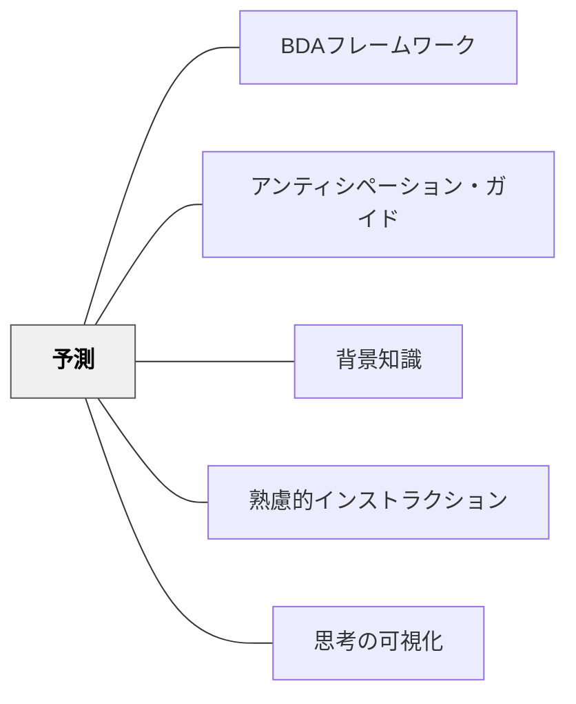

# 予測

> 次に何が起きるかを予測しながら読む・学ぶことで、学習者は能動的な意味構築者になる——予測は「当てる活動」ではなく「考え続ける動力」だ。

---

## 背景（Context）

予測（Prediction）は読解・学習において最も基本的な能動的認知方略の一つだ。学習者が「次にどうなるか」「この結果はどうなるか」と問いながら進むとき、受け身の情報受容者から能動的な意味構築者へと変わる。

BDAフレームワーク（[[パタン/BDAフレームワーク]]）の Before フェーズにおいて、予測は「前知識の活性化」と「読む目的の形成」を同時に担う。

アンティシペーション・ガイド（[[パタン/アンティシペーション・ガイド]]）は予測を構造化した授業ツールだ。

## 問題（Problem）

テキストを与えて「読みなさい」と言うとき、学習者には読む目的がない。目的なしに読むと、情報は表面を滑るだけで残らない。

「何が起きるか」「どうなるか」「この実験の結果は何か」——予測という問いが、学習者に**読む目的**を与える。

## 力のかたち（Forces）

- 予測が外れたとき、認知的葛藤（「あれ、違った」）が理解を深める
- 予測が当たったとき、既有知識との接続が確認されて定着が進む
- 「どちらも正解」という評価が予測を安心して試せる文化を作る
- 予測は背景知識（[[パタン/背景知識]]）なしには成立しない——知識があるほど予測が豊かになる

## 解決（Solution）

**読む前・活動の前に「次にどうなると思う？」という予測の問いを意図的に設計する。予測の正誤を評価するのではなく、予測から生まれる「なぜ？」の問いを大切にする。**

### 実践の形

- 章タイトル・見出し・図から本文を読む前に予測させる
- 実験・観察の前に「どうなると思う？」を書かせる
- アンティシペーション・ガイドの記述文に「賛成・反対」で予測させる（[[パタン/アンティシペーション・ガイド]]）
- 物語の区切り目で「次に主人公はどうする？」と止める

## 結果（Consequences）

- 「読む目的」が生まれ、受け身の読書が能動的な意味構築に変わる
- 予測の確認・修正が理解の深化を促す
- 背景知識と新知識の接続が起きやすくなる

## 関連パタン

- [[パタン/BDAフレームワーク]] — Before フェーズの予測が読解授業の骨格になる
- [[パタン/アンティシペーション・ガイド]] — 予測を構造化する授業ツール
- [[パタン/背景知識]] — 予測の質は背景知識の量に依存する
- [[パタン/熟慮的インストラクション]] — 予測を指示設計に組み込む
- [[パタン/思考の可視化]] — 予測を書き出すことで思考が可視化される

---

## クラスター図

## Actionable Insight

- **本の表紙・タイトル・挿絵だけ見せて「この本は何の話だと思う？」と聞く**——Before フェーズの予測が読書への構えを作る
- **理科の実験前に「どうなると思う？」をノートに書かせる**——予測は結果を「当てる」ためでなく「考え続ける」ためにある
