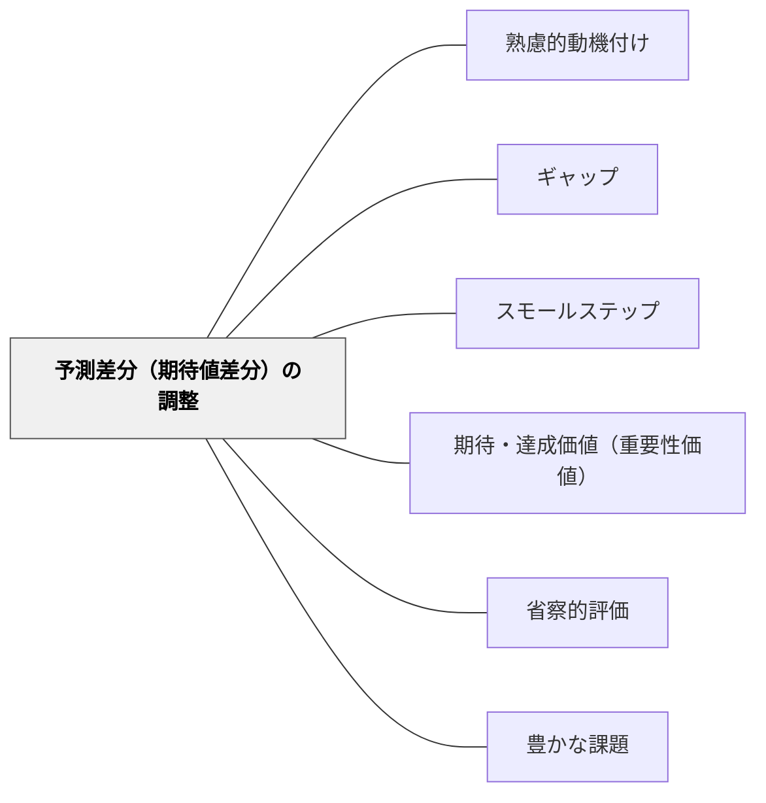

# 予測差分（期待値差分）の調整

> 期待が高すぎると落胆し、低すぎると挑戦しない。現実的な見通しが動機を守る。

## 背景（Context）
学習者は活動に取り組む前に「どのくらいうまくできるか」「どのくらい楽しいか」という期待を持っている。その期待と実際の結果のあいだにギャップがあると、次の行動意欲に大きく影響する。

## 問題（Problem）
期待値が現実より大幅に高いと、実際の結果に落胆してやる気が失われる。一方で期待値が低すぎると挑戦しようとしない。学習者の期待と実態のズレが継続的な動機低下を招く。

## 力のかたち（Forces）
- 過大な期待は失望につながり、学習継続を妨げる
- 過小な期待は挑戦回避につながり、成長の機会を損なう
- 他者（親・メディア）が植え付ける非現実的な期待もある
- 初回の体験が期待値の形成に大きく影響する

## 解決（Solution）
**学習の開始前に、現実的な見通しと小さな達成体験を組み合わせ、期待値と実際の結果のギャップを縮める。**

最初の課題を適切な難易度に設定し、「このくらいできそう」という見通しを持たせる。完了後に「思ったよりできた」という小さな成功体験を積ませることで、期待値が実態に近づいていく。進捗の見える化も期待と実態のすり合わせを助ける。

## 結果（Consequences）
- 継続的な動機の維持がしやすくなる
- 過大な期待による早期挫折を防げる
- 学習者が自分の実力を正確に把握する自己評価力が育つ

- [[概念/動機付け]] — 予測差分の動機付け理論的背景

## クラスター図

## Actionable Insight

- 単元の最初に「どのくらいできると思う？」と見通しを問い、最後に実際と比べさせる——期待と結果の差を自覚させることが自己評価力を育てる
- 最初の課題をやや易しめに設定し「思ったよりできた」という感覚を体験させてから難易度を上げる——小さな成功が期待値を現実に近づける
- 進捗を見える形（チェックリスト・進行バーなど）で提示する——進捗の可視化が期待と実態のすり合わせを助ける

## 出典

- 一つの教育のパタン・ランゲージ（岩井輝久）

## 関連パタン
- [[パタン/熟慮的動機付け]] — 親パタン
- [[パタン/ギャップ]] — 期待と現実のずれを扱う
- [[パタン/スモールステップ]] — 小さな達成で期待値を調整する
- [[パタン/期待・達成価値（重要性価値）]] — 期待の2軸を扱うパタン
- [[パタン/省察的評価]] — 予測と結果のずれを振り返ることで学習が深まる
- [[パタン/豊かな課題]] — 予測差分の問いが豊かな課題の動機構造になる
