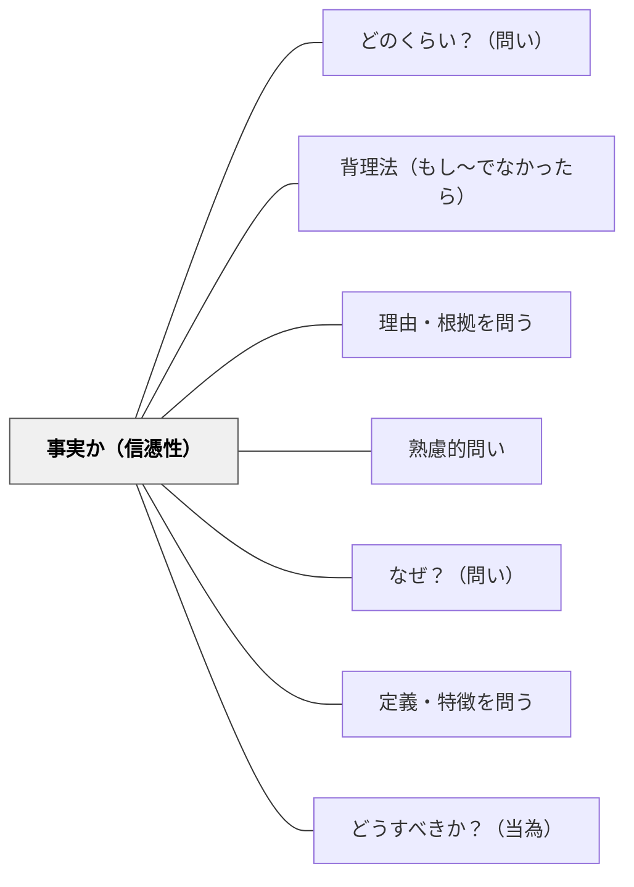

# 事実か（信憑性）

> 「本当にそうか？根拠は？エビデンスは？」と情報の信憑性・真偽を問う批判的思考の核心。

## 背景（Context）
情報が溢れる現代において、情報の真偽を判断する力は不可欠なリテラシーである。「それは事実か、意見か、推測か」「どのような証拠に基づいているか」という問いは、批判的思考（クリティカルシンキング）の最も基本的な問いの型である。

## 問題（Problem）
学習者は権威ある情報源からの情報を無批判に受け入れやすい。また「みんなそう言っている」「感覚的にそう思う」という根拠のない確信に基づいて判断しがちである。メディアリテラシーや科学的思考の基盤として、信憑性を問う習慣が必要とされている。

## 力のかたち（Forces）
- 根拠の有無を問うことで、事実と意見・推測の区別が明確になる
- 証拠の質（一次資料か二次資料か、統計か逸話か）への注意が育つ
- 「本当にそうか？」という疑問が、思い込みや確証バイアスへの対抗手段になる
- 信憑性を問うことが知的誠実さの文化を作る

## 解決（Solution）
「それは事実か、意見か？どんな証拠があるか？その情報源は信頼できるか？反証はないか？」と問いかける。例えば「この研究の結論は本当に言えることか？サンプルサイズは適切か？相関と因果は区別されているか？」と科学的なエビデンスの評価を促す。情報カードや根拠一覧表を作らせることも有効である。

## 結果（Consequences）
- 情報の批判的評価能力（メディアリテラシー・科学リテラシー）が高まる
- 根拠に基づいた議論と判断の習慣が育つ
- フェイクニュースや誇張された主張に対する免疫力が生まれる

## 関連パタン
- [[パタン/どのくらい？（問い）]]
- [[パタン/背理法（もし〜でなかったら）]]
- [[パタン/理由・根拠を問う]]
- [[パタン/熟慮的問い]] — 親パタン
- [[パタン/なぜ？（問い）]] — 根拠を問う問いと連携する
- [[パタン/定義・特徴を問う]] — 概念の正確性を確認する
- [[パタン/どうすべきか？（当為）]] — 事実と価値を区別する

## クラスター図

## Actionable Insight

- 情報や主張を提示するたびに「これは事実か意見か推測か？」を問う習慣をクラスで作る——情報の種類を区別する習慣がメディアリテラシーの基盤となる
- 「この情報の根拠は何か？情報源は信頼できるか？」を毎回問う——エビデンスへの問いが科学的態度と批判的思考を育てる
- 学習者に「今日学んだことの中で、自分がまだ確認していない事実を1つ挙げる」課題を出す——自ら確認する姿勢が知的誠実さの文化を作る

## 出典
- [[文献/熟慮的問いのパターンリスト（動画記録）]]
