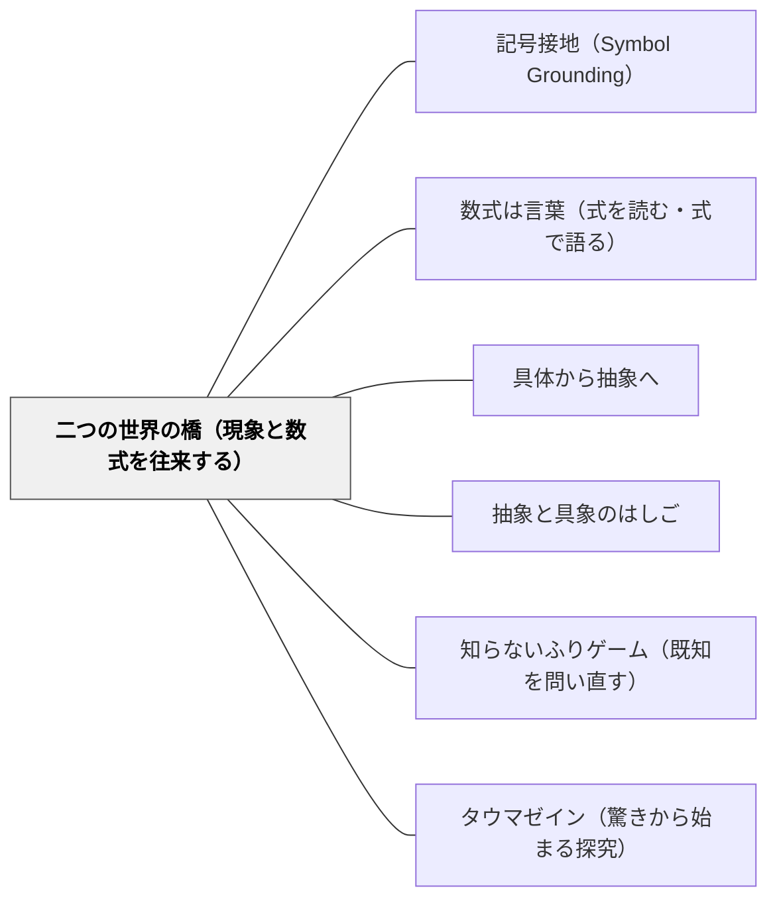

# 二つの世界の橋（現象と数式を往来する）

> 「ニュートンの運動方程式そのものが、現象の世界と数式の世界を結ぶ橋なのですね。」（第3章 テトラ）

---

## [Pattern Connection]

**数学ガールの物理ノート／ニュートン力学（結城浩, 2024）統合：**

第3章「万有引力の法則」において、テトラが「ニュートンの運動方程式は橋だ」と気づく場面。物理的世界（ボールが落ちる）と数学的世界（微分方程式が解かれる）は別の世界であり、数式はその橋渡しをする。橋を渡れば、現象から数式を作り（モデル化）、数式から現象を予測する（予測）が可能になる。

- **既存パタンとの関連**:
  - [[パタン/記号接地（Symbol Grounding）]] との根本的な接続——「二つの世界の橋」は、記号（数式）が物理的現象に接地されていることの構造的説明。橋がなければ数式は宙に浮いた記号に過ぎない。記号接地とは橋を架けること。
  - [[パタン/具体から抽象へ]] との接続——「具体（現象）から抽象（数式）へ」の方向が橋の片道。しかし「二つの世界の橋」は双方向の往来を強調する。抽象から具体へ戻ることも橋の使い方。
  - [[パタン/数式は言葉（式を読む・式で語る）]] との統合——数式が「言語」であるなら、二つの世界の往来は「翻訳」に相当する。現象→数式は「現実を数式という言語に翻訳する」こと。

- **補強された点**:
  - [[パタン/抽象と具象のはしご]] への接続——「はしご」と「橋」は異なるメタファー。「はしご」は抽象度の垂直移動；「橋」は領域間の水平移動。算数では「数の世界」と「量の世界」、「操作の世界」と「記号の世界」を行き来する橋がある。

- **他のパタンへの波及**:
  - [[パタン/知らないふりゲーム（既知を問い直す）]] — 「知らないふり」で再発見するとき、現象から出発して数式に到達する橋を自分で架け直す。
  - [[パタン/タウマゼイン（驚きから始まる探究）]] — 「橋を渡ったとき」の驚き——数式が現実を予測する瞬間——がタウマゼインを生む。

---

### 数学ガールの秘密ノート・丸い三角関数（結城浩, 2014）——「左に単位円、右にサインカーブ」

ミルカが第1章末に、単位円（左）とθ-sinカーブ（右）を横並びに描き、θを30°ずつ増やしながら両方に点を打っていく場面。

> ミルカ「左には単位円。右にはサインカーブ。この対応は美しい」（第1章）

これは「二つの世界の橋」の最も視覚的かつ動的な実例——「点が円上を回る」と「波形が生まれる」という二つの世界が同時に見える。橋を渡る行為が「動的な図の並置」として具体化される。テトラの「運動方程式は橋だ」が概念的・言語的な橋の発見だとすれば、ミルカの並置は視覚的・即物的な橋の実演である。

**補強された点**:
- 「同じθが二つの世界に同時に点として現れる」瞬間が、橋の「渡れる感覚」を身体的に提示する。単位円を見ながらサインカーブが生まれるのを「見る」体験は、数式の操作として橋を渡るより前に、橋の存在を感じさせる。
- 算数教育での橋の実例として:「数の世界（座標）↔形の世界（円・波形）」は、小学校の「量↔数」「操作↔記号」の往来と同じ構造を持つ。単純化すれば、「100円玉3枚を並べる操作」と「3×100=300という式」の並置が同型の橋。

**他のパタンへの波及**:
- [[パタン/発見を委ねる（自分で見つけたものこそ燃え上がる）]] — テトラがミルカの並置を見て「-1以上1以下」を自発的に発見する場面と接続。橋が見えると発見が起きる。
- [[パタン/定義から始める（言葉を厳密にする）]] — 単位円による再定義が「直角三角形という名の束縛」を解く。定義の変更が橋の形を変える。

→ [[文献/数学ガールの秘密ノート・丸い三角関数（結城浩）]]

---

### Nappo & Valente（2026）——「二つの世界の橋」は構造マッピングの実装

Gentner（1983, 1989）の構造マッピング理論（SMT）は、「二つの世界の橋」が認知的にどのように機能するかを説明する。

**SMTから見た「橋」の正体**：

- **ソース（源領域）** ＝ 物理的世界（ボールが落ちる、ばねが伸びる）
- **ターゲット（標的領域）** ＝ 数学的世界（微分方程式、比例式）
- **橋を架けること** ＝ 「ソースとターゲットの間の関係の等値写像（structural isomorphism）を見出すこと」

Gentnerが強調するのは「属性（見た目）の類似ではなく関係の構造の共通性」——電気と水流のアナロジーが成立するのは外見が似ているからではなく「電圧：電流 ＝ 水圧：流量」という関係構造が同型だから。「二つの世界の橋」が架かるのも同じ理由：「距離が増える速さ」と「微分」が関係構造として同型だから橋が成立する。

**inference force（推論力）と橋の強度**：

Nappo & Valente（2026）の「推論力」の概念は橋の強さを測る枠組みになる：
- 橋が強い ＝ 現象と数式の構造的類似が深く、一方から他方を正確に予測できる
- 橋が弱い ＝ 部分的な類似しかなく、予測に限界がある——これが「モデルの限界」を学ぶ入口になる

橋が「どこで崩れるか」を問うことは、Contrast（対比）学習モードの実践であり、数学的なモデルの精度と限界を自覚させる。

> "No difference without similarity." — Gentner (1993: 683)
> 橋の存在（構造的類似）が先に見えなければ、二つの世界の違いさえ見えない。

**補強された点**：「橋を往来する」という直観的なメタファーが、Gentnerの構造マッピング理論によって「関係の等値写像を見出し投影する」という認知的メカニズムとして説明される。

**他のパタンへの波及**：[[パタン/類推（アナロジー）]] — 橋の架け方の理論；[[パタン/直接見えない対象への類推（認識論的に困難な文脈）]] — 橋が架かる特別な文脈

→ [[文献/Analogical Reasoning in Science（Nappo & Valente）]]

---

## 背景（Context）

算数・数学の授業では、式と現実が切り離されて進みがちだ。「速さ × 時間 = 道のり」という式は「覚えるもの」として提示され、「なぜこの式が現実を記述できるのか」は問われない。数学の問題を解くとき、現実の場面はすでに「数値に変換済み」の形で与えられ、式と現実の橋を架ける経験が省略される。

しかし、数学の本質的な強さは「現実を式で表し、式を操作し、結果を現実に戻す」という往来にある。ニュートンがそれを示した——自然言語では語れなかった引力の法則を、微分方程式として書くことで、惑星の軌道が予測できるようになった。この往来こそが「数学がなぜ役立つのか」の核心である。

## 問題（Problem）

現象と数式の橋が子どもに見えない：

- 文章題を「式に変換する手続き」として処理し、「なぜ式が現実を表せるか」を考えない
- 数学の世界で式を操作して出た答えが、現実世界の何を意味するか分からない
- 「数学を学ぶとなぜ現実が分かるのか」という根本的な問いへの答えを持っていない
- 「モデル化」（現象→式）と「予測」（式→現象）を別々の活動として経験しない

## 力のかたち（Forces）

- 橋の両側を同時に見せることは、どちらか片方の習熟を犠牲にする可能性がある
- 往来の感覚は経験の積み重ねで育つ——一度経験するだけでは定着しない
- 「数学的に正しい」と「現実に対応している」は異なる基準——橋を往来するとは、この二基準を使い分けることでもある
- 「橋があること」を意識するのは高度なメタ認知——低学年では部分的な接続経験から始める必要がある

## 解決（Solution）

**「この式は現実のどの場面を表しているか」「現実で起きていることを式で書くとどうなるか」という往来の問いを、授業に意図的に組み込む。式を操作した後「では現実でどういうことか」と戻る習慣が、橋を架け直す経験を作る。**

---

### 橋を往来する三実践

**現象→数式（モデル化）**: 「この場面を式で書くとどうなる？」——現実の観察や経験から式を作る方向。

**数式→現象（予測・解釈）**: 「この式から何が分かる？現実ではどういうことが起きる？」——式を操作した結果を現実に戻す方向。

**往来の実感化**: 「式を作って、計算して、現実で確かめてみよう」——モデル化→予測→検証の一周が「橋を渡った」経験になる。

---

### 具体例

**例1: 小学校「速さ」**
実際に歩いて時間と距離を測り、「式で表すとどうなる？」でモデル化。「この式から、30分歩くと何m？」で予測。実際に歩いて確かめる——往来の一周が橋を体験させる。

**例2: 算数「面積」**
1cm²のタイルを敷いて「縦×横」が成り立つことを確認（現象→式）。「縦5cm×横7cm = 35cm²という式から、タイルが何枚必要か分かる」（式→現象）。橋は両方向に渡れる。

**例3: 理科と算数の接続**
「ばねが伸びた長さとおもりの重さ」の実験データから式を作る（モデル化）。式からまだ実験していない場合の予測を出す（予測）——式が「未来を先読みする道具」になる瞬間が橋の驚きを生む。

**例4: 数学デイリー（岩井）**
問題を解いた後「この式は何を表しているか」と書く。数式の世界での操作が、出発した問題の世界と接続されているかを確認する。往来の意識が計算の意味を保つ。

## 結果（Consequences）

- 式が「現実のモデル」として見えるようになる——式の操作に意味が生まれ、意欲的な関与が増す
- 「数学はなぜ役に立つのか」という問いへの体感的な答えが生まれる
- 「答えを出した後」に「これは現実でどういうことか」と問う習慣が育つ
- ただし: 橋の往来の経験は、系統的に設計しないと単発の活動で終わる——単元を通じた設計が必要

## 関連パタン

- [[パタン/記号接地（Symbol Grounding）]] — 橋を架けることは記号に現実的意味を持たせること
- [[パタン/数式は言葉（式を読む・式で語る）]] — 往来は「翻訳」であり、数式は往来の言語
- [[パタン/具体から抽象へ]] — 現象→数式の方向（橋の片道）
- [[パタン/抽象と具象のはしご]] — 抽象度の垂直往来との接続
- [[パタン/知らないふりゲーム（既知を問い直す）]] — 橋を自分で架け直す経験
- [[パタン/タウマゼイン（驚きから始まる探究）]] — 橋を渡った驚きが探究の動機に
- [[文献/数学ガールの物理ノート・ニュートン力学（結城浩）]] — 本パタンの出典

---

## クラスター図

## Actionable Insight

- 「この式は現実のどんな場面を表してる？」を式を導入するたびに一回聞く——式を「読む問い」と「現実に戻す問い」が橋を往来する習慣を作る
- 「式で計算した答えを、現実で確かめる」実験活動を1単元に1回入れる——「式→現実」方向の橋渡しが、数学の使いどころを体感させる
- 「なぜ数学を勉強するの？」と聞かれたとき「現実と数式の世界を行き来する道具を学んでいる」と答える——現象→式→予測の往来が「なぜ」への答えになる

---

## 出典

結城, 浩（2024）.『数学ガールの物理ノート／ニュートン力学』SBクリエイティブ. 第3章.

> 「ニュートンの運動方程式そのものが、現象の世界と数式の世界を結ぶ橋なのですね。」（第3章 テトラ）
