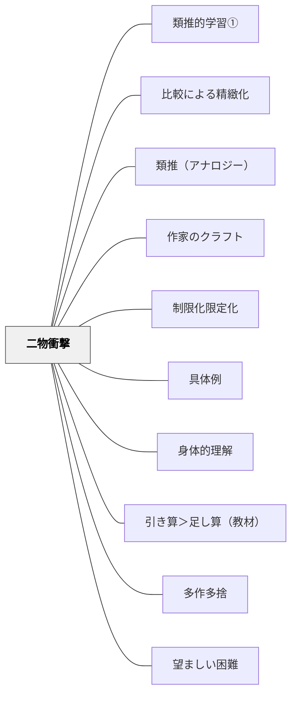

# 二物衝撃

> 関係のない二つのものを並べると、その「間」に意味が生まれる——比喩として結ばなくても、並置だけで読者の中に何かが起きる。

## Pattern Connection

**北大路翼（2019）生き抜くための俳句塾 統合（2026-06-02）：取り合わせの技法**

北大路翼は俳句の基本技法「二物衝撃」を次のように説明する。

> 「二物衝撃——映画のモンタージュが元。」——北大路翼（2019）第四講

映画のモンタージュ理論（エイゼンシュテイン）では、二つの無関係な映像を並べると、どちらの映像にも存在しない第三の意味が観客の脳内に生まれる（「赤ちゃんの顔」+「爆発」→「恐怖」）。俳句の「取り合わせ」はこれと同じ原理——季語と別のモノを並置するだけで、その「間」に意味が生まれる。

**俳句における二物衝撃の実例：**

| 句 | 俳人 | 二つのモノ | 「間」に生まれるもの |
|---|---|---|---|
| 古池や蛙飛び込む水の音 | 芭蕉 | 古池（永遠の静寂）× 蛙の音（一瞬） | 静寂がより深くなる逆説 |
| 荒海や佐渡に横たう天の川 | 芭蕉 | 荒れた地上の海 × 静かな天空の川 | 上下の対比による広大さ |
| さくらまんかいにして刑務所 | 種田山頭火 | 満開の美しさ × 自由を奪われた場所 | 美しさと不自由の衝撃的な共存 |
| 草の実や女子とふつうに話せない | 落地雄介 | 草の実の素朴さ × 青春の戸惑い | 日常の中の照れと純粋さ |
| 女房は下町育ち祭好き | 高浜年尾 | 妻への観察 × 祭の開放感 | さりげない愛情と穏やかな幸福 |

---

## 背景（Context）

俳句を作るとき「何を書けばいいかわからない」という行き詰まりは多い。観念（「さみしい」「嬉しい」）から書き始めると主観的形容詞に頼った句になり、読者に伝わらない。「なんでもいいから具体的なモノを一つ持ってきて、もう一つのモノと並べる」という取り合わせの技法は、この行き詰まりを解く最も基本的な操作である。

また教室での二物衝撃の活用は、俳句制作だけでなく、「比べて共通点を見つける」という類推的思考の訓練として機能する。複数の俳句を読み比べ、「この句とこの句に共通するものは何か」を問うことで、表面上まったく違う対象の奥にある本質的な共通性（さみしさ・静けさ・驚き・逆説）を発見する。

## 問題（Problem）

「関係のないものを結びつける」という創造的発想の仕方は、教えにくい。
- 「何か比喩を使って書こう」と言っても、「〜のようだ」という直喩しか出てこない
- 直喩は「A＝B」と明示するので、「間」の意味が生まれにくい
- 一つのモノだけを描写しようとすると、観念的・主観的な記述になりやすい
- 「関係のないもの」の組み合わせが無限にあるため、何を選べばいいかわからない

## 力のかたち（Forces）

- 二つのモノが近すぎると（例：犬と猫）、対比が安易で意味が生まれにくい
- 二つのモノが遠すぎると（例：宇宙と鉛筆）、接点が見えず意味が届かない
- 「その間に何があるか」を言葉にしようとするとき、最も深い思考が起きる
- 17文字の制約が「どちらを選ぶか」「どこで切るか」という判断を必然化する
- 季語という「共通のモノ」（時間・自然）が一方に入ることで、接続の手がかりになる
- 「なぜこの二つを並べたのか」を説明できないとき——それが最もよい取り合わせかもしれない

## 解決（Solution）

**関係のない二つのモノを「切れ字」（や・かな・けり）や改行で並べる。比喩として結ばない。その「間」に生まれるものを読者に委ねる。**

---

### 教室での実践：俳句の読み比べ→共通点の発見→自作

岩井の実践では、複数の俳句を子どもたちに提示し、「この句とこの句に共通するものは何か」を問う。これは[[パタン/類推的学習①]]の「読み比べ→共通点を見つける→型を自分で使う」のサイクルを俳句で実装したものである。

**ステップ1：俳句を2〜3句並べて提示する**

例：
- 「古池や蛙飛び込む水の音」（芭蕉）
- 「さくらまんかいにして刑務所」（種田山頭火）
- 「うごけば、寒い」（橋本夢道）

**ステップ2：「この句に二つのものがあるか？」を問う**

「古池」と「蛙の音」——この二つはどう違うか？（永遠の静寂 vs 一瞬の音）
「桜の満開」と「刑務所」——この二つを並べるとどんな感じがするか？

**ステップ3：「共通するもの」を探す**

一見まったく異なる複数の句が、「さみしさ」「静けさ」「逆説」「時間の圧縮」など同じ何かを持っていることを発見させる。これが類推的思考の核心。

**ステップ4：自分で「二物衝撃」を試す**

- 今日見た・触れた・感じたモノを一つ選ぶ
- それと関係のない（でも心が動く）もう一つのモノを選ぶ
- 「や」や「かな」で切って並べる

---

### 二物衝撃の設計ヒント

- **季語＋感情のある場面**：自然の事実（春・夏の蜂・冬の寒さ）と人間の感情的な場面を並べる
- **大きいもの＋小さいもの**：宇宙・海・山 × 鉛筆・蟻・爪
- **永遠のもの＋瞬間のもの**：古池・山 × 音・一瞬の動き
- **美しいもの＋哀しいもの**：桜・花 × 別れ・刑務所・孤独
- **日常のもの＋非日常の感情**：草の実・弁当 × 照れ・哀しさ・驚き

---

## 結果（Consequences）

- 「関係のないもの」を組み合わせる発想力が育つ——算数・理科・社会の「これと似ているものは？」という思考にも転移しやすい
- 直喩（「〜のようだ」）より深いレベルで意味を生む経験が、言語感覚を鍛える
- 「なぜこの二つなのか」という問いが、自分の感性・価値観への気づきを生む
- 複数の俳句を比べて共通点を探す活動が、類推的思考の実践になる
- 簡単には説明できない「間の意味」を言語化しようとするとき、最も深い思考が起きる

## 関連パタン

- [[パタン/類推的学習①]] — 俳句の読み比べ→共通点発見→自作のサイクルが類推的学習の実装
- [[パタン/比較による精緻化]] — 二物の比較が意味を深める
- [[パタン/類推（アナロジー）]] — 関係のない二物の間に橋を架ける思考
- [[パタン/作家のクラフト]] — 二物衝撃は俳句技法の核（北大路翼・芭蕉）
- [[パタン/制限化限定化]] — 17文字の制約が二物の選択を鋭くする
- [[パタン/具体例]] — 二物は互いにとっての意外な文脈的具体例になる
- [[パタン/身体的理解]] — モノから発想する起点が二物衝撃の前提
- [[パタン/引き算＞足し算（教材）]] — 二物だけを残して他を削る
- [[パタン/多作多捨]] — 二物の組み合わせを多数試して捨てる実践と連動
- [[パタン/望ましい困難]] — 「なぜこの二つなのか」の説明困難が学習を深める
- [[文献/生き抜くための俳句塾（北大路翼）]] — 二物衝撃・取り合わせの出典（北大路翼, 2019）

## クラスター図

## Actionable Insight

- **俳句の読み比べで「二つのもの」を見つける**：3句を並べて「この句にある二つのものを探して」と問う——「古池」と「蛙の音」、「桜」と「刑務所」という対を発見するだけで、取り合わせの原理が身体化する
- **「今日の二物衝撃」を一句作る**：今日見た・感じたモノを一つ選び、「それとは関係のない（でも何か気になる）もう一つのモノ」を選んで並べる——比喩として結ばず、ただ並べるだけでよい
- **算数の「二物衝撃」**：数と日常場面を取り合わせる——「分数」と「ピザ」でなく、「分数」と「時間」「折り紙」「距離」の複数の文脈を並べて共通点を発見させる（これは[[パタン/具体例]]の多様な文脈と同型）

## 出典

北大路翼（2019）. 『生き抜くための俳句塾』左右社.

岩井輝久（実践）— 複数の俳句を読み比べ、共通するものを発見し、自作へとつなぐ類推的学習の実践。

> 「二物衝撃——映画のモンタージュが元。」——北大路翼（2019）第四講
