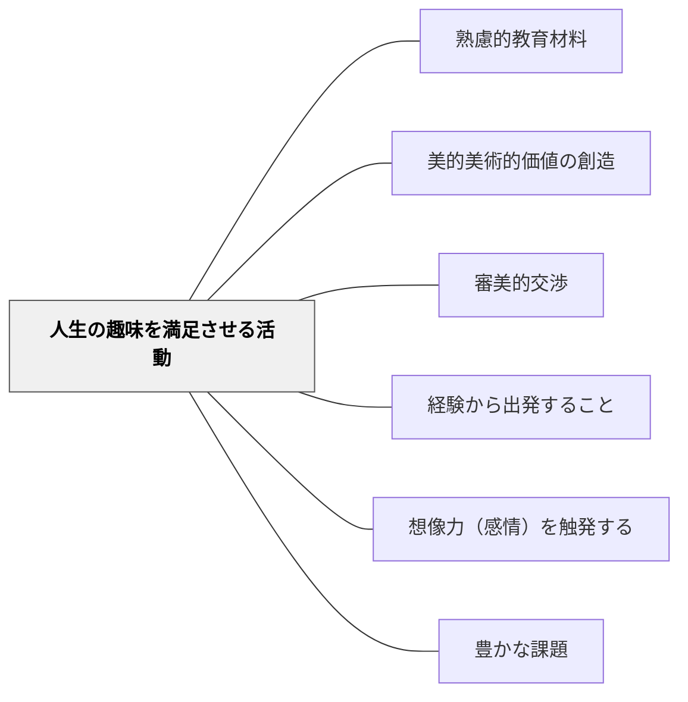

# 人生の趣味を満足させる活動

> 美術・音楽・文学——人生を豊かに彩る芸術的活動が教育材料になる。

## 背景（Context）

ハーバート・スペンサーの活動分類の第五項目。美術・絵画・音楽・文学・工芸など、人生の趣味・審美的満足に関わる活動。体育や芸術教科だけでなく、あらゆる教科での審美的な側面がここに含まれる。

## 問題（Problem）

「役に立つ」知識を優先するあまり芸術・文化的な教育が軽視されると、人生の豊かさと審美的感受性が育たない。

## 力のかたち（Forces）

- 芸術的体験が感情・想像力を強く触発する
- 趣味・審美性は個人差が大きい
- 受験教育との緊張関係がある

## 解決（Solution）

**芸術・音楽・文学・工芸などの審美的活動を教育材料として丁寧に設計し、人生を豊かにする審美的感受性を育てる。**

## 結果（Consequences）

- 審美的感受性と創造性が育つ
- 生涯にわたる文化的活動の基盤が形成される

## 関連パタン

- [[パタン/熟慮的教材教具]] — 親パタン
- [[パタン/美的美術的価値の創造]] — 美的価値との接続
- [[パタン/審美的交渉]] — 審美的な関わり

- [[パタン/経験から出発すること]] — 個人の趣味・関心を学びの出発点にする
- [[パタン/想像力（感情）を触発する]] — 趣味への熱中が感情・想像力を動かす
- [[パタン/豊かな課題]] — 趣味を核にした豊かな課題設計

## クラスター図

## Actionable Insight

- 各教科のまとめ課題に「詩・絵・音楽・工作のどれかで表現する」選択肢を加える——審美的な表現形式が概念の深い内面化を促し、学習者の多様な強みを引き出す
- 学習者が「好きな芸術作品」を1つ選び、今学んでいる内容と結びつけて紹介する課題を出す——自分の趣味と学習が結びつくことで内発的動機が生まれる
- 完成した学習成果を「小展覧会」形式で展示し、互いの審美的な良さを語り合う場を設ける——作品を大切に扱われる経験が学習への誇りと審美的感受性を同時に育てる

## 出典

- ハーバート・スペンサー（知識の分類）
- [[文献/熟慮的教育材料のパターンリスト（動画記録）]]
