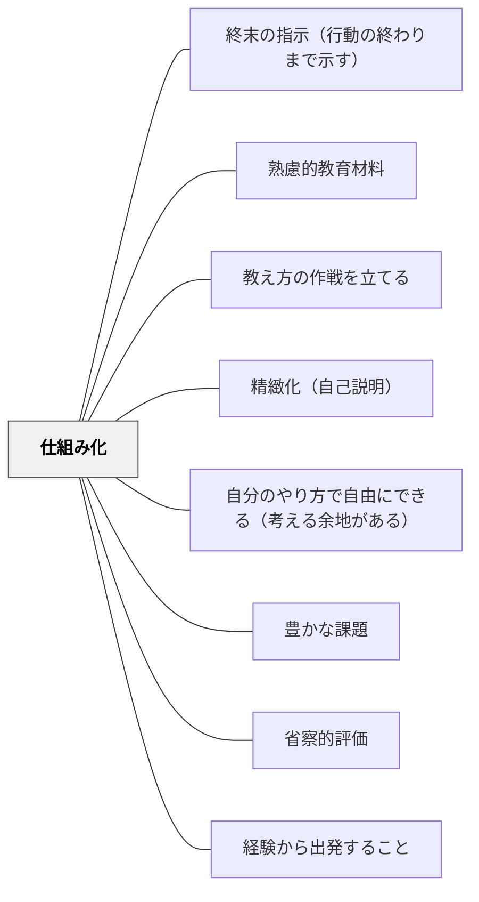

# 仕組み化

> 学習活動や教材の使い方をルーティン・システムとして設計し、自律的に学べる仕組みをつくる。

## 背景（Context）

教材単体ではなく、学習の「仕組み」として設計することで、教師がいなくても学習が進む状態をつくる。習慣化・ルーティン化・自己調整学習の基盤となる。鈴木克明「教材設計マニュアル」の「教え方の作戦」としての仕組みづくり。

## 問題（Problem）

良い教材があっても、いつ・どのように使うかの仕組みがないと、学習が散発的になり定着しない。

## 力のかたち（Forces）

- 仕組みが自動化されると認知負荷が減る
- ルーティンが安心感と継続性を生む
- 仕組みが複雑すぎると形骸化する

## 解決（Solution）

**学習活動をルーティン・システムとして設計し、「いつ・何を・どのように」が自明になる仕組みを教材に組み込む。**

## 結果（Consequences）

- 学習の継続性・自律性が高まる
- 教師の介入なしでも学習が進む

## 関連パタン
- [[パタン/終末の指示（行動の終わりまで示す）]]

- [[パタン/熟慮的教材教具]] — 親パタン
- [[パタン/教え方の作戦を立てる]] — 作戦としての仕組み
- [[パタン/精緻化（自己説明）]] — 仕組みの中の学習活動
- [[パタン/自分のやり方で自由にできる（考える余地がある）]] — 自律性の余地

- [[パタン/豊かな課題]] — 仕組みの中に豊かな課題を埋め込む
- [[パタン/省察的評価]] — 仕組みの振り返りが次の設計改善を生む
- [[パタン/経験から出発すること]] — 体験の仕組み化で学びを持続させる
## クラスター図

## Actionable Insight

- 毎回の授業で繰り返す「入室したら○○する」「活動後は必ず△△する」というルーティンを1つ定着させる——仕組みが自動化されることで認知負荷が減り学習への集中が高まる
- 学習材料に「いつ・何を・どの順に行うか」を示す簡単なチェックリストを組み込む——学習の進め方が自明になることで教師の介入なしでも学習が進む
- 「活動が終わったら次に何をするか」を事前に明示する——次の行動がシステムとして設計されていることが継続的な自律的学習の基盤になる

## 出典

- 鈴木克明（2002）『教材設計マニュアル――独学を支援するために』北大路書房
