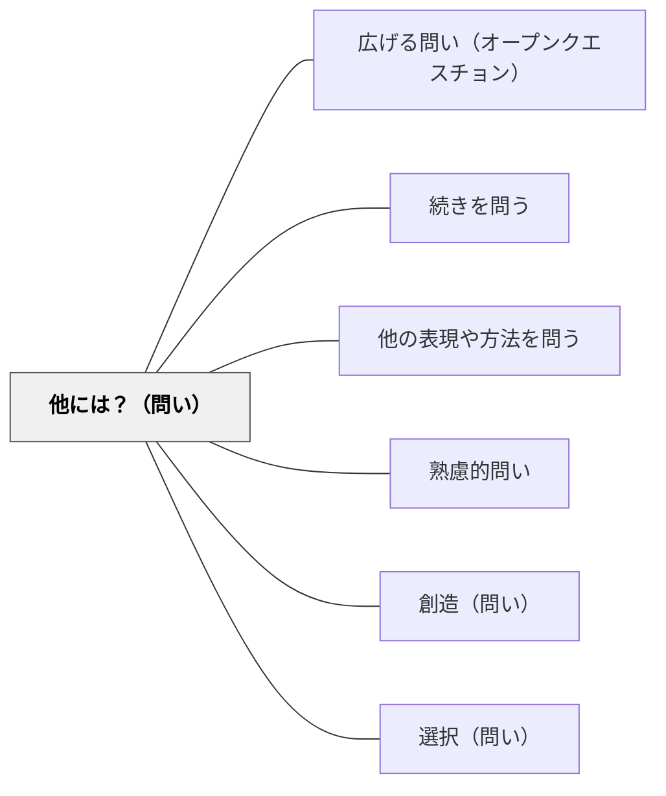

# 他には？（問い）

> 「他に何があるか？別の視点は？」と追加・多様な可能性を促し、思考を広げる。

## 背景（Context）
最初に思いついた解答や視点は、必ずしも最善ではない。思考の慣性によって、最初の答えで満足してしまう傾向がある。「他には？」という問いは、この慣性を打ち破り、思考の多様性・包括性を促す最もシンプルで強力な問いの一つである。

## 問題（Problem）
学習者は一つの解答が出ると思考を止めてしまいがちである。また視点の固定（思考の固着）によって、他の可能性が見えなくなることがある。「一つの正解を探す」という学習文化が、思考の多様性を妨げることもある。

## 力のかたち（Forces）
- 「他には？」という問いは最小限の言葉で最大限の思考拡張を促す
- 多様な視点の収集が、よりバランスの取れた理解と判断を生む
- 「まだあるかもしれない」という開放性が探究的態度を育てる
- 複数の解答を持つことが、文脈に応じた柔軟な選択を可能にする

## 解決（Solution）
「他には？もっとあるか？別の視点から見るとどうか？」と繰り返し問いかける。例えばブレインストーミングの場面では「まず10個挙げよう」と量を求めることで「他には？」の連鎖を引き出す。「最初に思いついたものとは全く異なる視点は？」という形で思考の固着を意識的に破る問いとして使うことも有効である。

## 結果（Consequences）
- 思考の多様性・包括性が高まり、見落としが減る
- 一つの視点への固着（思考の固定）が解消される
- ブレインストーミングや発散的思考の習慣が身につく

## 関連パタン
- [[パタン/広げる問い（オープンクエスチョン）]]
- [[パタン/続きを問う]]
- [[パタン/他の表現や方法を問う]]
- [[パタン/熟慮的問い]] — 親パタン
- [[パタン/創造（問い）]] — 新しい可能性を生み出す問い
- [[パタン/選択（問い）]] — 複数の選択肢から選ぶ問いと連携する

## クラスター図

## Actionable Insight

- 学習者が1つ答えを出したら「他には？」を3回繰り返す癖をつける——この問いだけで思考の多様性と包括性が格段に高まる
- ブレインストーミングで「まず10個挙げよう」と量を求めることで「他には？」の連鎖を生む——量を求めることが質の発散を引き出す逆説的な効果を持つ
- 「最初に思いついたものとは全く違う視点から考えると？」と固着を意識的に破る——思考の慣性を崩す問いが本質的な探究への扉を開く

## 出典
- [[文献/熟慮的問いのパターンリスト（動画記録）]]
