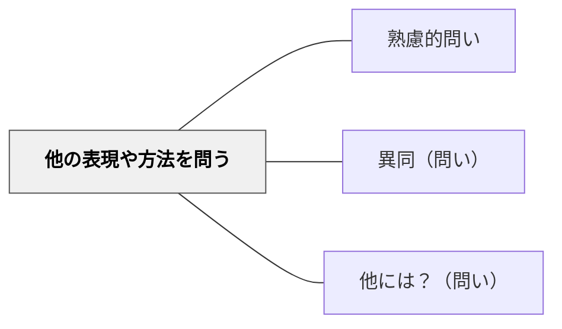

# 他の表現や方法を問う

> 「別の言い方・方法はあるか？」と問い、多様な表現・アプローチを引き出す。

## 背景（Context）
学習者がある方法や表現にたどり着いたとき、「それだけが答え」という思い込みに陥りやすい。一つの方法しか知らなければ、状況が変わったときに対応できない。多様な表現・解法を探す習慣が、柔軟な思考と深い理解を生む。

## 問題（Problem）
一つの正解を見つけた満足感が、「他の方法を探す」という動機を妨げる。教科書や授業で一つの解法だけが示されると、学習者はそれが唯一の方法だと信じてしまい、別の視点から問題を見る機会を失う。

## 力のかたち（Forces）
- 複数の解法を比べることで、それぞれの長所・短所が見える
- 「別の言い方」を探すことで、理解の幅が広がる
- 異なる方法が同じ答えにたどり着くと、概念の本質が見えてくる
- 創造的思考は「一つの正解」という制約を外すところから始まる

## 解決（Solution）
「別の方法で解いてみよう」「他の言い方ができる？」「もっと簡単な方法はないかな？」と問いかける。たとえば、たし算で解いた問題をかけ算でも解けるか試させる。詩の感想を一度言葉で表現した後、「絵や図で表すとしたら？」と促す。複数の表現を並べて「どれが一番しっくりくる？なぜ？」と比較させる。

## 結果（Consequences）
- 柔軟な思考と問題解決の引き出しが増える
- 多様な表現を通じて概念の理解が深まる
- 他者の方法・表現を尊重し、学び合う姿勢が育つ

## 関連パタン
- [[教科/算数・数学で使うパタン]]
- [[パタン/熟慮的問い]] — 親パタン
- [[パタン/異同（問い）]] — 方法同士を比較する
- [[パタン/他には？（問い）]] — さらに追加を促す

## クラスター図

## Actionable Insight

- 解法が1つ出たら「もっと簡単な方法・別の言い方はないかな？」と続ける——1つの答えで満足する慣性を崩す問いが柔軟な思考の引き出しを増やす
- 「言葉で言えた。次は絵で表せる？身体で表せる？」と表現形式を変えて問いかける——異なる形式での表現が概念の多面的な理解を深める
- 複数の表現を並べて「どれが一番しっくりくる？なぜ？」と比較・評価させる——比較によって各方法の長所・短所が見え、メタ的な理解が生まれる

## 出典
- [[文献/熟慮的問いのパターンリスト（動画記録）]]
