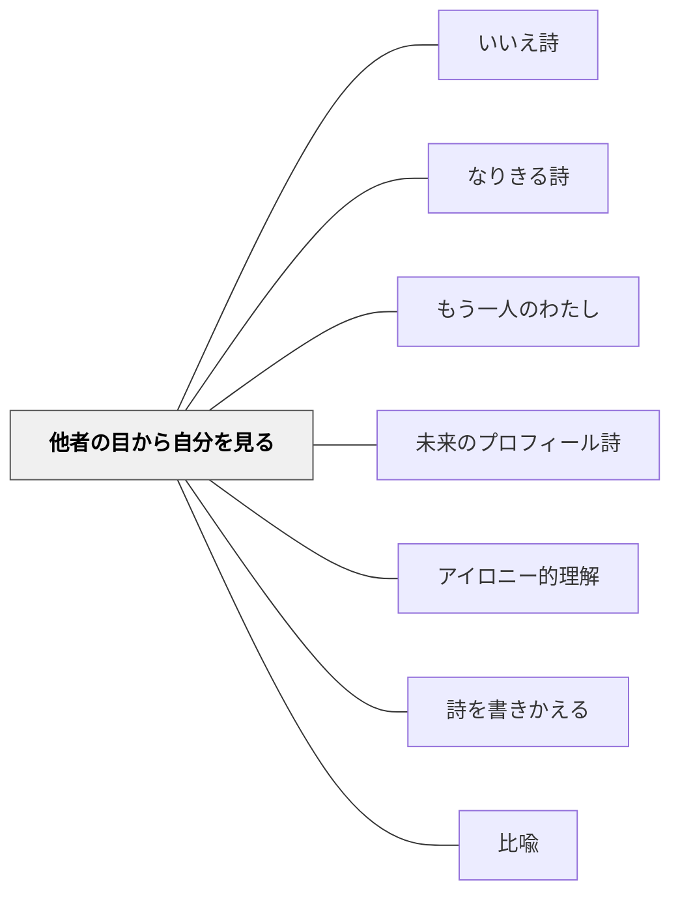

# 他者の目から自分を見る

> すずめから見ると「空をとべない大きな人」——他者の目が、自分の知らない自分を見せてくれる。

---

## Pattern Connection

**白谷明美（年不詳）統合（2026-05-21）：**

谷川俊太郎「わたし」（「男の子から見ると——女の子」「赤ちゃんから見ると——お姉ちゃん」）を入口に、白谷明美は「○○から見ると、わたしは……」という形式で多角的な自己探求の詩を書かせる実践を展開した。古賀涼子（小5）が20以上の視点を書き連ねた実践が象徴的だ。

- **既存パタンとの関連**：[[パタン/アイロニー的理解]] の「自分とは異なる存在の視点に立つことで自分を外から見る認知的距離が生まれる」という操作の詩版。[[パタン/なりきる詩]] が「他の存在の内側に入る」のに対し、本パタンは「他の存在から自分を見る」——方向性が逆で補完的。
- **補強される点**：[[パタン/詩を書きかえる]] の「別の視点から書きかえる」操作の自己探求版。詩の人物の視点を変えるのでなく、「わたし自身を見る視点」を変える。視点を増やすほど「わたし」の多様性・矛盾・豊かさが見えてくる。
- **他のパタンへの波及**：[[パタン/もう一人のわたし]] と連鎖する——「内なる声から自己を見る」も「他者の目から自己を見る」も、自己の外部化・多視点化という同じ軸の上にある。

---

## 背景（Context）

「自分について書こう」と言われると、子どもは「好きなもの・嫌いなもの・得意なこと」というプロフィールを書く。それは「自分から見た自分」であり、見慣れた自分の姿だ。

しかし「すずめから見ると、わたしは空をとべない大きな人だ」「ありから見ると、わたしは怪獣だ」——他者の目（動物・もの・宇宙）を通したとき、子どもは「知らなかった自分」に出会う。「月から見ると暗く悲しいようで、太陽から見ると明るく元気のようで」——同じ自分が視点によって全く別の存在になることの発見が、自己の複雑さと豊かさを教える。

## 問題（Problem）

「自分らしさを詩にしよう」と言っても、子どもは見慣れた自分像から出られない。自分の深い部分（矛盾・多様性・他者から見た自分）には届かない。どうすれば、子どもが自分の知らなかった自己の側面を詩のことばで発見できるか。

## 力のかたち（Forces）

- 「自分を見る」より「別のものが自分を見ている」の方が新しい発見が起きやすい
- 視点の落差が大きいほど驚きが生まれる——「ありから見ると（怪獣）」「山の上から見ると（豆粒）」
- 視点を増やすほど「わたし」の矛盾・多様性が現れてくる——20視点書いた子の発見は1視点の子より深い
- 「かがみから見ると（自分）」「ピアノから見ると（つぶす人）」など予想外の視点が詩の魅力になる
- 「月から見ると（暗く悲しい）」「太陽から見ると（明るく元気）」という反対の視点が、自己の複雑さを表現する
- 視点の数・種類の自由さが、全員参加を可能にする——「どの視点を使ってもいい」というローフロア性

## 解決（Solution）

**「○○から見ると、わたしは……」という形式で、できるだけ多様な視点（人・動物・もの・自然・宇宙）から「わたし」を描く詩を書く。**

---

### Step 1：谷川俊太郎「わたし」を読む

谷川俊太郎「わたし」の一部を読む（または教師が以下の例を読み聞かせる）：

- 「男の子から見ると——女の子」
- 「赤ちゃんから見ると——お姉ちゃん（お兄ちゃん）」
- 「親から見ると——子ども」
- 「先生から見ると——生徒」
- 「すずめから見ると——空をとべない大きな人」
- 「ありから見ると——怪獣」
- 「レントゲンから見ると——骨」
- 「山の上から見ると——豆粒」

---

### Step 2：視点を増やす

「あなたなら他にどんな視点から見ますか？」と問いかける。できるだけ多くの視点を出させる。

**子どもの実作例（古賀涼子、小5）の視点一覧（20以上）：**
- かがみから見ると（自分）
- ピアノから見ると（つぶす人）
- いちごから見ると（食べる人）
- 犬から見ると（走れない遅い人）
- 月から見ると（暗く悲しいようで）
- 太陽から見ると（明るく元気なようで）
- 宇宙から見ると（ちっぽけな存在）
- ……

「月から見ると暗く悲しいようで、太陽から見ると明るく元気のようで——これは矛盾しているように見えるね。でも、それがあなたなんだよ。」

---

### Step 3：詩として完成させる

視点のリストの中から特に気に入ったものを選んで、詩の形に整える。または全部を並べて「わたし」という題の詩にする。

**子どもの実作例：**
```
わたし

犬からみると
わたしはのろい人だ
ありからみると
わたしは大男だ
月からみると
わたしはかなしいようで
太陽からみると
わたしはるんるんしているようで
かがみからみると
わたしはわたしだ
```

---

### 発展：比喩との組み合わせ

「わたしを他の者にたとえるとなにみたいだと思いますか」（比喩版）：
- 「ぼくはのろいかめかな」
- 「わたしはモンキーかな。さわがしいから」
- 「ぼくはとらだ。気が短いから」

→ [[パタン/なりきる詩]] の特長図と組み合わせ：「とらだ→特長図（気が短い・がんばる時は走り回る）→とらの詩」

---

### 小学校・低学年への展開

- 低学年では「視点」の概念より「○○になったら、わたしを見るとどう見えるかな？」という問いかけが伝わりやすい
- 「動物3種類・もの2種類・自然1種類」という制約を与えると書きやすい
- 「いちばん驚いた視点はどれ？」と振り返りを加えると、自己発見の言語化が起きる

## 結果（Consequences）

- 「知らなかった自分」に出会う体験が起きる——視点を増やすほど発見が多い
- 「月から見ると暗く、太陽から見ると明るい」という矛盾した自己像を受け入れる自己受容が生まれる
- 自分の「固定したイメージ」から解放される——「自分は○○だ」という決め付けが崩れる
- 視点の数・多様さが詩の豊かさを決める——「20視点書いた子の詩」と「3視点の詩」は別物
- 「かがみから見ると（自分）」という視点が最後に来ると、詩が円環として完成する

## クラスター図



## Actionable Insight

- 「すずめから見たら、わたしってどんな存在だと思う？」という一問を詩の授業の導入に使う——5分でクラス全員が新しい自己発見をする
- 「20個以上書いた人は詩人だ」と伝える——量を追うことで思いがけない視点が出てくる
- 「月から見ると、太陽から見ると——反対の視点を必ず1つ入れてみよう」——矛盾した自己像の発見が詩のハイライトになる

## 関連パタン
- [[パタン/いいえ詩]]

- [[パタン/なりきる詩]] — 方向が逆の補完パタン：本パタンは「他者が自分を見る」、なりきる詩は「自分が他者になる」
- [[パタン/もう一人のわたし]] — 内なる視点から自己を見る補完的手法
- [[パタン/未来のプロフィール詩]] — 短所から自己を見る別の自己探求
- [[パタン/アイロニー的理解]] — 自分とは異なる視点に立つことで自分を外から見る認知的距離
- [[パタン/詩を書きかえる]] — 視点変換の詩的操作との連続性
- [[パタン/比喩]] — 「わたしを他のものにたとえると」は比喩遊びとの接続
- [[文献/詩が生まれるとき書けるとき（白谷明美）]] — 一次資料（第二章3節）

## 出典

白谷明美（年不詳）『詩が生まれるとき書けるとき　だれにでもできる楽しい詩のつくり方』教育出版センター（第二章3節「わたしって何者」）

> 「すずめから見ると——空をとべない大きな人」「ありから見ると——怪獣」——谷川俊太郎「わたし」応用の授業より
