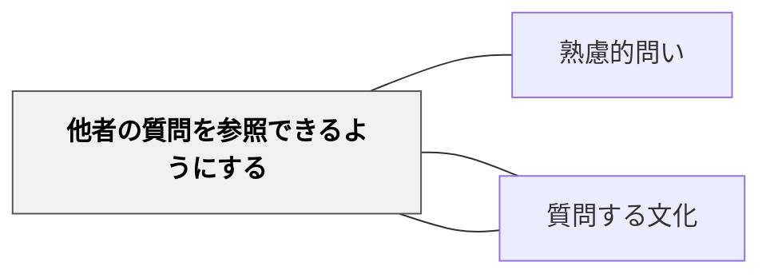

# 他者の質問を参照できるようにする

> 良い問いのモデルを提示し参照できる環境を作ることで、学習者は問いの質を高めるための基準を得る。

## 背景（Context）
問いを立てることを学ぶには、良い問いがどのようなものかを知る必要がある。しかし「良い問い」は抽象的な説明では伝わりにくく、具体的な事例を見ることで直感的に理解される。他者の問いを参照できる環境——問いのライブラリ、クラスの問い一覧、過去の学習者の問いの記録——は、問いの質を高めるための鑑賞・比較の場となる。

## 問題（Problem）
自分の問いのみを基準にしている学習者は、問いの視野が狭くなりがちである。「自分の問いがどの程度の深さか」を判断する基準がなければ、自己評価も難しい。良いモデルの提示なしに「深い問いを作れ」と求めても、その方向性が分からず、表面的な問いにとどまる。

## 力のかたち（Forces）
- 問いの質は、モデルとなる問いと比較することで理解される
- 他者の問いを読むこと自体が、問いを立てる練習になる
- 問いのライブラリは、単元を超えて蓄積・参照できるリソースになる
- 他者の問いを批評することは、批判的思考の訓練にもなる

## 解決（Solution）
授業で生まれた問いをポスターや共有ドキュメントにまとめ、常に参照できるようにする。単元の最初に「過去の学習者が立てた問いの例」を紹介し、「この問いのどこが深いと思う？」と考えさせる。例えば、読書の授業で前の学年の問い集を見せ、「自分が立てた問いと比べてどう違う？」と問いかける。問いを記録し蓄積する「問いの壁」や「問いノート」を用意する。

## 結果（Consequences）
- 問いの質についての共通基準が形成され、自己評価と相互評価が機能しやすくなる
- 問いを作ることが「孤独な作業」でなく、コミュニティの学びとして位置づけられる
- 蓄積された問いのライブラリが、次の学習者にとっての学習リソースとなる

## 関連パタン
- [[パタン/熟慮的問い]] — 親パタン
- [[パタン/質問作成の手順を示す]] — 手順と参照環境を組み合わせると問い生成が促進される
- [[パタン/質問する文化]] — 問いを共有・参照できる文化的基盤が必要

## クラスター図

## Actionable Insight

- 授業で生まれた良い問いを「問いの壁」として教室に常時掲示する——目に見える問いの蓄積が「問うことが学習の一部だ」という文化を育てる
- 単元の最初に「過去の学習者が立てた問いの例」を紹介し「どこが深い？」と考えさせる——良い問いのモデルを体感することで問いの質の基準が形成される
- 学習者が立てた問いを記録・蓄積し次の学習者の参照リソースにする——問いのライブラリが学習コミュニティの共有財産となり問いの文化を継続させる

## 出典
- [[文献/熟慮的問いのパターンリスト（動画記録）]]
