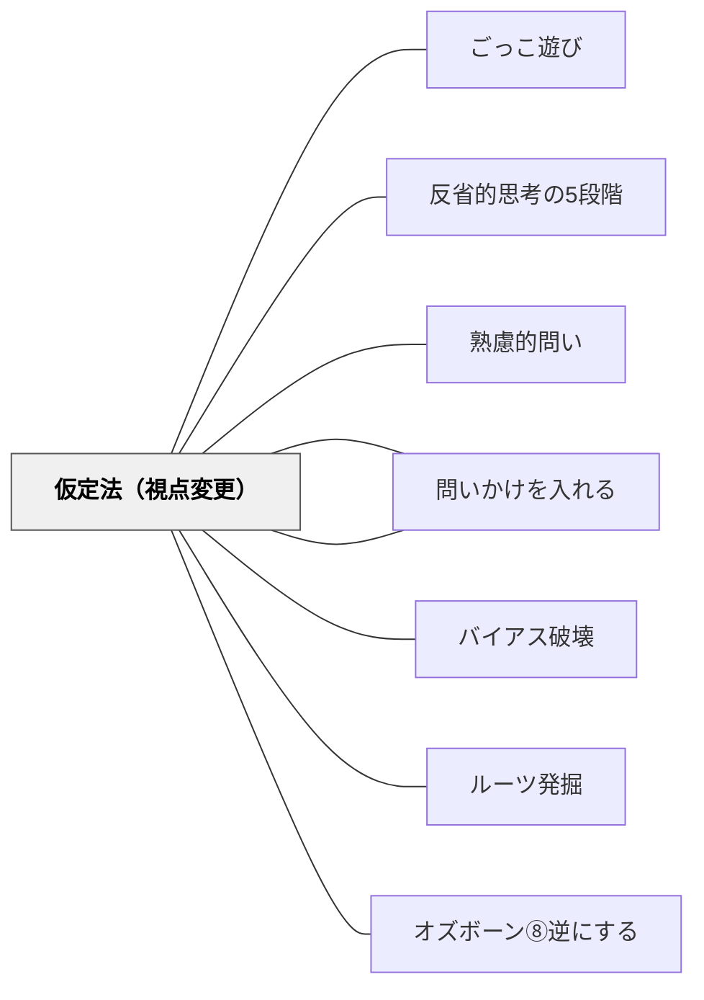

# 仮定法（視点変更）

> 「もし〇〇だったら？」という仮想的な設定によって視点を変える。

## Pattern Connection（安斎勇樹, 2021）

**位置づけの補強**：安斎（2021）は本パタンを「ユサブリモード」（とらわれを揺さぶる問い）の1技法として位置づけ、3バリエーションを体系化している。「もしも」の問いは答えの正誤を問わないため心理的安全性が高まりやすく、とらわれを解放するときに特に有効。

**3バリエーション**

| 種類 | 問いの形 | 例 |
|---|---|---|
| **立場の転換** | もし〇〇の立場だったら？ | 「もしあなたが経営陣だったら？」「もし非ユーザーだったら？」 |
| **制約の撤廃** | もし〇〇がなかったら？ | 「もし失敗してもかまわないとしたら？」「もし予算が無限だったら？」 |
| **架空の物語** | もし〇〇という世界だったら？ | 「もし人類が一歩も外出できない世界になったとしたら？」 |

**立場の転換**は関係性の固定を崩す。**制約の撤廃**は「どうせ無理」という衝動の枯渇を解放する。**架空の物語**は認識の固定化を根本から揺さぶる。4つの現代病（認識の固定化・関係性の固定化・衝動の枯渇・目的の形骸化）のそれぞれに対応させることができる。

**他のパタンへの波及**：仮定法で視点が動いた後は [[パタン/バイアス破壊]] で固定観念の解体を続けるか、[[パタン/ルーツ発掘]] で「なぜその立場からそう見える？」とこだわりを掘り下げることができる。

---

## 背景（Context）
人はある状況に慣れ親しむと、その文脈の中でしか物事を考えられなくなることがある。
仮定法は思考の枠組みそのものを一時的に外すための道具である。
「もし自分が〇〇だったら」「もしこの制約がなかったら」という問いは、新しい可能性の空間を開く。
歴史・科学・倫理・デザインなど、あらゆる領域で反事実的思考は重要な役割を果たす。

## 問題（Problem）
現実の制約や既存の枠組みに縛られた思考では、革新的なアイデアや深い理解が生まれにくい。
学習者が「こうなっているから仕方ない」と思考を止めてしまうことがある。
他者の立場・歴史上の文脈・異なる文化への想像力が欠けると、多角的思考が育まれない。

## 力のかたち（Forces）
- 仮定は現実の否定ではなく、現実を相対化するための足場となる。
- 「もしも」の問いは答えの正誤を問わないため、心理的安全性が高まりやすい。
- 極端な仮定（「もし重力がなかったら？」）は本質的な原理を照らし出す。
- 仮定が遠すぎると現実感が失われ、思考が空虚になるリスクがある。

## 解決（Solution）
「もし〇〇だったらどうなるか？」という仮定法の問いを意識的に授業・対話に組み込む。
「もし自分が歴史上のその人物だったら？」「もしこのルールがなかったら？」など文脈に応じた仮定を設計する。
仮定の答えから「なぜそうなるか」をさらに問うことで、背景にある原理や価値観を掘り起こす。
仮定法の問いを使った後、現実との対比を問うことで、思考が地に足ついたものとなる。

## 結果（Consequences）
固定した視点が揺らぎ、物事の別の見え方・可能性が学習者に見えてくる。
反事実的思考によって、現実の条件や前提への理解が深まる。
創造的・批判的思考の基盤となる「視点の複数性」が育まれる。
答えが複数存在する状況に慣れることで、複雑な問いへの耐性が高まる。

## 関連パタン
- [[パタン/ごっこ遊び]]
- [[パタン/反省的思考の5段階]]
- [[パタン/熟慮的問い]] — 親パタン
- [[パタン/問いかけの見立て]] — ユサブリ（とらわれ）が必要かどうかを判断する前段
- [[パタン/問いかけを入れる]] — 仮定法をユサブリモードとして体系的に位置づける
- [[パタン/バイアス破壊]] — 固定観念を崩す同系のユサブリ技法
- [[パタン/ルーツ発掘]] — 仮定の答えの奥にあるこだわりの源泉へ
- [[パタン/オズボーン⑧逆にする]] — 仮定法の一形式として逆転思考を使う

## クラスター図

## Actionable Insight

- 授業の問いに「もし〇〇だったら？」という仮定バージョンを1つ追加する——心理的安全性が高まり答えを恐れず考えられるようになる
- 仮定の問いへの答えが出た後「では実際の現実と何が違うか？」と問い返す——仮定と現実の対比が、現実の条件・制約への深い理解を生む
- 「もし重力がなかったら？」のような極端な仮定を使って原理を照らし出す——逆説的な設定が本質的な概念を浮き彫りにする

## 出典
- [[文献/熟慮的問いのパターンリスト（動画記録）]]
