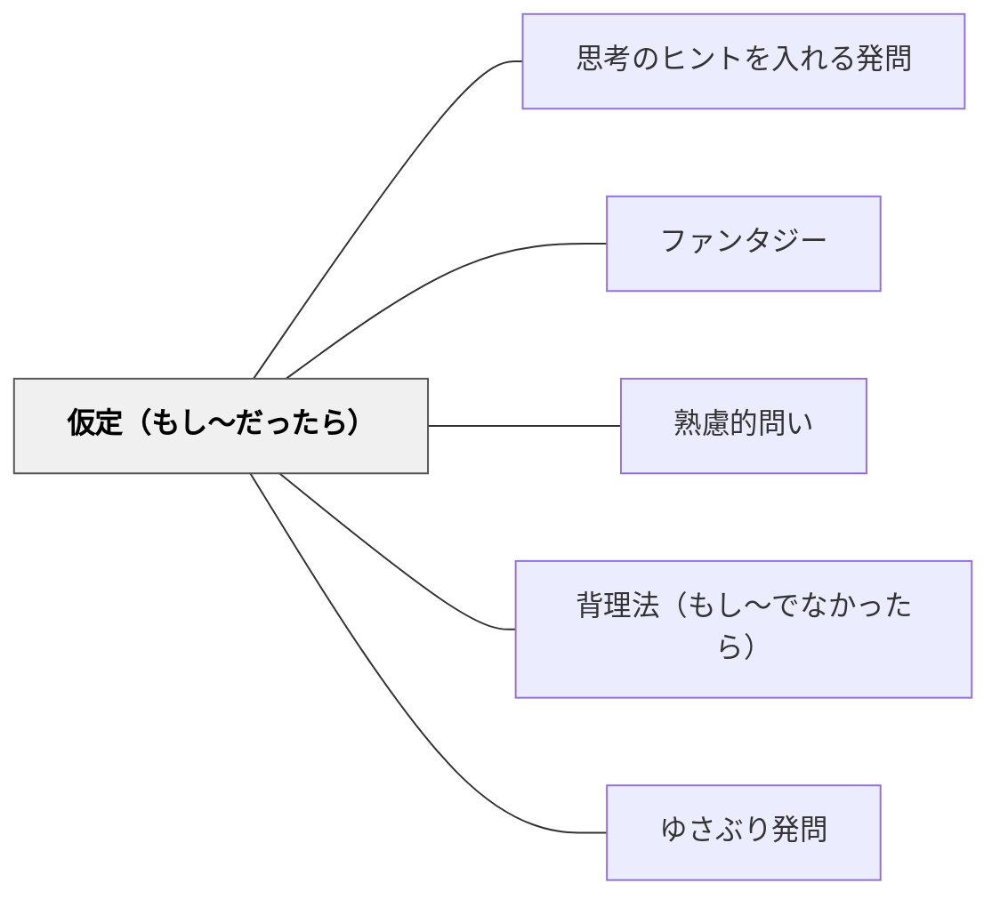

# 仮定（もし〜だったら）

> 「もし〇〇だったら？」と仮想の設定を置いて思考を広げ、反実仮想による探索を促す。

## 背景（Context）
現実の制約を外して「もし〜だったら」と問うことで、学習者は既存の枠組みを超えた思考実験ができる。歴史・科学・文学・倫理など、あらゆる分野で「仮定」の問いが深い洞察をもたらす。

## 問題（Problem）
現実しか見えていないと、可能性や原因・結果の関係を探究する幅が狭まる。仮定の問いがなければ、学習者は「事実の記憶」にとどまり、「もし違っていたら」という創造的・批判的思考に踏み込めない。

## 力のかたち（Forces）
- 仮定は現実から切り離した純粋な思考実験を可能にする
- 「もし〜なら」は答えが一つではなく、多様な意見が出る
- 反実仮想を考えることで、現実の条件・要因の意味が見えてくる
- 想像力・創造力を刺激し、学習への動機を高める

## 解決（Solution）
「もし重力がなかったら、地球はどうなる？」「もしペリーが日本に来なかったら、明治維新はあったか？」「もし主人公が違う選択をしていたら、物語はどう変わる？」と仮定の設定を与えて思考を広げる。仮定を考えた後に「実際はなぜそうではないのか？」と現実に引き戻すことで、事実の意味が深まる。

## 結果（Consequences）
- 原因・条件・結果の関係が深く理解される
- 想像力と仮説的思考力が育ち、創造性の基盤が形成される
- 「もし〜なら」を問い続ける探究心が育つ

## 関連パタン
- [[パタン/思考のヒントを入れる発問]]
- [[パタン/ファンタジー]]
- [[パタン/熟慮的問い]] — 親パタン
- [[パタン/背理法（もし〜でなかったら）]] — 否定的仮定による推論
- [[パタン/ゆさぶり発問]] — 思い込みを揺さぶる

## クラスター図

## Actionable Insight

- 「もし重力がなかったら？」「もし主人公が違う選択をしていたら物語はどう変わる？」と仮定の設定を与えて思考を広げる——反実仮想が現実の条件・要因の意味を深く理解させる
- 仮定を考えた後に「実際はなぜそうではないのか？」と現実に引き戻す——事実の意味がより深まる
- 「もし〜なら」という問いを一単元に一度設計する——多様な意見が出て想像力と仮説的思考力が育つ

## 出典
- [[文献/熟慮的問いのパターンリスト（動画記録）]]
