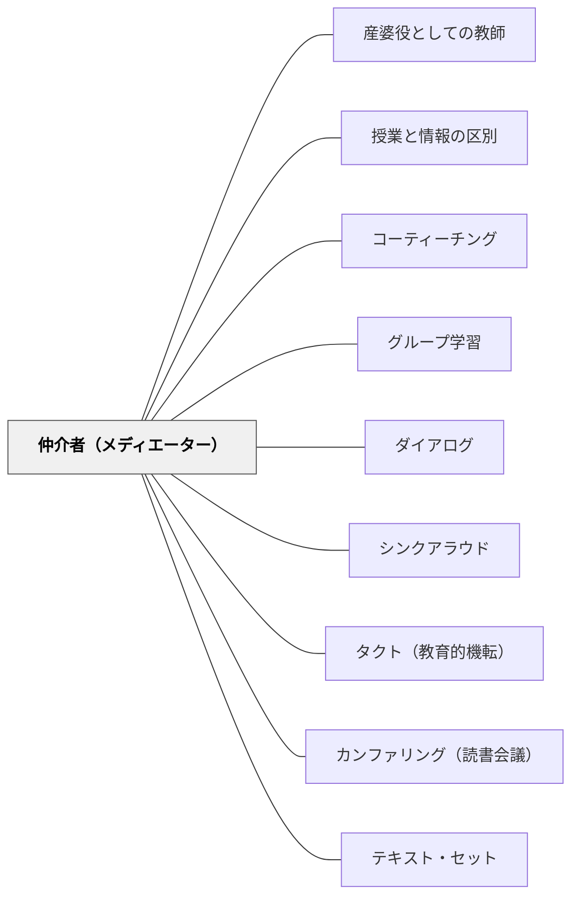

# 仲介者（メディエーター）

> 思考は孤独に起きない。思考が起きるには、必ず「仲介者」が必要だ——人・テキスト・物・問い・芸術作品。仲介者のないところに創造はない。

## [Pattern Connection]

### ドゥルーズ（1990）記号と事件——仲介者（médiateur）論

ドゥルーズは対話・インタビューというフォーマットそのものについて考えながら、思考における「仲介者」の本質的な役割を定式化した：

> 「仲介者が決定的に重要だ。創造とは孤独な行為ではない。ひとつの創造は別の創造に係わることで解放される。科学者は科学者だけに向けて語るのではない。芸術家も芸術家だけに向けて創らない。」——ドゥルーズ（記号と事件）

ドゥルーズはさらに「相互媒介（interférence）」の概念を提示する：科学者にとって数学者が仲介者、芸術家にとって科学者が仲介者……それぞれの領域の創造は、異なる領域との「仲介」によって解放される。これを「仲介者の相互性（réciprocité des médiateurs）」と呼ぶ。

**スピノザの「非哲学的理解」との接続：**
ドゥルーズはスピノザについて次のように述べた：
> 「スピノザは、哲学者でない人々によってのみ理解された最も偉大な哲学者のひとりだ。商人、医師、様々な人々。」

哲学の専門家ではなく「外部の人々」がスピノザの真の仲介者になった——この逆説は、思考の仲介者が「同じ領域の専門家」でなくてよいことを示す。教室において、教師が最も良い仲介者とは限らない。クラスメート・異年齢の他者・日常の物体・芸術作品が仲介者になりうる。

**既存パタンとの関連：**
- **補強点**：[[パタン/産婆役としての教師]] のソクラテス的仲介（知識を産む場を整える）が、ドゥルーズ的「仲介者」概念で再定式化される——教師は「知識を生み出す仲介者」であって「知識を渡す人」ではない。
- **接続点**：[[パタン/コーティーチング]] や [[パタン/グループ学習]] は、学習者同士が互いの「仲介者」になる構造。
- **波及するパタン**：[[パタン/授業と情報の区別]] — 「授業型の問い」が仲介者として機能する；[[文献/記号と事件（ドゥルーズ）]] — 本統合の出典

---

## 背景（Context）

「思考は個人の頭の中で起きる」という前提が、教育における多くの誤りの源泉になっている。個人の「理解」「能力」「才能」に焦点を当て、思考を孤独な認知活動として捉える。

しかしドゥルーズが示すように、思考・創造は常に「仲介者」との関係で起きる。科学的発見は数学的ツールとの仲介で起きた。芸術の突破は異分野との接触で起きた。子どもの概念形成は、仲間・教師・テキスト・身体的経験との仲介で起きる。

仲介者とは単なる「ヒント」や「ヘルプ」ではない——思考の「触媒」であり、思考が起きる「場」を作る存在だ。仲介者なしには、思考は起きない。

## 問題（Problem）

授業を「教師→生徒」の一方向の知識伝達として設計するとき、教師だけが「仲介者」の役割を引き受け、他の多様な仲介者の可能性が閉じる。

- クラスメートが仲介者になる機会が少ない
- 異年齢・異分野との接触が「特別活動」にとどまる
- テキスト・物・芸術作品を「正解の器」として使い、「仲介者」として使わない
- 教師が「知識の源泉」として機能し、「思考の触媒」として機能しない

## 力のかたち（Forces）

- 「教師＝知識の供給者」という役割規範が強い
- 一斉授業形式では教師以外が「仲介者」になる場が少ない
- 「正解を持っている教師」から「まだ持っていない生徒」への伝達が自然な流れに見える
- 多様な仲介者（物・テキスト・他者）を設計するには意図的な準備が必要
- 「仲介が起きているかどうか」は測定しにくく、評価されにくい

## 解決（Solution）

**教師以外の多様な仲介者——クラスメート・異分野のテキスト・実物・問い・芸術作品——を意図的に授業に配置し、思考がその仲介を通じて起きるように設計する。**

---

### 具体例①：仲介者の種類と教室での設計

| 仲介者の種類 | 教室での設計 |
|---|---|
| **人（クラスメート）** | 「Aさんはどう考えた？その考えを聞いて自分の考えはどう変わった？」 |
| **人（教師）** | 「答えを教えない代わりに、問いを変える・視点を加える」 |
| **テキスト** | 「この文章を読んで、自分の考えとどこが合う/違う？」 |
| **実物・物体** | 「実際に触って確かめた後、概念を言葉にする」 |
| **問い** | 「これが問いだ。仲介者としての問いと向き合う時間を作る」 |
| **芸術作品** | 「この絵・詩を見て/読んで、何が起きた？それを概念化する」 |
| **異分野の人** | 「算数の問題を、音楽の視点から考える」 |
| **異年齢の人** | 「1年生に説明するつもりで考える——仲介者としての1年生を想定する」 |

---

### 具体例②：ドゥルーズ的ペア学習——「相互媒介」

ドゥルーズの「仲介者の相互性」——AがBの仲介者になり、BがAの仲介者になる——を授業に実装する：

- 「Aさんの考えをBさんが自分の言葉で説明する。次にBさんの考えをAさんが説明する」
- 「説明し合ったあと『自分の考えはどう変わったか』を書く」
- 一方向の「教え合い」ではなく「お互いが仲介者になる」という設計

---

### 具体例③：教師が「仲介者」として機能するとき

教師が「仲介者（médiateur）」として機能するのは、「知識を渡すとき」ではなく：

- 「子どもの考えを別の子どもへとつなぐとき」（思考の架け橋）
- 「子どもの考えに新しい視点・問い・素材を加えるとき」（触媒）
- 「子どもが行き詰まっている思考に、別の入り口を見せるとき」（仲介の切り替え）
- 「子どもの発言を概念的な言語に変換して返すとき」（言語化の補助）

これらは「正解を教える」行為とは根本的に異なる。

---

### 具体例④：物・テキストを「仲介者」として使う

「分数1/2と1/3の比較」の授業：
- 情報型：「1/2 > 1/3 です。なぜなら分母が小さいほど……」（教師が情報を渡す）
- 仲介者型：「折り紙を半分に折ったものと3つに折ったものを用意する」（物が仲介者）→「どちらが大きい？」（問いが仲介者）→「Aさんはどう確かめた？」（クラスメートが仲介者）→「これを記号で表すと……」（教師が概念化の仲介者）

---

## 結果（Consequences）

- 思考が「教師→生徒」の一方向でなく、多方向の仲介ネットワークとして起きる
- 教師が「不在」のときも思考が起きる文化が育つ（仲介者が複数あるため）
- 「答えを知っている人に聞く」のではなく「仲介者と向き合う」という学習習慣が育つ
- クラスメートへの「聞く・つなぐ・変換する」能力が自然に発達する

## 関連パタン

- [[パタン/産婆役としての教師]] — 仲介者としての教師の最も古い哲学的定式化
- [[パタン/授業と情報の区別]] — 授業型の問いが仲介者として機能する
- [[パタン/コーティーチング]] — 複数の教師が仲介者になる
- [[パタン/グループ学習]] — 学習者同士が仲介者になる設計
- [[パタン/ダイアログ]] — 「仮定を宙吊りにする」対話は仲介者的機能を持つ
- [[パタン/シンクアラウド]] — 教師の思考を声にすることで「思考プロセスの仲介者」になる
- [[パタン/タクト（教育的機転）]] — 仲介の「切り替え」を今この瞬間に判断する実践知
- [[パタン/カンファリング（読書会議）]] — 1対1での思考の仲介
- [[パタン/テキスト・セット]] — 複数テキストを「思考の仲介者」として配置する
- [[概念/ドゥルーズと出来事の哲学]] — 仲介者論の哲学的基盤

## クラスター図

## Actionable Insight

- 今週の授業で「教師以外の仲介者は何か？」を設計前に問う——クラスメート・テキスト・物体・問いのどれかを仲介者として意識的に配置する
- 子どもが「答えを教師に求める」ときに「Aさんはどう考えた？」とクラスメートへの仲介を返す——「教師が唯一の仲介者」という構造を壊す
- 「Bさんの考えを自分の言葉で言い換えてみて」という活動を1回/週入れる——学習者が互いの「仲介者」になる練習

## 出典

ドゥルーズ，G．（宮林寛訳）（1992）．『記号と事件——1972-1990年の対話』河出書房新社．（原著: Deleuze, G. (1990). *Pourparlers, 1972-1990*. Minuit.）

> 「仲介者が決定的に重要だ。創造とは孤独な行為ではない。ひとつの創造は別の創造に係わることで解放される。」——ドゥルーズ（記号と事件）
