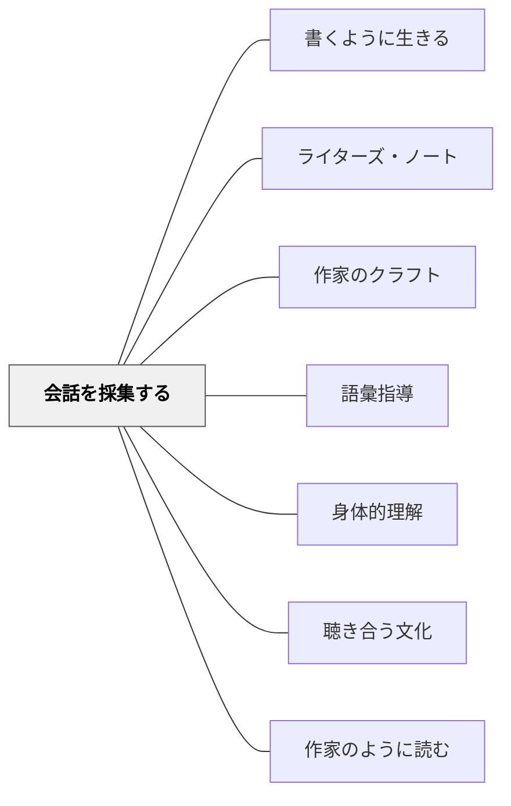

# 会話を採集する

> 人の話し方は、その人のすべてを語る。作家はその「会話の断片」に魅了され、書き留める。

## Pattern Connection

**Fletcher（1996）A Writer's Notebook Chapter 6 "Snatches of Talk" 統合（2026-06-02）**

フレッチャーはライターズ・ノートの章のひとつを「会話の断片（Snatches of Talk）」に丸ごと割く。

> 「Writers are fascinated by talk, obsessed with what people say and how they say it, how they interrupt themselves, the words they repeat, the way they pronounce or mispronounce certain words. The way we talk says a ton about who we are.」——Fletcher（1996）

「何を言うか」だけでなく「どのように言うか」——言葉の選択・繰り返し・発音・言い間違い——がキャラクターを映し出す。ノートには、親族の会話、子どもの言葉、見知らぬ人の会話、地域特有の表現などが積み重なる。

**Naomi Shihab Nye の実践（Fletcher 1996 所収）：**
詩人の Nye は息子 Madison の言葉をすべて書き留め続けた。生後11ヶ月での最初の文（"Daddy, bed hot, off."）から、多くの詩・エッセイの種がここから生まれた。「書き留めなければ5つか10しか覚えていない」——会話の採集は記録であり、素材であり、愛の行為でもある。

**「耳のトレーニング」：**
「耳のトレーニング（ear for dialogue）」はできる。多くの人は「何を言おうとしているか」に注目するが、作家は「実際にどんな言葉が口から出たか」に注目する。聞き方を変えることで、採集の精度が上がる。

- **既存パタンとの関連**：[[パタン/作家のクラフト]] の「対話（Dialogue）」が対話の書き方の技法を扱うとすれば、本パタンは対話の素材をどう集めるかを扱う——素材採集と技法使用の分業
- **補強された点**：[[パタン/ライターズ・ノート]] の「エントリータイプ」に「会話の採集」が独立した実践として追加される
- **他のパタンへの波及**：[[パタン/語彙指導]] — 採集した言葉の多様性が語彙の感覚を育てる；[[パタン/二物衝撃]] — 「こんな言葉がある」という発見がモノとモノの取り合わせと同じ驚きを生む

---

## 背景（Context）

子どもが書く対話はしばしばステレオタイプになる。「「こんにちは」「こんにちは」「今日は何をしますか」」——現実の会話の豊かさが失われる。また「対話を書こう」と言っても、「現実の人は実際にどんな言い方をするか」という観察の機会がなければ、書けない。

会話の採集は、現実の言葉の多様性・個性・ユーモア・悲しみへの気づきを育てる。採集した「本物の会話」がのちに作品の中に活きる。

## 問題（Problem）

「現実の人がどんな言葉を使うか」への無感覚が、書く対話を紋切り型にする。また「耳を澄ます」という経験がないため、言葉の個性・地域性・世代差に気づく機会がない。

## 力のかたち（Forces）

- 現実の会話は「意図して採集する」前には流れ去ってしまう
- 「どんな言葉を使うか」はその人のキャラクターを凝縮している
- 子どもの言葉・祖父母の言葉・地域の言葉はそれぞれ違う——その違いが書く素材になる
- 「聞く」ことは「書く」ことと同じくらい能動的な行為だが、「聞く練習」はされにくい
- 採集した会話を「作品に使う」前に、まず「採集すること自体を楽しむ」段階が必要

## 解決（Solution）

**ライターズ・ノートの中に「会話採集」のページを設ける。日常の中で聞いた印象的な言葉・言い回し・会話の断片を書き留める習慣をつくる。**

---

### 実践1：「耳を澄ます時間」（Snatches Collecting）

Fletcher の提案：

1. **公共の場所（食堂・バス・廊下）に行き、静かに座る**
2. 数分後、人々は気にしなくなり話し始める
3. **聞こえた言葉をノートに書き留める**（全部でなくていい——印象的な一文だけでも）

教室での応用：
- 昼食時間・休み時間・登下校中に「気になった言葉」をノートに書く
- 「今日聞いた一番面白い（または変な）言葉は？」を週1回共有する

---

### 実践2：子どもの言葉を採集する（Fletcher の例）

Fletcher は息子の言葉を長年にわたって書き留めた。

子どものことばの特徴：
- 大人の言葉を借りて新しい意味で使う（"puffing up"）
- 言葉を間違って覚えてより詩的になる（"nightmirror" ← nightmare）
- 大人が気づかない鋭い観察が出る

**授業への応用**：
- 「自分が小さかったとき、自分や兄弟が使っていた変わった言葉はある？」
- 「家族がよく使う独特の表現（家族語）を集めよう」
- 「この地域にしかない言い方を探そう」

---

### 実践3：会話の採集→キャラクター描写へ

採集した会話を、小説・物語の「キャラクターの声」に変換する練習：

1. ノートから「印象的な言い方をする人物」を一人選ぶ
2. その人物に「どんな状況でその言葉を使ったか」を追記する
3. 「この人物が他の場面でも話すとしたら、どう話すか」を書いてみる

---

## 結果（Consequences）

- 「対話を書く」技術が上がる——現実の多様な言い方を知っているから
- 言葉への感受性が育つ——「その人らしい言葉」に気づく目（耳）ができる
- 書くことと聴くことが一体化し始める——「聴くことも作家の仕事」という意識が生まれる
- 地域語・家族語・世代語の多様性への気づきが生まれる

## 関連パタン

- [[パタン/書くように生きる]] — 耳を澄ます行為が「書くように生きる」の実践形態
- [[パタン/ライターズ・ノート]] — 会話採集はノートのエントリータイプのひとつ
- [[パタン/作家のクラフト]] — 採集した会話を「対話の技法」として昇華させる
- [[パタン/語彙指導]] — 採集した言葉の多様性が語彙感覚を育てる
- [[パタン/身体的理解]] — 耳で「聴く」という身体的行為が書く素材になる
- [[パタン/聴き合う文化]] — 会話採集は「聴くことの価値」を書く文脈で実感させる
- [[パタン/作家のように読む]] — 読む目と同様に、聴く耳を作家として持つ
- [[文献/A Writer's Notebook（Fletcher）]] — 本パタンの出典（Chapter 6）

## クラスター図

## Actionable Insight

- **「今週のスナッチ」を導入する**：毎週月曜日の朝、「先週聞いた面白い・変な・心に残った言葉を一つ書いて」と問う。教師が自分の採集例を共有するとモデルになる
- **「家族語辞典」プロジェクト**：自分の家族だけが使う言葉・表現を集めてくるミニプロジェクト——語彙の個性と地域性が見えてくる
- **「言い間違いコレクション」を楽しむ**：「nightmirror」（nightmare）のように、子どもや家族が間違って使った言葉で詩的になったものを集める——誤りを価値として扱う習慣

## 出典

Fletcher, R. (1996). *A Writer's Notebook: Unlocking the Writer Within You*. HarperCollins.

> 「The way we talk says a ton about who we are.」——Fletcher（1996）
