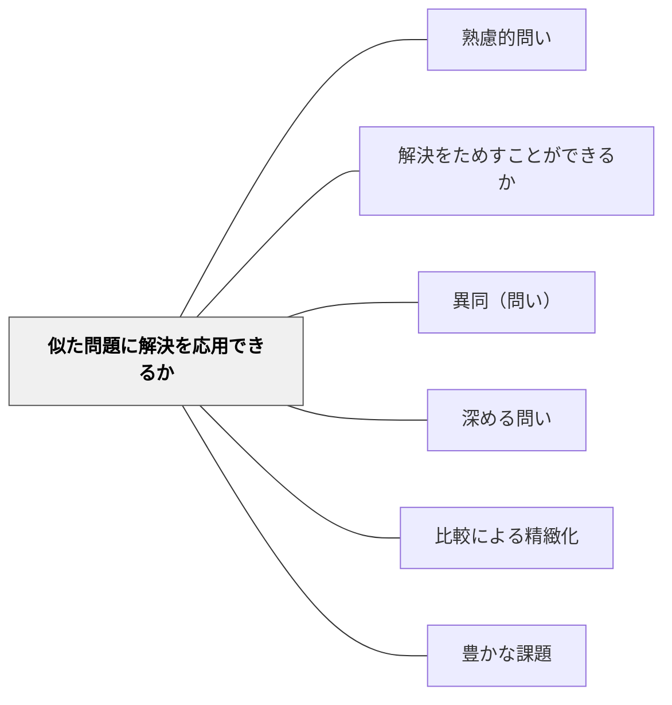

# 似た問題に解決を応用できるか

> この解き方を別の問題でも使えるか、と問うことで転移と応用を促す。

## 背景（Context）
問題を一つ解いたとき、その解法は「その問題だけの答え」になりがちである。解法を一般化し、類似の問題に適用できるかどうかを意識させなければ、学びは個別の経験にとどまり、知識の転移が起きない。

## 問題（Problem）
学習者は解いた問題の解法を他の問題に応用することを自発的に試みにくい。「解けた」という達成感で満足してしまい、解法の一般性・応用可能性に気づかないまま次に進んでしまう。

## 力のかたち（Forces）
- 解法を一般化する意識がなければ転移は起きない
- 類似点を見つけることそのものが高度な思考活動である
- 応用の失敗も重要な学習機会になる
- 成功体験を土台に挑戦意欲が高まる

## 解決（Solution）
「この解き方、別の問題でも使えそうか？」「似た問題を作れるか？」と問いかけ、解法の一般化と応用を促す。たとえば、比の問題を解いたあとに「速さの問題にも同じ方法を使えるか考えてみよう」と問う。解法のどこが汎用的で、どこが特殊かを議論させることも有効。

## 結果（Consequences）
- 学んだ知識・解法が他の文脈に転移しやすくなる
- 解法の本質的な構造を理解する力が育つ
- 自ら問題を見つけ、応用しようとする主体的な学びが生まれる

## 関連パタン
- [[パタン/熟慮的問い]] — 親パタン
- [[パタン/解決をためすことができるか]] — 検証から応用へ
- [[パタン/異同（問い）]] — 類似点・相違点を見る

- [[パタン/深める問い]] — 応用可能性への問いが理解を深める
- [[パタン/比較による精緻化]] — 類似問題の比較が解法の精緻化を生む
- [[パタン/豊かな課題]] — 応用問題が豊かな課題の発展形になる
## クラスター図

## Actionable Insight

- 問題を解いた後に「この解き方を使えそうな他の問題を自分で作ってみよう」と促す——解法の一般化と応用を自分で試みる経験が転移力を育てる
- 「この解法のどこが汎用的で、どこがこの問題固有か」を話し合う——解法の本質的な構造への理解が応用範囲の意識を育てる
- 単元末に「この単元で学んだ解法が使える場面・使えない場面を1つずつ挙げよう」と問う——転移の可否を意識させることで知識の射程が明確になる

## 出典
- [[文献/熟慮的問いのパターンリスト（動画記録）]]
- ジョージ・ポリア（1954）『いかにして問題をとくか』丸善出版
