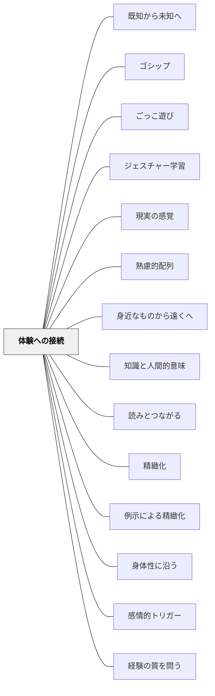

# 体験への接続

## 背景（Context）

[[パタン/精緻化]] によって、学んだ知識を「生きた理解」にしたい。どれだけ論理的に整合した知識でも、それが「自分の人生・体験・感情」と結びついていなければ、学習者にとって「他人事の知識」として処理されやすい。

## 問題（Problem）

知識が自分の体験から切り離されたまま学ばれると、「学校でだけ使う知識」になる。教室の外で同じ状況に出会っても、その知識を取り出す手がかりがない。学びが転移しない。

## 力のかたち（Forces）

- 感情を伴って経験したことは、記憶に残りやすく（情動的エンコーディング）、引き出しやすい
- しかし「体験と関係づけなさい」という指示だけでは、関係づけが浅いまま終わることがある
- 個人的な体験は多様なため、全員に共通する体験の枠組みを設計しにくい
- 自己開示的な体験の共有はリスクを伴う場合があり、心理的安全が前提になる

## 解決（Solution）

**新しく学んだ概念・出来事・技術を、自分の過去の体験・感情・生活と意識的に結びつける。**

「あのとき感じたことはこれだった」「自分の○○な経験はまさにこのパタン」という接続の瞬間が生まれると、知識は「自分の一部」として取り込まれる。

**実践例：**
- 国語で登場人物の「悔しさ」を学んだ後：「自分が同じように感じたのはいつ？」と問う
- 「権力の分散」を学んだ後：「自分のクラスや家庭で同じ問題が起きたことはある？」
- 算数の「比例」を学んだ後：「自分の生活で比例の関係にある2つのものを探す」
- 理科の「食物連鎖」を学んだ後：「自分が食べたものを一つ選んで、食物連鎖をさかのぼる」
- 体育の「コンビネーション」を学んだ後：「自分がうまくいったプレーを一つ思い出してみよう」

**「体験への接続」は強制できない。「思い浮かんだ人は」「もし思い当たることがあれば」というように、任意・選択的に設計することが大切。**

## 結果（Consequences）

- 知識が「自分の物語」の一部に組み込まれ、必要な場面で取り出しやすくなる（転移）
- 学習が「課題のため」ではなく「自分を理解するため」という意味づけをもつようになる
- 個人の体験が教室で共有されることで、他者への共感・多様な視点の獲得につながる

## クラスター図

## Actionable Insight

- 新しい概念を学んだ後「自分の生活の中で同じような場面はあるか」と問う——「思い浮かんだ人は」という任意の問いが心理的安全を保つ
- 登場人物の感情を学んだ後「自分が同じように感じたのはいつ？」を1文書かせる——個人の体験が知識を「自分の物語」の一部にする
- 単元の最後に「学んだことと自分の体験をつなげて1文書く」活動を入れる——接続の言語化が知識の転移を促す

## 出典

- 一つの教育のパタン・ランゲージ（岩井輝久）

## 関連パタン
- [[パタン/既知から未知へ]]
- [[パタン/ゴシップ]]
- [[パタン/ごっこ遊び]]
- [[パタン/ジェスチャー学習]]
- [[パタン/現実の感覚]]
- [[パタン/熟慮的配列]]
- [[パタン/身近なものから遠くへ]]
- [[パタン/知識と人間的意味]]
- [[パタン/読みとつながる]]

- [[パタン/精緻化]] — 親パタン：知識をネットワーク化する学習原理
- [[パタン/例示による精緻化]] — 体験は自分にとって最もリアルな「例」になる
- [[パタン/身体性に沿う]] — 身体的な体験への接続は特に記憶・理解と結びつきやすい
- [[パタン/感情的トリガー]] — 感情を動かす体験が接続の起点になる
- [[パタン/経験の質を問う]] — 体験への接続そのものが「よい経験」を作る行為
- [[パタン/語りによる精緻化]] — 体験を語ることでさらに深まる
