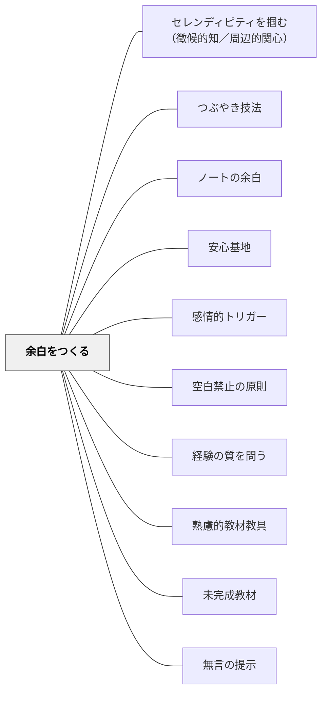

# 余白をつくる

## 背景（Context）

学校の授業はカリキュラム・時間割・指導要領などの制約によって、つめこみがちになる傾向がある。しかし、子どもたちの学びには、内面の動きを受け止めたり、創造的な働きかけが起こったりする「**間（ま）**」が必要である。

## 問題（Problem）

予定された活動や教材をこなすことに集中しすぎると、子どもたちが自分のペースで考えたり、感情や気づきを表現したりする時間がなくなる。その結果、学びが表層的なものになったり、「置いていかれる」感覚を抱いたりしやすくなる。

## 力のかたち（Forces）

- 子どもは一人ひとり異なるスピードや関心を持っている
- 「考えが浮かぶ」には、情報処理よりも「待つ」「感じる」ことが必要なこともある
- 予期しない発見やつぶやきが、深い学びのきっかけになる
- 忙しさが教員にも子どもにも余裕を奪ってしまう

## 解決（Solution）

あえて**活動や教材に「余白（スペース）」を設ける**。時間・空間・構造・やりとりなど、さまざまなレベルでの余白を意識的に確保することで、子どもが「内的な動き」や「自発的な表現」をしやすくする。

**具体的な余白の作り方：**
- 黙って考える1分間の「考える時間」を挿入する
- あえて指示を細かくしすぎず、子どもの試行錯誤を許す設計にする
- ワークシートに「自由記述欄」を設ける
- 読み聞かせのあとに何も言わず静かに余韻を味わう時間をとる
- 授業の最後に「ふりかえり」「質問コーナー」「自由に発表していい時間」を置く
- 美術の授業で「途中で歩き回って作品を見て回ってもいい」と許可する

## 結果（Consequences）

子どもたちが自分のリズムや興味で学びを深めたり、他者の意見に耳を傾けたりしやすくなる。「ちゃんとわかった」「納得した」という感覚や、「もっと考えたい」という内発的動機づけが生まれやすくなる。教室の空気にゆとりが生まれ、創造性や対話の可能性も高まる。

> 「余白」とは「空白」ではなく、「意味が立ち上がる可能性を開く場」である。

教師の「しゃべりすぎ」や「指示のしすぎ」は、無意識に余白を埋めてしまう。あえて「余白を設ける」という選択には、教師自身の勇気と信頼が必要。

## 関連パタン
- [[学級経営/オンボーディング]]
- [[特別支援/特別支援級の算数指導]]
- [[実践/個別支援級の複式算数：重さと面積をわたり・ずらしで学ぶ]]
- [[実践/読み語りの実践]]
- [[パタン/セレンディピティを掴む（徴候的知／周辺的関心）]]
- [[パタン/つぶやき技法]]
- [[パタン/ノートの余白]]
- [[パタン/安心基地]]
- [[パタン/感情的トリガー]]
- [[パタン/空白禁止の原則]]
- [[パタン/経験の質を問う]]
- [[パタン/熟慮的教材教具]]
- [[パタン/未完成教材]]
- [[パタン/無言の提示]]

### 下位パタン
- [[パタン/沈黙の間の設計]] — 発問・読み語りの後に意図的な沈黙の時間を設ける
- [[パタン/未完成教材]] — 教材に意図的な「空き」を残し学習者が埋める

### 関連
- [[パタン/発問を問いにしない]] — 問わないことで思考の余白を生む
- [[パタン/身体性に沿う]] — 身体が動く・感じる余白を設ける
- [[パタン/熟慮的教材教具]] — 余白のある教材設計
- [[パタン/アドベンチャー]] — 余白の中に冒険・挑戦を組み込む
- [[概念/確率と偶然性の教育]] — 偶然が起こりやすい場をつくる設計

## クラスター図

## Actionable Insight

- 発問の後に「5秒間、黙って待つ」を1回意識的に試す——この沈黙の間が子どもたちの思考を引き出す最も単純な余白の設計
- ワークシートの最後に「自由記述欄」を1行分だけ残す——空白があると「自分の言葉で何か書きたい」という内発的動機が生まれる
- 読み聞かせや資料提示の後に、何も言わず30秒だけ待つ——教師が先に話すことで余白が消える。黙ることが余白をつくる最初の一歩

## 出典

- パタン集/余白をつくる.md
