# 余計な難しさを外す（構成概念に無関係な分散）

> ルビを振る、読み上げる、時間を延ばす——それは甘やかしではない。測ろうとしていないものが邪魔をしているのを取り除く、妥当性の回復である。ただし、何を測ろうとしているのかを決めない限り、どの配慮が正しいかは決まらない。

## [Pattern Connection]

- **既存パタンとの関連**：[[パタン/測れていないものを疑う（構成概念の過少代表）]] と対をなす。あちらは評価が**狭すぎる**脅威、本パタンは**広すぎる**脅威。Messick は「両脅威はすべてのアセスメントで作動している」と書いており、**同じ1枚のテストが、焦点の構成概念を過少代表しながら同時に無関係な分散で汚染されている度合い**が、妥当化の主要な関心事になる
- **[[特別支援/インクルーシブ教育]] への理論的な裏づけ（本パタンの中心）**：合理的配慮は「困っている子への思いやり」として語られることが多い。本パタンはそれを**測定の理屈**に置き換える。配慮とは、測ろうとしていない構成概念（読解・書字・処理速度）がスコアに混入しているのを取り除く操作であり、公平さの問題であると同時に**妥当性の問題**である。この置き換えによって、教師は「なぜこの配慮をするのか」を、恩恵ではなく設計として説明できるようになる
- **[[パタン/算数の公平性]] への補強**：ステレオタイプ脅威も、Messick の枠組みでは無関係な難しさの一種として読める。焦点の構成概念（算数の力）と無縁な要因（性別・所属の想起）が、特定の集団にとってだけ課題を難しくしている。Boaler の対処（性別欄の削除、メッセージの変更）は、無関係な難しさを外す操作そのものである
- **[[パタン/バイアス破壊]] との関係**：あちらは学習者の思い込みに穴を開ける問い。本パタンは**評価する側の設計に埋め込まれたバイアス**を扱う。Messick は無関係な難しさを「採点と解釈におけるバイアスの主要な源泉、テスト使用における不公平の主要な源泉」と名指しし、DIF（項目機能差）分析が探している主犯だとする
- **修正点**：この Wiki の評価パタン群は「見取りの精度」を上げる方向に厚い。本パタンは、**精度を上げる前に測定を汚しているものを取り除く**という順序を立てる。汚染されたまま精度を上げると、汚染の測定精度が上がる
- **自己教育への波及**：独学では、配慮を自分にかけるかどうかを自分で決めることになる。解答を見る・電卓を使う・時間をかける——これらが妥当性の回復なのか、測りたいものを消しているのかは、そのとき何を測ろうとしていたかで変わる

## 背景（Context）

Messick（1994）が挙げる構成概念妥当性への二大脅威の、もう一方がこれである。

> In the threat to validity known as "construct-irrelevant variance," the assessment is too broad, containing excess reliable variance associated with other distinct constructs as well as method variance such as response sets or guessing propensities.
> （「構成概念に無関係な分散」として知られる妥当性への脅威では、アセスメントが広すぎて、別の構成概念に関わる余分な信頼できる分散や、反応セット・あてずっぽうの傾向のような方法分散を含んでいる。）

「余分な信頼できる分散」という言い方が重要である。これはランダムな誤差ではない。**安定して繰り返し現れる**。だから何度測っても同じ結果が出て、信頼性の指標はむしろ良く見える。読みが苦手な子は、何度算数のテストを受けても同じように低い点を取る。安定しているので、教師はそれを「その子の算数の力」だと読む。

Messick はこれを二種類に分ける。ここが本パタンの骨格になる。

**無関係な難しさ（construct-irrelevant difficulty）**——課題のうち焦点の構成概念とは無縁な側面が、一部の個人・集団にとって課題を不当に難しくする。Messick が挙げる例は、**教科知識のテストに過度の読解要求が紛れ込む**ことである。結果として、影響を受けた人のスコアは**不当に低くなる**（読みが苦手な子の知識スコア）。

**無関係な易しさ（construct-irrelevant easiness）**——項目や課題の形式にある余計な手がかりによって、構成概念とは無関係な仕方で正答できてしまう。Messick の例は、読解問題の文章が一部の読者によく知られている場合、視奏課題の楽譜が一部の演奏者にとって弾き慣れたものである場合である。結果としてスコアは**不当に高くなる**。

この二つは非対称に扱われがちである。無関係な難しさは「配慮が足りない」として問題になるが、無関係な易しさはめったに問題にされない。**点が高く出ることは、誰も困らないからである。** しかし妥当性の観点では同じ壊れ方であり、しかも易しさのほうは、その子ができるようになったという誤った判断を通して、次の指導を歪める。

## 問題（Problem）

**測ろうとしていないものが、点数に混ざっている。混ざっていることは、点数を見ても分からない。**

算数の文章題テストで20点だった子がいる。この点数から読み取れることは、実は非常に少ない。可能性は少なくとも四つある。

1. 算数の力が育っていない（**構成概念に関連する差**）
2. 問題文が読めていない（**無関係な難しさ**）
3. 何を問われているかは分かったが、答えを書く欄の形式に合わせられなかった（**無関係な難しさ・方法分散**）
4. 時間内に処理しきれなかった（**無関係な難しさ**）

このうち1だけが、その子の算数の指導を変えるべき理由になる。2〜4は、測定の問題であって、算数の指導の問題ではない。にもかかわらず、点数は四つを区別しない。そして教師の次の手立ては、たいてい「算数の補充」になる。

Messick はこの区別を、帰結の側から二つの禁則として述べる。

> low scores should not occur because the assessment is missing something relevant to the focal construct that, if present, would have permitted the affected persons to display their competence. Moreover, low scores should not occur because the measurement contains something irrelevant that interferes with the affected persons' demonstration of competence.
> （低い点数は、評価が焦点の構成概念に関連する何かを欠いていて、それが存在していればその人が有能さを示せたはずだ、という理由で生じてはならない。さらに、低い点数は、測定が無関係な何かを含んでいて、それがその人の有能さの発揮を妨げる、という理由で生じてもならない。）

前半が [[パタン/測れていないものを疑う（構成概念の過少代表）]]、後半が本パタンである。二文がひと続きで書かれていることが、この二つを一緒に点検すべき理由になっている。

そしてもうひとつ、厄介な問題がある。**豊かな文脈を持つ課題ほど、この脅威は強くなる。** Messick は Wiggins を引く。

> "paradoxically, the complexity of context is made manageable by contextual clues" (Wiggins, 1993, p. 208). And it matters whether the contextual clues that are responded to are construct-relevant or represent construct-irrelevant difficulty or easiness.
> （逆説的に、文脈の複雑さは文脈的手がかりによって扱いやすくなる。そして、反応されている文脈的手がかりが構成概念に関連するものなのか、それとも無関係な難しさ・易しさを表すものなのかが問題になる。）

現実世界を模した「真正な」課題は、子どもを助ける手がかりを大量に含んでいる。買い物の場面、給食の献立、運動会の記録。子どもはその文脈に反応して答えを出す。**そのとき反応している手がかりが、測ろうとしている構成概念に属するものなのか、それとも生活経験の差なのかは、課題を真正にすればするほど見分けにくくなる。** 真正さは妥当性を自動的に高めない。

## 力のかたち（Forces）

- **公平さの二つの像**——「全員に同じ条件を」と「全員が力を発揮できる条件を」。前者は手続きの公平、後者は測定の公平であり、両立しない場面がある。時間延長を認めれば条件は同一でなくなるが、認めなければ処理速度が知識の点数に混ざり続ける。**どちらも公平さの主張であり、どちらかが不誠実なのではない**
- **配慮が易しさに転じる境界**——同じ操作が、場面によって妥当性の回復にも破壊にもなる。算数の文章題を読み上げれば算数の力が見えるようになるが、読むことそのものを測る場面で読み上げれば、測ろうとしているものが消える。境界は操作の側にはなく、**その場面で何を測ろうとしているか**の側にある
- **説明可能性**——「あの子だけ読んでもらっている」は、子どもからも保護者からも同僚からも出る。恩恵として説明すると必ず不公平に見える。測定として説明すると理解されうるが、そのためには「今回は何を測っているか」を教師が言葉にできていなければならない
- **何を測るかを言葉にするコスト**——本パタンは配慮リストから始まらない。まず構成概念を言葉にするところから始まる。この工程は毎回は回らないので、単元単位・評価場面単位で回す設計にする必要がある
- **配慮の記録と評定の整合**——配慮つきで取った点数を、配慮なしの点数と同じ欄に並べてよいか。妥当性の理屈では並べてよい（同じ構成概念を測っているから）。しかし運用上は、何をどう外したかの記録が残っていないと、翌年の担任が判断できない
- **無関係な易しさは誰も困らない**——点が高く出ることに異議は出ない。だから易しさは放置されやすく、その結果として「できるようになった」という誤った判断が次の指導を歪める
- **真正さと診断可能性の衝突**——文脈を豊かにするほど参加できる子は増えるが、何に反応して答えたのかは読みにくくなる。逆に文脈を剥ぐと診断はしやすいが、剥いだ形式そのものが別の無関係な難しさ（抽象度・記号への慣れ）を持ち込む

## 解決（Solution）

**まず「この評価で何を測ろうとしているのか」を1文で書く。次に、その構成概念に属さないのに点数に効いている要因を洗い出す。読む・書く・速さ・形式への慣れ・題材の既知性。そのうえで、属さない要因を外す（難しさ側）か、効かないようにする（易しさ側）。配慮を先に選ばない。構成概念を先に決める。**

順序が決定的である。本パタンは「配慮リスト」ではなく、**手順**として使う。

### 手順1：この場面で測っているものを1文で書く

「算数の文章題」ではなく「場面から数量の関係を取り出し、演算を決めて処理できる」。「音読テスト」ではなく「文字列を音声に変換する正確さと速さ」。ここが書かれていないと、次の手順が判定不能になる。

### 手順2：構成概念に属さないのに効いている要因を挙げる

各問について「この問題に正しく答えるために必要なことのうち、手順1の構成概念に含まれないものは何か」を挙げる。典型的には次のものが出てくる。

- **読む力**（問題文・指示文・選択肢の語彙と長さ）
- **書く力**（解答欄の様式、記述量、書字の速さと正確さ）
- **処理速度**（制限時間、問題数）
- **形式への慣れ**（マークの仕方、表・グラフの読み取り、記号の書き方）
- **題材の既知性**（その題材に触れた経験の有無）
- **注意の持続・視覚的な負荷**（1ページあたりの情報量、罫線、書体）

### 手順3a：無関係な難しさを外す

構成概念に含まれないと判断した要因を、測定から取り除く。取り除き方は要因ごとに違う。

| 混ざっている要因 | 外し方 |
|---|---|
| 読む力 | ルビを振る／問題文を読み上げる／文を短く分ける／挿絵で場面を示す |
| 書く力 | 口頭で答えさせる／選択式にする／代筆する／解答欄を広くする |
| 処理速度 | 時間を延ばす／問題数を減らす／途中で休憩を入れる |
| 形式への慣れ | 事前に同じ形式の練習を全員に配る／解答の仕方の見本を問題用紙に載せる |
| 視覚的な負荷 | 1ページの問題数を減らす／行間を広げる／不要な装飾を削る |

重要なのは、**これらの多くは特定の子だけに適用する必要がない**ことである。ルビ・短い文・広い解答欄・少ない情報量は、全員に適用しても構成概念を損なわない。損なわないなら、最初から全員向けの設計にしてよい（[[パタン/授業のユニバーサルデザイン]]）。「あの子だけ」を減らすほど、説明のコストも下がる。

### 手順3b：無関係な易しさを潰す

こちらは能動的に探さないと見つからない。

- **題材の既知性**——読解のテストで、学級の一部が既に読んだことのある文章を使っていないか。理科で、家庭の経験差が直接効く題材になっていないか
- **形式の手がかり**——選択肢の長さ・言い回しから答えが割れないか。「すべて」「必ず」を含む選択肢が誤答になりがち、といった学習された規則で解けないか
- **練習で染みついた型**——[[パタン/理解のしるしを読む（fit と match）]] の「慣習」がそのまま無関係な易しさである。単元の問題群の共通性に反応して正答している場合、点数は理解ではなく慣習への適合を測っている
- **反応セット**——迷ったら真ん中を選ぶ、長い選択肢を選ぶ、といった構成概念と無縁な方略

### 手順4：外したことを記録する

何を、誰に、なぜ外したかを1行残す。「文章題の問題文を読み上げ（読解要求を外すため）」。この記録がないと、点数の意味が翌年に伝わらない。

---

### ⚠️ このパタンの急所：配慮は「甘やかし」ではなく「妥当性の回復」である

ここが本パタンのもっとも実務的な部分である。

ルビを振る。問題文を読み上げる。時間を延ばす。電卓を使わせる。解答を口頭で受ける。これらはしばしば「甘やかし」「特別扱い」「その子だけずるい」という言葉で語られる。この言葉づかいの背後には、「テストは同じ条件で受けるべきだ」という手続き的な公平観がある。

Messick の枠組みは、これを別の言葉に置き換える。**配慮とは、測ろうとしていない構成概念がスコアに混入しているのを取り除く操作である。** 算数の力を測りたいのに読解要求が混ざっているなら、読解要求を外すことは、測定を歪める操作ではなく、**測定を本来のものに戻す操作**である。

したがって、次のように言える。

- 配慮を入れない選択は、中立ではない。**読解の力を算数の点数に混ぜたまま測る、という積極的な選択**である
- 配慮によって上がった点数は、水増しではない。**元々その子が持っていたのに見えていなかった力**が、見えるようになったのである
- 配慮は、その子のためだけの措置ではない。**その点数を読むすべての人のための措置**である。歪んだ点数は、教師の判断も保護者の理解も次年度の引き継ぎも、まとめて誤らせる

説明の言葉も変わる。「あの子は苦手だから助けている」ではなく、「このテストで測っているのは算数の力なので、読む力が点数に混ざらないようにしている」。前者は恩恵の言葉であり、必ず不公平に聞こえる。後者は設計の言葉であり、同僚にも保護者にも子どもにも同じ形で説明できる。

学級の子どもへの説明も同型でよい。「このテストは算数の力を見るテストです。だから、読むところで困る人には読みます。読むのが上手かどうかは、今日は見ていません」。子どもは、何を見られているかがはっきりしているとき、この説明を受け入れる。

---

### ⚠️ ただし、決定的な但し書き：同じ配慮が、場面によっては無関係な易しさになる

上の議論には限界がある。**読解そのものを測りたい場面で問題文を読み上げれば、それは測ろうとしているものを消してしまう。**

音読の流暢さを測る場面で読み上げれば、測定は成立しない。漢字の書き取りで代筆すれば、書字が構成概念そのものなので、測定は成立しない。制限時間内の処理を測る場面で時間を延ばせば、構成概念の中心を外したことになる。

つまり、**どの配慮が正しいかは、配慮の側では決まらない**。決めるのは、その場面で何を測ろうとしているかである。同じ「読み上げ」が、算数の文章題では妥当性の回復になり、読解のテストでは妥当性の破壊になる。

だから本パタンは、配慮リストからは始められない。手順1——**構成概念を1文で書く**——から始まる。この1文が書けていない状態で配慮を判断すると、次の二つの失敗のどちらかに落ちる。

- **過少配慮**：何を測っているか曖昧なまま「同じ条件で」を守り、無関係な難しさを混ぜたまま測り続ける
- **過剰配慮**：何を測っているか曖昧なまま「困っているから」で外し、測るべきものまで外してしまう

どちらも、原因は同じ場所にある。

なお、教科の中には構成概念そのものが論争的な領域がある。Messick 自身が挙げる例がそれである。数学の知識を測るとき、数学的アイデアを伝える力は無関係な分散とみなしうる。しかし全米数学教師協議会のスタンダードでは、伝える力も知識も**数学的な力（mathematical power）**という高次の構成概念の関連部分になる。どちらが正しいかは原理では決まらず、**証拠と論証の説得力による**。教室でこれに当たるのは、「説明を書けないことは、算数ができないことに含まれるのか」という問いである。学年で答えを揃えておかないと、同じ子の評価が担任によって変わる。

---

### 具体例1：算数の文章題が、算数ではなく読解を測っている（算数・第4学年）

わり算の文章題の単元テスト。A児は計算問題は全問正解、文章題は5問中1問。教師の最初の見立ては「文章題が苦手」だった。

翌日、同じテストの文章題を、教師が声に出して読み上げてやり直させた。式も答えも書かなくてよく、口で答えるだけでよいことにした。**5問中4問が正しく答えられた。**

ここで分かったことを、点数は教えてくれない。分かったのは、A児のわり算の力ではなく、**元のテストが何を測っていたか**である。元のテストは「わり算の意味を場面から取り出せるか」に加えて、「その場面が日本語で書かれた文を読んで理解できるか」を測っていた。A児の20点は、二つの力の合成であり、どちらがいくつなのかは分離されていなかった。

この検証には10分かからない。**同じ問題を口頭で出して解けるなら、混ざっていたのは読解である。** そして次の手立ては二方向に分かれる。

- 算数の時間：文章題の読解を外して指導を進める（読み上げ・場面の絵・短文化）。算数の学習を、読みの育ちを待たせない
- 国語・自立活動の時間：読みそのものへの指導を、算数とは別のところで行う

混ざったまま「文章題が苦手だから文章題を練習させる」と、A児は読めない文を何十問も解かされることになる。これは算数の指導としても読みの指導としても効率が悪い。

---

### 具体例2：記述式の解答欄が、知識の発揮を妨げている（社会・第5学年）

「日本の工業がさかんな地域の特色を、地図から読み取って書きましょう」。B児は地図を指さしながら、太平洋側に集まっていること、海に近いこと、原料を船で運べることを次々に口で言った。しかし解答欄には、二行のうち半行しか埋まっていない。

書字に困難のある子にとって、記述式の解答欄は二つのことを同時に要求する。**内容を組み立てること**と、**それを手で書き出すこと**である。後者は社会科の構成概念に含まれない。含まれないものが点数に効いているなら、それは無関係な難しさである。

外し方の選択肢は複数ある。

- **口頭で答えさせて教師が記録する**（もっとも直接的。二人分の時間がかかる）
- **キーワードを選んでつなぐ形式にする**（書く量を減らす。ただし選択肢が手がかりになりすぎると無関係な易しさに転じるので、選択肢は多めに用意する）
- **タブレットで入力する**（書字の負荷は下がるが、入力操作という別の慣れが要る）
- **図や矢印で答えてよいことにする**（[[パタン/マルチモダール]]・[[パタン/観念から表出へ]]）

どれを選ぶかは、その子にとってどの要因が効いているかで変わる。共通しているのは、**「社会科の知識を測る」と決めた以上、書く速さと正確さは点数から外してよい**という判断である。

そしてこの判断は、B児だけの問題ではない。学級には、書くのが遅いために内容を削って書いている子が何人もいる。彼らの答案も、同じ意味で汚染されている。だから最初から**「口で答えてもよい・図で答えてもよい」を全員に開いておく**ほうが、設計として簡潔である。

---

### 具体例3：挙手発言だけで理解を見取ると、話すのが苦手な子の理解が見えない

授業中の見取りは、多くの場合、挙手と発言に依存している。挙手する・指名されて答える・みんなの前で説明する——これらはすべて、理解に加えて**人前で話す力と、話す構えの安全さ**を要求する。

理解を見取ろうとしている場面で、話す力が混ざっているなら、それは無関係な難しさである。しかも安定して現れるので、「あの子はいつも分かっていない」という判断が学期を通して積み重なる。

外し方は、表出の様式を言語に限定しないことである。

- **手でやってみせる**（「同じことを、手だけでやってみて」）
- **別の数でやってみせる**（口で説明させず、操作で示させる）
- **書いたものを教師が見に行く**（挙手を待たず、机間指導で拾う）
- **全員が同時に出す**（ミニホワイトボード、指の本数、カードの色）

最後の「全員が同時に出す」は、無関係な難しさを外すと同時に、[[パタン/心理的安全性（コンフォートゾーン）]] にも効く。人前で一人だけ答える構図そのものが、一部の子にとって課題を不当に難しくしている。

---

### 具体例4：「よく知っている題材が出た子」が有利になる（国語・説明文の読解／無関係な易しさ）

説明文の読解テストで、扱われた文章が「昆虫の擬態」についてだった。学級の数人は図鑑で読んだことがあり、内容をほぼ知っていた。彼らの得点は高い。

しかし測ろうとしていたのは「初めて出会う文章から、筆者の主張と根拠を取り出す力」である。既に内容を知っている子は、文章を読み取らなくても答えられる。Messick が挙げるのはまさにこの例である——読解問題の文章が一部の読者によく知られている場合、スコアは**不当に高くなる**。

無関係な易しさが厄介なのは、誰も困らないことである。高い点を取った子も保護者も教師も、この点数を疑わない。そして次の指導が歪む。「この子は読み取れている」と判断され、必要な指導が入らない。

対処は二つある。

- **題材を選ぶとき、学級の経験の偏りを考える**——学習済み・行事で扱った・教科書の他単元で出た題材を、読解の評価に使わない
- **既知かどうかを聞いてしまう**——テストの最後に「この文章の内容を前から知っていましたか」の欄を作る。1行で足りる。知っていた子の点数は、別の意味を持つ点数として読む

なお、既知性を完全に排除することはできないし、する必要もない。必要なのは、**点数を読むときに既知性の情報を持っていること**である。

---

### 具体例5：真正な課題ほど危ない——買い物の場面のパラドクス

割合の単元で、「2割引」のスーパーのチラシを使った課題を作った。現実の場面で、子どもも興味を持つ。参加率は上がる。

しかし Wiggins の言うとおり、**文脈の複雑さは文脈的手がかりによって扱いやすくなる**。買い物の経験が豊富な子は、割合の計算をしなくても「だいたいこのくらい」で正解に届く。買い物の経験がない子は、割合は理解していても場面の意味を掴むところで止まる。

つまり同じ課題が、ある子には**無関係な易しさ**（生活経験による近道）を、別の子には**無関係な難しさ**（場面理解の負荷）を与えている。真正さは、この二つを同時に増やす。

真正な課題をやめる必要はない。やるべきことは、**その課題で反応されている手がかりが構成概念に関連するものかを問う**ことである。実務的には、真正な課題の直後に、文脈を剥いだ同型の問いを1問置く。「もし2割引が3割引だったら？」「1500円のものが2割引ならいくら？」。二つの結果を並べると、生活経験で解いていたのか、割合で解いていたのかが分かれる。

---

### 特別支援の視点：合理的配慮を、教師が自分で判断できるようにする

合理的配慮は、制度の文言としては知られているが、現場での最大の困りごとは「**どこまでやってよいのか分からない**」である。判断の根拠が「本人の困り感」と「前例」しかないと、教師によって判断が割れ、割れることで子どもが不安定になる。

Messick の枠組みは、この判断に一本の軸を与える。問いはひとつでよい。

> **いま外そうとしているものは、この評価で測ろうとしている構成概念に含まれるか。含まれないなら外してよい。含まれるなら外せない。**

この軸で、実際の判断は次のように整理できる。

| 場面 | 測っているもの | 読み上げ | 代筆 | 電卓 | 時間延長 |
|---|---|---|---|---|---|
| 算数の文章題 | 数量関係の把握と演算の決定 | ○ | ○ | △（計算技能も測るなら×） | ○ |
| 計算の習熟テスト | 計算手続きの正確さと速さ | ○ | △ | × | △（速さも構成概念なら×） |
| 漢字の書き取り | 字形の想起と書字 | ○ | × | — | ○ |
| 音読 | 文字から音声への変換 | × | — | — | △ |
| 説明文の読解 | 文章から情報を取り出す | ×（△＝語彙の補助のみ） | ○ | — | ○ |
| 理科の考察 | 事象から筋道を立てて説明する | ○ | ○ | ○ | ○ |

この表は「正解表」ではない。**その学校・その学年が、各評価で何を測ることにしたか**によって中身が変わる。だから作るべきなのは表そのものではなく、**表を作る会話**である。学年会で「このテストで測るのは何か」を1文ずつ決めれば、配慮の判断はほぼ自動的に決まり、担任による揺れが消える。

もうひとつ。配慮の多くは、特定の子に限定しなくてよい。ルビ・短い指示文・広い解答欄・1ページの情報量を減らす・口頭でも図でも答えてよいことにする——これらは構成概念を損なわないので、**最初から全員に開いておける**（[[パタン/授業のユニバーサルデザイン]]・[[特別支援/インクルーシブ教育]]）。「この子のための調整が全員のための改善になる」というインクルーシブ設計の逆説は、測定の言葉で言えば「**一部の子にとっての無関係な難しさは、たいてい他の子にとっても無関係な難しさである**」ということである。

そして記録。何をどう外したかを、個別の指導計画か記録簿に1行残す。「単元テストは問題文読み上げ（読解要求を外すため）」。この1行があれば、翌年の担任は点数を正しく読める。無ければ、点数だけが引き継がれ、配慮の有無ごと消える。

---

### 自己教育での適用例：独学の「解けた／解けない」に混ざっているもの

独学では、配慮を自分にかけるかどうかを自分で決めることになる。そして判断の軸は、子どもの場合とまったく同じである。

**無関係な難しさの例。** 古い記法で書かれた本や洋書の問題が解けないとき、それは数学の力の不足なのか、記法への慣れの不足なのか。記法は、その問題で測ろうとしている構成概念（たとえば「極限の定義に沿って評価できる」）に含まれない。含まれないなら、記法の対応表を手元に置いて解いてよい。置かずに「解けなかった」と記録すると、記法への不慣れが数学の力の記録に混ざり続ける。同様に、計算の煩雑さが構成概念でない場面で電卓を使うことは、妥当性の回復である。

**無関係な易しさの例。** 一冊の本の中の問題を解き続けているとき、その本の文体・記号の使い方・問題の並べ方は一定である。だんだん解けるようになるのは、数学の力が伸びたからか、**その本の慣習に慣れたから**か。[[パタン/理解のしるしを読む（fit と match）]] の fit が、そのまま無関係な易しさである。判定するには、別の著者の本から同じ範囲の問題を1問だけ取ってきて解いてみればよい。解けなければ、伸びていたのは本への適合だった。

**そして但し書きも同じように働く。** 解答を見ながら解くことは、「解法を再現できるか」を測る場面では測定の破壊だが、「議論の筋を追えるか」を測る場面では正当な条件である。何を測っているかを決めない限り、どちらとも言えない。

自己教育でこの区別が効くのは、独学では**測定と学習が同じ行為の中で起きている**からである。子どもの評価では測る場面と学ぶ場面を分けられるが、独学では分けにくい。だからこそ、「いまのこれは測っているのか、学んでいるのか」を意識的に切り替える必要がある。切り替えの言葉として、Messick の二種類は使いやすい。

## 結果（Consequences）

**利点**

- **低い点数の意味が分岐する**——「できない」が、「力が育っていない」「読めていない」「書けていない」「間に合っていない」に分かれる。分かれれば、手立ても分かれる。混ざったままだと、手立ては常に「その教科の補充」になる
- **配慮の判断が属人的でなくなる**——「どこまでやってよいか」に、測定の理屈という共通の軸が入る。学年で構成概念を1文決めれば、配慮の判断はほぼ揃う
- **説明ができるようになる**——恩恵の言葉（「苦手だから助けている」）から設計の言葉（「この評価では読む力は見ていない」）へ。同僚にも保護者にも子どもにも、同じ言葉で説明できる
- **ユニバーサルデザインの根拠がはっきりする**——「全員に開いてよい配慮」と「特定の場面で外してはならない要素」が、構成概念という一本の基準で仕分けられる
- **無関係な易しさに目が向く**——ふだん誰も疑わない高い点数を疑えるようになる。既知の題材・染みついた型・選択肢の手がかりが、誤った「できている」判断を作っていた場面が見える
- **真正な課題の設計が良くなる**——文脈を豊かにすることの効果と副作用を、同時に扱えるようになる。真正さが妥当性を自動的に高めるわけではない、という認識が設計を慎重にする

**注意点・リスク**

- **構成概念を書かずに配慮リストだけを運用すると、必ず壊れる**——本パタンの最大のリスク。配慮を先に選ぶと、過少配慮（同一条件を守って汚染を放置）か過剰配慮（測るべきものまで外す）のどちらかに落ちる。**手順1を飛ばさない**
- **同じ配慮が場面によって逆になる**——読み上げは算数では回復、音読では破壊。「この子には読み上げ」という子ども単位の固定運用は、場面によって妥当性を壊す。**配慮は子どもに紐づけるのではなく、評価場面に紐づける**
- **「測っているもの」の合意が要る**——「説明を書けないことは算数ができないことに含まれるのか」は、Messick 自身が論争的と認めた種類の問いである。担任ごとに答えが違うと、同じ子の評価が年によって変わる。学年・学校で決めておく
- **配慮つきの点数の扱い**——妥当性の理屈では、同じ構成概念を測っている以上、並べてよい。しかし配慮の内容が記録されていないと、点数だけが独り歩きする。**何を外したかを1行残す**
- **全員に開けない配慮もある**——時間延長を全員に開くと時間割が回らない。この場合は「開けないから誰にもやらない」ではなく、「必要な子に適用し、記録する」に倒す
- **無関係な易しさは能動的に探さないと見つからない**——難しさは異議として現れるが、易しさは現れない。学期に一度、「点が高く出ている理由」を疑う時間を取らないと、永久に発見されない
- **過剰に警戒すると評価ができなくなる**——すべての要因を排除した純粋な測定は存在しない。Messick も両脅威は「すべてのアセスメントで作動している」と書いている。目標はゼロにすることではなく、**主要な混入を1つか2つ特定して外すこと**である

## 関連パタン

- [[パタン/測れていないものを疑う（構成概念の過少代表）]] — 対をなすもう一方の脅威。あちらは評価が狭すぎる場合。子どもの力が見えないとき、原因が「測っていない」のか「邪魔が入っている」のかで手当が逆になるため、必ず組で点検する
- [[概念/妥当性（スコアの意味についての評価判断）]] — 上位概念。妥当性はテストの性質ではなくスコアの意味の性質である
- [[概念/帰結的妥当性（評価がもたらす結果まで問う）]] — 「低い点数が無関係な混入によって生じてはならない」という禁則の出どころ。バイアス・公平性・分配的正義がここに入る
- [[パタン/採点の形を中身の形に合わせる（構造的忠実性）]] — 混入を外したあと、残ったものをどう合成して点にするかの問題
- [[パタン/その過程が本当に働いたかを確かめる]] — 子どもが実際に何に反応して答えたのかを経験的に確かめる段。真正な課題のパラドクスに対する直接の手立て
- [[パタン/理解のしるしを読む（fit と match）]] — 単元の慣習に適合して正答することは、無関係な易しさそのもの。慣習を一つ外した問いは、易しさを潰す具体的手続きになる
- [[特別支援/インクルーシブ教育]] — 合理的配慮とUDLに測定上の根拠を与える。「この子のための調整が全員のための改善になる」逆説の、妥当性からの説明
- [[パタン/授業のユニバーサルデザイン]] — 構成概念を損なわない配慮は、最初から全員に開いてよい。「あの子だけ」を減らす設計
- [[パタン/マルチモダール]] — 表出の様式を言語に限定しないことが、書字・発話の混入を外す
- [[パタン/観念から表出へ]] — 理解と言語表出は別の層にある。表出の困難を理解の不足と読まないための土台
- [[パタン/算数の公平性]] — ステレオタイプ脅威は、特定の集団にとってだけ課題を不当に難しくする無関係な要因として読める
- [[パタン/バイアス破壊]] — あちらは学習者の思い込み、本パタンは評価設計に埋め込まれたバイアス。DIF が探している主犯が後者
- [[パタン/S3.公平な待遇（公平感）]] — 公平さの二つの像（同一条件か、力を発揮できる条件か）の衝突が、子どもの公平感としてどう現れるか
- [[パタン/心理的安全性（コンフォートゾーン）]] — 人前で一人だけ答える構図そのものが、一部の子にとって無関係な難しさになる
- [[パタン/評定（成績評価）]] — 混入したまま合算された点数が、暗号として固定される場面
- [[パタン/答えの出どころを推し量る（誤答の解釈）]] — 誤答が構成概念の不足から来たのか無関係な要因から来たのかを読み分ける技術
- [[パタン/見取ったあとの手を決めておく（データ利用のルール化）]] — 分岐した原因ごとに手立てを決めておく段
- [[パタン/テストを作成する]] — 逆向き設計。評価を先に作るとき、同時に「何を測らないか」も決めておく
- [[パタン/ルーブリック]] — ルーブリックの記述語に、測りたい力とは無関係な要素が混ざっていないか
- [[パタン/総括的評価]] — 総括的評価が広すぎて、測りたい力以外のものを測ってしまう失敗の型

## クラスター図

```mermaid
flowchart LR
    ne4bd99e8a888e381aae99ba3e38197e38195e38292e5a496e38199efbc88e6a78be68890e6a682e5bfb5e381abe784a1e996a2e4bf82e381aae58886e695a3efbc89["余計な難しさを外す（構成概念に無関係な分散）"]
    ne6b8ace3828ce381a6e38184e381aae38184e38282e381aee38292e79691e38186efbc88e6a78be68890e6a682e5bfb5e381aee9818ee5b091e4bba3e8a1a8efbc89["測れていないものを疑う（構成概念の過少代表）"]
    ne68ea1e782b9e381aee5bda2e38292e4b8ade8baabe381aee5bda2e381abe59088e3828fe3819be3828befbc88e6a78be980a0e79a84e5bfa0e5ae9fe680a7efbc89["採点の形を中身の形に合わせる（構造的忠実性）"]
    ne3819de381aee9818ee7a88be3818ce69cace5bd93e381abe5838de38184e3819fe3818be38292e7a2bae3818be38281e3828b["その過程が本当に働いたかを確かめる"]
    ne79086e8a7a3e381aee38197e3828be38197e38292e8aaade38280efbc8866697420e381a8206d61746368efbc89["理解のしるしを読む（fit と match）"]
    ne68e88e6a5ade381aee383a6e3838be38390e383bce382b5e383abe38387e382b6e382a4e383b3["授業のユニバーサルデザイン"]
    ne3839ee383abe38381e383a2e38380e383bce383ab["マルチモダール"]
    ne8a6b3e5bfb5e3818be38289e8a1a8e587bae381b8["観念から表出へ"]
    ne7ae97e695b0e381aee585ace5b9b3e680a7["算数の公平性"]
    ne38390e382a4e382a2e382b9e7a0b4e5a38a["バイアス破壊"]
    n53332ee585ace5b9b3e381aae5be85e98187efbc88e585ace5b9b3e6849fefbc89["S3.公平な待遇（公平感）"]
    ne5bf83e79086e79a84e5ae89e585a8e680a7efbc88e382b3e383b3e38395e382a9e383bce38388e382bee383bce383b3efbc89["心理的安全性（コンフォートゾーン）"]
    ne8a995e5ae9aefbc88e68890e7b8bee8a995e4bea1efbc89["評定（成績評価）"]
    ne7ad94e38188e381aee587bae381a9e38193e3828de38292e68ea8e38197e9878fe3828befbc88e8aaa4e7ad94e381aee8a7a3e98788efbc89["答えの出どころを推し量る（誤答の解釈）"]
    ne8a68be58f96e381a3e3819fe38182e381a8e381aee6898be38292e6b1bae38281e381a6e3818ae3818fefbc88e38387e383bce382bfe588a9e794a8e381aee383abe383bce383abe58c96efbc89["見取ったあとの手を決めておく（データ利用のルール化）"]

    ne4bd99e8a888e381aae99ba3e38197e38195e38292e5a496e38199efbc88e6a78be68890e6a682e5bfb5e381abe784a1e996a2e4bf82e381aae58886e695a3efbc89 --- ne6b8ace3828ce381a6e38184e381aae38184e38282e381aee38292e79691e38186efbc88e6a78be68890e6a682e5bfb5e381aee9818ee5b091e4bba3e8a1a8efbc89
    ne4bd99e8a888e381aae99ba3e38197e38195e38292e5a496e38199efbc88e6a78be68890e6a682e5bfb5e381abe784a1e996a2e4bf82e381aae58886e695a3efbc89 --- ne68ea1e782b9e381aee5bda2e38292e4b8ade8baabe381aee5bda2e381abe59088e3828fe3819be3828befbc88e6a78be980a0e79a84e5bfa0e5ae9fe680a7efbc89
    ne4bd99e8a888e381aae99ba3e38197e38195e38292e5a496e38199efbc88e6a78be68890e6a682e5bfb5e381abe784a1e996a2e4bf82e381aae58886e695a3efbc89 --- ne3819de381aee9818ee7a88be3818ce69cace5bd93e381abe5838de38184e3819fe3818be38292e7a2bae3818be38281e3828b
    ne4bd99e8a888e381aae99ba3e38197e38195e38292e5a496e38199efbc88e6a78be68890e6a682e5bfb5e381abe784a1e996a2e4bf82e381aae58886e695a3efbc89 --- ne79086e8a7a3e381aee38197e3828be38197e38292e8aaade38280efbc8866697420e381a8206d61746368efbc89
    ne4bd99e8a888e381aae99ba3e38197e38195e38292e5a496e38199efbc88e6a78be68890e6a682e5bfb5e381abe784a1e996a2e4bf82e381aae58886e695a3efbc89 --- ne68e88e6a5ade381aee383a6e3838be38390e383bce382b5e383abe38387e382b6e382a4e383b3
    ne4bd99e8a888e381aae99ba3e38197e38195e38292e5a496e38199efbc88e6a78be68890e6a682e5bfb5e381abe784a1e996a2e4bf82e381aae58886e695a3efbc89 --- ne3839ee383abe38381e383a2e38380e383bce383ab
    ne4bd99e8a888e381aae99ba3e38197e38195e38292e5a496e38199efbc88e6a78be68890e6a682e5bfb5e381abe784a1e996a2e4bf82e381aae58886e695a3efbc89 --- ne8a6b3e5bfb5e3818be38289e8a1a8e587bae381b8
    ne4bd99e8a888e381aae99ba3e38197e38195e38292e5a496e38199efbc88e6a78be68890e6a682e5bfb5e381abe784a1e996a2e4bf82e381aae58886e695a3efbc89 --- ne7ae97e695b0e381aee585ace5b9b3e680a7
    ne4bd99e8a888e381aae99ba3e38197e38195e38292e5a496e38199efbc88e6a78be68890e6a682e5bfb5e381abe784a1e996a2e4bf82e381aae58886e695a3efbc89 --- ne38390e382a4e382a2e382b9e7a0b4e5a38a
    ne4bd99e8a888e381aae99ba3e38197e38195e38292e5a496e38199efbc88e6a78be68890e6a682e5bfb5e381abe784a1e996a2e4bf82e381aae58886e695a3efbc89 --- n53332ee585ace5b9b3e381aae5be85e98187efbc88e585ace5b9b3e6849fefbc89
    ne4bd99e8a888e381aae99ba3e38197e38195e38292e5a496e38199efbc88e6a78be68890e6a682e5bfb5e381abe784a1e996a2e4bf82e381aae58886e695a3efbc89 --- ne5bf83e79086e79a84e5ae89e585a8e680a7efbc88e382b3e383b3e38395e382a9e383bce38388e382bee383bce383b3efbc89
    ne4bd99e8a888e381aae99ba3e38197e38195e38292e5a496e38199efbc88e6a78be68890e6a682e5bfb5e381abe784a1e996a2e4bf82e381aae58886e695a3efbc89 --- ne8a995e5ae9aefbc88e68890e7b8bee8a995e4bea1efbc89
    ne4bd99e8a888e381aae99ba3e38197e38195e38292e5a496e38199efbc88e6a78be68890e6a682e5bfb5e381abe784a1e996a2e4bf82e381aae58886e695a3efbc89 --- ne7ad94e38188e381aee587bae381a9e38193e3828de38292e68ea8e38197e9878fe3828befbc88e8aaa4e7ad94e381aee8a7a3e98788efbc89
    ne4bd99e8a888e381aae99ba3e38197e38195e38292e5a496e38199efbc88e6a78be68890e6a682e5bfb5e381abe784a1e996a2e4bf82e381aae58886e695a3efbc89 --- ne8a68be58f96e381a3e3819fe38182e381a8e381aee6898be38292e6b1bae38281e381a6e3818ae3818fefbc88e38387e383bce382bfe588a9e794a8e381aee383abe383bce383abe58c96efbc89

    classDef hub fill:#f0f0f0,stroke:#555,color:#000,font-weight:bold
    class ne4bd99e8a888e381aae99ba3e38197e38195e38292e5a496e38199efbc88e6a78be68890e6a682e5bfb5e381abe784a1e996a2e4bf82e381aae58886e695a3efbc89 hub
```

## Actionable Insight

- **次のテストの上に、「このテストで測っているもの」を1文で書いてから配る**——教科名でも単元名でもなく、力の名前で書く。書けないうちは、どの配慮が正しいかも判定できない
- **文章題で点が取れなかった子に、同じ問題を口頭で出し直す**——10分でできる。解けたなら混ざっていたのは読解である。次の手立てが「算数の補充」から「読み上げ＋読みの指導は別枠」に変わる
- **記述式の解答欄がある課題で、「口で答えてもよい・図で答えてもよい」を全員に開く**——一部の子だけの措置にしない。書字の速さを内容の点数に混ぜている子は、学級に何人もいる
- **学年会で、主要な評価について「これで測るのは何か」を1文ずつ決める**——決まれば、読み上げ・代筆・電卓・時間延長の可否はほぼ自動的に決まり、担任による判断の揺れが消える
- **配慮を子どもではなく評価場面に紐づけて記録する**——「A児には読み上げ」ではなく「算数の単元テストは読み上げ（読解要求を外すため）」。場面が変われば判断も変わる
- **説明の言葉を入れ替える**——「苦手だから助けている」をやめ、「このテストは算数の力を見るので、読む力が混ざらないようにしている」と言う。子どもにも同じ文で説明する
- **学期に一度、「点が高く出ている理由」を疑う時間を10分取る**——既に知っている題材ではなかったか、選択肢に手がかりがなかったか、単元の慣習で解けていないか。無関係な易しさは、探さないと永久に見つからない
- **読解のテストの最後に「この文章を前から知っていましたか」の欄を1行足す**——既知性を排除はできないが、点数を読むときの情報にはできる
- **自分の学習でも同じ問いを立てる**——「いま解けなかったのは、力の不足か、記法への不慣れか」「解けるようになったのは、力か、この本への慣れか」。判定は、別の著者の本から同じ範囲の問題を1問取ってくれば10分でつく

## 出典

Messick, S. (1994). *Validity of psychological assessment: Validation of inferences from persons' responses and performances as scientific inquiry into score meaning* (Research Report RR-94-45). Princeton, NJ: Educational Testing Service.

> In the threat to validity known as "construct-irrelevant variance," the assessment is too broad, containing excess reliable variance associated with other distinct constructs as well as method variance such as response sets or guessing propensities that affects responses in a manner irrelevant to the interpreted construct. Both threats are operative in all assessment.
> — 「構成概念に無関係な分散」として知られる妥当性への脅威では、アセスメントが広すぎて、別の構成概念に関わる余分な信頼できる分散や、反応セット・あてずっぽうの傾向のような方法分散——解釈される構成概念とは無関係な仕方で反応に影響するもの——を含んでいる。両方の脅威は、すべてのアセスメントで作動している。

> In the former, aspects of the task that are extraneous to the focal construct make the task irrelevantly difficult for some individuals or groups. An example is the intrusion of undue reading-comprehension requirements in a test of subject-matter knowledge. In general, construct-irrelevant difficulty leads to construct scores that are invalidly low for those individuals adversely affected (e.g., knowledge scores of poor readers).
> — 前者（無関係な難しさ）では、焦点の構成概念にとって外的な課題の側面が、一部の個人や集団にとって課題を無関係に難しくする。例としては、教科知識のテストに過度の読解要求が紛れ込むことがある。一般に、無関係な難しさは、悪影響を受けた人にとって不当に低い構成概念スコアをもたらす（たとえば読みの苦手な人の知識スコア）。

> Indeed, construct-irrelevant difficulty for individuals and groups is a major source of bias in test scoring and interpretation as well as of unfairness in test use. Differences in construct-irrelevant difficulty for groups, as distinct from construct-relevant group differences, is the major culprit sought in analyses of differential item functioning (Holland & Wainer, 1993).
> — 実際、個人および集団にとっての無関係な難しさは、テストの採点と解釈におけるバイアスの、またテスト使用における不公平の、主要な源泉である。構成概念に関連した集団差とは区別される、集団ごとの無関係な難しさの差こそ、項目機能差（DIF）分析が探している主犯である。

> In contrast, construct-irrelevant easiness occurs when extraneous clues in item or task formats permit some individuals to respond correctly or appropriately in ways irrelevant to the construct being assessed. Another instance occurs when the specific test material... is highly familiar to some respondents, as when the text of a reading comprehension passage is well-known to some readers or the musical score for a sight-reading exercise invokes a well-drilled rendition for some performers.
> — 対照的に、無関係な易しさは、項目や課題の形式にある外的な手がかりによって、一部の個人が、評価されている構成概念とは無関係な仕方で正しく反応できてしまうときに生じる。別の例は、特定のテスト材料が一部の回答者にとって非常になじみ深い場合である——読解の文章が一部の読者によく知られている場合や、視奏課題の楽譜が一部の演奏者にとって弾き慣れたものである場合のように。

> "paradoxically, the complexity of context is made manageable by contextual clues" (Wiggins, 1993, p. 208). And it matters whether the contextual clues that are responded to are construct-relevant or represent construct-irrelevant difficulty or easiness.
> — 「逆説的に、文脈の複雑さは文脈的手がかりによって扱いやすくなる」（Wiggins, 1993, p.208）。そして、反応されている文脈的手がかりが構成概念に関連するものなのか、それとも無関係な難しさや易しさを表すものなのかが問題になる。

> That is, low scores should not occur because the assessment is missing something relevant to the focal construct that, if present, would have permitted the affected persons to display their competence. Moreover, low scores should not occur because the measurement contains something irrelevant that interferes with the affected persons' demonstration of competence.
> — すなわち、低い点数は、評価が焦点の構成概念に関連する何かを欠いていて、それが存在していればその人が有能さを示せたはずだ、という理由で生じてはならない。さらに、低い点数は、測定が無関係な何かを含んでいて、それがその人の有能さの発揮を妨げる、という理由で生じてもならない。

> For example, skill in communicating mathematical ideas might well be considered irrelevant variance in the assessment of mathematical knowledge (although not necessarily vice versa). But both communication skill and mathematical knowledge are considered relevant parts of the higher-order construct of mathematical power according to the content standards delineated by the U.S. National Council of Teachers of Mathematics.
> — たとえば、数学的アイデアを伝える技能は、数学の知識の評価においては無関係な分散とみなしてよいかもしれない（ただし逆は必ずしもそうではない）。しかし、全米数学教師協議会が示した内容スタンダードによれば、伝える技能も数学の知識も、ともに「数学的な力」という高次の構成概念の関連部分とみなされる。

Messick, S. (1989). Validity. In R. L. Linn (Ed.), *Educational measurement* (3rd ed., pp. 13–103). New York: Macmillan.

Messick, S. (1994). The interplay of evidence and consequences in the validation of performance assessments. *Educational Researcher, 23*(2), 13–23.——何が無関係な分散かは「やっかいで論争的」という指摘の出典

Holland, P. W., & Wainer, H. (Eds.). (1993). *Differential item functioning*. Hillsdale, NJ: Erlbaum.——DIF分析

Wiggins, G. (1993). Assessment: Authenticity, context, and validity. *Phi Delta Kappan, 83*, 200–214.——真正な課題と文脈的手がかり

[[文献/Validity of Psychological Assessment（Messick, 1994）]]
