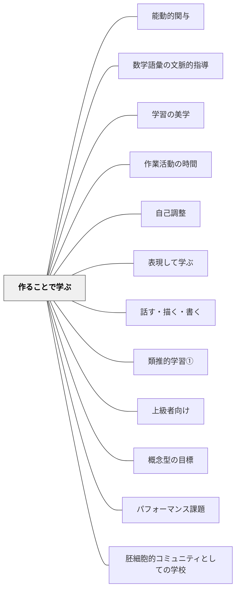

# 作ることで学ぶ

**一文でいうと**：作品や表現を作る過程で、知識を使い、考えを組み立て直す。

## 使いどころ・使いすぎ注意

| 観点         | 内容                                               |
| ------------ | -------------------------------------------------- |
| 使いどころ   | 制作過程で理解を深めたいとき。                     |
| 使いすぎ注意 | 作ることが目的化すると、概念理解が置き去りになる。 |

> 作ることで学ぶを教育設計の主軸にせよ。作ることで学ぶは学習方法の大パターンである。

## Pattern Connection

### 岩井輝久（2023）——「なぜ大パタンか」の論拠

> 「なぜ作る教育が重要なのか。それは、今でいう個別化や個性化、それと対立する系統的な学習の境界に位置するから。作る、構成するというのは、人それぞれに追求し続けることができる。」（岩井輝久、2023）

このツイートは「作ることで学ぶ」がなぜ大パタンに位置づけられるのかの論拠を明示した記録である。

- **既存パタンとの関連**：解決セクションに「子ども中心の学習と系統的な学習の境界に位置する」と記述されているが、ここに「なぜそれが大パタンたる理由か」という問いへの答えが加わる——「人それぞれに追求し続けることができる」という無上限性が鍵である
- **補強された点**：個別化・個性化と系統的学習という教育論の「対立」の中で、「作ることで学ぶ」がその対立を解消する場所として働くという位置づけが明確になった。対立を超える視点として大パタンが機能する
- **他のパタンへの波及**：[[パタン/自己調整]]（作り続けること＝自己調整であり、個別化と系統化の両立を可能にする）・[[パタン/上級者向け]]（終わりのない「作ること」が上限のない追求を可能にする）・[[自分のパタンを作る]]（「作ることで学ぶ」はパタン・ランゲージを育てること自体にも当てはまる）

---

**ショーペンハウアー（1851/2013）「幸福について」統合（2026-05-31）：活動と幸福**

ショーペンハウアーは「生命は動きに在る」（アリストテレス）という言葉を引きながら、「最大の満足が得られるのは、何かを『作る』こと、仕上げることだ」と述べた。著作・芸術・手仕事——「高尚な種類の作品であればあるほど、高次の楽しみが味わえる」。これは本パタンの哲学的基盤として機能する。

- **既存パタンとの関連**：本パタンの「知識は構成するもの」という認識論的根拠に、ショーペンハウアーの「何かを作り上げることが幸福の直接的な源泉」という存在論的根拠が加わる。「作ることで学ぶ」は教育設計の原理であると同時に、**幸福の設計**でもある
- **補強された点**：「意義深く偉大でまとまりのある作品を生みだす能力を自覚した人物は、この点でもっとも幸福である——それによって彼の生活全体に高次の関心が行き渡る」——作品を通じた高次の関心が、教室全体に「知的なスパイス」を加えるという論拠になる
- **波及するパタン**：[[パタン/「何者であるか」の優位]] — 作り続けることは「何者であるか」を育てる最も直接的な実践；[[パタン/精神の平穏]] — 日々作品が育つのを見ることが精神の平穏の副産物として幸福をもたらす

---

**Dewey（1909）Moral Principles in Education 統合（2026-05-31）：**

Deweyは1909年に「構成（construction）> 吸収（absorption）」という原則を明示した：

> "The child who has a variety of materials and facts wants to do something with them, and if he is permitted and encouraged to make things, the very act of production introduces real motive and purpose... The mere absorptive process by which isolated facts are put into the mind tends to destroy the power of judgment and the power to act independently."（Ch.3）

- **既存パタンとの関連**：本パタンの「知識は構成するものであり、受け取るものではない」という認識論的根拠が、1909年時点でDeweyによって教育的・道徳的観点から定式化されていたことが確認できる。「作ること」は認知的効果だけでなく、道徳的な意味での「主体的行為者としての人格形成」にも直結している。
- **補強された点**：「受動的な吸収は独立した判断力を阻む」——Deweyが指摘するように、作ることの対立物は「受け取るだけ・吸収するだけ」の学習である。これは単に認知的な問題でなく、道徳的問題でもある。自ら判断し行動できる人格（社会的知性・社会的力・社会的関心）を育てるために「作ること」が不可欠。
- **修正・拡張された点**：「作ることで学ぶ」は教科の内容習得の方法論であるだけでなく、「主体的行為者としての性格（character）の形成」そのものである。性格の第一要素「力・主体性（force/initiative）」——行動に必要なエネルギーと積極性——は、作る経験を通じてのみ発達する。
- **他のパタンへの波及**：[[パタン/胚細胞的コミュニティとしての学校]]（コミュニティへの貢献として「作る」行為が社会的動機を持つ）

[[文献/Moral Principles in Education（Dewey）]]

---

**Dewey（1910）How We Think 統合（2026-05-31）：**

*How We Think* Ch.10「具体と抽象の思考」は、**遊び態度（Play attitude）から仕事態度（Work attitude）への発達的連続性**を論じ、本パタンを「遊びから作ることへの連続」として補強する。

**Play attitude → Work attitude の発達的連続性（Ch.10）：**

| | 遊び態度（Play attitude） | 仕事態度（Work attitude） |
|---|---|---|
| 意味の扱い | 示唆された意味が物を支配（物に縛られない自由） | 意味が物と一致することを要求（目的へのコミット） |
| 焦点 | 活動そのものの即時的な楽しみ | 目的とプロセスへの継続的な関心 |
| 発達段階 | 幼児期の学習の主要な様式 | 学校的な学習の様式 |

**「幼稚園と小学校の断絶」への批判：**  
Deweyは Ch.10 で「幼稚園（遊び中心）と小学校（仕事中心）の間の人工的な断絶」を批判する。遊びから仕事への移行は**連続的な発達**であり、断絶として設計されるべきでない。「作ること」はこの連続性の中間に位置する——「意味への関与」（遊び的）と「目的への追求」（仕事的）を同時に持つ。

**Activity and Training of Thought（Ch.12）：**  
活動（activity）は思考を育てる最も直接的な手段であるとDeweyは述べる。活動なしに思考は育たない——「作ること」が「思考のトレーニング」として機能する哲学的根拠がここにある。

- **補強された点**：「作ることで学ぶ」がなぜ大パタンかの哲学的根拠として、Dewey（1909）の「構成>吸収」に加えて Dewey（1910）の「Play→Work連続性」が加わる。「作ること」が遊びと仕事を接続する学習様式であることが明確になる
- **修正・拡張された点**：「遊び態度を小学校で終わらせるな」——幼稚園的な「意味への自由な関与」を小学校的な「目的への追求」の中に生かし続けることが「作ることで学ぶ」の設計原則として加わる
- **他のパタンへの波及**：[[パタン/好奇心から多方興味へ]] — 遊び態度の好奇心を仕事態度の探究へとつなぐ設計；[[文献/How We Think（Dewey）]] — 本統合の出典

---

**ベルクソン（1934）思考と動き 統合（2026-06-02）：製作人（Homo Faber）と言語人批判**

ベルクソンは人間の定義として「製作人（Homo Faber）——作る人」を提唱し、旧来の教育が「言語人（Homo Loquax）——言葉を巧みに操る人」を養成してきたことを批判した。

> 「ホモ・ファベル——製作人というのが私の提案する人間の定義である。かつての教育方法は『言語人』を養成し完成することに重きを置いていた」——ベルクソン（1934/2013, 序論第二部）

> 「子どもは探究者であり、発明家である。したがっていつでも新しいものを待ちうけていて、規則には我慢できない」——同上

- **既存パタンとの関連**：Deweyの「構成>吸収」・ショーペンハウアーの「作り上げることの喜び」という根拠に、ベルクソンの人間学的根拠が加わる。「作ることで学ぶ」は教育方法論であるだけでなく、**人間存在の本質への回帰**である。「言語人」を量産する教育から、「製作人」として子どもを育てる教育への転換がパタンの射程。
- **補強された点**：子どもを「探究者・発明家」として位置づけることで、本パタンの「作ることで学ぶ」は「教師が準備した課題をこなす」設計から、「子どもが問いを立て発明する」設計へと射程が広がる。「規則には我慢できない」という子どもの本性が、自由度のある「作ること」の設計を正当化する。
- **修正・拡張された点**：「言語人批判」は現代の授業——説明を聞いて正しい言葉で答えるだけの授業——への批判として読める。本パタンは「説明・鑑賞型授業」の対極として、より積極的に位置づけられる。
- **他のパタンへの波及**：[[パタン/タウマゼイン（驚きから始まる探究）]] — 子どもが「発明家」として機能するのは、タウマゼイン（驚き）が駆動力になるとき；[[パタン/自分のやり方で自由にできる（考える余地がある）]] — 発明家としての子どもには選択の自由が必要

[[文献/思考と動き（ベルクソン）]]

---

**ベルクソン（1919）精神のエネルギー 統合（2026-06-02）：物質は障得・道具・刺激——作ることで学ぶの存在論的根拠**

『精神のエネルギー』第I章「意識と生命」において、ベルクソンは物質（Material）と精神の関係を三語で定式化した：**物質は障得（obstacle）であり道具（tool）であり刺激（stimulus）である**。

> 「精神的なものとは、努力によって自分の持っている以上のものを自分から引き出せるということである。」——ベルクソン（1919/2012）

同章ではさらに、**歓び（Joy）と快楽（Pleasure）の本質的な区別**を示した：

> 「歓びのあるところにはどこにも創造がある。創造の豊かさと活力が強ければ強いほど、歓びは深い。」——同上

「楽しい（快楽）」と「歓びがある（創造がある）」は異なる。快楽は受動的な享受だが、歓びは創造のシグナルである。

- **既存パタンとの関連**：ホモ・ファベル（思考と動き統合済み）が「作る人間としての本質」ならば、精神のエネルギーはその**実践的条件**を加える。物質（教材・課題の困難）は単なる障害でなく、精神が自分以上のものを引き出すための「障得—道具—刺激」の三重の機能を担う。「作ることで学ぶ」の設計では、この三重性を意識した材料・課題の選択が必要。
- **補強された点**：「歓びがある授業 = 創造がある授業」という等式が、「楽しい授業」との区別の基準になる。本パタンの目的は「快楽を生む」活動設計ではなく「歓び（創造の証）が生まれる」活動設計であることが明確になる。
- **他のパタンへの波及**：[[パタン/望ましい困難]] — 「障得」としての教材困難の設計；[[パタン/内発的動機づけ]] — 歓び（Joy）は内発的動機の質的指標

[[文献/精神のエネルギー（ベルクソン）]]

---

## 背景（Context）

「基地から道へ」と同様に、「作ること・構成することで学ぶ」は**全ての教育を貫く大パターン**だ。

しかし多くの教室では：

- 聞いたり読んだり見たりするだけでよく考えないため、理解が表層的で応用できず、すぐ忘れてしまう
- 何の意味・価値があるのか、どう役立つのか分からないため、やる気が起きない
- 学習を早く終えて何もやることがない（上級者が退屈する）

## 問題（Problem）

「受け取るだけ」の学習では、深い理解・転移可能な力・内発的動機づけが育たない。学習者はそれぞれ違うのに、全員が同じペースで同じことをするだけの設計では、上の学習者も下の学習者も取り残される。

## 力のかたち（Forces）

- 知識とは本来「構成（作る）」ものであり、受け取るものではない
- 作るという行為は人それぞれの速さ・深さで追求し続けることができる——上限も下限もない
- 系統的に学んでほしい内容と子ども中心の学習（自己選択・自己決定）は対立しているように見えるが、「作ること」の設計によって両立できる
- 類推的学習を組み合わせることで「作ること」が自己調整の学習ループになる

## 解決（Solution）

**作ることで学ぶを教育設計の主軸にせよ。**

---

### 知識は構成するもの——哲学的根拠

カントは『純粋理性批判』で「認識とは感性と悟性が合わさったもの」と指摘した。私たちは直観（直接観察）したことについて考えることで**意味や知識を構成（作り出す）**。そう考えれば、算数だろうが国語だろうが、社会科で新聞にまとめようが、理科で実験の報告文を作ろうが、**作る・構成するという点で変わらない**。

「作ることで学ぶ」を通して、教育とは**自分づくり（自分自身の構成）に取り組むこと**でもある。

---

### 各教科での「作ること」

| 教科       | 作ること                                                                 |
| ---------- | ------------------------------------------------------------------------ |
| 国語       | 物語や紹介文など文章を作る                                               |
| 算数・数学 | 問題を見出し解決方法を作り出したり、証明したりする                       |
| 社会       | 問題を見出し調査したことを新聞やレポートにまとめる                       |
| 理科       | 問題を見出し仮説を立て実験を設計してデータを考察することで知識を作り出す |
| 体育       | 自分の体づくり・チームづくりに取り組む                                   |
| 図工       | 平面作品や立体作品を作る                                                 |
| 音楽       | 曲や演奏を作る                                                           |
| 道徳       | 徳目に対して考えを作る・構成する——自律的な道徳的判断力・実践力を高める   |

---

### なぜ「作る教育」が重要か

作ることで学ぶは、**子ども中心の学習（個別化・個性化）と系統的な学習の境界**に位置する。類推的学習などのパターンを重ねて工夫することで、被教育者はそれぞれのペースで系統的に学ぶことができる。

作ることで学ぶに含まれる小パターン：

- **プロジェクト学習** — 問題を見出し解決策を作り出す
- **自己調整学習** — 自分のペースで作り続ける学習ループ
- **類推的学習** — 良い例を比較・観察して知識を構成する

---

### 具体例：ナンシー・アトウェルの「二重の作ることで学ぶ」教室

ナンシー・アトウェルのライティングワークショップの教室は**「二重の作ることで学ぶ」**になっている。

**第一の「作ること」：ジャンル学習（類推的学習）**

様々なジャンルの文章を比較・観察することで、そのジャンルの良い書き手がどのようなことをしているのかの特徴を**言語化・知識化・構成する（作り出す）**。

**第二の「作ること」：文章・作品を作る**

ジャンル学習で構成した知識を生かして文章を作ったり推敲したり自己評価したりする。

---

### エピソード：物語・小説のジャンル学習の具体的な流れ

1. **優れた短い小説をいくつか読み比べる**——作家・小説家がどんなことをしているのかを抽出する
2. **書き出してみんなで共有する**——良い書き手の特徴をリスト化・可視化する
3. **自分の下書きを書く時**にそのリストを参照して考える：
   - 「書き出しのところをもう少し工夫できる」
   - 「これからどんな問題が起きるか考えてみよう」
   - 「いい終わり方にするにはどうしたらいいか」
4. **友達の作品を鑑賞する視点**にもなる

子どもたちは基本的に自分の書きたいものを書いている——自由度がある。しかしその中に、系統的に学んでほしい学習事項が含まれるよう**制限（焦点化）することもできる**。自由度を保ちながら、系統的に身につけてほしい内容が無理なく学べるよう設計できる。

**上級者**はさらに終わりのない良いものを追求できる。**その分野が苦手な人**もその人なりに作る中で多くのことを学べる——作ることは人それぞれに追求し続けることができるからだ。

---

### 作ることで学ぶ × 他パターンの組み合わせ

作ることで学ぶを主軸にするといろんなパターンを重ねることができる：

- **上級者向け**：上限のない「作ること」の設計で上級者も退屈しない
- **概念型の目標**：大事な概念の目標に向かって、様々な学習事項を押さえながら子どもたちの自己選択・自己決定を踏まえた学習設計ができる
- **類推的学習**：良い例の比較から知識を構成し、それを作品制作に生かす自己調整の学習ループ
- **自己調整**：作り続ける中で自分の学習を調整する力が育つ

アトウェルのジャンル学習のような類推的学習を組み合わせることで、**自己調整を繰り返し作り続ける学習のループ**を促すことができる。

## 自己教育での適用例

**岩井の実践：** 数学用語辞典（概念の説明をワークシートに書く）・パタン記述を書く・このWikiを日々育てる——これらはすべて「何かを作る」行為であり、ショーペンハウアーが言う「高次の楽しみ」の実践例だ。「本でもいい、一つの作品が自分の手で日々成長し、ついに完成したのを見ると、直接的な幸せが味わえる」という体験が、数学デイリーとWiki構築の両方で起きている。

- **子どもとの共通点**：作り上げることの喜びという認知的・感情的なメカニズムは同じ
- **大人ならではの自由度**：テーマ・深さ・ペースをすべて自分で決められる。「作りたいものを作る」という自由が大人の自己教育における「作ることで学ぶ」の核心

---

**自己教育での適用例（ruisuishiki開発、2026-06）**

算数・数学教育プラットフォーム ruisuishiki の開発を通じた実例。
本パタンの問題——「受け取るだけの学習では深い理解が育たない」——を、開発者みずからがシステムレベルで解決したケース。
具体的には「数学を学ぶ→教材を作る→自分で解く→改善する→また学ぶ」という循環が成立し、
**作り手でありユーザーでもあること**が学習と開発の両方を強化している。
高校数学のコンテンツを作ることが、そのまま自分の高校数学の学習になる一石二鳥の構造——「教師が教材を作るときに最も学ぶ」という現象をシステム設計として自分に起こしている。
1ヶ月の適応期間（興奮と疲れ）を経て循環が安定し、複数の関心領域（数学学習・教育パタン研究・AI開発）がruisuishikiという結節点でつながり始めた。

---

## 結果（Consequences）

- 深く考えることが保障されるため、表層的な理解ではなく転移可能な知識・技能が育つ
- 上限も下限もない「作ること」の設計で、上級者も苦手な学習者もそれぞれの追求が続けられる
- 系統的な学習内容と子ども中心の学習（自己選択・自己決定）が両立する
- 作ることが自己調整の学習ループを生み、内発的動機づけが高まる

## 関連パタン
- [[教科/分数パズル（youcubed）]]
- [[パタン/能動的関与]]
- [[パタン/数学語彙の文脈的指導]]
- [[教科/算数・数学で使うパタン]]
- [[パタン/学習の美学]]
- [[パタン/作業活動の時間]]
- [[パタン/自己調整]]
- [[パタン/表現して学ぶ]]
- [[パタン/話す・描く・書く]]

- [[パタン/類推的学習①]] — 良い例を比較観察して知識を構成する——作ることで学ぶの核心的な小パターン
- [[パタン/上級者向け]] — 終わりのない「作ること」が上級者のやり込み要素になる
- [[パタン/概念型の目標]] — 作ることで学ぶの目標設計に
- [[パタン/パフォーマンス課題]] — 「作ること」の具体的な課題設計
- [[パタン/胚細胞的コミュニティとしての学校]] — 「作る」ことがコミュニティへの貢献として社会的動機を持つ
- [[文献/Moral Principles in Education（Dewey）]] — 「構成 > 吸収」原則の1909年版定式化
- [[文献/How We Think（Dewey）]] — Play→Work attitude の発達的連続性（Ch.10）・活動が思考を育てる（Ch.12）の出典
- [[文献/精神のエネルギー（ベルクソン）]] — 歓び（Joy）= 創造の証・物質は障得/道具/刺激（1919）

## このパタンが働く実践

| 実践パタン                             | 何を作ることで学ぶか                                                        |
| -------------------------------------- | --------------------------------------------------------------------------- |
| [[実践/10や100を単位にして計算しよう]] | 同じ考え方で解ける問題を自分で作ることで、10や100を単位とする見方を使い直す |

## クラスター図

## Actionable Insight

- 今週の授業で「説明する・作る・発表する」の機会を1つ意図的に設ける——受け取るだけの学習から作る学習への最初の一歩
- 作った作品を「見せ合う・読み合う」時間を確保する——誰かの目に触れるとき学習の質が変わる
- 「なぜこの表現を選んだの？」と作ったものの理由を問う——答えること自体が学習の深化と自己調整のループになる
- まず5分間の「ミニ制作」から始める——短い体験が全員の入口を開く
- 「完成品」より「プロセス」を見取る——途中の試行・修正・悩みを評価することで作ることへの安心感が育つ
- 他教科でも「作る」活動を1つ設ける——算数なら問題作り、理科なら観察記録。制作経験が教科を超えた学習スタイルになる

## 出典
- [[文献/一つの教育のパタン・ランゲージ]]

カント『純粋理性批判』（認識は感性と悟性の合成）  
Nancie Atwell（ライティングワークショップ・ジャンル学習）  
岩井輝久「岩井輝久『一つの教育のパタン・ランゲージ』」（2026-04-29 vault収録）  
岩井輝久「パタン　作ることで学ぶ（動画記録）」https://youtu.be/MG-SFD6EpEs  
ベルクソン，A.（原章二訳）（2013）『思考と動き』平凡社ライブラリー784 → [[文献/思考と動き（ベルクソン）]]
