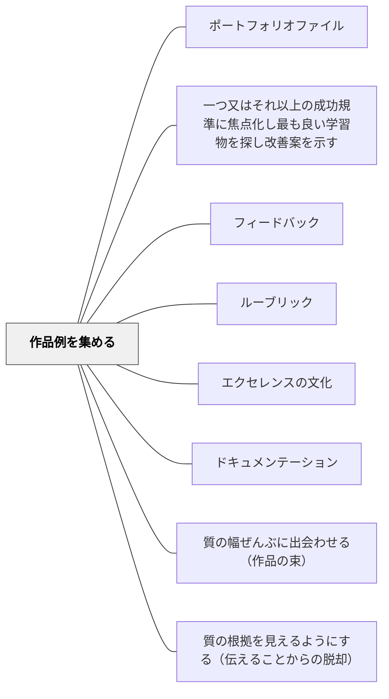

# 作品例を集める

> 「こういうものを作りたい」という憧れは、実物を見るところから始まる。

## 背景（Context）

学習者が高い質の作品を生み出すためには、「高い質とはどのようなものか」を具体的にイメージできる必要がある。言葉で「優れた作品を作りなさい」と言うだけでは、学習者はそのイメージを持ちにくい。実物の作品例（モデル）があることで、目指すべき水準が明確になり、学習者の挑戦意欲が高まる。

これはルーブリックのアンカー作品としての機能だけでなく、「エクセレンスの文化」を支える物的な基盤でもある。過去の学習者の作品が、将来の学習者のインスピレーションとモデルになるという連鎖が、学習コミュニティの文化を形成する。

## 問題（Problem）

教師が毎年一から「良い作品とはどういうものか」を説明しなければならない場合、その説明は抽象的になりがちで、学習者に伝わりにくい。また、優れた作品例が蓄積されていないと、学習者は先達の知恵から学ぶ機会を失う。

さらに、参照できる作品例がなければ、ルーブリックの各レベル記述も曖昧なまま残る。「レベル3の作品とはこういうものだ」と実物で示せることと、言葉でしか説明できないことには大きな差がある。

## 力のかたち（Forces）

- 特定の作品例を示すと、学習者がそれを模倣しすぎて独創性が失われることがある
- 多様な作品例を並べることで、「成功の形は一つではない」ことを示せる
- 作品例は時代とともに更新が必要で、古い作品が「型」になりすぎると学習が停滞する

## 解決（Solution）

学習の成果物を体系的に収集・整理し、将来の学習者がアクセスできる作品例ライブラリを構築する。作品例には複数のレベル（ルーブリックの各段階に対応するもの）と複数のスタイルを含めることで、「一つの正解」ではなく「多様な優れた表現」を示す。

作品例を授業に導入する際は、「何がこの作品を優れているものにしているか」を学習者と一緒に分析する過程を設ける。これにより、モデルの模倣ではなく、質の認識と応用が育まれる。また、作品を提供した元の学習者の許可を得た上で、その成長の過程も一緒に示すと、「自分にもできる」という感覚が生まれやすい。

## 結果（Consequences）

- 学習者が目指すべき水準を具体的にイメージでき、挑戦意欲が高まる
- ルーブリックや達成基準が具体物と結びつき、評価の透明性が高まる
- 先達の作品がコミュニティの文化として引き継がれ、エクセレンスの連鎖が生まれる

## 関連パタン
- [[パタン/ポートフォリオファイル]]
- [[パタン/一つ又はそれ以上の成功規準に焦点化し最も良い学習物を探し改善案を示す]]

- [[パタン/フィードバック]] — 親パタン
- [[パタン/ルーブリック]] — 作品例がルーブリックのアンカーとして機能する
- [[パタン/エクセレンスの文化]] — 作品例の蓄積がエクセレンスの文化を支える
- [[パタン/ドキュメンテーション]] — 学習過程の記録が将来の作品例となる
- [[パタン/質の幅ぜんぶに出会わせる（作品の束）]] — 良い作品例だけを集めるのではなく、質の幅の全体に出会わせ、判断させる方向へ展開したもの
- [[パタン/質の根拠を見えるようにする（伝えることからの脱却）]] — 作品例を「見せる」ことと「判断させる」ことの違い
- [[概念/鑑識眼（コノサーシップ）]] — 集めた作品を前にして働かせる目のこと

## クラスター図

## Actionable Insight

- 学年末に「今年の優れた作品例」を数点選び次年度の授業で使えるよう保存する——先達の作品がコミュニティの文化として引き継がれることでエクセレンスの連鎖が生まれる
- 作品例を紹介するとき「何がこの作品を優れているものにしているか」をクラスで分析する時間を入れる——模倣ではなく質の認識と応用を育てる
- 複数のレベルの作品例（良い例・普通の例）をセットで保管し、ルーブリックのアンカーとして使う——具体物と基準が結びつくことで評価の透明性が高まる

## 出典

Berger, R. (2003). *An Ethic of Excellence*. Heinemann.
Clarke, S. (2014). *Outstanding Formative Assessment*. Hodder Education.
