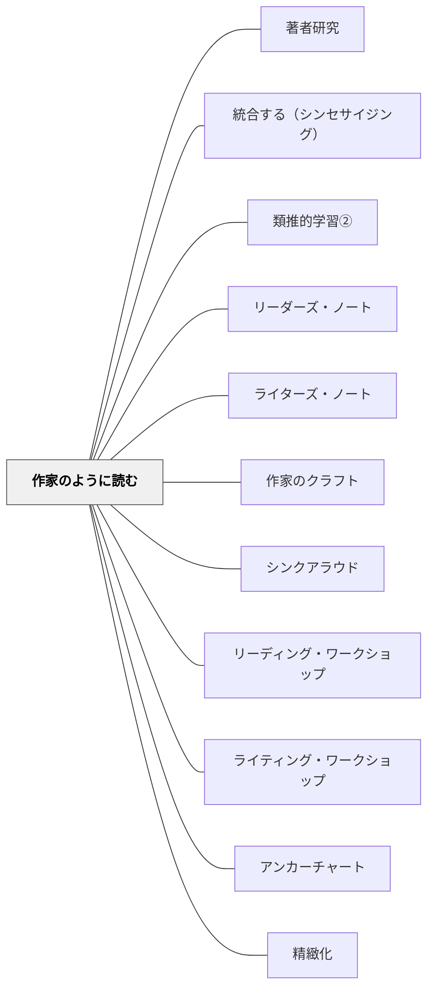

# 作家のように読む

> 読書は作家の技法を盗む最良の教室だ。作家が何をしたかを見ていると、書き手としての自分の引き出しが増える。— Aimee Buckner（2009）

---

## Pattern Connection

### Buckner（2005）再統合（2026-05-18 OCR全文照合）

**補強された点**（*Notebook Know-How* Ch.4 "When Writers Read"）

- Katie Wood Ray *Wondrous Words*（1996）の seamstress（裁縫師）のメタファーを確認：「シームストレスはショッピングモールで服の縫い目を見る——買うためでなく、作り方を学ぶために」
- Julius Lester *John Henry*（1999）を使った **Mapping the Text** ミニレッスンが追加された——能動動詞 vs 形容詞の比率・文の長さとペースの関係という2つの具体的な発見を含む
- **Poetry Pass**（詩を回覧する）ストラテジー追加：e.e. cummings の詩を複数の目で読み、気づきを蓄積する協働的手法
- **Author Style Chart**（作家スタイルチャート）追加：Author / Style / Example / Text Title の4列チャートで作家の引き出しを記録する
- **Try Ten**（10通りに書き直す）がライターズ・ノートの中でリビジョンとして機能することを確認

**修正・拡張された点**

- Julius Lester のエピソード：「本人も自分がしていることの全てを知らない——読者が発見する」。この事実が「正解のない技法探し」の根拠になる
- 形容詞でなく動詞がイメージを作るという理解が、「詳細描写＝形容詞」という誤解を解く

**他のパタンへの波及**

- [[パタン/ライターズ・ノート]] ← Mapping the Text / Poetry Pass / Author Style Chart がライターズ・ノートで試される具体的な形として追加
- [[パタン/作家のクラフト]] ← Try Ten・能動動詞・文の長さ変化がクラフト指導に直結

---

### Buckner（2009）再統合（2026-05-18 OCR全文照合）

**補強された点**

- Brian Cambourne の「学習の8条件」（immersion / demonstration / engagement / expectations / responsibility / employment / approximation / response）が「作家のように読む」プロセス全体の理論的枠組みとして機能することが確認された（Rushton et al. 2003）
- Frank Smith（1988, p.26）の「読む仲間（literacy club）」概念——「著者が子どもの無意識のコラボレーターになる」——が読書と作文をつなぐ核心として明確化された
- 「linguistic spillover（言語的しみ出し）」（Cambourne, cited in Anderson 2005, p.18）——素晴らしい文章を読んだ後その書き方が自分の文章にしみ出す現象——が「作家のように読む」の自然な発展形として確認された

**修正・拡張された点**

- 既存の「気づき（Noticings）」の書き方が具体的な教室エピソードで補強された（Henry's Freedom Box / Maniac Magee）
- リーダーズ・ノートとライターズ・ノートの切り替えは「哲学的なものでなく組織的な決断」という記述があり、「一つのノートでもよい」ことが明確化された
- Cambourne の「approximation（近似）」条件——完璧でない技法の試みを学習の一部として歓迎する——が教師フィードバックの根拠として追加された

**他のパタンへの波及**

- [[パタン/リーダーズ・ノート]] ← Fab Five・Summarizing Questionsが読みと書きをつなぐ新しい道具として追加
- [[パタン/シンクアラウド]] ← Cambourne の「demonstration（示範）」条件として位置づけを強化

---

## 背景（Context）

リーディング・ワークショップとライティング・ワークショップは多くの場合、別々の時間として設計されている。読む時間は「読書家として育てる場」、書く時間は「書き手として育てる場」——これ自体は正しいが、二つのワークショップが対話していないとき、豊かな接続が生まれない。

Aimee Buckner（2009）*Notebook Connections* 第4章「作家のように読む（Reading Like a Writer）」は、この二つを橋渡しするエントリータイプを提案する。読者は単に物語を楽しむのではなく、**著者が何をしているかに目を向け、その技法に名前をつけ、自分が書くときの引き出しにする**。

Frank Smith（1988）は「作家のグループへの招待（Joining the Literacy Club）」の中で「読者は書くことを学ぶために読む」と述べた。「作家のように読む」はこの考えを実践に落とした形だ。

## 問題（Problem）

読書と作文指導が分断されていると、子どもは「本を読んで感動する」と「上手な文章を書く」を別の能力として扱う。作文のミニレッスンで「書き出しの5パターン」を学んでも、読んでいる本の書き出しに着目することがない。読書の豊かな経験が作文力に還元されていない。

## 力のかたち（Forces）

- 優れたメンターテキスト（手本となるテキスト）は最も自然な作文の師匠
- しかし「上手な文章を読む」だけでは技法は身につかない——意識的に「何をしているか」を観察する必要がある
- 技法に名前をつけることで（メタ言語）、それを自分の書くときに使えるようになる
- 記録しなければ気づきは消える——リーダーズ・ノートに書くことで記憶と引き出しになる
- リーダーズ・ノートとライターズ・ノートが「作家のように読む」で接続される

## 解決（Solution）

**読書中に著者の技法を意識的に観察し、「何をしているか（What）」と「なぜ効くか（Why it works）」をリーダーズ・ノートに書き留める。**

---

### 気づき（Noticings）の書き方

基本フォーマット：
```
著者は【何をしている】——なぜなら/そのことで【どんな効果がある】
```

例：
- 「著者は書き出しに対話を使っている——なぜなら、すぐに人物の声が聞こえてテンポが速くなるから」
- 「著者は同じ言葉を3回繰り返している——リズムが生まれて、大事さが伝わる」
- 「著者は主人公の名前をずっと書かない——読者が誰のことか考え続けることになる」
- 「著者は色の言葉を選んでいない。でも場面が目に見える——具体的な物の名前だけで描写している」

---

### 授業での使い方

**ステップ1：シンクアラウドでモデリングする**
- 読み語りの中で「あ、ここで著者は〇〇をしている」と声に出す
- ノートに書いて見せる——「先生だったらこう書く」

**ステップ2：独立読書中に試す**
- 「今日は読みながら、著者が何かしているな、と感じた場所で止まって書いてみて」
- 付箋に「作家のように読む」の気づきを書いてページに貼る

**ステップ3：共有する**
- 数人が見つけた技法を全体で共有する——「クラスの発見リスト」をアンカーチャートに蓄積する

**ステップ4：ライターズ・ノートで試す**
- 「今日見つけた技法を、自分が書くときに使ってみよう」と促す
- ライターズ・ノートで「真似て書く（Trying the Technique）」エントリーを書く

---

### 気づくべき技法の例（低〜中学年）

| カテゴリ | 技法の例 |
|---|---|
| **書き出し** | 会話・場面描写・謎・動作から始まる |
| **詳細描写** | 色・音・形・動き・においを使う |
| **ペース** | 短い文の連続でスピードが上がる |
| **声（Voice）** | 読んでいてその人が話しているように感じる |
| **繰り返し** | 言葉・場面・構造の繰り返しがある |
| **終わり方** | 最後の一文に何が来るか |
| **視点** | 誰の目から語られているか |

---

### リーダーズ・ノートとライターズ・ノートの接続

```
リーダーズ・ノート
  →「〇〇の書き方をこの著者はしている」（気づき）
        ↓
ライターズ・ノート
  →「自分もこれを試してみる」（真似て書く）
        ↓
ライティング・ワークショップのドラフト
  →実際の作品の中で使う
```

この接続が生まれると、読む時間が書く力に直接貢献するようになる。

---

### 具体例①：John Henry——能動動詞とイメージ（Buckner 2005, Ch.4）

Buckner（2005）のクラスで Julius Lester の *John Henry*（1999）を使ったミニレッスン。テキストを全員に配り、ノートに貼り付けて「好きな語・フレーズを丸で囲む」活動：

> *John Henry sang and he hammered and the air danced and the rainbow shimmered and the earth shook and rolled from the blows of the hammer.*
>
> *the rainbow draped around him like love.*
>
> *he had finished building the road, not only had John Henry pulverized the boulder into pebbles*

**発見①（生徒：Jason）**：「"pulverized" がいい。"broke" や "smashed" より強い」→ 動詞の選択がイメージを作る

**発見②（生徒：Martha）**：「"like love"——直喩だ」→ Lester の simile は対立するイメージを組み合わせる（"a mountain as hard as hurt feelings"）

**発見③（生徒が自発的に）**：「最初の長い一文を速く読んだ。次の短い2文はゆっくり読んだ——文の長さが読む速さを決める」→ **文の長さの変化がペース（感情的テンポ）を作る**という気づき

**授業の核心（形容詞 vs 動詞の分析）**：  
「この約100語に形容詞はいくつあると思う？」→ 生徒の予測：25〜50。実際は約10%。

| 形容詞 | 名詞 | 動詞（動的） |
|---|---|---|
| quiet / prettiest / straightest / new | rainbow / earth / boulder / pebbles / love | sang / hammered / danced / shimmered / shook / rolled / pulverized / draped |

→ **イメージを作るのは動詞、次に名詞——形容詞は補助**。この発見が「能動動詞（active verbs）vs 受動動詞（passive verbs: is/are/have）」の文法理解につながる。

授業後、生徒が文の長さを意識して書いたエントリー：
> *The bell rang and students flood the halls filling it with laughter and shouts of joy and lockers slam and toilets flush while kids rush on to the next class. Classroom doors slam shut. Silence sweeps up the last bit of chatter. The next bell rings. The hallways are empty.*

---

### 具体例②：Poetry Pass——詩を回覧して気づきを積み重ねる（Buckner 2005, Ch.4）

e.e. cummings の詩4篇を1枚に印刷し、各自に配る。

**手順**：
1. 2回読む（1回目：聴くだけ、2回目：マークしながら）
2. 5分マッピング（丸印・コメント）→ 名前を書いて隣に渡す
3. 前の人のコメントを読んで → 3分でさらにマーク → また渡す
4. 最後に元の人に戻る。ページが複数人の気づきで埋まっている

**なぜ有効か**：
- 自分では気づかなかった技法を他の人の視点で発見できる
- 詩は短く、技法が密度高く含まれている
- 最後に「最も学んだ詩」を切り貼りしてノートに貼り、振り返りエントリーを書く

Ryan の詩（e.e. cummings の「little tree」から大文字なし一文字 "i" に着想）：
> *i wish i had a million dollars but i don't*  
> *i wish i had a big screen tv in my room but i don't*

---

### 具体例③：Henry's Freedom Box——テンションを「引き伸ばす」技法

Buckner（2009, Ch.4）のクラスで *Henry's Freedom Box*（Levine 2007）を使ったミニレッスン。奴隷制度の物語で、Henryが家族を失う場面：

> *"No!" cried Henry.  
> Henry couldn't move.  
> He couldn't think.  
> He couldn't work.*

教師：「著者は何をした？」  
生徒：「3文、全部'couldn't'で始まって、一つの感情が一文ずつ」  
→ Ralph Fletcher（2007, p.112）の「hot spot をスローダウンする」技法。短い文の連続で感情を引き伸ばす。

続いて教師が自分の文章でモデリング：

> *I wanted to snap my fingers. I wanted to raise my voice. I wanted to grab the note from their hands. But I didn't want to disturb the other readers.*

→ 子どもたちが「今日の書くことで、感情を引き伸ばせる場所を探してみよう」と実践へ。

---

### 具体例②：Maniac Magee——「detail bomb（詳細の爆弾）」

*Maniac Magee*（Spinelli 1990, pp.131-132）の廃屋の描写をクラスで分析。生徒Drewが発見：

> 「最初に通り過ぎるときは何でもないように見えた詳細が、あとで爆発する！」

→ クラスが「detail bomb」と命名。初見では気づかない伏線詳細が後から意味を持って爆発する技法。このように**子どもが技法に名前をつける**ことで、「クラス共有のメタ言語」が生まれ、その後の書くことに活用される。

**授業手順**：
1. テキストを初めに1回読む（内容を楽しむ）
2. 2回目：気になった部分をマークする
3. 3回目：なぜそこを選んだか話す
4. 発見した技法に名前をつける（クラスの言葉で）
5. ライターズ・ノートで自分の文章に試す

---

### 言語的しみ出し（Linguistic Spillover）

Brian Cambourne（cited in Anderson 2005, p.18）が「linguistic spillover」と呼ぶ現象——素晴らしい文章を読んだ後、その書き方が自分の文章にしみ出してくる。

「意図的に気づく」こと（作家のように読む）は、この自然なしみ出しを加速・意識化する実践。Julius Lesterに会ったとき「僕はそんなことをしているとは知らなかった！」と驚いた話——作家自身も無意識に埋め込んでいるものを、読者が意識的に抽出する。

---

### Cambourne の学習8条件と「作家のように読む」の対応

| Cambourne の条件 | 「作家のように読む」での現れ方 |
|---|---|
| **Immersion（浸透）** | 読み語り・独立読書でテキストに繰り返し浸る |
| **Demonstration（示範）** | 教師がシンクアラウドで技法に気づくモデルを見せる |
| **Engagement（関与）** | 子どもが自分で選んだ本で同じ目を向ける |
| **Expectations（期待）** | 「技法を見つけてノートに書く」という期待値を共有する |
| **Responsibility（責任）** | 何をどこで試すかは子どもが決める |
| **Employment（運用）** | ライターズ・ノートで実際に技法を試す |
| **Approximation（近似）** | 完璧でない試みも歓迎——Dean の文がずれていても「再試行」を促す |
| **Response（反応）** | 教師が試みを肯定し、次のステップへ向けてリダイレクトする |

## 結果（Consequences）

- 読書が「物語を楽しむ」だけでなく「書き方を学ぶ場」になる
- 作文ミニレッスンで扱う技法が「本の中にある」ことに気づく経験が積み重なる
- 読書と作文の時間が対話するようになり、両方の力が高まる
- 著者への意識が高まり、テキストをより批評的に読めるようになる

## 関連パタン
- [[教科/国語]]
- [[実践/ライターズ・ノートの起動]]
- [[実践/リーダーズ・ノートの起動]]
- [[パタン/著者研究]]
- [[パタン/統合する（シンセサイジング）]]
- [[パタン/類推的学習②]]

- [[パタン/リーダーズ・ノート]] — 気づきを書き留める道具
- [[パタン/ライターズ・ノート]] — 気づきを試す場所
- [[パタン/作家のクラフト]] — ライティング・ワークショップで扱うクラフトの体系
- [[パタン/シンクアラウド]] — 気づきをモデリングする指導形態
- [[パタン/リーディング・ワークショップ]] — 独立読書中に気づきを書く時間
- [[パタン/ライティング・ワークショップ]] — 試して書く時間
- [[パタン/アンカーチャート]] — クラスの気づきを蓄積する場所
- [[パタン/精緻化]] — 著者の選択の「理由」を問うことが精緻化

## クラスター図



## Actionable Insight

- 次の読み語りで一か所「著者はここで何をしているか」と問い、黒板に「【技法】——なぜなら【効果】」の形で書いてみる——2〜3回繰り返すとクラスが自分で気づきを言い始める
- 読書カンファリングで「ノートに作家の技法で気になったことはある？」と聞く——「ない」と言う子には自分のノートの気づきを一つ見せて問い返す
- 読書で見つけた技法をライターズ・ノートで1回試させる——どんなに短い模倣でも「借りた技法が自分の文章になった経験」が接続の始まりになる
- 感情が高まる場面で「著者は短い文を使っているか、長い文を使っているか？」と問う——文の長さが感情のテンポを作ることに気づく最も早い道
- 「技法に名前をつけさせる」ことを試す（Drewのdetail bombのように）——子ども自身が命名するとクラスのメタ言語になり、その後の書くことに何度も登場する
- **John Henry の Mapping the Text を試す**：テキストの形容詞・動詞・名詞をリスト化させる——「形容詞がなくてもイメージが豊か」という発見が能動動詞への意識を一気に育てる（Buckner 2005 Ch.4）
- **Poetry Pass を試す**：好きな詩人の詩3〜4篇を1枚に印刷し、グループで回覧してコメントを重ねる——他者の視点で自分が見逃した技法が見える

## 出典

Buckner, A. (2005). *Notebook Know-How: Strategies for the Writer's Notebook*. Stenhouse Publishers. (Chapter 4: When Writers Read)
Buckner, A. (2009). *Notebook Connections: Strategies for the Reader's Notebook*. Stenhouse Publishers. (Chapter 4: Reading Like a Writer)
Lester, J., & Pinkney, J. (1999). *John Henry*. Puffin Books.
Smith, F. (1988). *Joining the Literacy Club*. Heinemann.
Ray, K. W. (1999). *Wondrous Words: Writers and Writing in the Elementary Classroom*. NCTE.
Anderson, J. (2005). *Mechanically Inclined: Building Grammar, Usage, and Style into Writer's Workshop*. Stenhouse.
Fletcher, R., & Portalupi, J. (2007). *Craft Lessons: Teaching Writing K–8*. Stenhouse.
Rushton, S. P., Eitelgeorge, J., & Zickafoose, R. (2003). "Connecting Brian Cambourne's Conditions of Learning Theory to Brain/Mind Principles." *Early Childhood Education Journal*, 31(1), 11–21.
