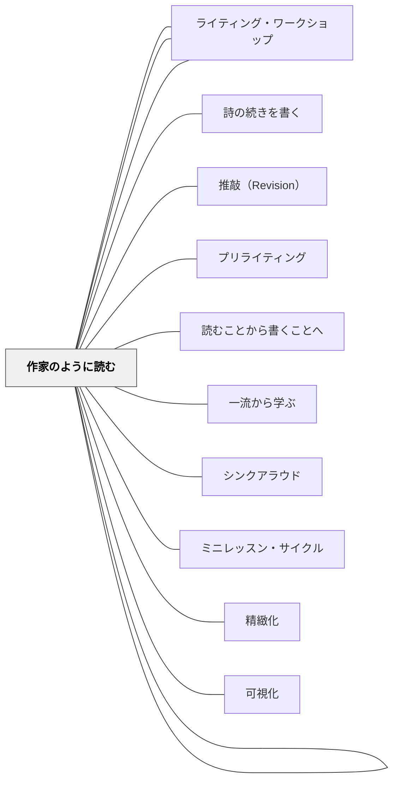

# 作家のクラフト

> 「正確だが平板な文章」と「読みたくなる文章」を分けるのは、文法の正しさではなく、書き出し・イメージ・視点・声・語の選択——「技芸（Craft）」と呼ばれる中間領域の意識的な使用である。

---

## Pattern Connection

**出典**: Muschla, G. R.（2005/2006）*Writing Workshop Survival Kit* (2nd ed.). Jossey-Bass.（統合：2026-05-14、拡張：2026-05-19）

- **既存パタンとの関連**：[[パタン/読むことから書くことへ]] は「書き手として読む・優れた作家の手法を内面化する」と述べるが、何を内面化するかは具体化されていなかった。本パタンはその「何を」——クラフト要素のリスト——を提供する。[[パタン/一流から学ぶ]] の具体的内容が「作家のクラフト」として実体化される
- **補強された点（2026-05-14）**：[[パタン/ライティング・ワークショップ]] のミニレッスン計画で「技芸」カテゴリーが独立することで、「タイプ（ジャンル）」「技芸」「メカニクス」の三層が明確になる。計画の際に技芸層が省略されにくくなる
- **拡張された点（2026-05-19）**：Art of Writing 29本の全体精査により、トーン・比喩三形態（直喩・暗喩・擬人法）・擬音語・頭韻・クリシェ回避が「主要な技芸要素」として追加された。またフィクション執筆に特化したクラフト群（Mini-Lessons 33–43）——対立・登場人物描写・対話・場面設定・フラッシュバック・伏線・クライマックス・視点の種類——を「フィクションの技芸要素」セクションとして独立させた
- **修正・拡張された点**：日本の作文指導が「メカニクス（文法・句読点）」と「タイプ（起承転結・説明文の構造）」に集中しがちな傾向を、本パタンで「技芸」層が補完する
- **他のパタンへの波及**：[[パタン/シンクアラウド]] で教師が「書き手として読む（クラフトに気づきながら読む）」モデリングを示すことが、技芸指導の最初の形になる

---

## 背景（Context）

日本の国語科作文指導は、二つの極の間に揺れることが多い。一方は「自由に書かせる」——動機と表現の自由を重んじるが、技術的な指導が入らず書き方が育ちにくい。もう一方は「正しい作文を書かせる」——句読点・常体敬体・接続詞の使い方・起承転結という構成などを教えるが、書いたものが生き生きとした文章にならない。

「技芸（Craft）」はこの両極の間にある第三の領域である。ルーシー・カルキンズ（1994）は「書くことの技芸を教える（The Art of Teaching Writing）」という表現でこれを定式化した。Muschla（2005）はそれを学校での実践に落とし込み、「書き出し・イメージ・視点・声・文体・語の選択」といった技芸要素を個別のミニレッスンとして体系化した。

作家のクラフトを意識的に学ぶことは、「どう書くか」を学ぶことであり、それは「よい文章を読むこと（一流から学ぶ）」と「書いたものを推敲すること（リビジョン）」の両方を通じて育つ。

## 問題（Problem）

作文指導でよく起きる問題：

- 子どもたちが「何を書くか」は持っているのに、「どう書くか」を知らないため、「○○をしました。楽しかったです。」で終わる
- 「もっと詳しく書こう」「具体的に書こう」と指示しても、どうすれば詳しく・具体的になるかの技術を持っていない
- 文章が「正確だが感情の動かない」状態になる——文法的には間違いないが、読む人に何も伝えない
- 技芸を教えようとすると「センス」の問題として扱われ、指導可能なスキルとして認識されない

## 力のかたち（Forces）

- 技芸の多くは「センス」ではなく、意識すれば使えるようになる技術である
- 書き手として優れた作家の技芸に気づくには、「読者として読む」ではなく「書き手として読む」必要がある
- 技芸は一度教えれば習得されるものではなく、繰り返しの意識的な練習を通じて内面化される
- 技芸要素は個別に教えられるが、作品の中では統合して機能する
- メカニクスを先に教えすぎると、子どもたちは技芸を考える前に誤字修正で疲弊する

## 解決（Solution）

**技芸要素を「ミニレッスンで示す→書いた作品で意識する→仲間と読み合う」という循環で、繰り返し・螺旋的に教える。優れた作家の文章をモデルとして使い、子どもたちが自分の文章に技芸を試みる機会を作る。**

---

### 主要な技芸要素（Art of Writing）

| 技芸要素 | 何を教えるか | ミニレッスンの入口 |
|---------|------------|----------------|
| **書き出し（Lead）** | 読み手を引き込む最初の一文・一節 | 好きな本の書き出しを集めてパターンを発見する |
| **見せる描写（Show, don't tell）** | 「彼は怒っていた」→「彼はドアを叩きつけた」 | 「教えて文」を「見せて文」に書き換えるワーク |
| **感覚的イメージ（Sensory detail）** | 五感を使った具体的な描写 | 記憶の場面を五感ですべて書き出す |
| **視点（Point of View）** | 誰が語るか・何を知っているか | 同じ場面を1人称・3人称で書き比べる |
| **声（Voice）** | 書き手の個性・文章の「温度感」 | 同じ内容を2人の作家が書いたらどう違うか |
| **トーン（Tone）** | 書き手の態度・感情的色調（ユーモア・哀愁・皮肉など） | 同じ場面をトーンを変えて2通り書く |
| **語の選択（Word Choice）** | 正確で鮮やかな語を選ぶ | 「大きい」の代わりに使える言葉を集める |
| **文の多様性（Sentence variety）** | 文の長さとリズムを変える | 長文・短文を意識的に交互に使う |
| **つなぎ（Transitions）** | 場面・段落の間を滑らかに移動する | つなぎ言葉のリストを作り、実際に試す |
| **比喩（Figurative Language）** | 直喩（〜のように）・暗喩（〜は〜だ）・擬人法の3形態 | 詩や物語の比喩を見つけて分類する |
| **擬音語（Onomatopoeia）** | 音が意味を運ぶ言葉——バシャン・ぽたぽた | 場面の音を書き出して「音ある文」に変換する |
| **頭韻（Alliteration）** | 同じ音で始まる語を連ねてリズムを生む | 詩の一節や広告で頭韻を探す |
| **クリシェ回避（Avoiding Clichés）** | 「陳腐な表現」を見つけ、自分の言葉に置き換える | 「腹を抱えて笑う」を自分の表現で書き換える |
| **終わり方（Ending）** | 余韻のある締めくくり | 好きな本の終わり方を集めてパターンを発見する |

---

### Try Ten——書き出しを10通りに書き直す（Buckner 2005, Ch.4）

「Try Ten」はライターズ・ノートの後ろ（リビジョン・ノートのセクション）で試すストラテジー。書き出し（lead）を10通りに書き直すことで、より良い書き出しを見つける。

**手順**：
1. 現在のドラフトの書き出し文をノートに書く（これが #1）
2. #2〜10 で同じ内容を異なる形で書き直す（質問で始める・動作で始める・場面から始めるなど）
3. 6〜8番あたりでアイデアが苦しくなる——それが創造的思考が始まる地点

**Davis の Try Ten（Toby Keith について）**：
> 1. Toby Keith is my hero because he loves our country more than anybody.
> 7. Toby Keith stands for our country like a bulldozer.
> **9. Toby Keith is my everyday hero because he stands for our country like a rock.** ← Davis が選択

「9番目の書き出しは最初より格段に良い。書き直しが苦しくなるほど創造的になる」——Buckner

**拡張**：書き出しだけでなく、終わり方・接続文・比喩の10通り試しにも使える。

---

### フィクションの技芸要素（Mini-Lessons 33–43）

フィクション・物語文に特化したクラフト群。技芸ミニレッスンの第二層として、「書き出しや見せる描写」を教えた後に順次導入できる。

| フィクション技芸要素 | 核心概念 | ミニレッスンの入口 |
|-------------------|---------|----------------|
| **対立（Conflict）** | 外的4種類（人vs人・人vs社会・人vs自然・人vs運命）＋内的対立 | 好きな物語の対立を分類する |
| **登場人物描写（Characterization）** | 直接描写（名前・外見）と間接描写（行動・対話・内面）の区別 | 台詞だけで人物の気持ちがわかる場面を書く |
| **対話（Dialogue）** | 人物の個性・対立・感情を表現する道具——文字起こしではない | 「言った」以外の動詞を30個集める |
| **場面設定（Setting）** | 五感で構築する——視覚だけでなく音・におい・手触り・味も | 記憶の場所を五感のマトリクスで描写する |
| **フラッシュバック（Flashback）** | 現在の場面を中断して過去に戻る——転換の技法 | フラッシュバックを使っている作品の切れ目を見つける |
| **伏線（Foreshadowing）** | 後の展開を暗示する——読者の期待をコントロールする | クライマックスを決めてから「伏線を逆算して仕込む」 |
| **クライマックス（Climax）** | 対立が頂点に達する瞬間——その後の解決へ向かう転換点 | 物語の山場とその前後の緊張感の変化を図式化する |
| **視点の種類（Point of View Types）** | 1人称／3人称客観・限定・全知——それぞれの効果と制約 | 同じ場面を1人称・3人称限定・全知で書き比べる |

**視点（POV）の詳細**：
- **1人称（I）**：主人公の思考・感情に深く入れる。他の人物の内面は不明。読者との距離が最も近い
- **3人称客観（Objective）**：行動・対話のみを描写。内面に入らない。劇的・映像的な効果
- **3人称限定（Limited）**：一人の人物の視点から語る。内面には入れるが他の人物の内面は不明
- **3人称全知（Omniscient）**：全ての人物の内面を知っている。複雑な人間関係を扱いやすいが読者との距離が遠くなる

---

### 「Show, don't tell」ミニレッスン（最初に試す1本）

**ねらい**：「感情を告げる」から「感情が見える場面を描く」への転換

**手順**（10分）：
1. 黒板に「教えて文（Tell）」を書く：「田中さんはとても嬉しかった」
2. 「この文、何がわかりますか」「でも、どんな顔をしていたかわかりますか」
3. 教師がモデリング：「田中さんは両手を広げてくるりと回った。ついに言いたいことを言えた、という感じで」
4. 「これが『見せる（Show）』です」——アンカーチャートに書く
5. 「Tell文」のリストを配り（「悲しかった」「怒っていた」「不安だった」等）、3分間で1つを「Show文」に変換する
6. 2〜3人が読み上げ、どの言葉で「感じた」かを共有する

**フォローアップ**（独立書きで）：
- 「自分の作品の中に『告げている文』はないか探してみて」
- 「一つだけ『見せる文』に変えてみて」

---

### 書き出しの5パターン

| パターン | 例 |
|---------|-----|
| **アクション書き出し** | 「私は走った。校門の外から、声が聞こえた。」 |
| **対話書き出し** | 「『行かないで』彼は言った。誰もいなかった。」 |
| **問いかけ書き出し** | 「あなたは、海に一人で立ったことがあるか。」 |
| **場面の描写書き出し** | 「霧が薄くなる朝、山の向こうに光が線のように差していた。」 |
| **驚きの事実書き出し** | 「その日、田中先生は学校に来なかった。」 |

---

### クラフト・カンファリングの問い

書いた作品を見ながら、技芸に焦点を当てた問いかけ：

- 「この作品の中で、一番気に入っている一文はどこですか」
- 「書き出しを読んで、読み続けたいと思いましたか」
- 「どこに一番「見せる」（Show）が使えていると思いますか」
- 「もし書き直すとしたら、どの言葉を変えてみたいですか」

---

### メカニクス・技芸・タイプの関係

| 層 | 内容 | 目標 |
|----|------|------|
| タイプ（Types） | ジャンル・目的に応じた書き方 | 何を書くか・どんな形式か |
| **技芸（Art）** | 書き出し・見せる・声・語選択 | **どう書くと伝わるか** |
| メカニクス（Mechanics） | 文法・句読点・段落 | 正確に書くか |

技芸はタイプとメカニクスの間にある。タイプを知らないと書く方向が見えない。メカニクスがないと読みにくい。しかし**技芸がなければ、読みたくならない**。

年間計画でバランスを意識する：技芸ミニレッスンを1学期に5〜7本、タイプを3〜5本、メカニクスを8〜10本程度のイメージで配置すると、偏りが生まれにくい。

## 結果（Consequences）

- 子どもたちが「どう書くか」の道具を意識的に持つことで、推敲が「誤字を直す」から「もっとうまく表現する」へと変わる
- 優れた作家の文章を「書き手として読む」経験が増えることで、読みと書きが相互に深まる
- 「感情を告げる」から「場面を見せる」への移行が起きると、作品に具体性・臨場感が生まれる
- ただし技芸の指導はメカニクスよりも時間がかかり、効果が見えにくいため、継続して取り組む環境設計が必要

## 関連パタン
- [[パタン/ライターズ・ノート]]
- [[パタン/ライティング・カンファリング]]
- [[パタン/作家のように読む]]
- [[パタン/詩の続きを書く]]
- [[パタン/推敲（Revision）]]

- [[パタン/ライティング・ワークショップ]] — 技芸ミニレッスンが機能する授業構造
- [[パタン/プリライティング]] — クラフトを意識した書き出し前の準備
- [[パタン/読むことから書くことへ]] — 書き手として読むことで技芸の感覚が育つ
- [[パタン/一流から学ぶ]] — 優れた作家の技芸を発見・分析・模倣する
- [[パタン/シンクアラウド]] — 教師が「書き手として読む」をモデリングする形態
- [[パタン/ミニレッスン・サイクル]] — 技芸要素を傘テーマのもとにサイクルで計画する
- [[パタン/精緻化]] — 技芸的な書き換えは知識の精緻化と対応する
- [[パタン/可視化]] — アンカーチャートで「技芸の引き出し」を可視化する
- [[実践/書き出しのクラフト]] — 書き出し指導を最初の技芸ミニレッスンとして実践化
- [[文献/Writing Workshop Survival Kit（Muschla）]] — 本パタンの一次資料

---

## クラスター図

## Actionable Insight

- **「Show, don't tell」ミニレッスンを1回試す**——「悲しかった」を「見せる文」に変換する10分のミニレッスンは追試しやすく、子どもたちが「あ、こういうことか」という経験をしやすい。失敗してもその対話が学習になる
- **好きな本の書き出しを3〜5個集める**——「書き出しコレクション」のアンカーチャートを作ると、クラス全体で「よい書き出しとはどんなものか」のイメージが育つ。集めた書き出しのパターンを子どもたちが名づけると、技芸の言語化が始まる
- **技芸・タイプ・メカニクスの3層バランスを確認する**——今の自分の作文指導の中に「技芸ミニレッスン」が何本あるか数える。ゼロならまず1本（「書き出し」または「Show don't tell」）を追加することから始める

---

## 出典

Buckner, A. (2005). *Notebook Know-How: Strategies for the Writer's Notebook*. Stenhouse Publishers. (Chapter 4: When Writers Read — Try Ten, Grabber Leads, Mapping the Text)
Muschla, G. R. (2005). *Writing Workshop Survival Kit* (2nd ed.). Jossey-Bass.
Calkins, L. (1994). *The Art of Teaching Writing* (2nd ed.). Heinemann.

> "Voice is what makes your writing sound like you. It is the quality that keeps readers reading." —Muschla（2005）

> "Show, don't tell: instead of saying 'He was nervous,' show what nervous looks like." —Muschla（2005）

[[文献/Notebook Know-How（Buckner）]]
