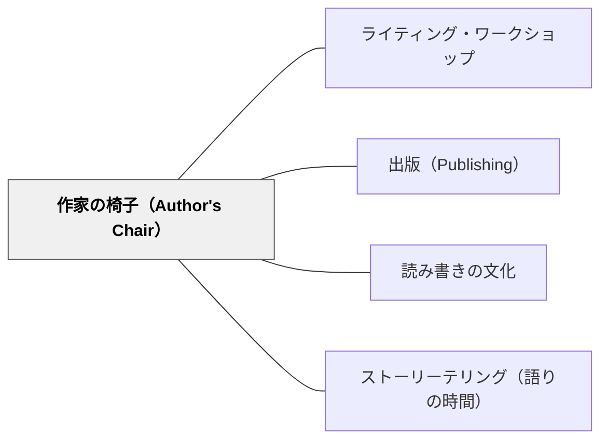

# 作家の椅子（Author's Chair）

> 書いたものを本物の声で読み、仲間がそれに応答する。小さな共有の場が、書き手としてのアイデンティティを育てる。

## 背景（Context）

ライティング・ワークショップでは、子どもが自分の作品を「誰かに読まれるもの」として経験することが重要である。作品が教師に提出されるだけでは、読者は評価者に閉じてしまう。作家の椅子は、完成した作品や書きかけの作品をクラスの仲間に読み聞かせる最小の出版の場である。

## 問題（Problem）

書く活動が個人作業のまま終わると、書き手は「伝わった」「反応が返ってきた」という経験を持ちにくい。推敲や表現の選択も、読者との関係ではなく、教師の評価に合わせる作業になりやすい。

## 解決（Solution）

**授業の終わりや週末に、1〜2人が椅子に座って作品を読み、聴き手が短く応答する時間を設ける。**

最初は普通の椅子でよい。大切なのは、そこに座った子を「作家」として扱うこと、聴き手が評価ではなく読者として反応すること、短くても継続することである。

## 使い方

- 1人5分以内で、書いたものを読み聞かせる
- 聴き手は「心に残った一文」「もっと聞きたいところ」を返す
- 作品の優劣を評定する場にしない
- 完成作品だけでなく、書きかけの一部を読むことも認める

## このパタンが働く実践

- [[実践/ライティング・ワークショップ年度初め]] — 作家の椅子を文化として導入し、書くことを教室の共有財にする。
- [[実践/ローベルみたいな物語を書こう]] — 完成前の構想や作品を読み、仲間の反応を次の推敲に生かす。
- [[実践/詩を紹介する・詩を創作する]] — 詩の紹介や自作詩を声に出して読み、読者の反応を受け取る。

## 関連パタン

- [[パタン/ライティング・ワークショップ]]
- [[パタン/出版（Publishing）]]
- [[パタン/読み書きの文化]]
- [[パタン/ストーリーテリング（語りの時間）]]

## クラスター図

## Actionable Insight

- 今週の最後の5分に、1人だけ「今書いているもの」を読む時間を置く——それだけで、作品に読者が生まれる
- 聴き手には「心に残った一文」か「もっと聞きたいところ」のどちらかを返すよう伝える——評価でなく読者として反応することを最初から明示しておく
- 最初の3回は教師が椅子に座って自分の書きかけを読む——「先生が公開している」というモデルが、子どもの椅子へのハードルを最も下げる

## 出典

- Atwell, N.（1998）In the Middle. Heinemann. / Muschla, G.R.（2006）Writing Workshop Survival Kit, 2nd ed. Jossey-Bass. / Horn, M. & Giacobbe, M.E.（2007）Talking, Drawing, Writing. Stenhouse.
