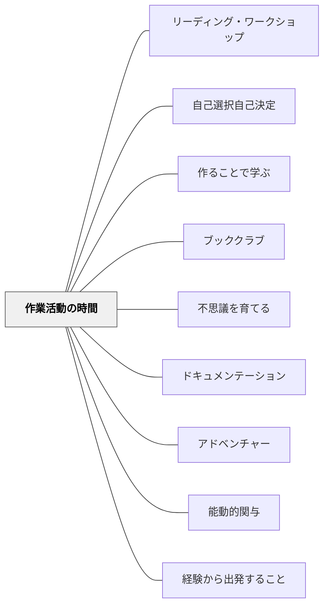

# 作業活動の時間

> 時間・選択・多様な素材・予測できる構造を与えると、予測できないことが起きる。

## Pattern Connection

### Dewey（1916）

Deweyの *Democracy and Education* Ch.14-15は、このパタンの理論的根拠である。Millerの「作業活動の時間」はDeweyの「作業的活動（occupations）」概念の現代的実践版として読むことができる。

- **既存パタンとの関連**：Deweyは「学習者の教科内容は①やり方の知識→②情報→③科学的知識という3段階で発達する」と論じる（Ch.14）。作業活動の時間は、子どもが①のレベルで素材と身体的に関わるところからスタートし、より深い意味への入口となる。ChrisがPompeiiの火山を製作してから「なぜ噴火するか」を調べるのは、この3段階を自然に歩む例そのものである。
- **補強された点**：「なぜ作業的活動が学びになるのか」の根拠が深まる。社会的起源をもつ活動（調理・製作・演劇）は、科学・歴史・言語への本物の入口として機能する——これがDeweyの主張であり、Millerの実践が示した通りのことである。

> "The positive principle is maintained when the young begin with active occupations having a social origin and use, and proceed to a scientific insight in the materials and laws involved."（Ch.14）

> "Work which remains permeated with the play attitude is art—in quality if not in conventional designation."（Ch.15）

**作業活動の時間の3層構造（Deweyの知識3段階と対応）**

| 段階 | Deweyの知識形態 | 作業活動での具体例 |
|---|---|---|
| ①やり方の知識 | 身体的な親しみ・道具の使い方 | 木材で火山を作る・粘土で惑星を並べる |
| ②情報 | 経験に統合された意味ある事実 | 「なぜこの形か」「他の例は」を調べる |
| ③科学的知識 | 概念・法則・理論への展開 | 火山の仕組み・太陽系の構造を体系化する |

- **他のパタンへの波及**：[[パタン/アドベンチャー]]（遊びの態度を保った仕事）・[[パタン/能動的関与]]（doing なくして本物の知識なし）・[[パタン/経験から出発すること]]（doing + undergoing の結合）

---

### Miller（2002）

Debbie Miller（2002）の *Reading with Meaning* 第7章「Digging Deeper」に登場する「Work Activity Time（作業活動の時間）」は、一日の最後の40分に子どもたちが自律的に学びを深める時間として設計されている。

- **既存パタンとの関連**：[[パタン/リーディング・ワークショップ]] の「独立読書・独立実践の時間」を拡張した概念。授業時間外の「遊びと学びの融合」
- **補強された点**：[[パタン/自己選択自己決定]] に「子どもが本物の問いを持ち込む時間」という構造が加わる。選択肢は「教師が決める5択」でなく「子どもが自分で決める完全自由」
- **他のパタンへの波及**：[[パタン/作ることで学ぶ]] に「学んだことを体で表現する」という実践例が加わる。[[パタン/ブッククラブ]] が「放課後の自然な読書クラブ」として機能し始める

---

## 背景（Context）

ストラテジー指導を積み重ねていると、子どもたちは「学んだことを自分で使ってみたい」という動機を持つようになる。しかし授業中は教師が設計した活動の枠の中で動くことが多く、子どもが「自分で学びを生み出す」場が限られている。

一日の最後に「予測できる自由な時間」があると、子どもたちは安心して「次に何をしたいか」を考え始める。この時間を「休み時間」ではなく「作業活動の時間」と名づけることで、学びの場として意味づけられる。

## 問題（Problem）

読解ストラテジーを教えても、それが「授業の中だけで使うもの」になる。子どもが「学んだことを自分の好きなことに使う」機会がない。豊かな学びは「教師の設計した課題」の中だけでは実現しない。

## 力のかたち（Forces）

- 子どもには「学んだことを自分で使ってみたい」という本来の動機がある
- 完全な自由より「予測できる構造の中での自由」の方が、子どもは安心して動ける
- 多様な素材（ブロック・レゴ・Beanie Babies・付箋・紙・本・道具）が発想を広げる
- 「今日何をしたいか」を毎回自分で決める体験が、自律的な学習者の感覚を育てる

## 解決（Solution）

**一日の最後の40分を「作業活動の時間」として設け、子どもたちが自分で決めたテーマ・形式・素材で学びを深める時間を保障する。教師は見守り・記録・共有の設計を担う。**

---

### Miller クラスの実際（第7章の事例）

| 子ども | 活動内容 | ストラテジーとの接続 |
|---|---|---|
| Olivia | Oliver Button Is a Sissy のブック・クラブを自分でリードする | 統合・問いを持つ |
| Chris | 木・紙で Pompeii の火山を製作し、説明する | ノンフィクション学習の応用 |
| Sunny, Seth, 他 | The Stinky Cheese Man のドラマを演じる | 推論・メンタル・イメージ |
| Thad | JFK 暗殺についての「授業」をクラスに行う | 重要性の判断・統合 |
| 4人グループ | 犬の研究：毛のサンプルを比較・観察 | ノンフィクション探究 |
| 他のグループ | Little Bear の世界を木製ブロックで再現 | スキーマ・メンタル・イメージ |

> 「子どもたちの話は『粘土でピザを作りたい』から『粘土で惑星を太陽からの順番に並べて、幼稚園のみんなに説明したい』に変わっていった。素材はもはや目的ではない——理解を作り出す手段になっていた」（Miller）

---

### 設計のポイント

| 要素 | 内容 |
|---|---|
| **時間** | 一日の最後の40分（予測できる構造） |
| **選択** | テーマ・形式・素材をすべて子どもが決める |
| **素材の多様性** | 本・ブロック・レゴ・Beanie Babies・付箋・紙・道具・カード等を常に補充 |
| **教師の役割** | 見守り・記録・週1回の「共有の時間」での紹介 |
| **評価** | 「今日何をしたか」「次に何をしたいか」を簡単に記録する |

---

### 日本版での応用

- **帰りの会の前の30分**：「今日学んだことを使って何かしよう」という自由時間として設定
- **素材の用意**：図書コーナー・画用紙・折り紙・付箋・学年相応のブロックや道具
- **特別支援学級での応用**：「今日やりたいこと選択ボード」を視覚化し、3〜4択から選ぶ形にする
- **週1回の共有**：「今週誰が何をしたか」を朝の会か帰りの会で5分間共有する——「あの子みたいなことをやってみたい」が生まれる

---

## 結果（Consequences）

- 「授業で学んだことを自分で使う」という応用の場が生まれる
- ブック・クラブが「教師が設定したもの」ではなく「子どもが自然に始めたもの」になり始める
- 子どもが「教える側」に回る経験（Thad のJFK授業）が、理解を深める
- 学んだことが「本物の活動」に転化するとき、ストラテジーは真に内面化される
- ただし、素材が少なく・時間が予測できず・共有の場がないと、単なる「暇な時間」になる

## 関連パタン

- [[パタン/リーディング・ワークショップ]] — 読書ワークショップの延長・発展として機能する
- [[パタン/自己選択自己決定]] — 時間・テーマ・素材をすべて自分で決める
- [[パタン/作ることで学ぶ]] — 学んだことを作品・劇・研究として形にする
- [[パタン/ブッククラブ]] — 作業活動の時間中に自然発生的に起きる読書クラブ
- [[パタン/不思議を育てる]] — Wonder Box の問いが作業活動の探究テーマになる
- [[パタン/ドキュメンテーション]] — 作業活動を記録・掲示することで学びが可視化される
- [[パタン/アドベンチャー]] — 遊びの態度を保った仕事という概念で接続する
- [[パタン/能動的関与]] — doingなくして本物の知識なし（Dewey）
- [[パタン/経験から出発すること]] — 身体的な作業活動が経験の起点になる

## クラスター図

## Actionable Insight

- 今週1回、授業の最後の10分を「今日学んだことを使って何か作る・書く・話す時間」として試してみる——5分の共有を加えるだけで、子どもの動機が変わる
- 「作業活動の時間」という名前をつけて（「自由時間」とは呼ばない）、それが「学びの時間」であることを伝える
- 教師は最初の数回、子どもたちが何をするか観察するだけにする——指示や提案は後から

## 出典

Miller, D. (2002). *Reading with Meaning: Teaching Comprehension in the Primary Grades*. Stenhouse Publishers.

> "Providing time, choice, a variety of materials for a wide range of responses, and a predictable structure children can count on allows the unpredictable to happen."

[[文献/Reading with Meaning（Miller）]]
