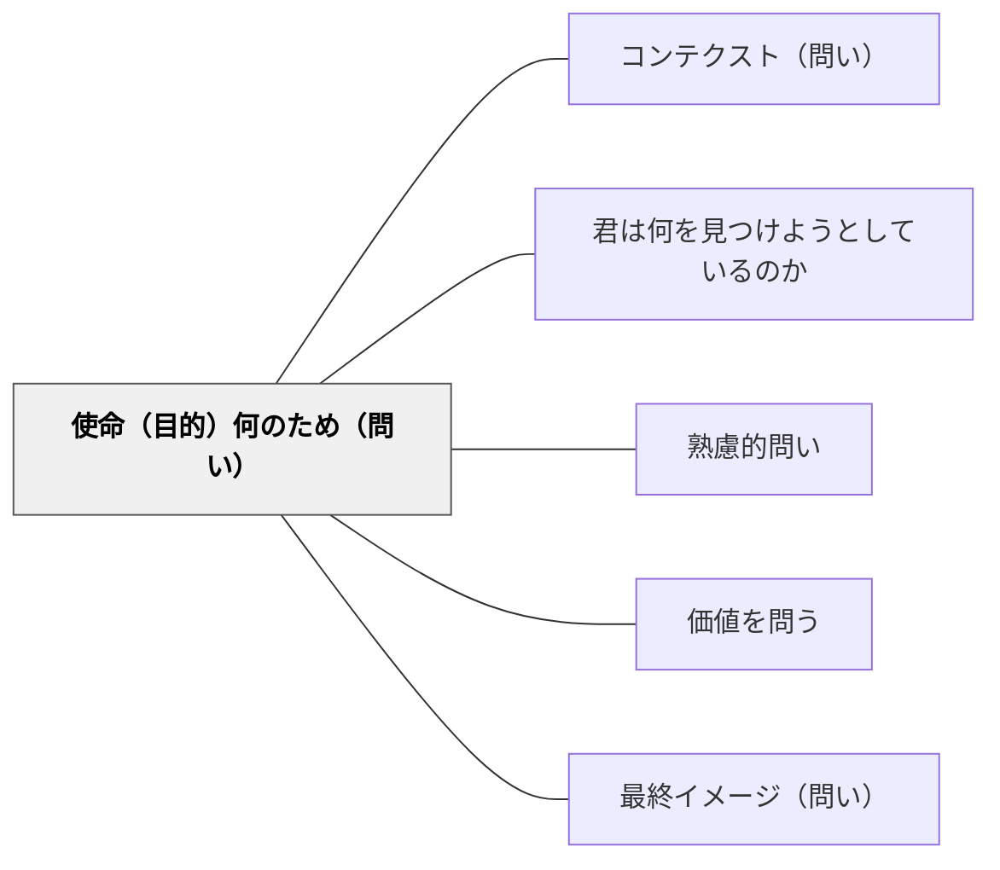

# 使命（目的）何のため（問い）

> 「何のためにするのか」と目的・使命・意義を問うことで、学習者は行動の方向性と意味を自ら構築する。

## 背景（Context）
活動や学習課題を与えられた学習者は、しばしばその「目的」を深く考えないまま動き始める。なぜこれをするのか、誰のためになるのか、何を達成しようとしているのか——これらを問われる機会がなければ、学びは手順の実行にとどまりがちである。目的意識は内発的動機の核心であり、明確な使命感は行動の質を変える。

## 問題（Problem）
目的を問われない学習者は、課題を「こなすべきもの」として受け取る。なぜこの学習をするのかが分からなければ、困難に直面したときに踏ん張る理由を見つけられない。また、表面的な課題達成（点数・提出）を本当の目的と混同してしまうリスクがある。

## 力のかたち（Forces）
- 目的が明確であるほど、手段の選択と優先順位づけが効果的になる
- 「何のため」は個人・他者・社会の三層で問うことができ、それぞれ異なる動機を引き出す
- 目的を問う問いは、学習者が自分の価値観と結びつける機会を与える
- 過度に抽象的な使命感の問いは、実践との乖離を生む可能性がある

## 解決（Solution）
単元の始めに「なぜこれを学ぶのだろう？誰の役に立つのだろう？」と問いかける。プロジェクト学習では「このプロジェクトは何を達成しようとしているのか？」を繰り返し問い直すチェックポイントを設ける。例えば、理科の実験前に「この実験で何を確かめようとしているのか？」と問い、実験の目的を自分の言葉で言わせる。発表の場では「あなたがこれを伝えたい一番の理由は？」と使命を問う。

## 結果（Consequences）
- 学習者が「なぜやるか」を自分の言葉で語れるようになり、内発的動機が高まる
- 学習プロセスにおける判断や優先順位が明確になり、主体的な取り組みが増える
- 個人の学びが他者・社会とつながる感覚が生まれ、協働への意欲が高まる

## 関連パタン
- [[パタン/コンテクスト（問い）]]
- [[パタン/君は何を見つけようとしているのか]]
- [[パタン/熟慮的問い]] — 親パタン
- [[パタン/価値を問う]] — 価値と使命は補完的な問いの次元
- [[パタン/最終イメージ（問い）]] — 使命と最終イメージをセットで問うと目的が具体化する

## クラスター図

## Actionable Insight

- 単元の最初に「この学習は誰の役に立つのだろう？」と問い、学習者に一文で書かせる——目的を自分の言葉で語る経験が内発的動機の基盤になる
- 実験・観察・調べ学習の前に「この活動で何を確かめようとしているのか」を口に出して言わせてから始める——目的の言語化が途中でぶれない探究の姿勢をつくる
- 発表の準備段階で「あなたがこれを一番伝えたい理由は？」と問う——使命を言語化することで発表の焦点と熱量が変わる

## 出典
- [[文献/熟慮的問いのパターンリスト（動画記録）]]
