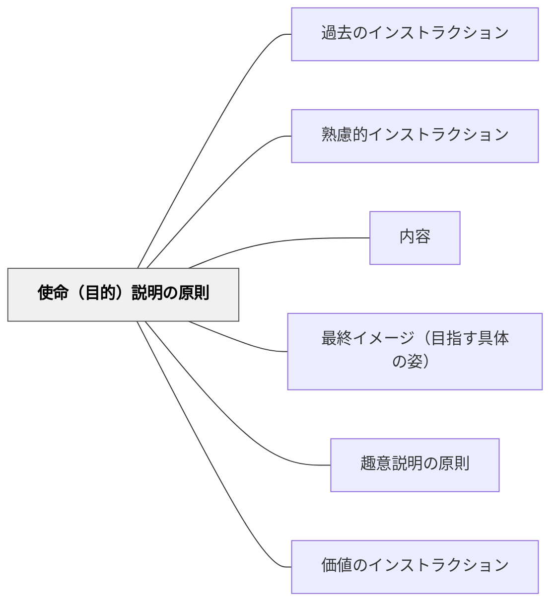

# 使命（目的）説明の原則

> 何のためのインストラクションかを最初に伝えることが、すべての起点になる。

## 背景（Context）
ワーマンはインストラクションの内容を6要素で整理し、その最初に「使命（ミッション）」を置いた。使命とは「何のためにこれをするのか」という目的のことであり、最終イメージ（具体的なゴール）とは区別される。使命は真っ先に与えられるべき要素である。

## 問題（Problem）
使命が不明確なまま手順だけが伝えられると、受け手は「なぜこれをやるのか」がわからないまま動く。方法に縛られ想像力が削がれ、想定外の状況に対応できなくなる。アビアンカ航空事故は「燃料が切れそうだ」という手順は伝えたが「緊急事態」という使命が管制に伝わらなかった悲劇的な例である。

## 力のかたち（Forces）
- 使命が明確だと受け手は自分の判断で手順を補えるようになる
- 使命が曖昧だと手順の一つが失敗したとき全体が止まる
- 使命を伝えることへの抵抗（「そこまで説明しなくてよい」という感覚）がある
- 使命は最終イメージより抽象的であり、両方必要

## 解決（Solution）
**インストラクションの冒頭に「何のために」という使命を明示する。手順に入る前に、目的を一文で伝える。**

「今日のゴールは○○です」「これをやる目的は△△のためです」という形で最初に使命を示す。使命が伝わると受け手は手順の一部が不明確でも自分で補える。使命と最終イメージ（具体的な完成形）は別物であり、両方を示すことで受け手の理解が深まる。

## 結果（Consequences）
- 受け手が主体的に判断できる余地が生まれる
- 手順の一部が抜けても使命に基づいて対応できるようになる
- 「なぜ動かなかったのか」の原因が使命の欠如として特定しやすくなる

## クラスター図

## Actionable Insight

- インストラクションの最初に「今日のゴールは○○です」と使命を一文で伝えてから手順に入る——使命が明確だと受け手は手順の一部が不明確でも自分で補える判断力を持てる
- 「なぜこれをやるか」を省かず伝える習慣を作る——使命なき手順だけの指示が受け手を「言われたから動く」状態に固定してしまうことを意識する
- 学習者が止まったとき「この活動の目的は何だったか思い出してみよう」と使命に立ち返らせる——使命への参照が想定外の状況への自律的な対応力を育てる

## 出典

- 一つの教育のパタン・ランゲージ（岩井輝久）

## 関連パタン
- [[パタン/過去のインストラクション]]
- [[パタン/熟慮的インストラクション]] — 親パタン
- [[パタン/内容]] — 6要素の枠組み
- [[パタン/最終イメージ（目指す具体の姿）]] — 使命と対で必要な要素
- [[パタン/趣意説明の原則]] — 向山洋一による類似概念
- [[パタン/価値のインストラクション]] — 意味・価値の伝達
