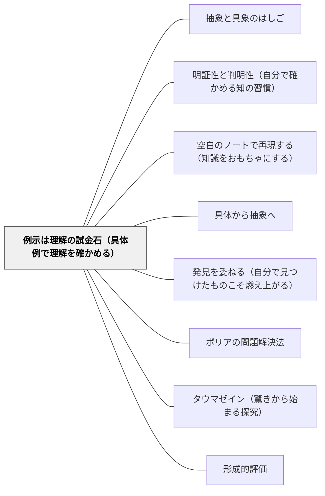

# 例示は理解の試金石（具体例で理解を確かめる）

> 「《例示は理解の試金石》だから、具体例が作れたということは、ユーリは証明したいことをよく理解しているといえる」（結城浩, 2014）

---

## [Pattern Connection]

### 数学ガールの秘密ノート・整数で遊ぼう（結城浩, 2014）——具体例生成が理解確認の最強手段

第1章「足しても引いても同じ数」の核心エピソード。3の倍数判定法の証明を一般式（n = 100a + 10b + c）で説明した後、ユーリが自分で「n=123」という具体例を作って確かめた。語り手がそれを見て：

> 「《例示は理解の試金石》だから、具体例が作れたということは、ユーリは証明したいことをよく理解しているといえる」

**なぜ具体例生成が理解の証明になるのか：**

一般規則に従う具体例を「生成」するには、規則の意味を内面化していなければならない。
- 規則の「記憶」だけでは、新しい具体例は作れない
- 規則の「適用手順」だけでも、制約条件を満たす例を選べない
- 規則の「意味」が分かって初めて、任意の具体例を生成・検証できる

教科書の例を「追う」ことと、自分で「作る」ことは全く異なる認知的活動である。後者は前者より深い処理を要求する。

**「例示は試金石」の方向：抽象→具体（逆向きの移動）：**

[[パタン/具体から抽象へ]] が「複数の具体から共通の抽象を掴む」という学習の方向を示すのに対し、本パタンは逆方向——「習得した抽象（規則・定義・定理）から、それを満たす具体例を生成できるか」を確認する。この往復（抽象→具体→抽象）が理解を深める。

- **既存パタンとの関連**:
  - [[パタン/明証性と判明性（自分で確かめる知の習慣）]] との核心的な接続——「明証性の確認の四問」の第1問「自分の言葉で説明できるか」に、「例を作ることで確かめられるか」が具体的な実践手段として加わる。「例示は試金石」は明証性確認の最も強い実践形態。
  - [[パタン/空白のノートで再現する（知識をおもちゃにする）]] との補完——「白紙に再現できるか」（手続きの再現）と「具体例を作れるか」（規則の内面化）は相互補完的な確認方法。前者は「どうやるか」を確認し、後者は「何を言っているか」を確認する。
  - [[パタン/具体から抽象へ]] との相補関係——学習は「具体→抽象」の方向で進むが、理解の確認は「抽象→具体（例生成）」という逆方向の操作が必要。往復が理解を深める。

- **補強された点**:
  - [[パタン/発見を委ねる（自分で見つけたものこそ燃え上がる）]] — 「例を作ってみて」という問いかけが、学習者が自ら構造を探索する「水を向ける」行為として機能する。発見の設計として使えるとともに、理解の確認手段としても使える。

- **他のパタンへの波及**:
  - [[パタン/ポリアの問題解決法]] — Step 1「問題を理解する」の確認として「例を作ってみよう」が使える。問題文を「理解した」かどうかは、条件を満たす例を作れるかどうかで確認できる。

---

## 背景（Context）

授業で新しいルール・定義・定理を学習した後、「わかりましたか？」と聞くと子どもたちは「はい」と答える。しかし「わかった」の内実は大きく異なる。

「理解した」状態には少なくとも二つの層がある。
- **手続き的理解**：問題を解く手順が追えること
- **概念的理解**：そのルールが何を言っているか（意味が分かること）

教師が「分かった」と判断しても、学習者が「解き方のパターンを覚えた」だけで意味を理解していないケースは多い。この差異を可視化する最も簡単な方法が「具体例を作ってみて」という問いである。

## 問題（Problem）

「わかりましたか？」への「はい」は理解の証明にならない：

- ルールを文字で言えても、そのルールに当てはまる例を作れない
- 解法の手順を追えても、似た問題の設定を自分で作れない
- 定義を読めても、「この例は定義に当てはまるか」の判断ができない
- 教師が例を示すとき「なるほど」と感じるが、別の例を考えると作れない

この状態は「例を追う」能力が「例を作る」能力に転化していないことを示す。

## 力のかたち（Forces）

- 「例を追う」は受動的でコストが低い——「例を作る」は能動的でより高い認知的要求がある
- 「例を作る」ことが失敗すると恥ずかしい——心理的安全性が低い環境では例生成の試みが起きにくい
- 「どんな例でもいい」という許可が必要——「正解の例」を求めると例生成が委縮する
- 「例を作れなかった」ことが、次の学習の正直な出発点になる——失敗が診断情報として機能する
- 「例示は試金石」という言葉自体を知ることが、自己確認の習慣を育てる

## 解決（Solution）

**新しいルール・定義・概念を学習した後、「それに当てはまる具体例を自分で作ってみる」という確認ステップを組み込む。「例を作れたら理解の証拠、作れなかったら次の出発点」という文化を作る。教師が「例を出して」と問うだけで、理解の実態が可視化される。**

---

### 「例示の試金石」の三段階

**1. 簡単な例を作る（確認）**: 「この規則を満たす最も簡単な例を一つ作ってみよう」——最初は規則に「明らかに当てはまる例」を作るだけ。これが最初の確認。

**2. 境界例を作る（深化）**: 「この規則がギリギリ成り立つ例・成り立たない例を作ってみよう」——境界にある例を考えることで、規則の「範囲」が明確になる。

**3. 反例を作る（批判的確認）**: 「この規則が成り立たない場合はあるか」——反例を探すことが、規則の「条件の必要性」を理解する。

---

### 具体例

**例1：算数「3の倍数の判定」**
「3の倍数とは各桁の和が3の倍数になるもの」を学習した後：「3の倍数の例を3つ作ってみよう。そして3の倍数でない例も1つ作ってみよう。」——作れれば規則の意味を理解している。作れなければ「各桁の和を計算する」という操作と「3で割り切れる」という概念が切断されたまま。

**例2：国語「比喩（たとえ）の表現」**
「比喩とはある物事を別の物事にたとえる表現」を学習した後：「今日の授業を比喩を使って表現してみよう」——比喩を作れる子は「たとえる」という操作を内面化している。「わかった」と言っていても作れない子は、例を追っていたに過ぎない。

**例3：数学「素数の定義」**
「素数とは1と自分以外に約数を持たない自然数（ただし1を除く）」を学習した後：「10から20の間の素数をすべて挙げよ」——1を含めてしまう、20を素数だと思う——どの誤りも定義の「どこを理解していないか」を示す診断情報になる。

**例4：岩井の数学デイリー（自己教育実践）**
公式・定理を使った問題を解いた後、「別の数字でこの定理を使う問題を自分で作れるか」を確認する。作れれば「定理を理解して使った」であり、作れなければ「当てはめ方を暗記しただけ」である。「例を自作する」ことが次の問題への橋渡しになる。

**例5：定義の「先生テスト」（教師への適用）**
教師が学習者に概念を説明した後、「先生が作る例と間違いの例（罠）を並べて、どちらが正しいか当てて」という活動——教師が例を「作る」ことと「分類させる」ことの両方が、概念理解の確認になる。

---

## 結果（Consequences）

- 「例を作れた」という体験が「本当に理解した」という確信を与える——安易な「分かった」より根拠のある確信が育つ
- 「例を作れなかった」ことが、どこが分からないかを正直に示す——曖昧なまま進む問題が減る
- 「例を作る」習慣が身につくと、新しい概念を学ぶときに「まず例を作ってみよう」という自律的な確認行動が生まれる
- 教師が「例を出して」と一言問うだけで、クラス全体の理解の実態が30秒で可視化される
- ただし、「例を作る」ことが「正解の例を当てること」に変わると、試金石でなく試験になる——「どんな例でもいい」「間違いも情報」という文化が前提

## 関連パタン
- [[パタン/抽象と具象のはしご]]

- [[パタン/明証性と判明性（自分で確かめる知の習慣）]] — 「例が作れるか」が明証性確認の実践形態
- [[パタン/空白のノートで再現する（知識をおもちゃにする）]] — 再現（手続き）と例生成（意味）は相補的確認
- [[パタン/具体から抽象へ]] — 学習の方向（具体→抽象）の逆をたどる確認（抽象→具体）
- [[パタン/発見を委ねる（自分で見つけたものこそ燃え上がる）]] — 「例を作ってみて」が発見の水向けになる
- [[パタン/ポリアの問題解決法]] — Step 1「問題を理解する」の例示確認への応用
- [[パタン/タウマゼイン（驚きから始まる探究）]] — 「この例は規則に当てはまるか？」という問いが驚きを生む
- [[パタン/形成的評価]] — 例生成は最も診断的な形成的評価の手法
- [[文献/数学ガールの秘密ノート・整数で遊ぼう（結城浩）]] — 本パタンの出典

---

## クラスター図

## Actionable Insight

- 新しいルールや定義を教えた直後、「これを使った例を一つ作ってみて（自分で数を選んでいいよ）」と2分間取る——作れるか作れないかが即座に理解の実態を示す。「作れなかった場所」が次の授業の出発点になる。
- 「例を作れたら理解の証拠」という言葉を一度クラスで共有する——学習者自身が「例を作って確かめる」という自律的な確認行動を持てるようになる。「バシッとわかったかどうか」を自分で試す方法として渡す。
- 数学デイリーや自学ノートで「今日使った公式・定理を使う問題を1問自作する」を一行習慣にする——問題を解くだけでなく問題を作ることが、理解を「おもちゃにする」第一歩になる。

---

## 出典

結城, 浩（2014）.『数学ガールの秘密ノート／整数で遊ぼう』SBクリエイティブ. 第1章.

> 「《例示は理解の試金石》だから、具体例が作れたということは、ユーリは証明したいことをよく理解しているといえる」——第1章
