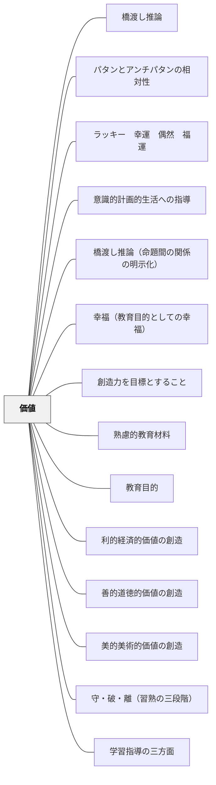

# 価値

> 全ての教科・教育材料は「価値」から出発している。— 牧口常三郎

## Pattern Connection

### 牧口常三郎（1931）——価値論の深化：認識と評価の区別・正反価値・利善美の体系

*創価教育学体系 第2巻* は「利・善・美」体系の理論的根拠を詳述し、本パタンを補強・拡張する。

**真理と価値の根本的区別**

従来の哲学が「真善美」を同列に扱ってきたことを批判し、「真（真理）」は認識の領域、「価値」は評価の領域として峻別した。

- **認識**：対象の実在と表現との質的一致を判断する作用——客観的・不変
- **評価**：対象と評価主体（生命）との関係力の量を測定する作用——主観的・可変

> 「真理は創造する事は出来ない。ただ自然にあるがままを吾々が見出すに留まったものである。之に反して価値は創造し得る」

この区別が「**真善美**」から「**利善美**」への転換の論理的根拠である。「真（真理）」は価値ではなく認識の対象であるため、価値体系からは除外される。

**認識と評価の混同が生む教育問題**

> 「生徒が教師に『何ですか』と質問する。この場合に『まだこんな事が解らないのか』と反費するならば、これは明らかに認識作用と評価作用とを混希したるものではないか」

質問への叱責・先入観による評価・付和雷同——これらすべてが認識作用と評価作用の混同から生じる。教師が「認識させる」場面と「評価させる」場面を区別することが指導の前提となる。

**正価値・反価値の概念**

価値には「有価値・無価値」だけでなく、**正価値（積極的価値）と反価値（消極的価値）**の対立がある。生命の保全・伸長に有益なものが正価値、有害なものが反価値。数学の正数・負数の対立に相当する。

> 「反価値が正価値を生み、正価値が反価値を生む場合がある」

**価値の本質 = 関係力**

> 「価値とは目的に対する手段の関係に立つ実在がその目的を達成せしむる力の総量をいう」

価値はモノに内在する固定した性質ではなく、評価主体とモノの関係性から生じる。同じ炭でも夏と冬では価値が変わる——価値は人・時・状況によって変わる相対的なものである。

- **他のパタンへの波及**：[[パタン/守・破・離（習熟の三段階）]]（価値創造の方法論）・[[パタン/意識的計画的生活への指導]]（意識的創価作用が教育の対象）

---

### 牧口常三郎（1930）——三育論の批判と価値教育の位置づけ

*創価教育学体系 第1巻* 第一編第三節は、伝統的な「智育・徳育・体育の三育並立」が教育の誤解を生んでいると批判し、価値教育（利育・善育・美育）の正しい位置づけを示す。

- **既存パタンとの関連**：本パタンが「利・善・美の三価値」を概説するのに対し、この Pattern Connection は「なぜ三育並立が誤りで、価値教育が智育に内包されるのか」という**構造的理由**を補強する。

**三育論の批判**

従来の「智育・徳育・体育の三育並立」は、あたかも植物・動物が相対立並存するように三つを同列に扱う誤りを犯している。これが「智育が進むと徳育が衰える」「体育と智育は対立する」といった思想的混乱を生む。

**正しい構造**

| 区分 | 内容 |
|---|---|
| **体育** | 身体的活動——行動訓練 |
| **智育**（価値意識） | **利育**（経済的・実用的価値の創造） |
|  | **善育**（道徳的・社会的価値の創造） |
|  | **美育**（審美的・芸術的価値の創造） |

「徳育は智育の一部であり、徳育を含まない智育はあるが、**智育を含まない徳育は成立しない**」——これが牧口の根本主張。道徳的行為には必ず道徳的知識が先行する。

**二育並行論**

三育を並立させるのでなく、**体育と智育を並行させる**のが正しい。体育と智育は「一体両面」の関係（相互に包合しなければ成立しない）。智育と徳育は「全体と一部分」の関係で、発生に前後がある。

> 「体育的に智育し、智育的に体育し、少なくとも両者の相背反妨害しない程度方法に、教育せんとするのが三育並行の不合理を捨てたる、新主張二育並行論の要旨である」

- **他のパタンへの波及**：[[パタン/利的経済的価値の創造]]・[[パタン/善的道徳的価値の創造]]・[[パタン/美的美術的価値の創造]]（三育が「並立」でなく智育に内包される価値として設計される）

### 岩井輝久（2023）——牧口の教育哲学はパタン・ランゲージのメタパタン

岩井は「一つの教育のパタン・ランゲージ」の思考記録の中で次の洞察を記している：

> 「牧口の教育哲学は、教育パタンを作るためのパタンだと気づいた。他の大パタンとは違うレベルにある。つまり、牧口の教育哲学は、パタン・ランゲージのパタンである。」（岩井輝久、2023）

「イメージ」「ボトルネック」「制限化」「ソーシャル」などの大パタンは、実際の教育設計・実行の局面で使う「一階」のパタンである。それに対し、牧口の教育哲学——経験から出発する・価値を目標とする・経済を原理とする——は、どのようにパタンを構成し、どう選び、どう組み合わせるかという「二階」の原理であり、**メタパタン**として機能する。

**三つのメタパタン**

| メタパタン | 内容 |
|---|---|
| **経験から出発する** | 自分の実践・観察・読書・聞いた話から出発する——先行理論を輸入するのではなく、経験を観察してパタンを名づける |
| **価値を目標とする** | 利・善・美のいずれの価値を育てるかを目標にしてパタンを設計する——パタンは「良い結果（価値）の原因」として見出される |
| **経済を原理とする** | 教育力（時間・費用・労力）の無駄を最小化するパタンを選ぶ——同じ効果を得るなら少ない介入で |

この区別が実践的に重要なのは、どのパタンをどの順で重ね、どう組み合わせるかを判断する基準がメタパタンに宿るからである。「どのパタンを使うか」の判断力は、個々の大パタンの知識からでなく、メタパタンへの理解から育つ。

- **他のパタンへの波及**：[[自分のパタンを作る]]（メタパタンの実践的応用はパタンを自分で作る行為と一体）・[[パタン/教育目的]]（「価値を目標とする」というメタパタンは教育目的論と直結する）

---

## 背景（Context）

牧口常三郎（1871-1944）は「創価教育学体系」において、教育の目的を「価値の創造」と定め、価値を利的経済的価値・善的道徳的価値・美的美術的価値の3種に分類した。数学にも国語にも体育にも固有の価値があり、それが教科として存在する根拠となる。

## 問題（Problem）

価値の根拠を問わないまま教科・教材を扱うと、なぜそれを教えるのかが分からなくなり、学習者の動機付けにも影響が出る。

## 力のかたち（Forces）

- 教育材料には利・善・美のいずれかの価値が含まれる
- 同じ素材でも価値の切り口によって教材化の方向が変わる
- 価値の問いは常にその時代の文化・社会に依存する

## 解決（Solution）

**教育材料を選択・設計する際に、その教材が育てる価値（利的・善的・美的）を意識する。価値の3分類を軸に教材の意義を問い直す。**

## 結果（Consequences）

- 教材選択に根拠が生まれる
- 教科横断的な視点で教育材料を設計できる

## 関連パタン
- [[パタン/橋渡し推論]]
- [[パタン/パタンとアンチパタンの相対性]]
- [[パタン/ラッキー　幸運　偶然　福運]]
- [[パタン/意識的計画的生活への指導]]
- [[パタン/橋渡し推論（命題間の関係の明示化）]]
- [[パタン/幸福（教育目的としての幸福）]]
- [[パタン/創造力を目標とすること]]

- [[パタン/熟慮的教材教具]] — 親パタン
- [[パタン/教育目的]] — 価値から目的へ
- [[パタン/利的経済的価値の創造]] — 価値の分類①
- [[パタン/善的道徳的価値の創造]] — 価値の分類②
- [[パタン/美的美術的価値の創造]] — 価値の分類③
- [[パタン/守・破・離（習熟の三段階）]] — 価値創造への習熟の道
- [[パタン/学習指導の三方面]] — 価値の三分類（利・善・美）が学習指導の三方面（認識・評価・創価）と交差する

## クラスター図

## Actionable Insight

- 教材を選ぶときに「この教材が育てるのは利的・善的・美的のどの価値か」を一言で答えてみる——価値の意識化が教材選択に根拠と一貫性をもたらす
- 同じ学習内容を「これは生活に役立つ（利）」「これは人として大切（善）」「これは美しい（美）」の3視点から説明してみる——切り口の違いが学習者の多様な関心に応える
- 授業の終わりに「この学習で何の価値を得たか」を学習者に1文書かせる——価値の言語化が学びの意味を深め内発的動機を育てる

## 出典

- 牧口常三郎（1972）『牧口常三郎全集第4巻 創価教育学体系 上』聖教新聞社
- [[文献/創価教育学体系 1（牧口常三郎）]] — 三育論批判・二育並行論
- [[文献/創価教育学体系 2（牧口常三郎）]] — 認識と評価の区別・利善美の体系・正反価値
