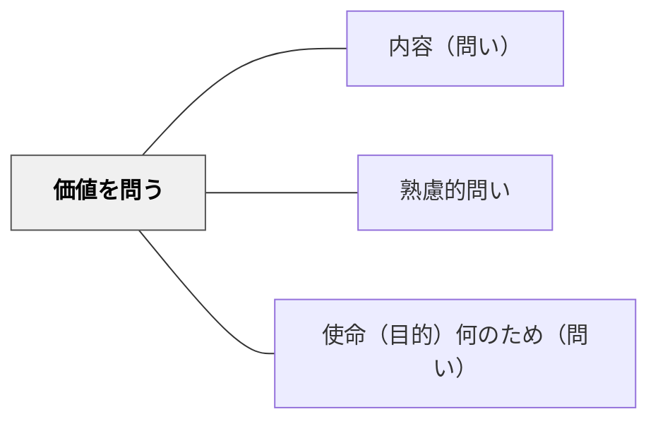

# 価値を問う

> 「この学びの良さ・意義は何か」と問うことで、学習者は知識の価値を自ら発見する。

## 背景（Context）
学校での学びは、教師が「これが大切だ」と一方的に伝えることが多い。しかし、学習者が価値を自ら発見しなければ、学びは受け身の暗記にとどまりやすい。算数の考え方には優雅さがあり、文学には美しさがあり、理科の法則には普遍性がある。それぞれの学問の「よさ」は問われなければ気づかれないまま過ぎ去る。

## 問題（Problem）
価値を問われない学習者は「なぜ学ぶのか」という問いに答えられない。算数を「計算の練習」としか見なかったり、文学を「物語の暗記」としてしか経験しなかったりする。学びの意義が見えないと、外発的動機のみに依存し、深い理解や主体的な探究が生まれにくい。

## 力のかたち（Forces）
- 学習者は意味や価値が見えないと動機を維持しにくい
- 「なぜ大切か」は教えることもできるが、問われることで初めて腑に落ちる
- 教科の本質的な美しさや面白さは、発見的に気づくことに価値がある
- 価値を問う問いは、教科横断的な思考力とも結びつく

## 解決（Solution）
授業の中で「この考え方の良さはどこにあると思う？」「なぜこのやり方が優れているんだろう？」と具体的に問いかける。例えば、算数でかけ算を学んだ後に「たし算でなくかけ算を使うことの良さは何か？」と問う。文学では「なぜこの表現が選ばれたと思う？」と問い、表現の選択に込められた価値を探らせる。価値の次元（美しさ・効率・公平さ・普遍性など）を学習者が言語化できるよう、必要に応じて観点を提示する。

## 結果（Consequences）
- 学習者が「なぜ学ぶのか」を自分の言葉で語れるようになる
- 教科の本質的な魅力に気づき、内発的な探究心が育まれる
- 学びを評価・批評する視点が身につき、批判的思考と結びつく

## 関連パタン
- [[パタン/内容（問い）]]
- [[パタン/熟慮的問い]] — 親パタン
- [[パタン/使命（目的）何のため（問い）]] — 目的と価値は相補的な問い

## クラスター図

## Actionable Insight

- 算数でかけ算を学んだ後に「たし算でなくかけ算を使うことの良さは何か？」と問う——教科の本質的な美しさや効率を発見的に気づかせる
- 文学で「なぜこの表現が選ばれたと思う？」と問い、表現の選択に込められた価値を探らせる——学習者が内発的に学びの意義を感じる
- 単元末に「この単元で学んだことの一番価値があると思うところは？」を一文書かせる——学習者が「なぜ学ぶのか」を自分の言葉で語れるようになる

## 出典
- [[文献/熟慮的問いのパターンリスト（動画記録）]]
