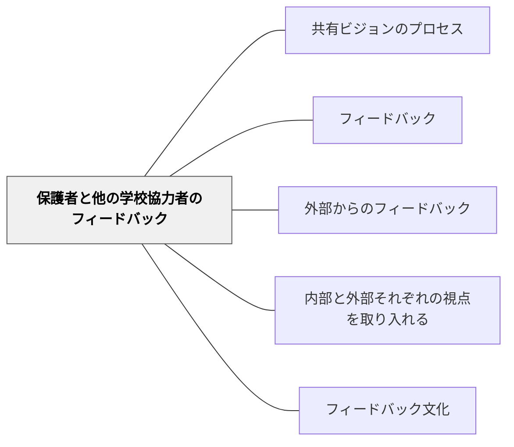

# 保護者と他の学校協力者のフィードバック

> 保護者・地域・他の教員・専門家という外部の視点が、学習を内側からでは見えない角度から豊かにする。

## 背景（Context）

学習者の育ちは学校の中だけで完結しない。家庭での学習の様子・保護者が見る成長・地域での活動・他の専門家から見た可能性など、学校の教師だけでは把握できない情報が学習者の周囲に存在する。保護者や地域の協力者からのフィードバックは、その多様な視点を学習に持ち込む機会となる。

また、保護者・地域・他校の教員などが学習の評価に関わることで、学校の閉じた評価基準を開き、社会のより広い文脈から学習を捉え直すことが可能になる。

## 問題（Problem）

日本の学校文化では、フィードバックは教師が学習者に与えるものという一方向のイメージが強い。保護者・地域からのフィードバックを授業設計に組み込む仕組みが整っていないことが多く、家庭との連絡が行事・連絡帳・個人面談に限られてしまう。

一方で、外部からのフィードバックを無条件に受け入れることも問題がある。学習の目標・文脈を共有せずに外部評価を行うと、的外れな批評が学習者を傷つけることもある。外部協力者との事前のすり合わせが重要である。

## 力のかたち（Forces）

- 保護者・地域からのフィードバックは学校の外での学習者の姿を伝え、多面的な理解を促す
- 外部の専門家・地域人材からのフィードバックは内部基準を超えた視点をもたらす
- 外部評価を機能させるためには、評価の文脈・基準の共有と関係性の構築が必要

## 解決（Solution）

単元設計において、保護者・地域・他の専門家がフィードバックに参加できる機会を意図的に設ける。発表会・展示・地域への提案発表などは、外部協力者が自然にフィードバックを与えられる場となる。

保護者に対しては、評価の基準と目的を事前に伝え、「どんなことを見てほしいか」を明示することで、有用なフィードバックが集まりやすくなる。[[パタン/外部からのフィードバック]]の考え方と連動させ、保護者を「評価者」ではなく「学習のパートナー」として位置づけることが重要である。

## 結果（Consequences）

- 学校外の多様な視点が学習に持ち込まれ、学習の意味と文脈が豊かになる
- 保護者が学習プロセスに関わることで、家庭学習への理解と支援が深まる
- 外部フィードバックの質を保つためには、文脈共有と関係構築の準備が必要

## 関連パタン
- [[パタン/共有ビジョンのプロセス]]

- [[パタン/フィードバック]] — 親パタン
- [[パタン/外部からのフィードバック]] — より広い外部視点のパタン
- [[パタン/内部と外部それぞれの視点を取り入れる]] — 外部と内部の視点を組み合わせる設計
- [[パタン/フィードバック文化]] — 外部フィードバックを受け取る文化的土台

## クラスター図

## Actionable Insight

- 発表会・展示・プレゼンテーションに保護者を招き「子どもの作品について気づいたこと・感じたこと」を書いてもらう——保護者が評価者として参加する場が家庭と学校の連携を深める
- 外部協力者を招く前に「今何に取り組んでいるか・どんな視点でフィードバックをお願いしたいか」を事前に伝える——文脈共有があることで外部フィードバックの質が上がる
- 保護者からのフィードバックを子どもに届けて一緒に読む機会を設ける——外部の視点が学習者の自己認識を豊かにし学習の意味を広げる

## 出典

Epstein, J. L. (2001). *School, Family, and Community Partnerships*. Westview Press.
