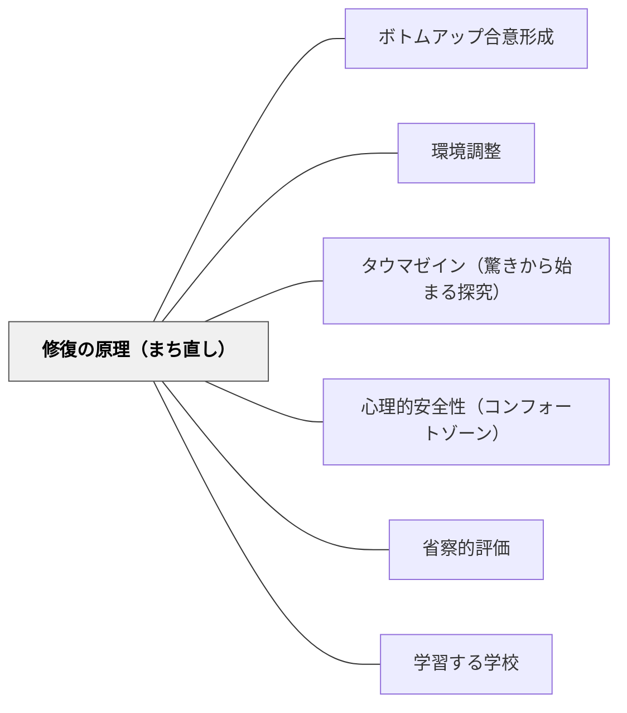

# 修復の原理（まち直し）

> まっさらから作り直す前に、今あるものを診断せよ。良いところを守り、悪いところを小さく直す——この「まち直し」の積み重ねこそが、有機的秩序を生き返らせる道だ。

## [Pattern Connection]

### 中菊博（2009/2015）「まちづくり」から「まち直し」へ

本パタンは、中菊博がアレグザンダーの思想系譜を辿りながら導出した「修復の原理」を、教育・学習設計の文脈に転用したものである。

**補強点**：
- パタン・ランゲージの「良いパタン・悪いパタン」という判断基準が、修復の方向性を与える。「どう改善するか」より先に「今のどこが良くて、どこが悪いか」を診断することがパタン・ランゲージの実践的な入口だと示す。

**拡張点**：
- 「パタンを記述する」という静的な作業が、「修復によって有機的秩序を取り戻す」という動的なプロセスとして機能する。パタン・ランゲージは単なる知識記述ツールではなく、設計・実践の診断と改善のための道具だと明確になる。

**波及するパタン**：
- [[パタン/ボトムアップ合意形成]] — 「まち直し」の合意形成技術
- [[概念/パタン・ランゲージ概論]] — セミラチス構造・5原理との接続
- [[パタン/環境調整]] — 有機的秩序・センター理論が環境設計の深層原理
- [[パタン/タウマゼイン（驚きから始まる探究）]] — 「懐かしさ・情緒」という感動が修復の動機

---

## 背景（Context）

建物・まち・授業・学校のいずれも、「今あるもの」の上に成り立っている。子どもたちが生きている教室・学校には、既存の文化・慣習・人間関係・物的環境が積み重なっている。

アレグザンダーは、歴史的に自然に生まれたまち（温泉・路地・商家）が持つ「懐かしさ・安心感・情緒」の正体を研究し、「有機的秩序」と呼んだ——それは「環境の個々の部分の要求とその全体の要求との間に完璧なる均衡が存在するときに生じるもの」だ。

近代建築（コルビュジェ的な幾何学的都市）は、まっさらから設計することで「有機的秩序」を失った。これを「まちづくり（ゼロから作る）」ではなく「まち直し（今あるものを診断して修復する）」として捉え直すことが、この思想の核心である。

## 問題（Problem）

改善・改革・授業改善・学校改革は、しばしば「現状を白紙にして理想を一から設計する」という方向に動く。しかしこのアプローチには構造的な問題がある：

- 現状の「良いもの」も一緒に壊してしまう
- 大きすぎる変化は非連続なため、周囲から孤立する
- 「いつか完成する理想」のために現在の問題に耐えることを強いる
- 使用者（子ども・教師）が設計に参加できない

結果として、「改革した後の授業・学校」が、改革前より生き生きとしなくなるという逆説が起きる。

## 力のかたち（Forces）

- 問題が山積しているとき、「全部直したい」衝動が大改革へ向かわせる
- しかし大改革は資源・時間・エネルギーを奪い、現在をより悪くする場合がある
- 「今できること・すぐできること」から始める小さな修復は動機を維持しやすい
- 使用者（子ども・教師）は設計者（管理職・専門家）より現場の問題を正確に知っている
- 未来の理想図を描くことと、現在の状況を診断することは、全く異なる認知的行為
- 部分を直すとき、全体との均衡を保たなければ、別の部分が崩れる

## 解決（Solution）

**「今あるものを診断する」ことから始め、「良いところを守り、悪いところを小さく直す」漸進的修復を積み重ねることで、部分と全体の有機的秩序を取り戻す。**

### 修復の原理の5つの柱（アレグザンダー「オレゴン大学の実験」より）

**(1) パタンの原理——「形態の規定」でなく「プロセスの管理」**
- あらかじめ決まった理想の形（未来マップ）でなく、パタンランゲージ（設計ルールの集合）で柔軟に対応する
- パタンはスケールを自在に扱えるため、部分の問題にも全体の問題にも対応できる

**(2) 参加の原理——「使用者だけが設計条件を正確に把握している」**
- 使用者（子ども・教師・住民）が設計に参加することで初めて有機的秩序が生まれる
- 「参加」とは意見を聞くことではなく、基本計画概略の段階まで使用者が直接デザインすること
- 「住民が自分を取り巻く世界を設計することで、世界との一体感を感じる——所有感（土地への愛着）と創造的自治をもたらす」

**(3) 小さくつくる原理——「漸進的変化」**
- 大きな開発・大改革は非連続で周囲から孤立する
- 小さな修復を無数に繰り返すことが大きな変化につながる
- 「どぶ板政治」は悪口だが、まち直しとしてはむしろ正道——すぐできる小さな修復の積み重ねが重要

**(4) 診断の原理——「未来マップでなく現状診断マップ」**
- 「あるべき姿」を先に描くのでなく、今の状況を「カルテ」として診断する
- あるパタンがどこに充足していてどこに不足しているかを地図（または表）に落とす
- 診断マップは定期的に更新することで硬直性を防ぐ

**(5) 調整の原理——「公的な場での討議」**
- 修復の優先順位・実施/延期は、関係者が公的な場で討議して決める

---

### センター理論（Nature of Order）——「今あるセンターを補い助ける」

アレグザンダーが東野高校プロジェクト（1985年）で適用した理論：

> 「どのような設計行為も建設行為についても、それは〈中心（センター）〉を創造する行為であり、その〈中心〉自身は、そこにすでに存在する他の〈中心〉を補い助けるように配しなければならない」

この原理の教育版：
- 授業の各活動も「センター」
- 新しい活動を導入するとき、「今すでにある良いセンター（子どもの好奇心・学級の文化・強みのある教師の技術）」を補い助けるように設計する
- センターを無視した設計は、既存の有機的秩序を壊す

---

### セミラチス vs ツリー——「重なり合いの設計」

| ツリー型設計 | セミラチス型設計 |
|---|---|
| 各活動は独立・分離 | 活動が互いに重なり合う |
| 時間割通りに完結 | 授業の外でも「あの問いの続き」を考える |
| 教科が縦割り | 教科を横断する問いが生まれる |
| 一対一の上位従属 | 一つの経験が複数の学びに属する |

「偶然の出会い・とんでもない組み合わせ」が起きるのはセミラチス構造のまちだけだ——と同様に、子どもが「思いがけない発見」をするのはセミラチス型の学習設計においてだ。

---

### 具体例1——教室環境の「まち直し」

「この教室の何を直せばよいか？」の問い方を変える：
- ×「理想の教室はどんな姿か？」（未来マップ型）
- ○「今の教室で何が良くて、何が邪魔しているか？」（診断型）

「今すぐできる一番小さな修復」は何かを子どもに問う。本の場所を一か所変える、座席の向きを一つ調整する——これが「まち直し型の教室改善」だ。

### 具体例2——那須塩原と仙台の露天風呂の「有機的秩序」

全く無関係の二つの温泉（那須塩原・仙台作並）が、「長い木の階段→男女別着替え室→浴槽→川の景色」という全く同じ関係性（オーダー）を持っていた。

> 「形のひとつひとつが似ているのではなく、形の要素の関係性が同じなのです」

これが「有機的秩序」の正体——形ではなく関係性のパタンが繰り返されることで、全く異なる場所に「同じ安心感・心地よさ」が生まれる。

教育版：授業の形（活動の種類）でなく、授業内の関係性（子どもと問いの出会い方・教師の介入のタイミング）が繰り返されるとき、「良い授業の有機的秩序」が再現できる。

### 具体例3——逗子の住宅（1988年）と原寸設計

施主の奥さんにパタンリストを読み上げ、目を閉じて家全体のイメージを描いてもらった。そのスケッチは、完成後の建物を先取りするほど正確だった。

台所の棚の高さは「のっぽのご主人と背の小さな奥さんにとっての適切な高さ」を現場で段ボールで実物大に作って全員で決めた（原寸設計）。

教育版：授業設計も「紙の上の計画」より「子どもの反応を見ながら実物大で試す」方が使用者の感覚に合ったものになる。

---

## 結果（Consequences）

- 「大改革なき継続的改善」が実現する——変化のたびに全体を壊すことなく、局所的な改善が全体の質を高める
- 使用者（子ども・教師）が「自分たちが設計に参加した」という所有感と愛着を持つ
- 部分と全体の均衡が保たれ、「有機的秩序」が少しずつ回復する
- 改善が小さいので失敗コストが低く、試行が続けやすい
- 「未来の理想のために現在を我慢する」構造から解放される

## 関連パタン

- [[概念/パタン・ランゲージ概論]] — セミラチス・5原理・有機的秩序の理論的背景
- [[パタン/ボトムアップ合意形成]] — 修復の合意をどう形成するか（感動ポイント・芋づる方式）
- [[パタン/環境調整]] — 有機的秩序の観点から環境を設計・修復する
- [[パタン/タウマゼイン（驚きから始まる探究）]] — 「懐かしさ・情緒・感動」が修復の動機になる
- [[パタン/心理的安全性（コンフォートゾーン）]] — 修復のプロセスに必要な安全な空間
- [[パタン/省察的評価]] — 「診断の原理」の具体的実践（今の状況を正直に評価する）
- [[パタン/学習する学校]] — 5つのディシプリンと「小さくつくる原理」の共鳴
- [[文献/「まちづくり」から「まち直し」へ（中菊博）]] — 本パタンの主要出典

---

## クラスター図

## Actionable Insight

- **「今の授業の診断マップ」を1枚作る**: 今週の授業で「このパタンが充足していた」「このパタンが足りなかった」を3つずつ書き出す——未来の理想を書くのでなく、今を診断する
- **一番小さな修復を探す**: 「教室で今すぐ変えられる一番小さなことは何か？」を子どもに問う。棚の配置、本の場所、席の向き——子どもの答えが最も正確な診断になる
- **竹竿テスト（原寸確認）**: 新しい活動・指示を設計したとき、実際にやってみる前に、同僚に「子ども役」として試してもらう——原寸設計の教育版
- **セミラチスの問い**: 「この活動は他の教科・生活でどう使えるか？」という問いを授業の最後に置き、活動の孤立を防いで重なりを作る

---

## 出典

中菊博（2009/2015）『「まちづくり」から「まち直し」へ／パタンランゲージと「修復の原理」』やわらかいパタンランゲージ ブックレット（2009年PDFとして発表、2015年Kindle版）

> 「『まちづくり』は、まっさらな更地から出発する建物づくりとは明らかに異なります。あくまで現状の状況から出発するのです。現状の悪いところをどう修復し、良いところはどこで、どのようにそこを保存していくのか。そこがキーポイントです」——中菊博
