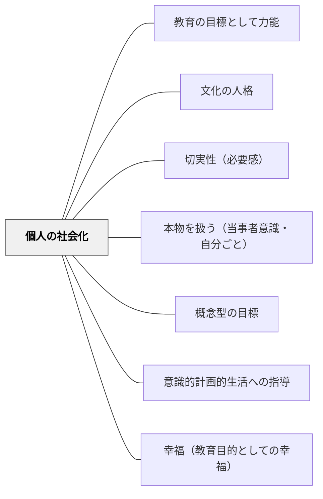

# 個人の社会化

> 個人が社会の一員として必要な価値観・行動様式・知識・スキルを習得していくプロセスを支援せよ。

## Pattern Connection

### 牧口常三郎（1931）——人格価値の三階級：社会化の到達度を測る基準

*創価教育学体系 第2巻* の人格価値論は、個人の社会化がどこへ向かうべきかを明確にする。

**三つの人格価値の階級**

牧口は社会における人格の価値を次の三階級で示す：

| 階級 | 定義 | 社会化の状態 |
|------|------|-------------|
| **正価値**（上） | 居ることを希望される人 | 社会に貢献し、存在が喜ばれる |
| **無価値**（中） | 居てもいない人（いてもいなくても変わらない） | 社会に存在するが関係力がない |
| **反価値**（下） | 居てほしくない人 | 社会に害をなす、存在が重荷になる |

**教育の目標としての含意**

「個人の社会化」の最終目標は、単に規範を守る「居てもいない人」ではなく、**居ることを希望される人**——共同体の中で喜ばれ、社会の善的価値を創造する人格——である。

牧口が「社会全体の生命への関係力」と定義した善的価値は、この「居ることを希望される」状態に対応する。算数を学ぶことも、国語で表現する力を育てることも、この方向を目指す社会化のプロセスである。

**実践への示唆**

- 学習の意義を「テストの点を取る」でなく「社会の中で居ることを希望される人になる」という文脈で語る
- 協働学習で「あなたがいてよかった」と感じる場面を設計する——善的価値の体験が社会化の動機を作る
- 「この力を持った人は社会でどんなことができるか」の問いは、三階級の正価値へ向かう意識を育てる

- **他のパタンへの波及**：[[パタン/価値]]（善的価値の本質）・[[パタン/意識的計画的生活への指導]]（無意識から意識的社会生活へ）

**目的観の三階級：社会化の「向き」を測る基準**

人格価値の三階級（居ることを希望される人等）が「社会からどう見られるか」を示すのに対し、牧口は同じく第2巻で「社会をどう見るか」という**目的観の三階級**を提示する。

| 階級 | 目的観の内容 | 社会化の状態 |
|---|---|---|
| **第一階級** | 社会を自己生存の手段と見る（個人主義） | 社会化の出発点；自己利益が最優先 |
| **第二階級** | 社会の観念が曖昧で、自己との関係を意識しない | 社会に属しているが社会性が未自覚 |
| **第三階級** | 社会を意識して行動し、共存共栄を目的とする | 真の社会化；善的価値の担い手 |

第二階級はさらに、地方的団体・党派的団体・国家・国際へと社会的視野の広がりで細分される。

**教育への含意**

個人の社会化の目標は、単に「社会の規範に従う人（第二階級）」ではなく、「社会を意識して主体的に貢献する人（第三階級）」である。学習活動でも「自分がどうなるか（第一階級的動機）」から「仲間や社会がよくなるか（第三階級的動機）」へと目的観が育つように設計することが社会化の教育の核心である。

- **他のパタンへの波及**：[[パタン/意識的計画的生活への指導]]（第二→第三階級への意識化が目標）・[[パタン/幸福（教育目的としての幸福）]]（社会的幸福は第三階級的目的観と重なる）

---

## 背景（Context）

社会化とは、個人が社会の一員として機能するために必要な言語・文化・価値観・社会規範・コミュニケーション能力などを習得していく過程のことだ。学校の学習のほとんどは社会化の過程であるともいえる。算数・国語の学習も、社会に出て使える力を身につける社会化のプロセスと位置づけられる。

[[パタン/文化の人格]] に示される6大指標の「三　個人の社会化」として牧口常三郎も位置づけた教育の重要な側面。

牧口は*創価教育学体系 第1巻*（1930）において、社会化の核心を「無意識的社会生活を意識的・計画的社会生活へと転換すること」と定義した。「個人の社会化」は単なる規範の内面化ではなく、社会との共存共栄（self + others）の関係を意識し、社会に貢献する生活へと自ら向かう力の育成である。

## 問題（Problem）

社会で必要なスキル・価値観・コミュニケーション能力が身についていなければ、子どもは社会に出てから困難に直面する。しかし「社会化」を意識せずに知識伝達だけに終始すると、学習が生きた力にならない。

## 力のかたち（Forces）

- 言語・文化・社会規範は学校という場で自然に身につく側面もあるが、意図的な支援がなければ格差が広がる
- 個人の社会化は知識習得と切り離せない——算数を学ぶことは社会で計算できる人になることでもある
- 社会化の過程でコミュニケーション能力・協調性・共同作業能力が発達する

## 解決（Solution）

**学校での学習を「社会の一員として必要な力を育てる」という視点で意味づけ直す。**

- 1つ1つの知識を理解して活用できるようになることが、そのまま社会化であり人格の完成に向かうプロセス
- コミュニケーション・協力・ルールの理解を、教科学習の中に意図的に組み込む
- 子どもたちが「なぜこれを学ぶのか」を社会とのつながりで理解できるよう支援する

## 結果（Consequences）

- 学習の意味が「テストのため」から「社会に生きるため」に変わる
- 知識・スキルが生活の中で活用される
- [[パタン/文化の人格]] の形成に向けた土台が育まれる

## 関連パタン
- [[パタン/教育の目標として力能]]

- [[パタン/文化の人格]] — 個人の社会化は6大指標の第三指標
- [[パタン/切実性（必要感）]] — 社会とのつながりから必要感を生む
- [[パタン/本物を扱う（当事者意識・自分ごと）]] — 社会に根ざした学習課題
- [[パタン/概念型の目標]] — 社会化につながる概念的理解の設計
- [[パタン/意識的計画的生活への指導]] — 無意識な社会生活から意識的な社会生活へ
- [[パタン/幸福（教育目的としての幸福）]] — 社会的次元を含む幸福の実現

## クラスター図

## Actionable Insight

- 単元の始まりに「この学習は社会のどんな場面で使われるか」を1分考えさせる——学習と社会をつなぐ一問が「テストのため」という意味を変える
- グループ活動に「役割分担・意思決定・合意形成」のプロセスを意図的に組み込む——教科学習の中でコミュニケーション・協調・ルールの理解を育てる
- 「この技術・知識を持った人は社会でどんなことができるか」を子どもと一緒に考える——知識の社会的意味を共に探ることが学習の動機を変える

## 出典

牧口常三郎（1932）『創価教育学体系』第3巻．創価学会．（個人の社会化：6大指標の第三指標）
- [[文献/創価教育学体系 2（牧口常三郎）]] — 人格価値の三階級（正価値・無価値・反価値）・善的価値の定義
