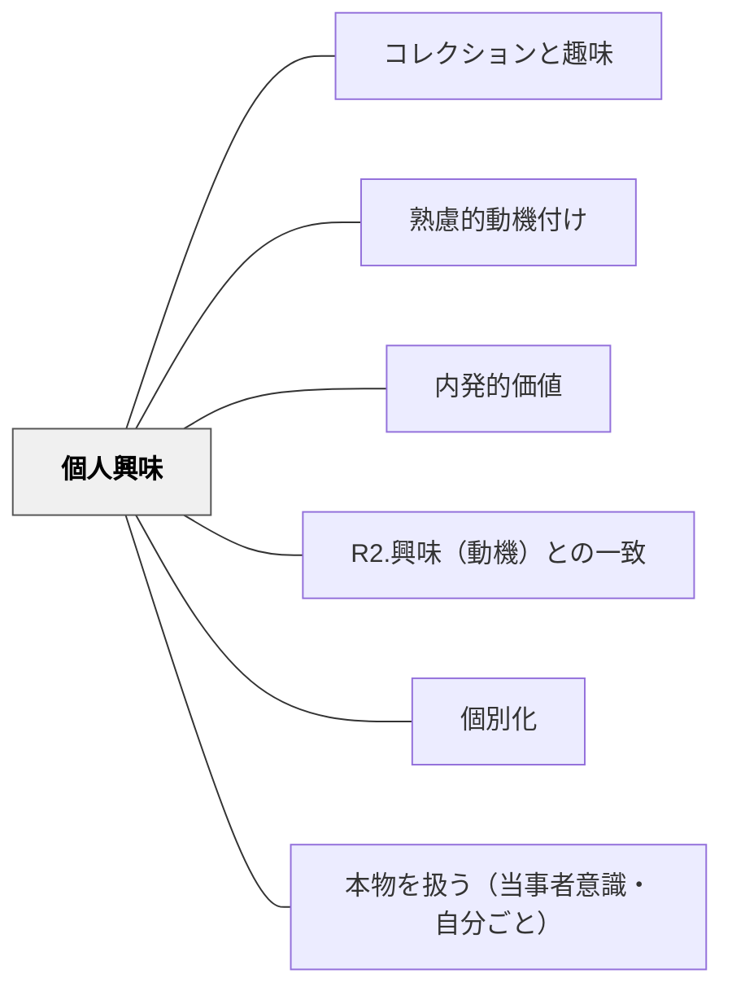

# 個人興味

> 自分の中に根付いた興味は、外から火をつけなくても燃え続ける。個人の関心領域に根ざした動機は、深く安定している。

## 背景（Context）
興味研究（ハイディ＆レニンジャー）では、状況的興味（その場で喚起される）と個人興味（個人に安定して存在する）が区別される。個人興味は長期にわたって培われた深い関心であり、学習における内発的動機付けの最も安定した形態のひとつである。

## 問題（Problem）
学校の学習では、状況的興味（今日の授業の面白さ）は設計しやすいが、個人興味との接続が軽視されがちである。個人の深い関心が無視された学習は表面的なものになりやすく、学校を離れると続かない。

## 力のかたち（Forces）
- 個人興味は長年の経験・読書・活動の積み重ねによって形成される
- 個人興味のある分野では、困難に直面しても粘り強さが発揮されやすい
- すべての学習内容を個人興味と結びつけることは現実的に難しい
- 個人興味の探索と発見を支援することも教育の重要な役割

## 解決（Solution）
**学習者の個人的な関心・興味・得意領域を把握し、それを学習に活かせる機会を意図的に作ることで、深く安定した動機を引き出す。**

学習者の関心領域を知るための対話やアンケートを実施する、個人興味に関連したテーマで探究や発表の機会を設ける、個人興味の探索を支援する読書・体験・対話の場を設けるなどが有効である。

## 結果（Consequences）
- 学習者が自分の興味に根ざした深い探究を行い、質の高い学習が生まれる
- 個人興味の探索・発見を通じて、学習者が自分を知っていく
- 学校での学びと人生での学びがつながる長期的な学習習慣の形成につながる

## クラスター図

## Actionable Insight

- 学期の始めに「あなたが一番関心を持っていること・得意なことは何か」を一問アンケートで把握する——個人興味を把握することで学習内容との接続機会が計画的に設計できる
- 単元の中で1回「自分の興味・関心のある視点からこのテーマを探究する」選択課題を設ける——個人興味に根ざした探究が深く安定した動機を引き出す
- 学習者が「これ好き・得意」と感じている分野と今日の学習内容の共通点を一言見せる——接続が見えるだけで「自分ごと」として関与する姿勢が生まれる

## 出典

- 一つの教育のパタン・ランゲージ（岩井輝久）

## 関連パタン
- [[パタン/コレクションと趣味]]
- [[パタン/熟慮的動機付け]] — 親パタン
- [[パタン/内発的価値]] — 関連パタン
- [[パタン/R2.興味（動機）との一致]] — 関連パタン（ARCSとの接点）
- [[パタン/個別化]] — 関連パタン
- [[パタン/本物を扱う（当事者意識・自分ごと）]] — 関連パタン
