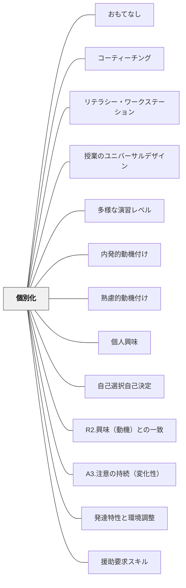

# 個別化

> 学習者ひとりひとりに合わせた学習は、「これは自分のための学習だ」という感覚を生む。画一性より個別性が、動機を育てる。

## [Pattern Connection]

- **いるかどり（2023）統合（2026-05-20）**：本パタンはもともと「コンテンツを個別化する」——ペース・難易度・テーマの選択——という軸で書かれていた。いるかどり（2023）はこれに「**環境を個別化する**」という別の軸を加える。同じ子どもが、環境（人的・物的・空間的）によって全く異なる状態で学習・生活できるという視点だ。環境の個別化はコンテンツの個別化より先に問われるべき次元かもしれない——どんなに内容を工夫しても、感覚過敏がある子に音が響く座席を与えたままでは学習に入れない。
- **強みリストの統合**：いるかどり（2023）は「できること・好きなこと・やりたいことの総体」を**強みリスト**として記録することを提案する。既存のActionable Insightにある「得意なこと・好きなことを確認する」は、この強みリストの実践と直接重なる。違いは、強みリストが「記録してネットワークに広める」ことを意図している点——本人・保護者・教師・支援者が共有することで個別化の設計の出発点になる。
- **既存パタンとの関連**：[[パタン/発達特性と環境調整]] が「環境の個別化」の具体的手法を提供する。本パタンは「なぜ個別化するか（動機・理念）」を、発達特性と環境調整は「どう個別化するか（手法・環境次元）」を担う。
- **他のパタンへの波及**：[[パタン/援助要求スキル]] — 個別化された環境の設計には「この子が今何に困っているか」を本人が伝えられることが必要——援助要求スキルが個別化の継続的な更新を支える。

## 背景（Context）
すべての学習者が同じ内容を同じペースで学ぶ画一的な授業では、個々の学習者の興味・強み・学習スタイル・習熟度との間に必然的なズレが生じる。このズレが動機の低下・疎外感・学習困難の原因になることがある。個別化は動機付けと学習の質の両方を高める。

## 問題（Problem）
クラス全体への一律の教授では、「自分はこのクラスに合わない」「このペースについていけない・遅すぎる」という感覚を持つ学習者が出てくる。そうした学習者は動機を失いやすい。

## 力のかたち（Forces）
- 完全な個別化は教師の負担が大きく、現実的な制約がある
- テクノロジー（アダプティブラーニング等）を活用することで個別化の実現が容易になっている
- 個別化はペース・内容・方法・評価の複数の次元で実現できる
- 個別化と協働学習は対立するのではなく、組み合わせることができる

## 解決（Solution）
**学習者の興味・強み・習熟度・学習スタイルに応じた学習の選択肢・ペース・支援を提供することで、「自分に合った学習」を実現する。**

選択課題・選択テーマの提供、習熟度別のサポート、学習者が自分のペースで進める時間の確保、学習スタイルに合わせた多様な表現・方法の提供などが有効である。全体で学ぶ時間と個別に進める時間を意図的に組み合わせる設計が現実的な出発点となる。

## 結果（Consequences）
- 学習者が「これは自分に合っている」と感じ、学習への参加意欲が高まる
- 各学習者の強みが活かされる場が生まれ、多様性がクラスの豊かさになる
- 個別化の設計は、学習者理解を深める教師の実践力を育てる

## クラスター図

## Actionable Insight

- 各学習活動に「テーマ・形式・難易度のどれか1つ」を選択できる余地を作る——選択肢があるだけで「これは自分のための学習だ」という感覚が生まれる
- 全体指導の時間と「自分のペースで進める時間」を1コマの中に両方組み込む——全体と個別の組み合わせが現実的な個別化の出発点になる
- 学期の最初に「得意なこと・好きなこと・苦手なこと」を一問確認する——学習者理解が意図的な個別化設計の基盤となる

## 関連パタン
- [[パタン/おもてなし]]
- [[パタン/コーティーチング]]
- [[パタン/リテラシー・ワークステーション]]
- [[パタン/授業のユニバーサルデザイン]]
- [[パタン/多様な演習レベル]]
- [[パタン/内発的動機付け]]

- [[パタン/熟慮的動機付け]] — 親パタン
- [[パタン/個人興味]] — 関連パタン
- [[パタン/自己選択自己決定]] — 関連パタン
- [[パタン/R2.興味（動機）との一致]] — 関連パタン（ARCSとの接点）
- [[パタン/A3.注意の持続（変化性）]] — 関連パタン（ARCSとの接点）
- [[パタン/発達特性と環境調整]] — 「環境の個別化」の具体的手法（いるかどり, 2023）
- [[パタン/援助要求スキル]] — 個別化の継続的な更新を支える（本人からの情報提供）

## このパタンが働く実践

| 実践パタン | どのように個別化しているか |
|------------|----------------------------|
| [[実践/カエルの算数：勝ちやすさを表で考えよう]] | 児童ごとに目標や支援を変え、一人用ボードなど参加の仕方も調整する |
| [[実践/個別支援級の複式算数：重さと面積をわたり・ずらしで学ぶ]] | 複数の教育課程と児童の状態に合わせ、直接指導・自力解決・支援のタイミングを調整する |

- [[パタン/熟慮的動機付け]] — 親パタン
- [[パタン/個人興味]] — 関連パタン
- [[パタン/自己選択自己決定]] — 関連パタン
- [[パタン/R2.興味（動機）との一致]] — 関連パタン（ARCSとの接点）
- [[パタン/A3.注意の持続（変化性）]] — 関連パタン（ARCSとの接点）
