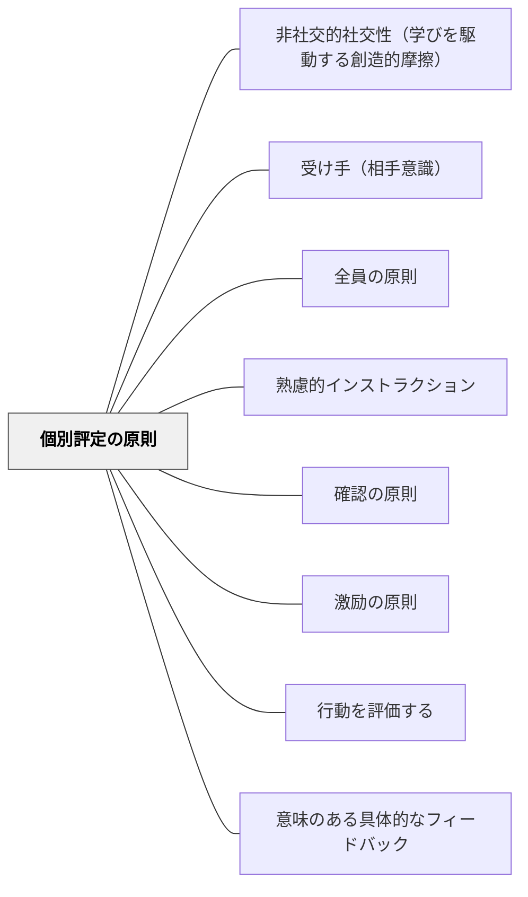

# 個別評定の原則

> 全体への評価だけでなく、一人ひとりへの個別のフィードバックが行動を変える。

## 背景（Context）
個別評定の原則は向山洋一（1985）『授業の腕をあげる法則』明治図書に示される10原則の一つである。「よくできました」という全体への言葉ではなく、「〇〇さん、ここが良かった」という個別の評価が受け手の行動を具体的に変える。全体評価と個別評価は目的が異なり、組み合わせて使う。

## 問題（Problem）
教師が全体に向けて「上手ですね」「よくできました」と言うだけでは、一人ひとりは自分がどうだったのかわからない。個別の視点が欠けた評価は漠然とした印象にとどまり、具体的な行動変容につながらない。

## 力のかたち（Forces）
- 個別評価は受け手が「自分のことを見てもらえている」という実感を生む
- 全員に個別評価を届けるには、意図的な机間巡視の計画が必要
- 評価の言葉は具体的な行動・成果を指すほど効果が高い

## 解決（Solution）
**机間指導・作品確認の際に、一人ひとりの具体的な行動や成果に対して「〇〇ができていますね」「△△のところが良いです」と個別に伝える。**

机間巡視では全員に声をかけることを意識し、特定の子だけに集中しないようにする。「早い・遅い」の評価より「具体的な行動・内容」の評価を心がける。激励の原則と組み合わせることで、受け手の意欲を引き出す。

## 結果（Consequences）
- 受け手が自分の学習状態を具体的に把握できる
- 「見てもらえている」という安心感が学習意欲を高める
- 教師が全員の状況を把握する観察力が育つ

## クラスター図

## Actionable Insight

- 机間巡視で「今日は全員に一言声をかける」ことを意識して歩く——意図的に計画することで特定の子だけに集中する偏りが防げる
- 作品確認のとき「ここが良い」と具体的な箇所を指さして伝える——漠然とした「上手ですね」より、場所を特定した評価が行動を変える情報になる
- 「早く終わった」ではなく「ここに丁寧に取り組んでいる」と行動・内容を評価する言葉に切り替える——早さへの評価が競争を生み、内容への評価が質の追求を生む

## 出典

- 一つの教育のパタン・ランゲージ（岩井輝久）

## 関連パタン
- [[パタン/非社交的社交性（学びを駆動する創造的摩擦）]]
- [[パタン/受け手（相手意識）]]
- [[パタン/全員の原則]]
- [[パタン/熟慮的インストラクション]] — 親パタン
- [[パタン/確認の原則]] — 個別評定の前段となる全体確認
- [[パタン/激励の原則]] — 個別評定に添える励まし
- [[パタン/行動を評価する]] — 個別評定の評価対象の原則
- [[パタン/意味のある具体的なフィードバック]] — 個別評定の質を高めるフィードバック論
