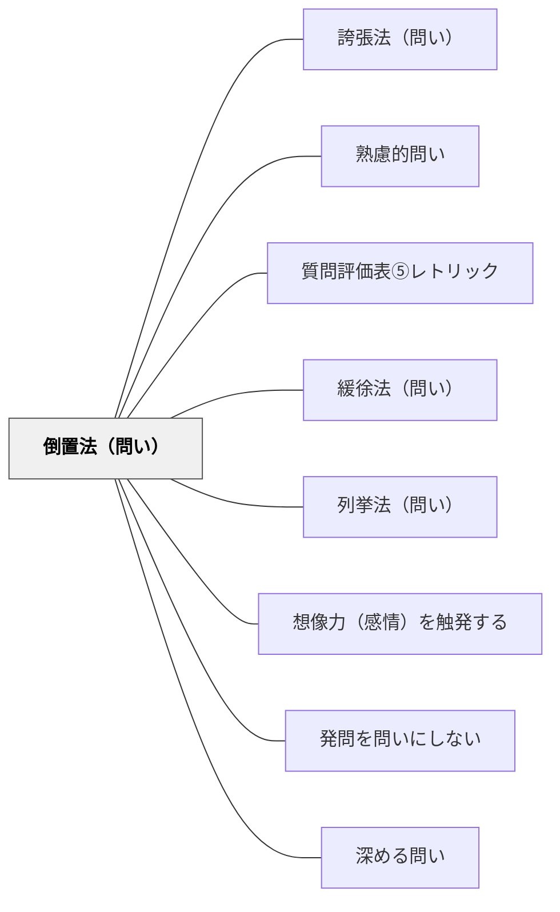

# 倒置法（問い）

> 語順を逆にすることで、問いの前提を印象づけ、思考を引き寄せる。

## 背景（Context）
通常の語順で問いを提示すると、聞き手は言葉を処理しながら内容を理解しようとする。
倒置法は語順を意図的に逆にすることで、強調したい言葉を前面に出す修辞技法である。
「学ぶとは何か」→「何のために、私たちは学ぶのか」のように、語順の変化が問いの重心を変える。
倒置によって問いの出発点が変わり、思考の入口が自然と移動する。

## 問題（Problem）
標準的な語順の問いは意味を伝えやすいが、印象が弱く記憶に残りにくいことがある。
「〇〇とは何か」という形式的な問いは安全だが、考えることへの誘いとして平板に感じられやすい。
問いの力を高めたいとき、内容を変えずに表現だけで印象を変える方法が必要になる。

## 力のかたち（Forces）
- 倒置は驚きを与えるが、乱用すると不自然な印象になる。
- 語順の逆転は、日本語と英語で効果の出方が異なることがある。
- 倒置法によって強調される言葉は、問いの核心を表す言葉であるべきである。
- 問いの文脈・場の雰囲気によって、倒置の効果は増減する。

## 解決（Solution）
問いを通常の語順で書いた後、「どの言葉を前に出したいか？」を考えて語順を入れ替える。
「何が大切か」ではなく「大切なのは、何か」のように、強調語を文頭または文末に移動させる。
複数のバリエーションを書き比べ、声に出して読んで最も響く語順を選ぶ。
倒置した問いを学習者に提示し、通常語順と比べた印象の違いを話し合うことも有効である。

## 結果（Consequences）
倒置された問いは学習者の注意を引きつけ、「あ、この問いは少し違う」という感覚を生む。
語順の変化が思考の切り口を変えるため、新しい視点からの探究が始まりやすい。
一方、意図が伝わりにくくなるリスクがあるため、文脈の説明と組み合わせることが望ましい。

## 関連パタン
- [[パタン/誇張法（問い）]]
- [[パタン/熟慮的問い]] — 親パタン
- [[パタン/質問評価表⑤レトリック]] — 修辞の評価軸
- [[パタン/緩徐法（問い）]] — 二重否定で断定を避ける兄弟パタン
- [[パタン/列挙法（問い）]] — 順序を並べることで強調する兄弟パタン
- [[パタン/想像力（感情）を触発する]] — 修辞的問いが感情・想像力を動かす上位パタン
- [[パタン/発問を問いにしない]] — 修辞の形で問いの圧力を柔らげる関連手法
- [[パタン/深める問い]] — 修辞技法が表面的な応答を防ぎ思考を深める

## クラスター図

## Actionable Insight

- 問いを通常の語順で書いた後「どの言葉を前に出したいか？」を考えて語順を入れ替える——語順の変化だけで問いの重心が移り、思考の入口が変わる
- 「何が大切か」ではなく「大切なのは、何か」という複数のバリエーションを書き比べ、声に出して読んで最も響く語順を選ぶ——声に出すことが頭の中だけでは気づかない語順の効果を体感させる
- 倒置した問いと通常の問いを学習者に並べて見せ、印象の違いを話し合わせる——比較体験が問いの修辞的な力への感度を育てる

## 出典
- [[文献/熟慮的問いのパターンリスト（動画記録）]]
