# 偶発の瞬間を活かす（コンティンジェンシー）

> 授業が子どもの応答によって分岐する点は、偶然おとずれるものではない。あらかじめ「ここで分かれる」と決めて置いておくものである。しかも、1時間に何個も置くものではない。

## [Pattern Connection]

このWikiには [[パタン/タクト（教育的機転）]] がある。ヘルバルト（1806）由来の、「今この瞬間に何をするか」を決める教育者の徳である。その記述は正確だが、**片側しか扱っていない**。タクトは瞬間が**起きたあと**の話である。「起きる場所を、どこに、いくつ作るか」——設計の側は空白のままだった。

Black & Wiliam（2009）の中心概念 **"moments of contingency"（偶発の瞬間）** が埋めるのはこの空白である。彼らの主張はこうだ。形成的評価とは、指導のなかに偶発の瞬間を**作り出し**、それを**活かす**ことである。「作り出す」が先に来ていることが決定的である。瞬間は待つものではなく、置くものだ。

接続の要点は三つある。

第一に、これは [[パタン/タクト（教育的機転）]] の**対**である。タクトは譲渡不能で、経験の蓄積でしか育たない——だからこそ、若手教師にはタクトを求める前にできることがある。**分岐点を単元計画の紙面に書き込むこと**は、経験がなくてもできる。タクトの質は上げられなくても、タクトが要求される場面の**数と位置**は設計できる。

第二に、[[パタン/見取ったあとの手を決めておく（データ利用のルール化）]] が本パタンの下半分にあたる。あちらは「見取ったあとの行動を事前に決めておくと効果量が0.42から0.92へ動く」という実証を扱う。本パタンはその手前——**そもそも見取る点をどこに置くか**——を扱い、二つが揃って一つの設計になる。片方だけでは、決めてあるルールを発動する場面がないか、場面はあるが発動する手がないかのどちらかになる。

第三に、2009年の定義は [[パタン/形成的評価]] の定義を**書き換えている**。1998年版の「フィードバックとして用いられる情報を提供するすべての活動」から、2009年版は「**決定（decisions）**」に焦点を移し、しかも「**〜である限りにおいて（to the extent that）**」という程度の表現を採った。形成的か否かは二値ではない。この移動が、本パタンの記述全体を支えている。

## 背景（Context）

算数の1時間の途中で、教師はしばしばこう思う。「今の説明で通じたのだろうか」。数人が手を挙げる。当てる。正解が返る。授業は進む。——このとき、授業が分岐する可能性があった点を、教師は通り過ぎている。

Black & Wiliam（2009）は §3 で、1998年のレビューと ARG（2002）の定義をふまえて、形成的評価を次のように定義しなおした。

> Practice in a classroom is formative to the extent that evidence about student achievement is elicited, interpreted, and used by teachers, learners, or their peers, to make decisions about the next steps in instruction that are likely to be better, or better founded, than the decisions they would have taken in the absence of the evidence that was elicited.
> — 教室における実践が形成的であるのは、**児童生徒の達成についての証拠が引き出され、解釈され、教師・学習者・その仲間によって使われて、指導の次の一歩についての決定が下される限りにおいて**であり、その決定は、引き出された証拠がなかったならば下されたであろう決定よりも、**よりよい、または、より良く根拠づけられている見込みが高い**ものである。

この一文は、読み飛ばせない特徴を四つ持つ。

**第一に、「指導（instruction）」の語義**。著者らは断っている。英語圏の多くで instruction は訓練や教え込みの含みを持つが、ここではアメリカ英語の用法——**教えることと学ぶことの結合**——を意図している。「学習を生み出そうとするあらゆる活動」を指す。pedagogy を使わなかった理由も書かれていて、pedagogy だと「生徒たちは互いにとっての教育資源である」と言うのが奇妙に響くからだという。つまりこの定義は、最初から**子どもを資源に数える**設計になっている。

**第二に、焦点は「決定」にある**。ここが定義の心臓部である。著者らは、焦点を「意図」に置く可能性を検討して退けている。意図に置けば、**証拠を集めたが使わなかった場合も形成的になってしまう**からだ。逆に「実際に学習を改善した」ことを要求する可能性も検討して、これも退けている。理由は二つある。学習は予測不能であり、最も有望に見える手立てが特定の場面で効かないことはある。そしてより重大なことに、**反事実的な主張——証拠がなければ起きなかったであろうこと——を確立せねばならず、実際上それは不可能である**。だから定義は「よりよい**見込みが高い**（likely to be better）」という確率的な形をとる。最善の設計をした介入でも、すべての子どもに効くわけではないという事実も、この形に反映されている。

**第三に、評価の主体は教師に限らない**。多くの場合に決定を下すのは教師だが、定義は**仲間（peers）と学習者本人**も主体に含めている。

**第四に、「よりよい、または、より良く根拠づけられた（better, or better founded）」の後半**。ここは現場にとって最も救いになる項である。形成的評価の結果、**教師が最初から意図していた手立てがやはり最善だと分かることがある**。このとき行動は変わらない。しかしその行動は、証拠に根拠づけられたものになっている。**「見取ったが何も変えなかった」は失敗ではない**——ただし「証拠を見たうえで変えないと決めた」場合に限る。

この定義から、著者らは中心概念を取り出す。

> From the definition, it is clear that formative assessment is concerned with the creation of, and capitalization upon, ‘moments of contingency’ in instruction for the purpose of the regulation of learning processes.
> — この定義から明らかなように、形成的評価は、学習過程の調整という目的のために、指導における「**偶発の瞬間**」を作り出し、それを活かすことに関わっている。

そして、この焦点は狭いと自ら認めたうえで、こう続ける。

> However, whilst this focus is narrow, its impact is broad, since how teachers, learners, and their peers create and capitalize on these moments of contingency entails considerations of instructional design, curriculum, pedagogy, psychology and epistemology.
> — しかし、この焦点は狭いけれども、その影響は広い。なぜなら、教師・学習者・その仲間がこれらの偶発の瞬間をどう作り出しどう活かすかは、教材設計・カリキュラム・教育方法・心理学・認識論についての考察を巻き込むからである。

**狭い焦点／広い影響**——この構図が本パタンの骨格である。焦点を狭く保つことが、形成的評価の理論を「教授と学習の一般理論」から区別する。そして狭いからこそ、そこを動かすと広い範囲が動く。

### 同期と非同期

偶発の瞬間は同期的にも非同期的にも生じる、と著者らは書く（§3）。

- **同期**：一対一の指導や学級全体の議論のさなかの、教師の「リアルタイム」の調整
- **非同期**：評定の実践を通したフィードバック、宿題から得た証拠の利用、そして**授業の終わりに子ども自身が書いた要約（「出口パス」exit passes）を次の授業の計画に使うこと**

さらに射程は広い。

> They might also include responses to work from the students from whom the data were collected, or from other students, or insights learned from the previous lesson or from a previous year.
> — それらにはまた、データを収集した当の児童生徒の作業への応答だけでなく、**他の児童生徒の作業への応答**、あるいは**前の授業や前年度から得られた洞察**への応答も含まれうる。

この一文が、現場の罪悪感をひとつ解除する。**「その場で拾えなかった」ことは失敗ではない**。拾えなかったつまずきは、次の授業の設計に返せる。今年の学級で返せなかったものは、来年の同じ単元の導入に返せる。偶発の瞬間は「今この子」に閉じていない。

教師の応答は一対一にも集団向けにもなりうる。書かれた作品への応答はふつう一対一だが、**学級討論では、フィードバックは教科としての学級全体のニーズに向けられる**。それは討論の流れへの即時の介入かもしれないし、**次の授業をどう始めるかという決定**かもしれない。

### 図2——三つの領域と、破線の矢印

著者らは形成的なやりとりを、三つの相互作用する領域として描く（§3、図2）。左に**教師**、右に**学習者**、そして両者のあいだに**教室そのもの**がある。

- 教師は「**統制者（Controller）か、指揮者（Conductor）か**」
- 学習者は「**受動的（Passive）か、関与的（Involved）か**」

教師が課題（多くは問いの形をとる）を投げ、学習者が応じ、教師はその応答をふまえてさらなる介入を組み立てる。この基本構造は **I-R-E（initiation-response-evaluation、Mehan, 1979）** として記述されてきたものだが、著者らは重要な注意を付ける。**同じ構造が、真に対話的な過程にも、生徒が脇役に追いやられた過程にもなりうる**。構造からは判別できない。

矢印が**破線**で描かれている理由が §4 で明かされる。

> what the learner actually hears and interprets is not necessarily what the teacher intended to convey, and what the teacher hears and interprets is not necessarily what the student intended to convey: the broken arrows in figure 2 emphasise this.
> — 学習者が実際に聞き解釈するものは、必ずしも教師が伝えようとしたものではなく、教師が聞き解釈するものは、必ずしも生徒が伝えようとしたものではない。図2の破線の矢印はこのことを強調している。

そして中央の色つきの領域は、**多くの学習者がやりとりを聞き、ときに加わっている教室**を表す。だからそこには**あらゆる方向に多数の矢印が走っている**。このモデルは一対一の家庭教師（Bloom, 1984 が最も効果的な指導モデルとみなしたもの）を超えて適用されることが、意図されている。

## 問題（Problem）

**偶発の瞬間は、設計されていないと発生しない。そして発生しても、行き先が用意されていなければ通り過ぎる。**

問題の第一の形は、I-R-E の常態化である。著者らは §3 で率直に書く。教師が I-R-E を使うとき、それはしばしば**教師の説明の穴埋めを子どもに求める形**になる——**拡張された「クローズ法」**である。このとき教師の注意は応答の**正しさ**に向いており（Davis の言う「評価的な聴き方」）、続く教師の手は、子どもに正答を言わせることを目指す。「おしい」「もう少し」といった励ましがそれである。そして——**この形の相互作用が大半の教室で常態であるという証拠は十分にある**（Applebee et al., 2003; Hardman et al., 2003; Smith et al., 2004）。

日本の教室に置き換えれば、こうなる。「では、ここはどうなりますか」「はい、A さん」「◯◯です」「そうですね。よくできました」。この三手は形式上 I-R-E だが、**授業が分岐する可能性はどこにもない**。教師の次の一手は、A さんが何と答えても同じだったからである。証拠は引き出されたが、**決定には使われていない**。2009年の定義に照らせば、この場面は形成的ではない。

問題の第二の形は、その裏返しである。近年は「見取り」の技術が普及した。ミニホワイトボード、ハンドサイン、机間指導の記録。証拠を集める道具は増えた。しかし——**集めた証拠で次の10分が変わるように設計されていなければ、それは形になっているだけである**。定義の中心は「決定」であって、収集ではない。

問題の第三の形は、逆方向の過剰である。「一人ひとりを見取る」という理念は、しばしば**すべての場面で見取る**という運用に化ける。1時間に確認の場面を4つ5つ置けば、授業は進まない。著者らが**狭い焦点**を強調したのは、まさにこの過剰を避けるためでもある。

## 力のかたち（Forces）

- **分岐の数 vs 進度**——偶発の瞬間を増やせば、子どもの実態に沿う度合いは上がる。しかし一つ置くごとに授業は数分止まり、分岐先の準備も倍になる。1時間に置ける数には現実的な上限がある
- **同期の鮮度 vs 非同期の精度**——その場で返せば鮮度は最高だが、教師は数秒で診断と処方を同時に行わねばならない。持ち帰れば全員分を落ち着いて読めるが、返るのは翌日になる。どちらが優れているのではなく、**同じ単元の中に両方が要る**
- **見えるようにする vs 見せたくない**——全員の応答を可視化するほど証拠は良くなる。しかし「わからない」を可視化することは、子どもにとって危険を伴う。挙手方式が機能しないのはこのためであり、可視化の形式を選ぶことは同時に**安全の設計**である（[[概念/教授学的契約（やり過ごしの均衡）]]）
- **解釈の不確かさ（破線の矢印）**——教師が聞き取ったものが、子どもの言おうとしたことである保証はない。偶発の瞬間をいくら増やしても、**その質は解釈の質を超えない**
- **統制者 vs 指揮者**——教師が統制者の位置にいると、偶発の瞬間は「正答へ導く分岐」になり、実質的に分岐ではなくなる。指揮者の位置に立つには、**答えの出どころに関心を持つ構え**が要る（[[パタン/聴き方を変える（評価的・解釈的・解釈学的）]]）
- **変えないという決定の座りの悪さ**——「見取ったのに何もしなかった」は現場では失敗として語られやすい。しかし定義の "better founded" の項は、これを正当な帰結として認めている。ただし**証拠を見る前から決まっていた**場合と区別がつきにくい
- **今この子 vs 来年のこの単元**——その場で返せなかった証拠を捨てるか、記録に残すか。残す作業は今日の授業には一切寄与しない。寄与するのは一年後である
- **てこの支点としての魅力 vs 万能視の危険**——著者らは §7 で、偶発の瞬間への焦点が実践者にとって「他に類を見ないほど強力なてこの支点」だと述べる一方、それが学級全体の議論を見る**唯一の、あるいは最も適切な見方だとは主張しない**とも明記している

## 解決（Solution）

**1時間の授業に、「ここで進路が分かれる」点を——原則ひとつだけ——先に決めて置く。その点では全員の応答が見える形で証拠を取り、証拠の出方に応じた次の展開を、少なくとも2通り、事前に用意しておく。そして、その場で使えなかった証拠は次の授業か来年の単元計画に返す。**

手順は三つである。

1. **置く場所と個数を先に決める**——単元計画の該当時に、「分岐点」と書き込む。原則は1時間に1つ。内容が大きく変わる時（新しい見方を導入する時、既習が誤って一般化されやすい時）にだけ2つ置く。**それ以外の時間は分岐点を置かない**と決めることが、この手順の実質である
2. **全員の応答が同時に見える形で取る**——挙手は使わない。挙手は「言いたい子」の標本であって学級の標本ではない。ミニホワイトボード、指の本数、ノートを持って立つ、机の上にカードを出す、といった**一斉に・同時に・見える**形式を選ぶ（[[パタン/理解確認]]）
3. **分岐先を先に書いておく**——「A が半数を超えたら → ◯◯へ10分」「B が8割を超えたら → △△へ10分」。この2行を指導案に書けていないなら、**その日の証拠収集は形になっているだけである**（[[パタン/見取ったあとの手を決めておく（データ利用のルール化）]]）

そのうえで、拾った証拠の**返し先**を四つ持っておく。同期で返す／次の授業の頭で返す／その子ではなく学級全体に返す／来年の同じ単元に返す。**この四つがあることを知っているだけで、「今返せなかった」が失敗でなくなる**。

---

### 具体例1：算数の1時間に、進路が分かれる点をひとつだけ置く

5年「小数のかけ算」。既習の「かければ大きくなる」が、乗数が1より小さいときに崩れる時間である。ここが**誤った一般化の分岐点**であることは、単元計画の段階で分かっている。だから第3時のところに、赤で「分岐点」と一箇所だけ書いておく。

授業。「80円のリボンを 0.8 m 買います。代金は 80 円より**大きくなる／小さくなる／同じ**。予想をミニホワイトボードに書いて、まだ伏せておいてください」。全員が書き終わったのを見て、「せーの」で一斉に上げさせる。ここまでが証拠の収集で、所要は2分である。

指導案の余白には、前の晩に書いた2行がある。

- **分岐A**（「大きくなる」が3分の1を超えたら）→ 数直線に 1 の目盛りを入れ、「かける数が1より大きいか小さいか」で二つの場合を並べて比べる。10分。
- **分岐B**（「小さくなる」が8割を超えたら）→ 予想の確認では止まらず、**なぜそうなるかを図で説明する**活動へ移る。「小さくなる」と正しく答えた子のうち、理由を説明できる子は多くない。10分。

実際にはAが出た。3分の1強が「大きくなる」に手を挙げた。この学級では、その情報がなければ教師は分岐Bの展開をしていたはずである——予定していたのはそちらだった。

**要点は、教師がその場で名案を思いついたのではないことである。** 前の晩に書いた2行のうち、片方を選んだだけだ。タクトが要求されたのは「AかBか」を読む数秒だけであり、その先の10分は準備済みである。これが、経験の浅い教師にも実行できる形の偶発の瞬間である。

この場面が本パタンの中心にあるのは、**証拠と決定が同じ時間の中で結びついている**からだ。「大きくなる」が3分の1いたという事実は、10分後の教室の姿を実際に変えた。定義の言葉でいえば、この実践は形成的である——「その限りにおいて」。

---

### 具体例2：出口パスを、返さずに次の授業の設計に使う（非同期）

同じ単元の別の時間。授業の最後の3分に、小さな紙を配る。書くのは1行だけである。

**「今日のなかで、いちばん自信のないところ」**

名前は書かせる（あとで個別に返すためではなく、翌日の座席の組み方に使うため）。回収する。**返却しない**。これが重要な点で、出口パスは**返す**ためのものではなく、**次の授業を設計する**ためのものである。子どもの側にはそう伝える。「これは先生が明日の最初の5分を決めるために読みます」。

放課後、教師は紙を3つの山に分ける。前の晩に、山の名前も決めてある。

- **山1：ことばが分からない**（「もとにする量がわからない」など、用語の指示対象が定まっていない）
- **山2：手順は分かるが、どちらを使うか迷う**（判断の分岐で止まっている）
- **山3：全部**（あるいは白紙）

そして、翌日の最初の5分の案も3通り用意してある。山1が最多なら、用語を場面に貼り直す5分。山2が最多なら、**判断が分かれる2問だけを並べて見比べる**5分。山3が一定数を超えたら、その子たちを翌日の前半に教師の近くの席にして、全体は前時の再確認から始める。

出口パスの実務的な利点は、**3分で取れて、放課後10分で処理できる**ことである。所見や朱書きのように積み上がらない。そして負担が軽いということは、**続く**ということである。

---

### 具体例3：拾えなかったつまずきを、来年の単元計画に返す

5年「割合」。「くらべる量」と「もとにする量」の取り違えは、毎年起きる。ある年、教師は取り違えの分布に規則があることに気づいた——**文章題で「もとにする量」が文の後半に出てくるときに集中している**。「定員 40 人に対して 30 人」は間違えないが、「30 人が乗っています。定員は 40 人です」で崩れる。

しかしこの気づきは、単元の後半で得られた。その年の授業設計を変えるには遅い。ここで教師がやることは二つに一つである。忘れるか、書き残すか。

書き残す場所は、単元計画の余白である。日付と、次の3行。

> 2026-06-xx 取り違えは「もとにする量が後に出る文」に集中。第1時の導入を、量が前に出る文だけで始めているのが原因かもしれない。**来年は第1時から後置の文を混ぜる**。

翌年、第1時の例題が変わる。この1行の変更が、翌年の学級の第5時の姿を変える。

これが Black & Wiliam の言う「**前年度から得られた洞察への応答**」である。原文はこれを、偶発の瞬間の一形態としてはっきり数えている。**教師の1年は、次の1年に対する非同期の偶発の瞬間である**——この見方を持つと、単元記録を残す動機が「反省」から「設計」に変わる。反省は気が重いが、設計は具体的である。

書式は軽くてよい。単元計画の紙の余白に、赤で3行。学期末にまとめて整理しようとすると、まず続かない。

---

### 具体例4：全体交流では、「その場で返すか、翌日に回すか」を先に決めておく

国語の物語文。全体交流で、ある子が本文の根拠を一つも挙げずに、しかし核心を突いた読みを言う。教室が一瞬静かになる。

**ここで教師は二つの決定のあいだにいる**。討論の流れに即時に介入して「今の読みは、どこからそう思った?」と問い返すか（[[パタン/問い返し（リヴォイシング）]]）。それとも今日は流し、**明日の授業をその発言から始める**か。原文が「討論の流れへの即時の介入かもしれないし、次の授業をどう始めるかという決定かもしれない」と書いているのは、まさにこの二択である。

判断の基準を、単元に入る前に決めておく。たとえばこうする。

- **その時間の中心の問いに直結する発言** → その場で拾い、学級全体に返す（一対一ではなく、教科としての学級全体のニーズへのフィードバックとして）
- **中心からは外れるが重要な発言** → **板書の端に発言者の名前とともに残し**、翌日の冒頭で戻る
- **教師自身が解釈できていない発言** → その場で処理しない。「今の、明日もう一度聞かせて」と言って持ち帰る

三つ目が実は最も重要である。破線の矢印——教師が聞き取ったものが子どもの言おうとしたことだとは限らない——を踏まえるなら、**解釈できていないまま即時に応答することは、誤読を学級全体に配ることになる**。持ち帰る選択肢を明示的に持っておくことが、応答の質を守る（[[パタン/答えの出どころを推し量る（誤答の解釈）]]、[[パタン/練り上げ（比較検討の全体交流）]]）。

---

### 特別支援の視点：一対一では、偶発の瞬間が多すぎる

特別支援学級や通級の一対一・少人数では、状況が反転する。偶発の瞬間は**作らなくても連続して発生する**。子どもの手が止まる、鉛筆の持ち方が変わる、視線が外れる——教師はそのすべてに応答できてしまう。

ここに固有の危険がある。**応答が連続すると、教師の見立てだけで授業が進む**。子どもは常に教師の直前の一手に反応しているので、子ども自身がどこで詰まっていたのかが、記録にも記憶にも残らない。数か月後、「この子は繰り下がりができる」と教師は言えるが、それが**支援つきでできる**のか**単独でできる**のかを、教師自身が区別できなくなる。

対策は、通常学級とは逆向きになる。**偶発の瞬間を増やすのではなく、止まって確かめる点を決めて、それ以外では口を出さない**。

- 10分の課題のなかに「止まる点」を**2つだけ**置く。たとえば3問目を解き終わったところと、書き終わりの前
- 止まる点では、**教師は言葉をかけずに、子どもが自分で見直す30秒**を取る。教師が見るのは、その30秒に子どもが何をしたか（見直したか、見直さなかったか、どこを見たか）
- 止まる点以外では、手が止まっても**5つ数えるまで介入しない**（[[パタン/待ち時間（問いのあとの3秒）]] の一対一版）

そのうえで、止まる点で取った証拠には**支援の量を書き添える**。「単独／指さしあり／一緒に読んだ」の3段階でよい。これがないと、非同期の証拠——個別の指導計画に書かれる記述——が、支援込みの姿と単独の姿を混ぜたものになる。

「介入しない時間を設計する」ことは、一対一の場面では技術である。何もしていないように見えるからだ。しかし**証拠は、教師が黙っている時間にしか取れない**。

---

### 自己教育での適用：確かめる点を、章のどこに置くか

この設計は大人の独学にもそのまま移る。数学を独学するとき、一問ごとに解答を見れば進むが、自分がどこで曖昧なのかは分からないままになる。かといって一切確かめなければ、誤解を抱えたまま章を終える。

やっていることは同じである。**章の中に、確かめる点を一つか二つだけ置く**。たとえば「この節の定義を、本を閉じて自分の言葉で書けるか」を節の終わりに一度だけ。そして書けなかった場合の行き先を先に決めておく（前の節に戻る／例を3つ作る）。行き先を決めていないと、書けなかったという事実だけが残って、次の行動が起きない。

大人の独学で子どもと差が出るのは、**証拠を見なかったことにできてしまう**点である。教室では他人が見ているが、独学では自分しかいない。だから独学の側では、証拠の記録を紙に残すこと自体が偶発の瞬間の成立条件になる。

## 結果（Consequences）

**利点**

- **タクトを、経験のない教師にも部分的に開く**——偶発の瞬間の質は経験に依存するが、**位置と個数と分岐先**は準備で決まる。前の晩に2行書くことは、10年の経験を必要としない。[[パタン/タクト（教育的機転）]] の「譲渡不能」という性格を、設計の層で迂回できる
- **「見取り」が実際の行動に変わる**——証拠の収集と決定が同じ設計の中に入る。分岐先を書く欄があることで、「取ったが使わなかった」が起きにくくなる
- **焦点が狭いので、実際に始められる**——授業観の転換や学校全体の改革を必要としない。**1時間に1点**から始まる。そして §7 が言うとおり、この点は「他に類を見ないほど強力なてこの支点」である。心理学やカリキュラムの論点を避けるのではなく、**自分の実践に直接かつ即座に関わる仕方でそれらに取り組める**場所になる
- **「今返せなかった」からの解放**——同期／非同期／他の子へ／来年へ、という四つの返し先が明示されることで、その場で拾えなかった証拠が失敗ではなく在庫になる。教師の罪悪感を減らすと同時に、単元記録を残す実務的な動機を生む
- **授業の記録が設計に還る**——具体例3の形式で単元計画の余白に3行残す運用は、翌年の第1時を実際に変える。校内で単元計画を共有していれば、この3行は個人の反省ではなく**学年の資産**になる
- **子どもの側の位置が上がる**——定義が主体に仲間と学習者本人を含めているため、分岐点は「教師が判定する場所」ではなく「学級で情報を出す場所」として運用できる。「せーの」で全員が同時に出す形式は、それ自体が **答えを出すことの危険度を下げる** 装置になる

**注意点・リスク**

- **増やしすぎると授業が進まない**——これが最大の失敗モードである。焦点が狭いことは本論文の主張そのものであって、簡略化ではない。1時間に3つも4つも作るものではない。確認の場面が増えるほど、一つあたりの分岐先の準備は薄くなり、結局どの分岐も発動しなくなる。**「今日は分岐点を置かない時間だ」と決めることも設計のうち**である
- **証拠を取っただけでは形成的にならない**——定義の中心は「決定」である。ミニホワイトボードを一斉に上げさせて、「なるほど、いろいろですね」と言って予定どおり進む授業は、証拠を集めたが使っていない。著者らが焦点を「意図」に置かなかったのは、まさにこの場合を形成的と呼ばないためである。**分岐先を用意していない証拠収集は、形になっているだけ**
- **「変えなかった」は失敗ではない——ただし条件つき**——"better founded" の項が保証するのは、**証拠を見たうえで変えないと決めた**場合である。証拠を見る前から決まっていた展開を、証拠を取ってからそのまま実行することは、これに当たらない。区別の目安は、**分岐先が2通り書いてあったかどうか**である。1通りしか書いていないなら、それは決定ではない
- **破線の矢印——偶発の瞬間の質は、解釈の質を超えない**——教師が聞き取ったものが子どもの言おうとしたことだとは限らず、その逆も成り立つ。分岐点を増やしても、応答を「正解か不正解か」でしか読めなければ、分岐の中身は変わらない（[[パタン/答えの出どころを推し量る（誤答の解釈）]]、[[パタン/理解のしるしを読む（fit と match）]]）。分岐点の設計は、聴き方の設計とセットでしか効かない
- **I-R-E の外形は維持されたまま中身が空洞化しうる**——「問う→答える→受ける」の三手はそのままに、分岐点という名前だけが付くことがある。構造は対話的な過程にも脇役化した過程にもなりうる、という原文の注意はここに効く。判別の基準は簡単で、**子どもが何と答えても教師の次の一手が同じなら、それは分岐点ではない**（[[パタン/IRE型応答の脱却（Talk Move）]]）
- **可視化が子どもを追い詰めることがある**——全員が同時に「わからない」を出す形式は、証拠としては最良だが、学級の関係が整っていない段階では危険である。誤答が笑われる教室では、ミニホワイトボードは同調の道具になる。導入は、**正誤のない予想**（「大きくなる／小さくなる」）から始め、正誤のある確認に進む
- **出口パスを返してしまうと別のものになる**——出口パスは次時の設計材料であって、フィードバックの紙ではない。赤を入れて返し始めると、書く負担が教師側に発生して続かなくなり、子どもの側では「評価される紙」になって本音が書かれなくなる。**返さないことがこの手法の設計思想**である
- **単元記録は、まとめて書こうとすると必ず途切れる**——学期末に振り返って書く運用は、ほぼ実現しない。その場で3行、紙の余白に、赤で。書式を軽くすることが継続の条件である

## 関連パタン

- [[パタン/タクト（教育的機転）]] — 対になるパタン。あちらは瞬間が起きたときにどう振る舞うかを扱い、本パタンは瞬間をどこにいくつ作るかを扱う。タクトが譲渡不能でも、瞬間の位置は設計できる
- [[パタン/見取ったあとの手を決めておく（データ利用のルール化）]] — 本パタンの下半分の実装。分岐先を事前に書く手順はここに詳しい。両方が揃って一つの設計になる
- [[パタン/形成的評価]] — 上位。2009年の定義（「決定」への焦点・「〜である限りにおいて」という程度表現）は、1998年の定義の更新版にあたる
- [[概念/形成的評価の5つの戦略（3×3の枠組み）]] — 同じ論文が提示する戦略の枠組み。偶発の瞬間はその戦略群が働く「場所」にあたる
- [[パタン/IRE型応答の脱却（Talk Move）]] — 同じ I-R-E 構造を扱う。構造は変えずに第3ターンを変える手であり、本パタンの分岐点における具体的な動きになる
- [[パタン/問い返し（リヴォイシング）]] — 同期の瞬間でその場で使う手。分岐点で「なぜそう思ったか」を取り出す技術
- [[パタン/待ち時間（問いのあとの3秒）]] — 瞬間が成立するための時間条件。待たない分岐点は、早く答えられる子だけの標本になる
- [[パタン/聴き方を変える（評価的・解釈的・解釈学的）]] — 教師が統制者から指揮者へ移るための構え。評価的な聴き方のもとでは、分岐点は正答へ導く迂回路に化ける
- [[パタン/答えの出どころを推し量る（誤答の解釈）]] — 破線の矢印への応答。偶発の瞬間の質は、応答をどう解釈するかの質を超えない
- [[パタン/理解のしるしを読む（fit と match）]] — 分岐点で取った証拠の読み方。正答が理解の証拠とは限らないため、分岐の判定基準を正誤だけに置かない
- [[パタン/予想される反応を先に書く（応答の幅を絞る）]] — 分岐先を用意するための前作業。どんな応答が返るかを先に列挙しておくと、分岐の2行が書ける
- [[パタン/理解確認]] — 全員の応答が同時に見える形をどう作るか。挙手ではなく行動レベルで確かめる形式の選択
- [[パタン/練り上げ（比較検討の全体交流）]] — 学級全体の議論の場面。フィードバックが個人ではなく教科としての学級全体のニーズに向かう典型的な場所
- [[パタン/ナンバートーク]] — 同期の偶発の瞬間が定型として連続する活動。複数の解法が出ること自体が分岐を生む
- [[パタン/即時的なフィードバック]] — 同期側の原理。ただし本パタンは、即時に返せなかったものを非同期に返す道も等しく認める
- [[パタン/学習のための評価（A4L）]] — 分岐点で得た情報を、教師の決定だけでなく学習者自身の決定へ渡す実装
- [[パタン/授業の縦糸と横糸]] — 分岐点をどこに置くかは単元の縦糸の側で決まる。横糸（1時間の資料→活動→評価）の中に分岐点が入る
- [[概念/教授学的契約（やり過ごしの均衡）]] — 分岐点が発動しない理由の説明。「答えれば終わり」の暗黙の契約のもとでは、可視化しても本当の状態は出てこない
- [[文献/Developing the Theory of Formative Assessment（Black & Wiliam, 2009）]] — 出典
- [[文献/Assessment and Classroom Learning（Black & Wiliam）]] — 前身にあたる1998年のレビュー。定義の更新前の版

## クラスター図

```mermaid
flowchart LR
    ne581b6e799bae381aee79eace99693e38292e6b4bbe3818be38199efbc88e382b3e383b3e38386e382a3e383b3e382b8e382a7e383b3e382b7e383bcefbc89["偶発の瞬間を活かす（コンティンジェンシー）"]
    ne382bfe382afe38388efbc88e69599e882b2e79a84e6a99fe8bba2efbc89["タクト（教育的機転）"]
    ne8a68be58f96e381a3e3819fe38182e381a8e381aee6898be38292e6b1bae38281e381a6e3818ae3818fefbc88e38387e383bce382bfe588a9e794a8e381aee383abe383bce383abe58c96efbc89["見取ったあとの手を決めておく（データ利用のルール化）"]
    ne5bda2e68890e79a84e8a995e4bea1["形成的評価"]
    n495245e59e8be5bf9ce7ad94e381aee884b1e58db4efbc8854616c6b204d6f7665efbc89["IRE型応答の脱却（Talk Move）"]
    ne5958fe38184e8bf94e38197efbc88e383aae383b4e382a9e382a4e382b7e383b3e382b0efbc89["問い返し（リヴォイシング）"]
    ne5be85e381a1e69982e99693efbc88e5958fe38184e381aee38182e381a8e381ae33e7a792efbc89["待ち時間（問いのあとの3秒）"]
    ne881b4e3818de696b9e38292e5a489e38188e3828befbc88e8a995e4bea1e79a84e383bbe8a7a3e98788e79a84e383bbe8a7a3e98788e5ada6e79a84efbc89["聴き方を変える（評価的・解釈的・解釈学的）"]
    ne7ad94e38188e381aee587bae381a9e38193e3828de38292e68ea8e38197e9878fe3828befbc88e8aaa4e7ad94e381aee8a7a3e98788efbc89["答えの出どころを推し量る（誤答の解釈）"]
    ne79086e8a7a3e381aee38197e3828be38197e38292e8aaade38280efbc8866697420e381a8206d61746368efbc89["理解のしるしを読む（fit と match）"]
    ne4ba88e683b3e38195e3828ce3828be58f8de5bf9ce38292e58588e381abe69bb8e3818fefbc88e5bf9ce7ad94e381aee5b985e38292e7b59ee3828befbc89["予想される反応を先に書く（応答の幅を絞る）"]
    ne79086e8a7a3e7a2bae8aa8d["理解確認"]
    ne7b7b4e3828ae4b88ae38192efbc88e6af94e8bc83e6a49ce8a88ee381aee585a8e4bd93e4baa4e6b581efbc89["練り上げ（比較検討の全体交流）"]
    ne3838ae383b3e38390e383bce38388e383bce382af["ナンバートーク"]
    ne58db3e69982e79a84e381aae38395e382a3e383bce38389e38390e38383e382af["即時的なフィードバック"]

    ne581b6e799bae381aee79eace99693e38292e6b4bbe3818be38199efbc88e382b3e383b3e38386e382a3e383b3e382b8e382a7e383b3e382b7e383bcefbc89 --- ne382bfe382afe38388efbc88e69599e882b2e79a84e6a99fe8bba2efbc89
    ne581b6e799bae381aee79eace99693e38292e6b4bbe3818be38199efbc88e382b3e383b3e38386e382a3e383b3e382b8e382a7e383b3e382b7e383bcefbc89 --- ne8a68be58f96e381a3e3819fe38182e381a8e381aee6898be38292e6b1bae38281e381a6e3818ae3818fefbc88e38387e383bce382bfe588a9e794a8e381aee383abe383bce383abe58c96efbc89
    ne581b6e799bae381aee79eace99693e38292e6b4bbe3818be38199efbc88e382b3e383b3e38386e382a3e383b3e382b8e382a7e383b3e382b7e383bcefbc89 --- ne5bda2e68890e79a84e8a995e4bea1
    ne581b6e799bae381aee79eace99693e38292e6b4bbe3818be38199efbc88e382b3e383b3e38386e382a3e383b3e382b8e382a7e383b3e382b7e383bcefbc89 --- n495245e59e8be5bf9ce7ad94e381aee884b1e58db4efbc8854616c6b204d6f7665efbc89
    ne581b6e799bae381aee79eace99693e38292e6b4bbe3818be38199efbc88e382b3e383b3e38386e382a3e383b3e382b8e382a7e383b3e382b7e383bcefbc89 --- ne5958fe38184e8bf94e38197efbc88e383aae383b4e382a9e382a4e382b7e383b3e382b0efbc89
    ne581b6e799bae381aee79eace99693e38292e6b4bbe3818be38199efbc88e382b3e383b3e38386e382a3e383b3e382b8e382a7e383b3e382b7e383bcefbc89 --- ne5be85e381a1e69982e99693efbc88e5958fe38184e381aee38182e381a8e381ae33e7a792efbc89
    ne581b6e799bae381aee79eace99693e38292e6b4bbe3818be38199efbc88e382b3e383b3e38386e382a3e383b3e382b8e382a7e383b3e382b7e383bcefbc89 --- ne881b4e3818de696b9e38292e5a489e38188e3828befbc88e8a995e4bea1e79a84e383bbe8a7a3e98788e79a84e383bbe8a7a3e98788e5ada6e79a84efbc89
    ne581b6e799bae381aee79eace99693e38292e6b4bbe3818be38199efbc88e382b3e383b3e38386e382a3e383b3e382b8e382a7e383b3e382b7e383bcefbc89 --- ne7ad94e38188e381aee587bae381a9e38193e3828de38292e68ea8e38197e9878fe3828befbc88e8aaa4e7ad94e381aee8a7a3e98788efbc89
    ne581b6e799bae381aee79eace99693e38292e6b4bbe3818be38199efbc88e382b3e383b3e38386e382a3e383b3e382b8e382a7e383b3e382b7e383bcefbc89 --- ne79086e8a7a3e381aee38197e3828be38197e38292e8aaade38280efbc8866697420e381a8206d61746368efbc89
    ne581b6e799bae381aee79eace99693e38292e6b4bbe3818be38199efbc88e382b3e383b3e38386e382a3e383b3e382b8e382a7e383b3e382b7e383bcefbc89 --- ne4ba88e683b3e38195e3828ce3828be58f8de5bf9ce38292e58588e381abe69bb8e3818fefbc88e5bf9ce7ad94e381aee5b985e38292e7b59ee3828befbc89
    ne581b6e799bae381aee79eace99693e38292e6b4bbe3818be38199efbc88e382b3e383b3e38386e382a3e383b3e382b8e382a7e383b3e382b7e383bcefbc89 --- ne79086e8a7a3e7a2bae8aa8d
    ne581b6e799bae381aee79eace99693e38292e6b4bbe3818be38199efbc88e382b3e383b3e38386e382a3e383b3e382b8e382a7e383b3e382b7e383bcefbc89 --- ne7b7b4e3828ae4b88ae38192efbc88e6af94e8bc83e6a49ce8a88ee381aee585a8e4bd93e4baa4e6b581efbc89
    ne581b6e799bae381aee79eace99693e38292e6b4bbe3818be38199efbc88e382b3e383b3e38386e382a3e383b3e382b8e382a7e383b3e382b7e383bcefbc89 --- ne3838ae383b3e38390e383bce38388e383bce382af
    ne581b6e799bae381aee79eace99693e38292e6b4bbe3818be38199efbc88e382b3e383b3e38386e382a3e383b3e382b8e382a7e383b3e382b7e383bcefbc89 --- ne58db3e69982e79a84e381aae38395e382a3e383bce38389e38390e38383e382af

    classDef hub fill:#f0f0f0,stroke:#555,color:#000,font-weight:bold
    class ne581b6e799bae381aee79eace99693e38292e6b4bbe3818be38199efbc88e382b3e383b3e38386e382a3e383b3e382b8e382a7e383b3e382b7e383bcefbc89 hub
```

## Actionable Insight

- **次の単元計画を開き、「分岐点」と書き込む時を1つだけ選ぶ**——既習が誤って一般化されやすい時、または新しい見方を導入する時。1単元で2〜3箇所まで。それ以外の時間には置かないと決める
- **その時の指導案の余白に、分岐先を2行だけ書く**——「A が◯割を超えたら → ◯◯へ10分」「B が◯割を超えたら → △△へ10分」。この2行が書けないなら、その日は証拠を取らない
- **挙手をやめて、全員が同時に出す形式を1つ決める**——ミニホワイトボード、指の本数、カード。まずは**正誤のない予想**（「大きくなる／小さくなる／同じ」）から始める
- **今週の1時間で、出口パスを3分だけ試す**——「今日いちばん自信のないところ」を1行。**返却しない**。放課後に3つの山に分け、翌日の最初の5分を決める。それだけで一巡が閉じる
- **今日拾えなかったつまずきを、単元計画の余白に赤で3行残す**——「何が起きたか／原因の見当／来年どう変えるか」。学期末にまとめて書こうとしない
- **一対一の場面では、逆に「止まる点」を2つに絞る**——それ以外では5つ数えるまで介入しない。止まる点で取った証拠には「単独／指さしあり／一緒に読んだ」の支援量を書き添える
- **自分の分岐点が本物か、1つの問いで検査する**——「子どもがどう答えても、次の10分は同じだったか?」。同じだったなら、それは分岐点ではなく確認の儀式である

## 出典

Black, P., & Wiliam, D. (2009). Developing the theory of formative assessment. *Educational Assessment, Evaluation and Accountability, 21*(1), 5–31.

※ 参照したのは著者校正前のプレプリント（"Revise of 3rd November 08"）であるため、本論文本文からの引用に頁番号は付さず、節（§）で示す。

> Practice in a classroom is formative to the extent that evidence about student achievement is elicited, interpreted, and used by teachers, learners, or their peers, to make decisions about the next steps in instruction that are likely to be better, or better founded, than the decisions they would have taken in the absence of the evidence that was elicited. （§3）
> — 教室における実践が形成的であるのは、児童生徒の達成についての証拠が引き出され、解釈され、教師・学習者・その仲間によって使われて、指導の次の一歩についての決定が下される限りにおいてであり、その決定は、引き出された証拠がなかったならば下されたであろう決定よりも、よりよい、または、より良く根拠づけられている見込みが高いものである。

> An additional problem with such an approach is that it would, in effect, be impossible in practice to establish whether a particular assessment was indeed formative, since it would involve establishing a counter-factual claim: that what actually happened was different (and better than) what would otherwise have happened (but did not do so). （§3）
> — そうしたアプローチのもう一つの問題は、ある評価が本当に形成的であったかどうかを確かめることが、実際上不可能になるという点である。それは反事実的な主張——実際に起きたことが、そうでなければ起きたであろうこと（しかし起きなかったこと）とは異なり、かつそれよりよかった——を確立することを含んでしまうからである。

> In this case, formative assessment would not change the course of action, but it would mean that it was better grounded in evidence. （§3）
> — この場合、形成的評価は行動の道筋を変えないが、その行動がより良く証拠に根拠づけられたものになることを意味する。

> From the definition, it is clear that formative assessment is concerned with the creation of, and capitalization upon, ‘moments of contingency’ in instruction for the purpose of the regulation of learning processes. （§3）
> — この定義から明らかなように、形成的評価は、学習過程の調整という目的のために、指導における「偶発の瞬間」を作り出し、それを活かすことに関わっている。

> However, whilst this focus is narrow, its impact is broad, since how teachers, learners, and their peers create and capitalize on these moments of contingency entails considerations of instructional design, curriculum, pedagogy, psychology and epistemology. （§3）
> — しかし、この焦点は狭いけれども、その影響は広い。なぜなら、教師・学習者・その仲間がこれらの偶発の瞬間をどう作り出しどう活かすかは、教材設計・カリキュラム・教育方法・心理学・認識論についての考察を巻き込むからである。

> They might also include responses to work from the students from whom the data were collected, or from other students, or insights learned from the previous lesson or from a previous year. （§3）
> — それらにはまた、データを収集した当の児童生徒の作業への応答だけでなく、他の児童生徒の作業への応答、あるいは前の授業や前年度から得られた洞察への応答も含まれうる。

> This basic structure has been described as initiation-response-evaluation or I-R-E (Mehan, 1979), but this structure could represent either a genuinely dialogical process, or one in which students are relegated to a supporting role. （§3）
> — この基本構造は開始—応答—評価、すなわち I-R-E（Mehan, 1979）として記述されてきたが、この構造は、真に対話的な過程を表すことも、生徒が脇役に追いやられた過程を表すこともありうる。

> what the learner actually hears and interprets is not necessarily what the teacher intended to convey, and what the teacher hears and interprets is not necessarily what the student intended to convey: the broken arrows in figure 2 emphasise this. （§4）
> — 学習者が実際に聞き解釈するものは、必ずしも教師が伝えようとしたものではなく、教師が聞き解釈するものは、必ずしも生徒が伝えようとしたものではない。図2の破線の矢印はこのことを強調している。

> In particular, for practitioners the fact that moments of contingency create the possibilities for whole class discussion to be improved provide a point of leverage that seems to us uniquely powerful. Rather than ignoring issues of psychology, curriculum and pedagogy, such a focus allows the teacher to engage with these issues in a way that is directly and immediately relevant to their practice. （§7）
> — とりわけ実践者にとって、偶発の瞬間が学級全体の議論を改善する可能性を作り出すという事実は、われわれには他に類を見ないほど強力な「てこの支点」に思われる。そうした焦点は、心理学・カリキュラム・教育方法の論点を無視するのではなく、自分の実践に直接かつ即座に関わる仕方で、教師がそれらの論点に取り組むことを可能にする。

**論文が孫引きしている文献**

Mehan, H. (1979). *Learning lessons: Social organization in the classroom*. Cambridge, MA: Harvard University Press.（I-R-E 構造の記述）

Davis, B. (1997). *Listening for differences: An evolving conception of mathematics teaching*. Journal for Research in Mathematics Education, 28(3), 355–376.（評価的・解釈的・解釈学的の三つの聴き方。Black & Wiliam 2009 の本文表記は「Davis (1998)」だが、同論文の文献リストは 1997 年版を挙げている）

Bloom, B. S. (1984). The search for methods of instruction as effective as one-to-one tutoring. *Educational Leadership, 41*(8), 4–17.（一対一の家庭教師を最も効果的な指導モデルとした研究。図2のモデルはこれを超えて学級に適用することを意図している）

Applebee, A. N., Langer, J. A., Nystrand, M., & Gamoran, A. (2003). Discussion based approaches to developing understanding: Classroom instruction and student performance in middle and high school English. *American Educational Research Journal, 40*(3), 685–730.／Hardman, F., Smith, F., & Wall, K. (2003). "Interactive whole class teaching" in the national literacy strategy. *Cambridge Journal of Education, 33*(2), 197–215.／Smith, F., Hardman, F., Wall, K., & Mroz, M. (2004). Interactive whole class teaching in the National Literacy and Numeracy strategies. *British Educational Research Journal, 30*(3), 395–411.（I-R-E 型の相互作用が大半の教室で常態であることの証拠として引かれている3件）
